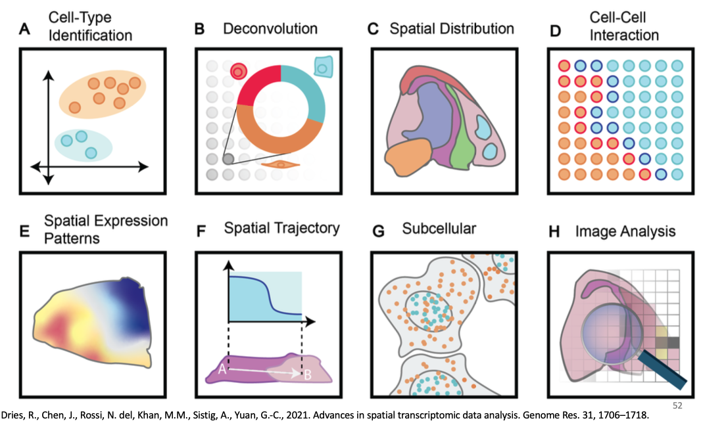

# Spatial omics technologies

Ruben Dries

August 5th 2024

## Introduction

### Why do we need spatial omics technologies?

xxxx 

### What is spatial omics?

xxxx

     

## What are the main spatial omics technologies?

### Spatial sequencing

### Spatial in situ

### Spatial proteomics

### Other Spatial omics: ATAC-seq, CUT&RUN, lipidomics, etc

   

## What can we learn from spatial omics technologies?

### Input data types and formats

### Spatial downstream analysis

