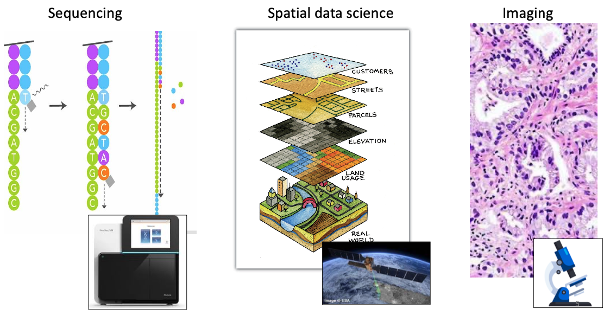
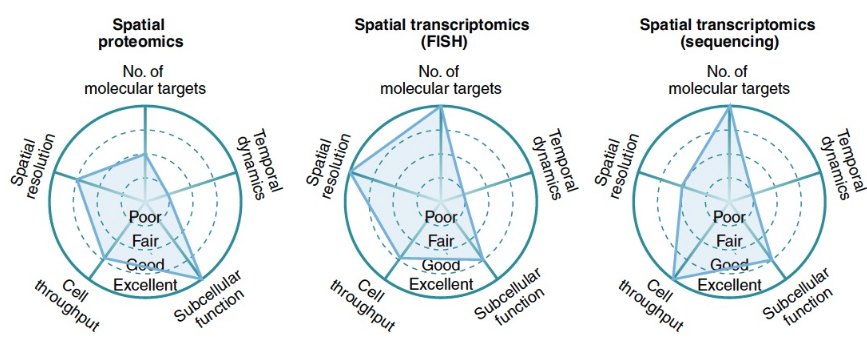
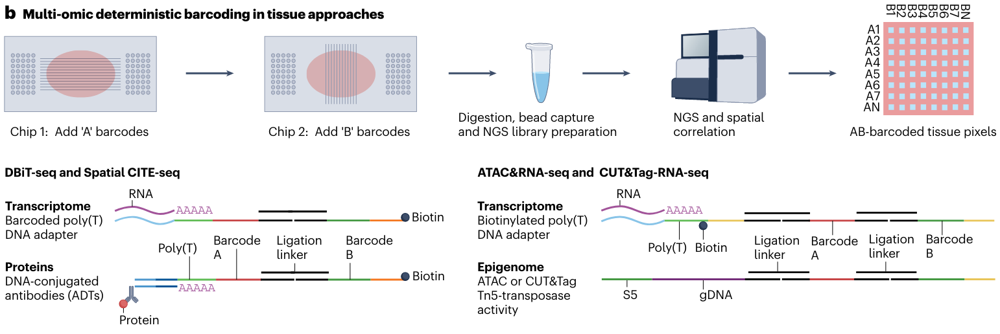

# Spatial omics technologies

Ruben Dries

August 5th 2024

## Presentation

[

```{r out.height = "460px", out.width='800px', echo=F, fig.cap="Spatial omics overview slides"}
knitr::include_graphics("https://drieslab.github.io/giotto_workshop_2024/spatial_omics_technologies_GS_workshop.pdf")
```

](<https://drieslab.github.io/giotto_workshop_2024/spatial_omics_technologies_GS_workshop.pdf>)

<br>

## Short summary

### Why do we need spatial omics technologies?

Spatial omics allows us to examine the role of one or more cells within its normal context. This spatial context is typically organized at multiple length scales, and considers both adjacent neighboring cells and larger levels of tissue organization.

```{r, echo=FALSE, out.width="100%", fig.align="center", fig.cap="Capturing tissue complexity with RNA-seq, scRNAseq, and Spatial Omics"}
knitr::include_graphics("img/01_session1/0-spatial_vs_singlecell.png")
```

### What is spatial omics?

Spatial omics is typically a combination of spatial sequencing and/or imaging together with understanding the obtained results through spatial data science.

```{r, echo=FALSE, out.width="100%", fig.align="center", fig.cap="Spatial Omics Constituents"}

```


<br>

### What are the main spatial omics technologies?

The large majority - and most popular or accessible - spatial technologies are:\
- spatial antibody-multiplex proteomics\
- spatial multiplex **in situ hybridization** (ISH)-based transcriptomics\
- spatial sequencing-based transcriptomics


```{r, echo=FALSE, out.width="100%", fig.align="center", fig.cap="Lewis et al. Nat Meth Review. Characteristics of spatial omics technologies"}

```

### Other Spatial omics: ATAC-seq, CUT&Tag, lipidomics, etc

A growing number of other spatial technologies exist that profile different types of molecular analytes. One example is using a deterministic barcoding approach (Rong Fan's group) to explore open (ATAC-seq) or modified (CUT&Tag) chromatin in a spatially aware manner.


```{r, echo=FALSE, out.width="100%", fig.align="center", fig.cap="Vandereyken et al. Nat Rev Genetics. Spatial deterministic barcoding for ATAC-seq and CUT&tag"}

```

<br>

### What are the different types of spatial downstream analyses?

There exist a large and diverse amount of different downstream spatial data analyses that use different available data types and formats as input.

```{r, echo=FALSE, out.width="100%", fig.align="center", fig.cap="Dries, R. et al. Genome Res. Downstream analysis in spatial data analysis."}
knitr::include_graphics("img/01_session1/4-spatial_downstream_analyses.png")
```
