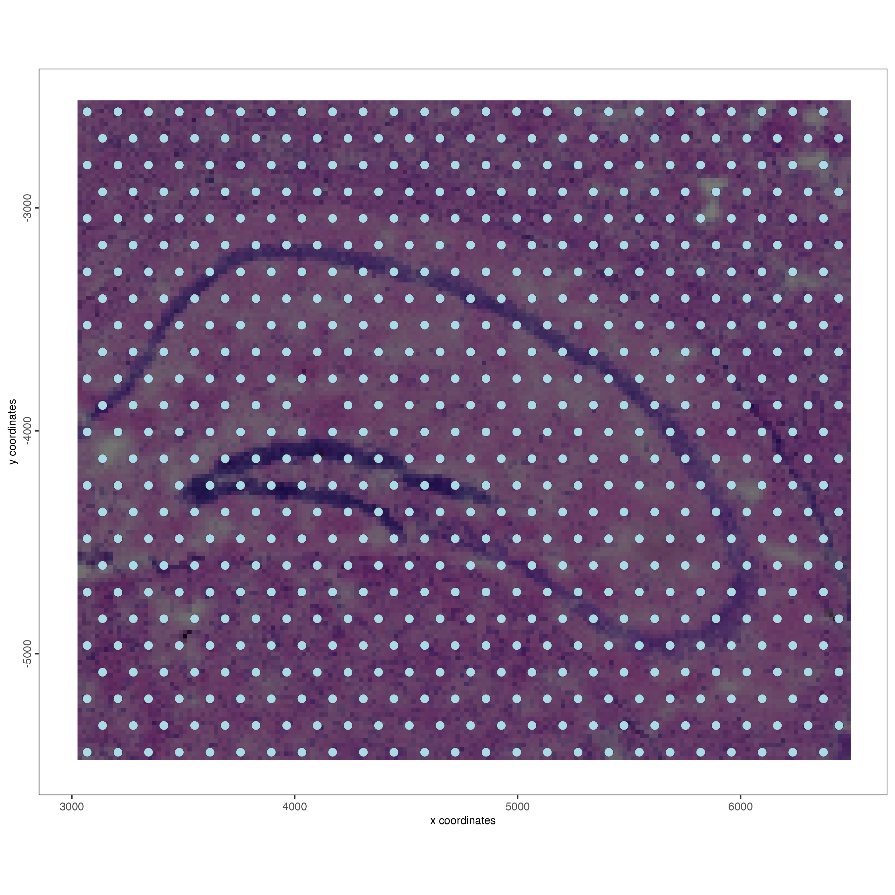

# Introduction to the Giotto package

Ruben Dries & Jiaji George Chen

August 5th 2024

## Presentation  
  
[
```{r out.height = "460px", out.width='800px', echo=F, fig.cap="Giotto Suite overview slides"}
knitr::include_graphics("https://drieslab.github.io/giotto_workshop_2024/pdf/GS_workshop2024_giotto_intro.pdf")
```
](https://drieslab.github.io/giotto_workshop_2024/pdf/GS_workshop2024_giotto_intro.pdf)


<br>  


## Ecosystem

Giotto Suite is a modular ecosystem of individual R packages that each provide
different functionality and that together provide users with a fully integrated 
spatial multi-omics workflow.

  
```{r, echo=FALSE, out.width="100%", fig.align="center", fig.cap="Overview of the modular Giotto Suite ecosystem"}

```

  
Each package also has its own website:  
- **GiottoUtils**: https://drieslab.github.io/GiottoUtils/  
- **GiottoClass**: https://drieslab.github.io/GiottoClass/   
- **GiottoData**: https://drieslab.github.io/GiottoData/   
- **GiottoVisuals**: https://drieslab.github.io/GiottoVisuals/   

More information is available at https://drieslab.github.io/Giotto_website/articles/ecosystem.html 

## Installation + python environment

### Giotto installation

Giotto Suite is currently available installable only from GitHub, but we are actively working on getting it into a major repository. 
Much of this already covered in Section 2.2, but the highlights are:

#### System prerequisites

  - for windows, _Rtools_ needs to be installed
  - a major dependency _terra_ needs `GDAL (>= 2.2.3), GEOS (>= 3.4.0), PROJ (>= 4.9.3), sqlite3` on linux

#### Installation of released version

To install the currently released version of Giotto in a single step:

```{r, eval=FALSE}
pak::pak("drieslab/Giotto")
```

This should automatically install all the Giotto dependencies and other Giotto module packages.


#### Installation of dev branch Giotto packages

You can install dev branch versions by using `devtools::install_github()`

Core module dev branchs:

- "drieslab/Giotto@suite_dev"
- "drieslab/GiottoVisuals@dev"
- "drieslab/GiottoClass@dev"
- "drieslab/GiottoUtils@dev"

```{r, eval=FALSE}
devtools::install_github("drieslab/GiottoClass@dev")
```

_pak_ tends to forcibly install all dependencies, which can have issues when working with multiple dev branch packages.


#### Common install issues

If installing on an R version earlier than 4.4, pak can throw errors when installing Matrix. To get around this, install _Matrix v1.6-5_ and then installing _Giotto_ with _pak_ should work.
```{r, eval=FALSE}
devtools::install_version("Matrix", version = "1.6-5")
```

If you come across the `function 'as_cholmod_sparse' not provided by package 'Matrix'` error when running Giotto, reinstalling _irlba_ from source may resolve it.
```{r, eval=FALSE}
install.packages("irlba", type = "source")
```


### Python environment

#### Default installation

In order to make use of python packages, the first thing to do after installing Giotto for the first time is to create a giotto python environment. Giotto provides the following as a convenience wrapper around _reticulate_ functions to setup a default environment.

```{r, eval=FALSE}
library(Giotto)
installGiottoEnvironment()
```

Two things are needed for python to work:

1. A conda (e.g. miniconda or anaconda) installation which is the package and environment management system. 
2. Independent environment(s) with specific versions of the python language and associated python packages.

`installGiottoEnvironment()` checks both and will install miniconda using _reticulate_ if necessary. If a specific conda binary already exists that you want to use, the `conda` param can be set, or you can set the _reticulate_ option `options("reticulate.conda_binary" = "[conda path]")` or `Sys.setenv("RETICULATE_CONDA" = "[conda path]")`.

After ensuring the conda binary exists, the default Giotto environment is installed which is a python 3.10.2 environment named 'giotto_env'. 
It will contain several default packages that Giotto installs:

- "pandas==1.5.1"
- "networkx==2.8.8"
- "python-igraph==0.10.2"
- "leidenalg==0.9.0"
- "python-louvain==0.16"
- "python.app==1.4" (if needed)
- "scikit-learn==1.1.3"

#### Custom installs

Custom python environments can be made by first setting up a new environment and establishing the name and python version to use.

```{r, eval=FALSE}
reticulate::conda_create(envname = "[name of env]", python_version = ???)
```

Following that, one or more python packages to install can be added to the environment. 

```{r, eval=FALSE}
reticulate::py_install(
  pip = TRUE,
  envname = '[name of env]',
  packages = c(
      "package1",
      "package2",
      "..."
  )
)
```


Once an environment has been set up, _Giotto_ can hook into it.


#### Using a specific environment

When using python through _reticulate_, R only allows one environment to be activated per session. Once a session has loaded a python environment, it can no longer switch to another one. Giotto activates a python environment when any of the following happens:

- a `giotto` object is created
- `giottoInstructions` are created (`createGiottoInstructions()`)
- `GiottoClass::set_giotto_python_path()` is called (most straightforward)

Which environment is activated is based on a set of 5 defaults in decreasing priority.

1. User provided (when `python_path` param is given. Either a full filepath or an env name are accepted.)
2. Any provided path or envname set in options  `options("giotto.py_path" = "[path to env or envname]")`
3. Default expected giotto environment location based on `reticulate::miniconda_path()`
4. Envname `"giotto_env"`
5. System default python environment

Method 2 is most recommended when there is a non-standard python environment to regularly use with Giotto. 

You would run `file.edit("~/.Rprofile")` and then add `options("giotto.py_path" = "[path to env or envname]")` as a line so that it is automatically set at the start of each session.

If a specific environment should only be used a couple times then method 1 is easiest:
```{r, eval=FALSE}
GiottoClass::set_giotto_python_path(python_path = "[path to env or envname]")
```

To check which conda environments exist on your machine:
```{r, eval=FALSE}
reticulate::conda_list()
```

Once an environment is activated, you can check more details and ensure that it is the one you are expecting by running:
```{r, eval=FALSE}
reticulate::py_config()
```


## Giotto instructions

Giotto uses `giottoInstructions` in order to set a behavior for a particular `giotto` object. Most commonly used are:

- python_path - when set, will activate a python environment
- save_dir - save directory to use. Usually for plots generated. This can help speed things up since the viewer no longer has to render.
- save_plot - whether to save plots to the `save_dir`
- return_plot - whether to return the plot objects. When FALSE, only NULL is returned
- show_plot - whether to show the plot in the viewer

These objects are created with `createGiottoInstructions()` and the created objects can be edited afterwards using the `instructions()` generic function.

```{r, eval=FALSE}
library(Giotto)
save_dir <- "results/01_session2/"

# this call will also intialize the python env
instrs <- createGiottoInstructions(
    save_dir = save_dir, # working directory is the default
    show_plot = FALSE,
    save_plot = TRUE,
    return_plot = FALSE,
    python_path = NULL # when NULL, this calls GiottoClass::set_giotto_python_path() to get the default
)
force(instrs)
```


Giotto object creation functions all have an `instructions` param for passing in instructions objects.
`giotto` objects will also respond to the `instructions()` generic.

```{r, eval=FALSE}
test <- giotto(instructions = instrs) # passing NULL instead will also generate a default instructions object

# example plot
g <- GiottoData::loadGiottoMini("visium")
instructions(g) <- instrs
instructions(g, "show_plot") # instructions say not to plot to viewer
spatPlot2D(g, show_image = TRUE, image_name = "image")
# instead it will directly write to the results folder
```

As an example, you can also set individual instructions

```{r, eval=FALSE}
instructions(g, "show_plot") <- TRUE
spatPlot2D(g, show_image = TRUE, image_name = "image")
```

```{r, echo=FALSE, fig.cap="example image output"}

```


