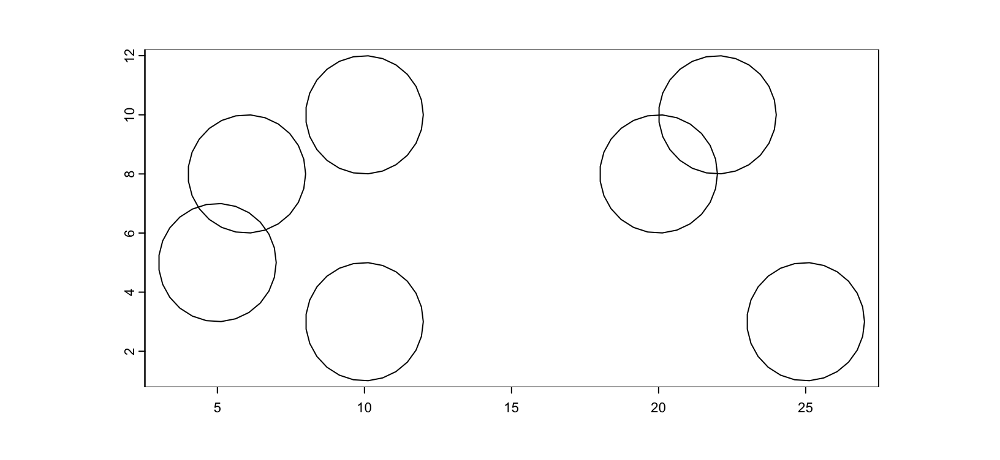
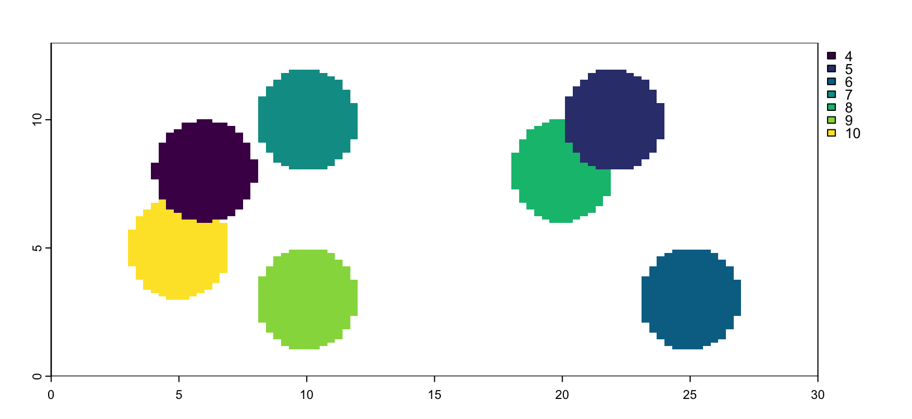
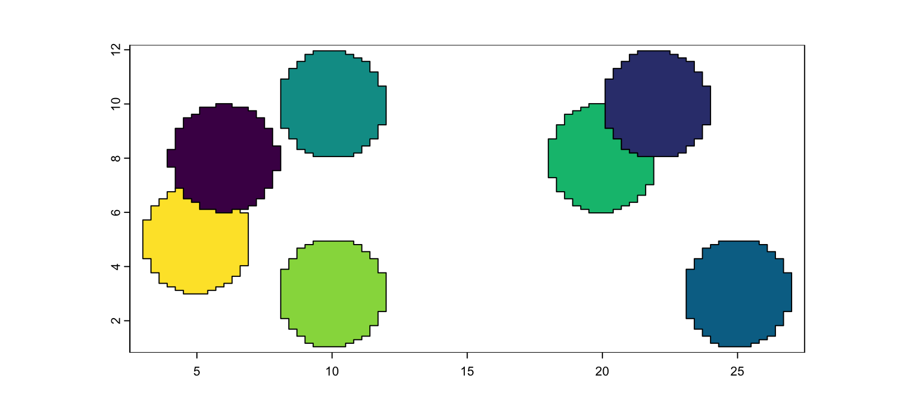
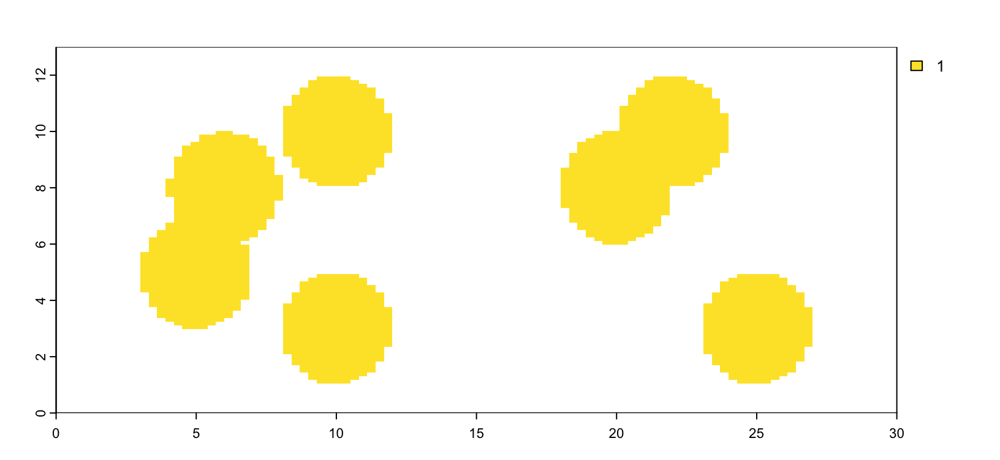
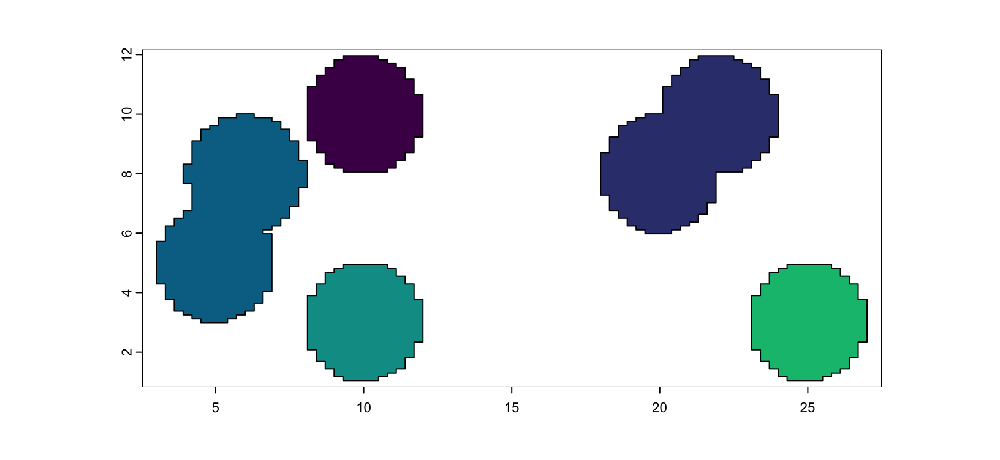
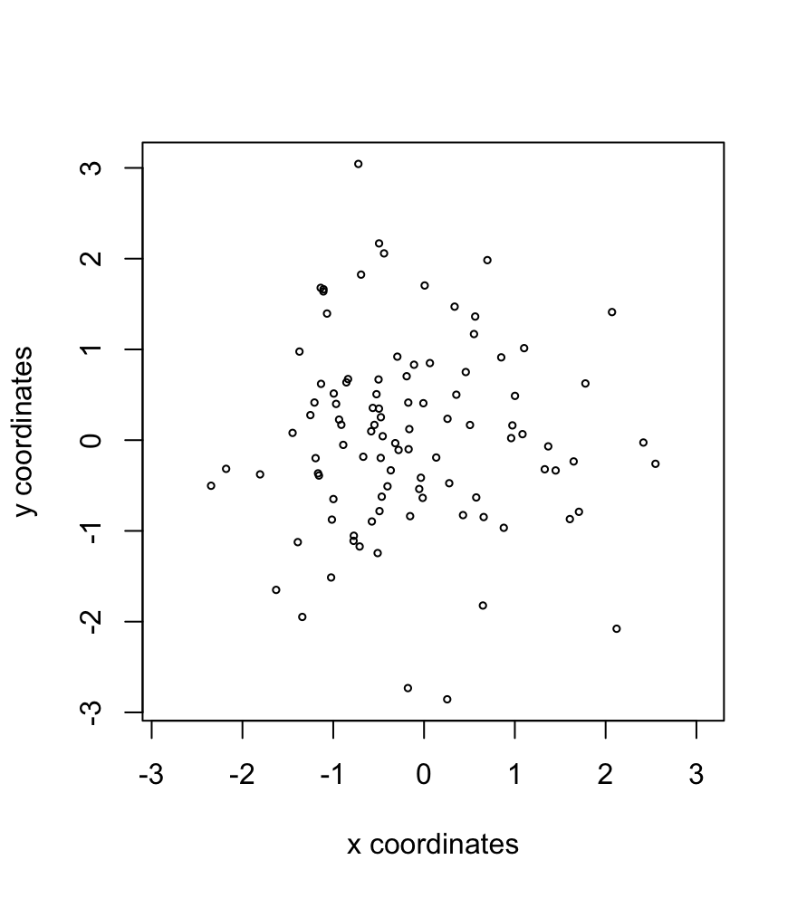
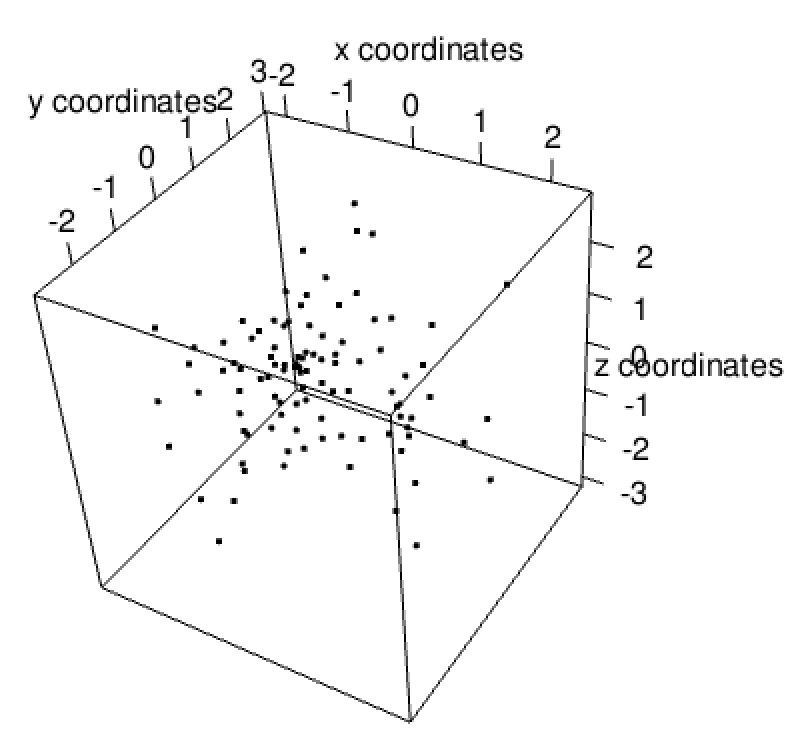
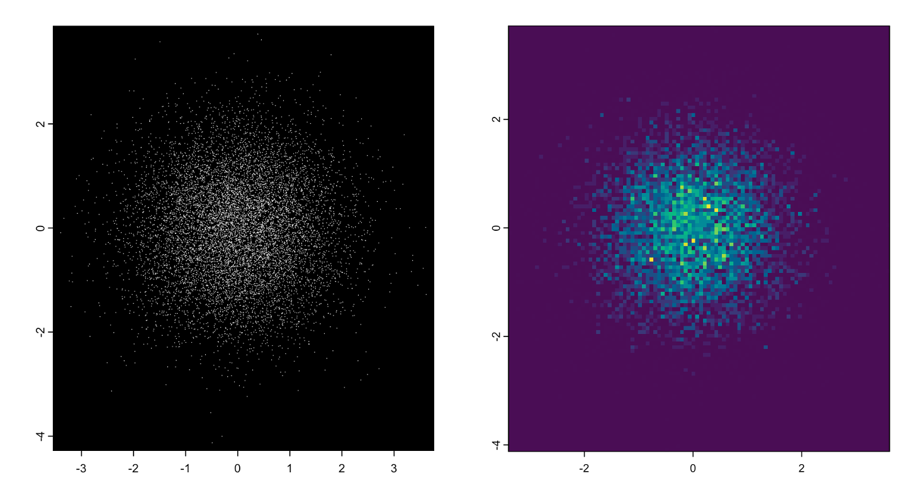
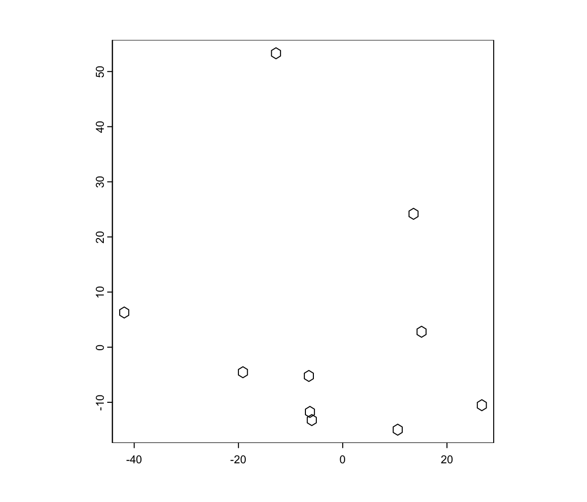

# Data formatting and Pre-processing

Jiaji George Chen

August 5th 2024

## Data formats

There are many kinds of outputs and data formats that are currently being used in the spatial omics field for storage and dissemination of information. The following are some that we commonly work with. For Giotto, much of the data wrangling task is to get the information read in from these formats into R native formats and wrapped as Giotto subobjects. 

The subobjects then enforce formatting and allow the data types to behave as building blocks of the `giotto` object

### General formats

`.csv`/`.tsv` are standard delimited filetypes, where the values are separated by commas (`.csv`), tabs (`.tsv`). These can be read in with a wide array of functions and packages: `utils::read.delim()`, `readr::read_delim()`, `data.table::fread()` etc. They are easy to use, but large files are hard to scan through.


### Matrix formats

10X regularly provides their cell feature counts matrices in both the `.mtx` (matrix market or MM) and `.h5` formats. The MM formats come in a zipped folder. Within, the structure is usually
```
├── barcodes.tsv.gz
├── features.tsv.gz
└── matrix.mtx.gz
```
MM format by itself does not carry dimnames so they are stored in .tsv files for the barcodes (cells/observations) and features.

barcodes.tsv.gz from a Xenium dataset
```
                V1
            <char>
     1: aaaadpbp-1
     2: aaaaficg-1
     3: aaabbaka-1
     4: aaabbjoo-1
     5: aaablchg-1
    ---           
162250: ojaaphhh-1
162251: ojabeldf-1
162252: ojacfbid-1
162253: ojacfhhg-1
162254: ojacpeii-1
```

features.tsv.gz from a Xenium dataset
```
                          V1                      V2                  V3
                      <char>                  <char>              <char>
  1:         ENSG00000121270                  ABCC11     Gene Expression
  2:         ENSG00000130234                    ACE2     Gene Expression
  3:         ENSG00000213088                   ACKR1     Gene Expression
  4:         ENSG00000107796                   ACTA2     Gene Expression
  5:         ENSG00000163017                   ACTG2     Gene Expression
 ---                                                                    
537: UnassignedCodeword_0495 UnassignedCodeword_0495 Unassigned Codeword
538: UnassignedCodeword_0496 UnassignedCodeword_0496 Unassigned Codeword
539: UnassignedCodeword_0497 UnassignedCodeword_0497 Unassigned Codeword
540: UnassignedCodeword_0498 UnassignedCodeword_0498 Unassigned Codeword
541: UnassignedCodeword_0499 UnassignedCodeword_0499 Unassigned Codeword
```

The `matrix.mtx` file then contains the actual sparse matrix values in triplet format.

The `.h5` format is very similar, except that it is a hierarchical format that contains all three of these items in the same file.

_Giotto_ provides `get10Xmatrix()` and `get10Xmatrix_h5()` as convenient functions to open these exports and read them in as one or more _Matrix_ sparse representations.


### Tabular formats

`.parquet` is a great format for storing large amounts of table information and providing fast access to only portions of the data at a time. 10X is using this format for things such as the table of all transcripts detections in Xenium or the polygons. They can be opened and worked with using _arrow_ and _dplyr_ verbs.

Currently, _giotto_ extracts information from these files and then converts them to in-memory `data.tables` or _terra_ `SpatVectors` depending on what data they contain.


### Spatial formats

`.shp` and `.geojson` are common formats for polygon and point data. They are commonly used as exports from segmentation software such as QuPath. `GiottoClass::createGiottoPolygon()` and the more specific `createGiottoPolygonsFromGeoJSON()` can be used for reading these in.

```{r, eval=FALSE}
shp <- system.file("extdata/toy_poly.shp", package = "GiottoClass")
gpoly <- createGiottoPolygon(shp, name = "test")
plot(gpoly)
```

```{r, echo=FALSE, out.width="80%", fig.cap="Plot of `giottoPolygon` from .shp"}

```


### Mask files

`.tif` files can be used as mask files where the integer values of the image encode where an annotation is. `createGiottoPolygonsFromMask()` guesses whether the image is single value or multi value mask. NanoString CosMx is one example of a platform that distributes the polygon information through a series of mask files.

```{r, eval=FALSE}
m <- system.file("extdata/toy_mask_multi.tif", package = "GiottoClass")
plot(terra::rast(m), col = grDevices::hcl.colors(7))
```

```{r, echo=FALSE, out.width="80%", fig.cap="Example mask image. Integer values are shown as different colors"}

```


```{r, eval=FALSE}
gp <- createGiottoPolygon(
    m,
    flip_vertical = FALSE, flip_horizontal = FALSE,
    shift_horizontal_step = FALSE, shift_vertical_step = FALSE,
    ID_fmt = "id_test_%03d",
    name = "test"
)
force(gp)
```

```
An object of class giottoPolygon
spat_unit : "test"
Spatial Information:
 class       : SpatVector 
 geometry    : polygons 
 dimensions  : 7, 1  (geometries, attributes)
 extent      : 3, 27, 1.04, 11.96  (xmin, xmax, ymin, ymax)
 coord. ref. :  
 centroids   : NULL
 overlaps    : NULL
```

```{r, eval=FALSE}
plot(gp, col = grDevices::hcl.colors(7))
```

```{r, echo=FALSE, out.width="80%", fig.cap="`giottoPolygon` from mask image. Identical coloring order implies that encoded IDs have been properly imported."}

```

For situations where all pixel values are the same, but not touching indicates different annotations:

```{r, eval=FALSE}
m2 <- system.file("extdata/toy_mask_single.tif", package = "GiottoClass")
plot(terra::rast(m2), col = grDevices::hcl.colors(7))
```

```{r, echo=FALSE, out.width="80%", fig.cap="Example mask image with only 1 value"}

```

```{r, eval=FALSE}
gpoly1 <- createGiottoPolygonsFromMask(
    m2,
    flip_vertical = FALSE, flip_horizontal = FALSE,
    shift_horizontal_step = FALSE, shift_vertical_step = FALSE,
    ID_fmt = "id_test_%03d",
    name = "multi_test"
)
plot(gpoly1, col = grDevices::hcl.colors(7))
```

```{r, echo=FALSE, out.width="80%", fig.cap="`giottoPolygon` from single value mask"}

```

### images

Most images are openable using `createGiottoLargeImage()` which wraps `terra::rast()`. This allows compatibility with most common image types. Recent and non-geospatially related image formats are not well supported however. One example is `ome.tif` which 10X uses for large image exports from Xenium. For these, we use `ometif_to_tif()` to convert them into normal `.tif` files using the python _tifffile_ package. `ometif_metadata` can be used to extract and access the associated `ome xml` image metadata.


### jsonlike formats

jsonlike formats are ones that can be read in with `jsonlite::read_json()` and then coerced into list-like or tabular structures. 10X uses these `.json` to report the scalefactors information in Visium datasets. The `.xenium` file format is also openable as a json-like.

### Hierarchical formats

There are many types of data in spatial-omics analysis. Hierarchical formats afford both a way to organize complex multi-type data and also to store and distribute them. In R, these can be opened with either _hdf5r_ on CRAN or _rhdf5_ on BioConductor. The complex nature of these formats and also the fact they are just a storage format and not an organizational specification means that what data and how it is stored and represented can often be very different. `.gef` and `.bgef` which StereoSeq exports are `.hdf5`-like formats.

`.h5ad` is a specific flavor of these file formats where they follow the _AnnData_ framework so that there is more common structure in how datasets are stored. _Giotto_ provides `anndataToGiotto()` and `giottoToAnnData()` interoperability functions for interconverting.

`.zarr` is another hierarchical storage structure, however currently the R-native support is still being developed.


## Pre-processing

The most common types of raw data needed for a Giotto object are expression matrices, centroids information, spatial feature points, polygons, and expression information. Evaluation of input data and conversion to compatible formats happens inside the `create*` functions that Giotto exports. There is one of these for each of the subobject classes.

### Expression matrix

Not much processing is needed for matrices. All that is needed is a data type that is coercible to matrix (or _Matrix_ classes). Dimnames should be added. Columns should be cells or observations. Rows should be features or variables.

```{r, eval=FALSE}
m <- matrix(sample(c(rep(1, 10), rep(0, 90))), nrow = 10)
rownames(m) <- sprintf("feat_%02d", seq(10))
colnames(m) <- sprintf("cell_%02d", seq(10))
x <- createExprObj(m)
```

```
An object of class exprObj : "test"
spat_unit : "cell"
feat_type : "rna"

contains:
10 x 10 sparse Matrix of class "dgCMatrix"
                           
feat_01 . 1 1 1 . . . . . .
feat_02 . . . . . . . . . .
feat_03 . . . . . 1 . . . .
feat_04 1 . . . 1 . . . . .

 ........suppressing 2 rows in show(); maybe adjust options(max.print=, width=)
                           
feat_07 . 1 . . . 1 . . . 1
feat_08 . . . . . . . . . .
feat_09 . . . . . . . . . .
feat_10 . . . . . . . . . .

 First four colnames:
 cell_01 cell_02 cell_03 cell_04 
```


### Spatial locations

For _Giotto_ centroid locations, a tabular data.frame-like format is required. The first non-numeric column found will be set as the cell_ID. The numeric columns will then be kept as coordinates information.

```{r, eval=FALSE}
set.seed(1234)
xy <- data.frame(
    a = as.character(seq(100)), 
    b = rnorm(100),
    c = rnorm(100)
)
sl_xy <- createSpatLocsObj(xy)
plot(sl_xy)
```

```{r, echo=FALSE, out.width="60%", fig.cap="Plot of `spatLocsObj` created from xy information"}

```

```{r, eval=FALSE}
set.seed(1234)
xyz <- data.frame(
    a = as.character(seq(100)), 
    b = rnorm(100), 
    c = rnorm(100), 
    d = rnorm(100)
)
sl_xyz <- createSpatLocsObj(xyz)
plot(sl_xyz)
```

```{r, echo=FALSE, out.width="60%", fig.cap="Plot of `spatLocsObj` created from xy and z information"}

```

### giottoPoints

`giottoPoints` are very similar. These subobjects wrap a _terra_ `SpatVector` object and if tabular data is provided, what is needed are x, y, and feature ID. Additional columns are kept as metadata information.

```{r, eval=FALSE}
set.seed(1234)
tx <- data.frame(
    id = sprintf("gene_%05d", seq(1e4)),
    x = rnorm(1e4),
    y = rnorm(1e4),
    meta = sprintf("metadata_%05d", seq(1e4))
)
gpoints <- createGiottoPoints(tx)
plot(gpoints, raster = FALSE)
plot(gpoints, dens = TRUE)
```

```
An object of class giottoPoints
feat_type : "rna"
Feature Information:
 class       : SpatVector 
 geometry    : points 
 dimensions  : 10000, 3  (geometries, attributes)
 extent      : -3.396064, 3.618107, -4.126628, 3.727291  (xmin, xmax, ymin, ymax)
 coord. ref. :  
 names       :    feat_ID           meta feat_ID_uniq
 type        :      <chr>          <chr>        <int>
 values      : gene_00001 metadata_00001            1
               gene_00002 metadata_00002            2
               gene_00003 metadata_00003            3
```

```{r, echo=FALSE, out.width="60%", fig.cap="`giottoPoints` plotted without rasterization (left), with rasterization and colored by density (right)"}

```


### giottoPolygon

Polygon information is often provided as a known spatial format or as image masks, which can be read in as shown earlier. However, they can also be provided as numerical values. This is the case for Vizgen MERSCOPE and 10X Xenium outputs, both of which now use `.parquet` to provide cell barcodes and xy vertices associated with them.

```{r, eval=FALSE}
set.seed(1234)

hex <- hexVertices(radius = 1)
spatlocs <- data.table::data.table(
    sdimx = rnorm(10, mean = 5, sd = 20),
    sdimy = rnorm(10, mean = 5, sd = 20),
    cell_ID = paste0("spot_", seq_len(10))
)
random_hex <- polyStamp(hex, spatlocs)
random_hex_poly <- createGiottoPolygon(random_hex)
plot(random_hex_poly)
```

```{r, echo=FALSE, out.width="60%", fig.cap="`giottoPolygon` created from ID and vertices"}

```


## Subobject utility functions

The `giotto` object is hierarchically organized first by slots that define their subobject/information type, then usually by which spatial unit and feature type information they contain. Lastly, they have specific object names. This makes the object very manually explorable.

Most of the subobjects are tagged with metadata information that allow them find their place within this nesting, and there are also common functions that giotto subobjects respond to.

### IDs

`spatIDs` and `featIDs` are used to find the spatial or feature IDs of an object.
```{r, eval=FALSE}
spatIDs(sl_xy)
```

```
  [1] "1"   "2"   "3"   "4"   "5"   "6"   "7"   "8"   "9"   "10"  "11"  "12" 
 [13] "13"  "14"  "15"  "16"  "17"  "18"  "19"  "20"  "21"  "22"  "23"  "24" 
 [25] "25"  "26"  "27"  "28"  "29"  "30"  "31"  "32"  "33"  "34"  "35"  "36" 
 [37] "37"  "38"  "39"  "40"  "41"  "42"  "43"  "44"  "45"  "46"  "47"  "48" 
 [49] "49"  "50"  "51"  "52"  "53"  "54"  "55"  "56"  "57"  "58"  "59"  "60" 
 [61] "61"  "62"  "63"  "64"  "65"  "66"  "67"  "68"  "69"  "70"  "71"  "72" 
 [73] "73"  "74"  "75"  "76"  "77"  "78"  "79"  "80"  "81"  "82"  "83"  "84" 
 [85] "85"  "86"  "87"  "88"  "89"  "90"  "91"  "92"  "93"  "94"  "95"  "96" 
 [97] "97"  "98"  "99"  "100"
```

```{r, eval=FALSE}
spatIDs(gpoly)
```

```
"a" "b" "c" "d" "e" "f" "g"
```

```{r, eval=FALSE}
head(featIDs(gpoints))
```

```
 "gene_00001" "gene_00002" "gene_00003" "gene_00004" "gene_00005" "gene_00006"
```

### Bracket subsetting and extraction

Most of the subobjects also respond to indexing with `[`, but since many of them are wrappers around an underlying data structure, empty `[` calls will drop the object to the contained data structure

```{r, eval=FALSE}
gpoly[1:2]
```

```
An object of class giottoPolygon
spat_unit : "test"
Spatial Information:
 class       : SpatVector 
 geometry    : polygons 
 dimensions  : 2, 2  (geometries, attributes)
 extent      : 3.015771, 12, 1.003947, 6.996053  (xmin, xmax, ymin, ymax)
 coord. ref. :  
 names       : poly_ID   idx
 type        :   <chr> <int>
 values      :       a    10
                     b     9
 centroids   : NULL
 overlaps    : NULL
```

```{r, eval=FALSE}
gpoly[c("a", "e")]
```

```
An object of class giottoPolygon
spat_unit : "test"
Spatial Information:
 class       : SpatVector 
 geometry    : polygons 
 dimensions  : 2, 2  (geometries, attributes)
 extent      : 3.015771, 27, 1.003947, 6.996053  (xmin, xmax, ymin, ymax)
 coord. ref. :  
 names       : poly_ID   idx
 type        :   <chr> <int>
 values      :       a    10
                     e     6
```

```{r, eval=FALSE}
gpoints[]
```

```
 class       : SpatVector 
 geometry    : points 
 dimensions  : 10000, 3  (geometries, attributes)
 extent      : -3.396064, 3.618107, -4.126628, 3.727291  (xmin, xmax, ymin, ymax)
 coord. ref. :  
 names       :    feat_ID           meta feat_ID_uniq
 type        :      <chr>          <chr>        <int>
 values      : gene_00001 metadata_00001            1
               gene_00002 metadata_00002            2
               gene_00003 metadata_00003            3 
 ```

### Nesting metadata generics

`spatUnit()`, `featType()`, `objName`, `prov()` are all generics that act on the metadata of the subobjects.
They work both to access and replace the information.

```{r, eval=FALSE}
featType(x)
```

```
[1] "rna"
```


```{r, eval=FALSE}
objName(x) <- "raw2"
spatUnit(x) <- "aggregate"
force(x)
```

```
An object of class exprObj : "raw2"
spat_unit : "aggregate"
feat_type : "rna"

contains:
10 x 10 sparse Matrix of class "dgCMatrix"
                           
feat_01 . 1 1 1 . . . . . .
feat_02 . . . . . . . . . .
feat_03 . . . . . 1 . . . .
feat_04 1 . . . 1 . . . . .

 ........suppressing 2 rows in show(); maybe adjust options(max.print=, width=)
                           
feat_07 . 1 . . . 1 . . . 1
feat_08 . . . . . . . . . .
feat_09 . . . . . . . . . .
feat_10 . . . . . . . . . .

 First four colnames:
 cell_01 cell_02 cell_03 cell_04 
```

### Appending to a giotto object

Subobjects are formatted to for Giotto and can directly be added to the `giotto` object using the `setGiotto()` generic.

```{r, eval=FALSE}
# initialize an empty object
g <- giotto()
g <- setGiotto(g, x)
force(g)
```

```
An object of class giotto 
>Active spat_unit:  aggregate 
>Active feat_type:  rna 
[SUBCELLULAR INFO]
[AGGREGATE INFO]
expression -----------------------
  [aggregate][rna] raw2


Use objHistory() to see steps and params used
```


