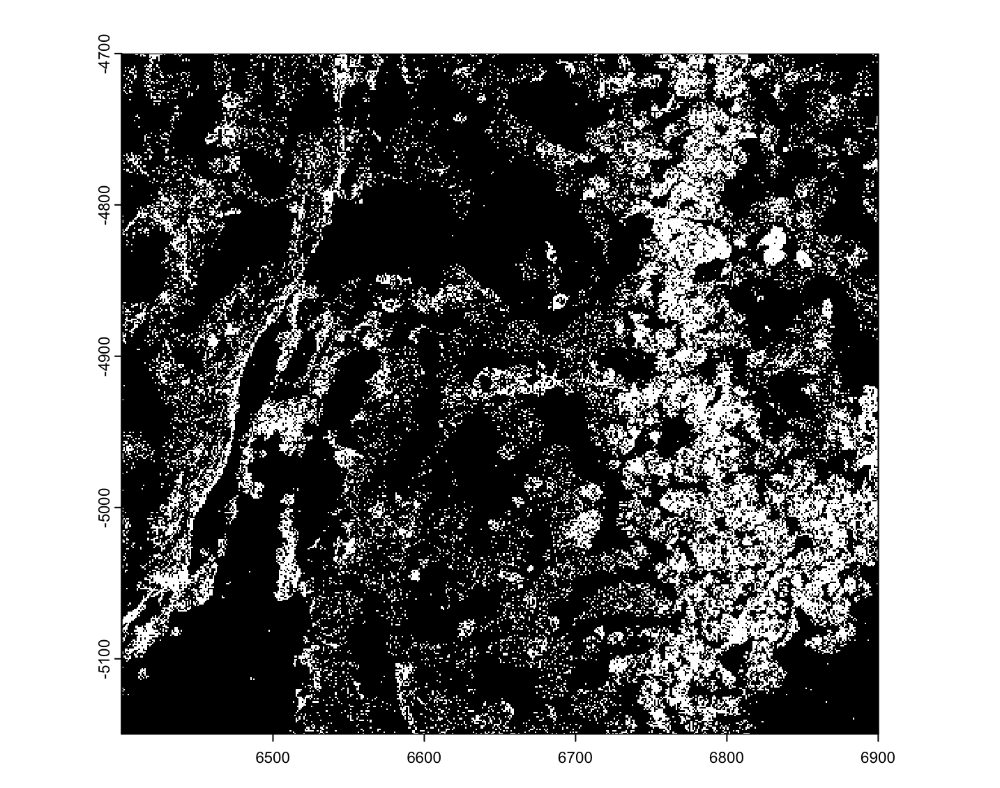
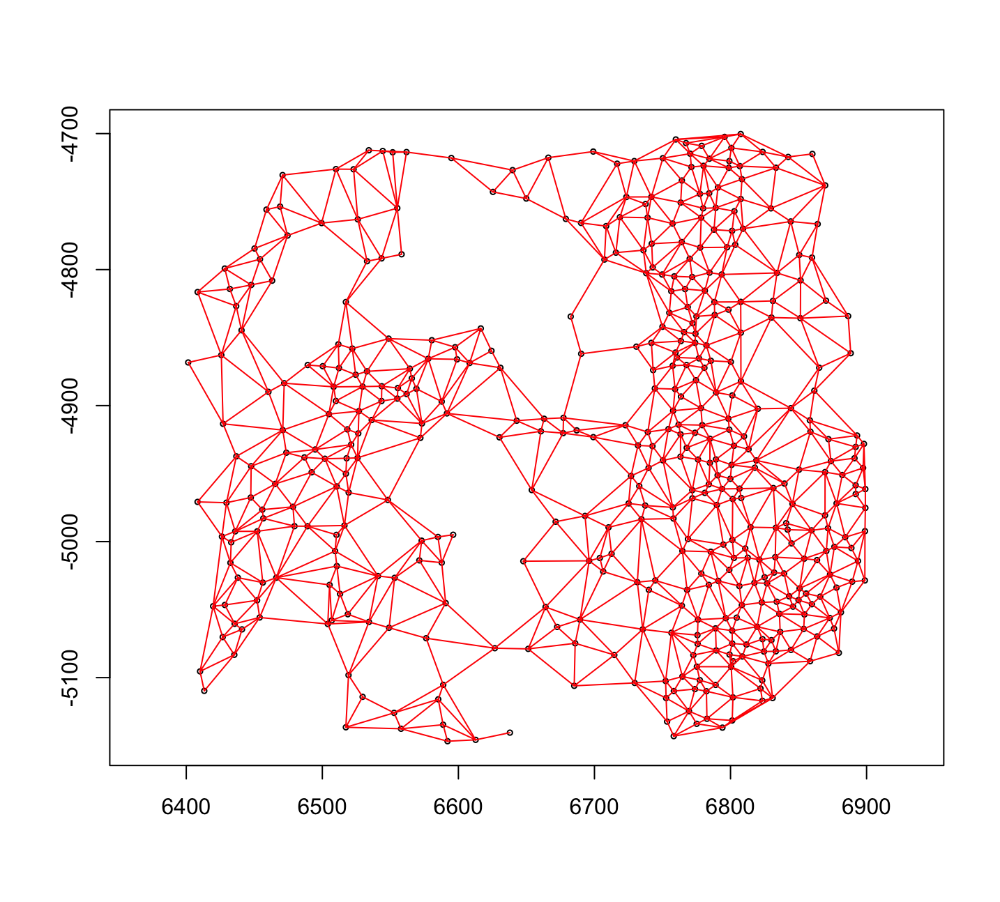
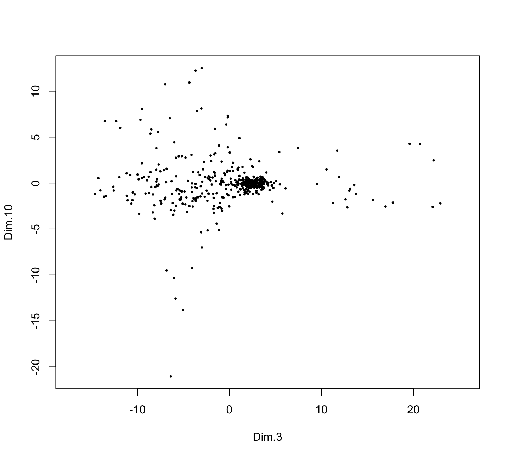
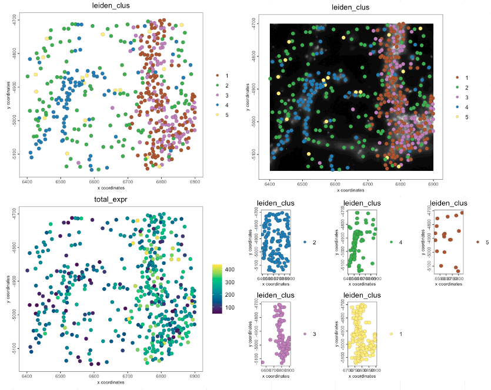
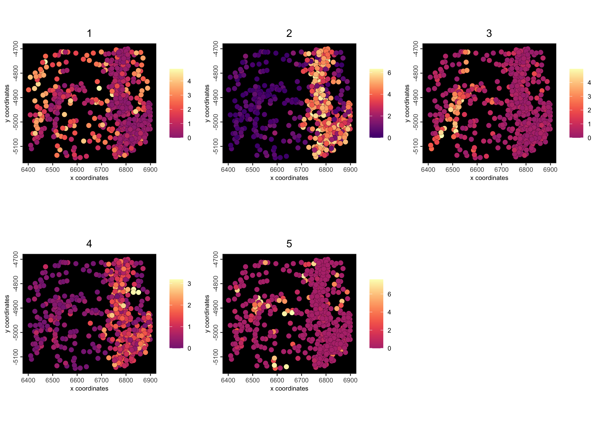
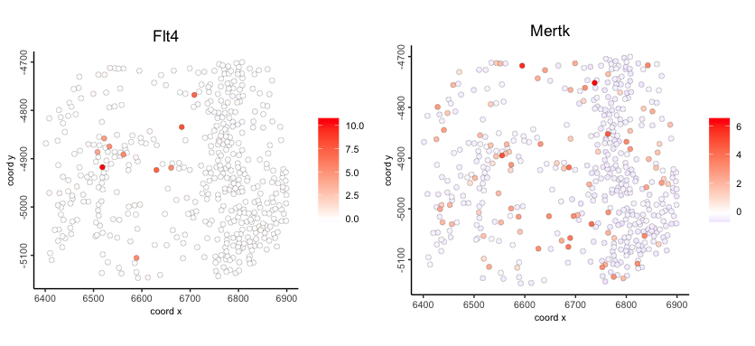
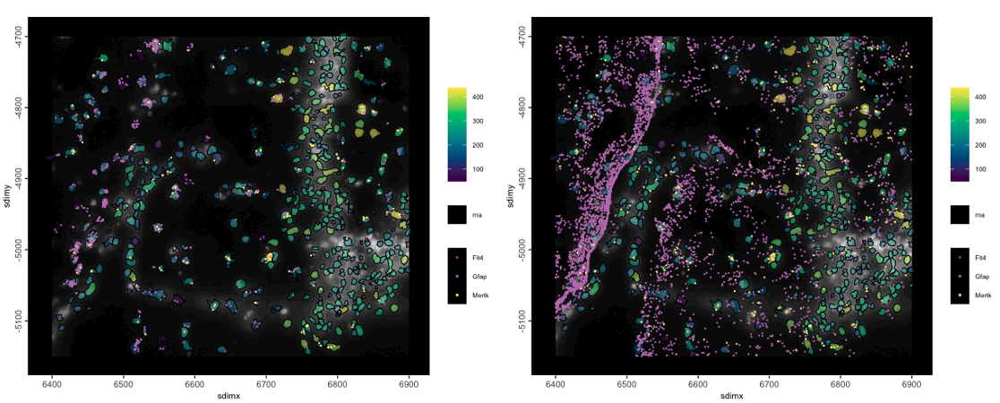
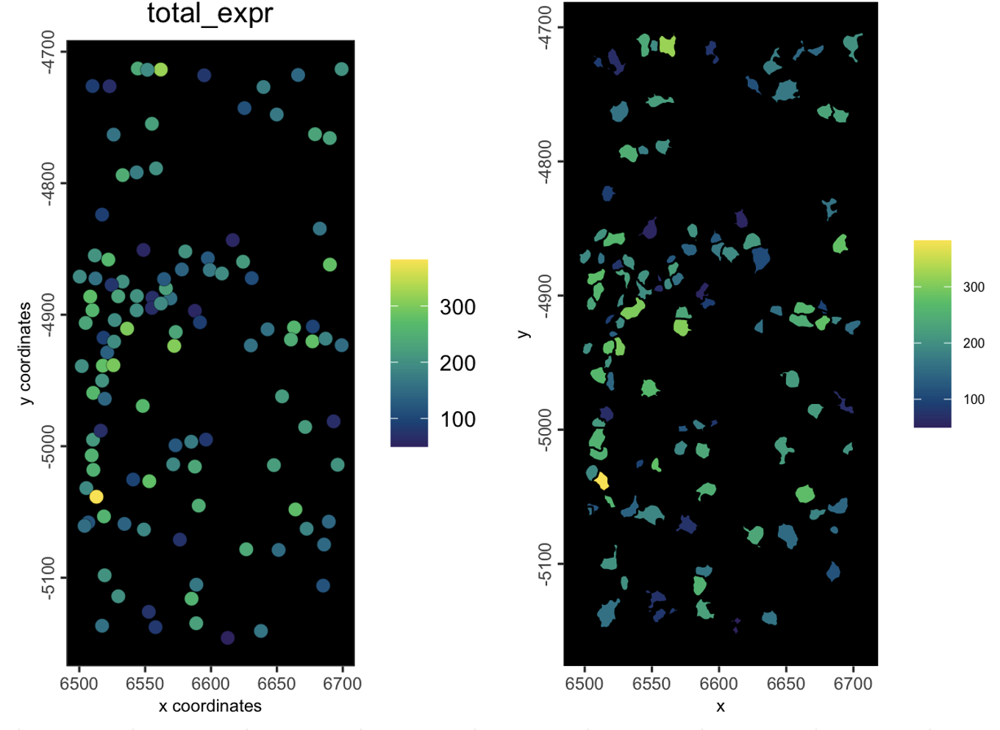

# Creating a Giotto object

Jiaji George Chen

August 5th 2024

## Overview

The minimal amount of raw data needed to put together a fully functional `giotto` object are either of the following:

-   spatial coordinates (centroids) and expression matrix information
-   spatial feature information (points or image intensity values) and spatial annotations to aggregate that feature information with (polygons/mask).

You can either use the `create*` style functions introduced in the previous session and build up the object piecewise or you can use the `giotto` object constructor functions `createGiottoObject()` and `createGiottoObjectSubcellular()`

## GiottoData modular package

We can showcase the construction of objects by pulling some raw data from the *GiottoData* package. A dataset was loaded from here earlier in the previous section, but to formally introduce it, this package contains mini datasets and also download links to other publicly available datasets. It helps with prototyping and development and also making reproducible examples.

The mini examples from popular platform datasets can also help give an understanding of what their data is like and how *Giotto* represents them.

## From matrix + locations

For this, we will load some visium expression information and spatial locations.

```{r, eval=FALSE}
library(Giotto)

# function to get a filepath from GiottoData
mini_vis_raw <- function(x) {
    system.file(
        package = "GiottoData", 
        file.path("Mini_datasets", "Visium", "Raw", x)
    )
}

mini_vis_expr <- mini_vis_raw("visium_DG_expr.txt.gz") |>
    data.table::fread() |>
    GiottoUtils::dt_to_matrix()
mini_vis_expr[seq(5), seq(5)]
```

```         
5 x 5 sparse Matrix of class "dgCMatrix"
       AAAGGGATGTAGCAAG-1 AAATGGCATGTCTTGT-1 AAATGGTCAATGTGCC-1 AAATTAACGGGTAGCT-1 AACAACTGGTAGTTGC-1
Gna12                   1                  2                  1                  1                  9
Ccnd2                   .                  1                  1                  .                  .
Btbd17                  .                  1                  1                  1                  .
Sox9                    .                  .                  .                  .                  .
Sez6                    .                  1                  4                  3                  .
```

```{r, eval=FALSE}
mini_vis_slocs <- mini_vis_raw("visium_DG_locs.txt") |>
    data.table::fread()
head(mini_vis_slocs)
```

```         
      V1    V2
   <int> <int>
1:  5477 -4125
2:  5959 -2808
3:  4720 -5202
4:  5202 -5322
5:  4101 -4604
6:  5821 -3047
```

With these two pieces of data, we can make a fully working `giotto` object. The spatial locations are missing cell_ID names, but they will be detected from the expression information.

```{r, eval=FALSE}
mini_vis <- createGiottoObject(
    expression = mini_vis_expr,
    spatial_locs = mini_vis_slocs
)
instructions(mini_vis, "return_plot") <- FALSE
# set return_plot = FALSE otherwise we will get duplicate outputs in code chunks
```

For a simple example plot:

```{r, eval=FALSE}
spatFeatPlot2D(mini_vis,
    feats = c("Gna12", "Gfap"), 
    expression_values = "raw",
    point_size = 2.5,
    gradient_style = "sequential",
    background_color = "black"
)
```

```{r, echo=FALSE, fig.cap="Example spatial feature plot to show functioning object"}
knitr::include_graphics("img/01_session4/example_featplot.png")
```

## From subcellular raw data (transcripts or images) + polygons

You can also make `giotto` objects starting from raw spatial feature information and annotations that give them spatial context.

```{r, eval=FALSE}
# function to get a filepath from GiottoData
mini_viz_raw <- function(x) {
    system.file(
        package = "GiottoData", 
        file.path("Mini_datasets", "Vizgen", "Raw", x)
    )
}

mini_viz_dt <- mini_viz_raw(file.path("cell_boundaries", "z0_polygons.gz")) |>
    data.table::fread()
mini_viz_poly <- createGiottoPolygon(mini_viz_dt)
force(mini_viz_poly)
```

```         
An object of class giottoPolygon
spat_unit : "cell"
Spatial Information:
 class       : SpatVector 
 geometry    : polygons 
 dimensions  : 498, 1  (geometries, attributes)
 extent      : 6399.244, 6903.243, -5152.39, -4694.868  (xmin, xmax, ymin, ymax)
 coord. ref. :  
 names       :                                 poly_ID
 type        :                                   <chr>
 values      :  40951783403982682273285375368232495429
               240649020551054330404932383065726870513
               274176126496863898679934791272921588227
 centroids   : NULL
 overlaps    : NULL
```

```{r, eval=FALSE}
plot(mini_viz_poly)
```

```{r, echo=FALSE, out.width="60%", fig.cap="Example MERSCOPE polygons loaded form vertex info"}
knitr::include_graphics("img/01_session4/viz_gpoly.png")
```

```{r, eval=FALSE}
mini_viz_tx <- mini_viz_raw("vizgen_transcripts.gz") |>
    data.table::fread()
mini_viz_tx[, global_y := -global_y] # flip values to match polys

viz_gpoints <- createGiottoPoints(mini_viz_tx)
force(viz_gpoints)
```

```         
An object of class giottoPoints
feat_type : "rna"
Feature Information:
 class       : SpatVector 
 geometry    : points 
 dimensions  : 80343, 3  (geometries, attributes)
 extent      : 6400.037, 6900.032, 4699.979, 5149.983  (xmin, xmax, ymin, ymax)
 coord. ref. :  
 names       : feat_ID global_z feat_ID_uniq
 type        :   <chr>    <int>        <int>
 values      :    Mlc1        0            1
                Gprc5b        0            2
                  Gfap        0            3
```

```{r, eval=FALSE}
plot(viz_gpoints)
```

```{r, echo=FALSE, out.width="60%", fig.cap="Example mini MERSCOPE transcripts data"}

```

```{r, eval=FALSE}
mini_viz <- createGiottoObjectSubcellular(
    gpolygons = mini_viz_poly,
    gpoints = viz_gpoints
)
instructions(mini_viz, "return_plot") <- FALSE 
force(mini_viz)
```

```         
An object of class giotto 
>Active spat_unit:  cell 
>Active feat_type:  rna 
[SUBCELLULAR INFO]
polygons      : cell 
features      : rna 
[AGGREGATE INFO]


Use objHistory() to see steps and params used
```

```{r, eval=FALSE}
# calculate centroids
mini_viz <- addSpatialCentroidLocations(mini_viz)

# create aggregated information
mini_viz <- calculateOverlap(mini_viz)
mini_viz <- overlapToMatrix(mini_viz)

spatFeatPlot2D(
    mini_viz, 
    feats = c("Grm4", "Gfap"),
    expression_values = "raw",
    point_size = 2.5,
    gradient_style = "sequential",
    background_color = "black"
)
```

```{r, echo=FALSE, fig.cap="Example mini MERSCOPE aggregated feature counts"}
knitr::include_graphics("img/01_session4/example_featplot_sub.png")
```

## From piece-wise

You can also piece-wise assemble an object independently of one of the 2 previously shown convenience functions.

```{r, eval=FALSE}
g <- giotto() # initialize empty gobject
g <- setGiotto(g, mini_viz_poly)
g <- setGiotto(g, viz_gpoints)
force(g)
```

```         
An object of class giotto 
>Active spat_unit:  cell 
>Active feat_type:  rna 
[SUBCELLULAR INFO]
polygons      : cell 
features      : rna 
[AGGREGATE INFO]


Use objHistory() to see steps and params used
```

This is essentially the same object as the one created through `createGiottoObjectSubcellular()` earlier.

## Using convenience functions for popular technologies (Vizgen, Xenium, CosMx, …)

There are also several convenience functions we provide for loading in data from popular platforms. These functions take care of reading the expected output folder structures, auto-detecting where needed data items are, formatting items for ingestion, then object creation. Many of these will be touched on later during other sessions.

```         
createGiottoVisiumObject()
createGiottoVisiumHDObject()
createGiottoXeniumObject()
createGiottoCosMxObject()
createGiottoMerscopeObject()
```

## Plotting

### Subobject plotting

Giotto has several spatial plotting functions. At the lowest level, you directly call `plot()` on several subobjects in order to see what they look like, particularly the ones containing spatial info. Here we load several mini subobjects which are taken from the vizgen MERSCOPE mini dataset. To see which mini objects are available for independent loading with `GiottoData::loadSubObjectMini()`, you can run `GiottoData::listSubobjectMini()`

```{r, eval=FALSE}
gpoints <- GiottoData::loadSubObjectMini("giottoPoints")
plot(gpoints)
plot(gpoints, dens = TRUE, col = getColors("magma", 255))
plot(gpoints, raster = FALSE)
plot(gpoints, feats = c("Grm4", "Gfap"))
```

```{r, echo=FALSE, fig.cap="giottoPoints plots. Rasterized (top left), Rasterized and colored with 'magma' color scale by density (top right), Non-rasterized (bottom left), Plotting specifically 2 features (bottom right)"}
knitr::include_graphics("img/01_session4/gpoint_plots.png")
```

```{r, eval=FALSE}
gpoly <- GiottoData::loadSubObjectMini("giottoPolygon")
plot(gpoly)
plot(gpoly, type = "centroid")
plot(gpoly, max_poly = 10)
```

```{r, echo=FALSE, fig.cap="giottoPolygon plots. default (left), plotting centroids (middle), auto changing to centroids after there are more polygons to plot than max_poly param (right)"}
knitr::include_graphics("img/01_session4/gpoly_plots.png")
```

```{r, eval=FALSE}
spatlocs <- GiottoData::loadSubObjectMini("spatLocsObj")
plot(spatlocs)
```

```{r, echo=FALSE, out.width="60%", fig.cap="Plot of spatLocsObj"}
knitr::include_graphics("img/01_session4/sl_plot.png")
```

```{r, eval=FALSE}
spatnet <- GiottoData::loadSubObjectMini("spatialNetworkObj")
plot(spatnet)
```

```{r, echo=FALSE, out.width="60%", fig.cap="Plot of spatialNetworkObj"}

```

```{r, eval=FALSE}
pca <- GiottoData::loadSubObjectMini("dimObj")
plot(pca, dims = c(3,10))
```

```{r, echo=FALSE, out.width="60%", fig.cap="Plot of PCA dimObj showing the 3rd and 10th PCs"}

```

### Additive subobject plotting

These base plotting functions inherit from `terra::plot()`. They can be used additively with more than one object.

```{r, eval=FALSE}
gimg <- GiottoData::loadSubObjectMini("giottoLargeImage")

plot(gimg, col = getMonochromeColors("#5FAFFF"))
plot(gpoly, border = "maroon", lwd = 0.5, add = TRUE)
```

```{r, echo=FALSE, fig.cap="Plot image with monochrome color scaling with added polygon borders"}
knitr::include_graphics("img/01_session4/additive_baseplot.png")
```

### Giotto object plotting

*Giotto* also has several *ggplot2*-based plotting functions that work on the whole `giotto` object. Here we load the vizgen mini dataset from *GiottoData* which contains a lot of worked through data.

#### Giotto spatial plot functions

`spatPlot()` - standard centroid-based plotting geared towards metadata plotting

```{r, eval=FALSE}
g <- GiottoData::loadGiottoMini("vizgen")
activeSpatUnit(g) <- "aggregate" # set default spat_unit to the one with lots of results
force(g)
```

```         
An object of class giotto 
>Active spat_unit:  aggregate 
>Active feat_type:  rna 
[SUBCELLULAR INFO]
polygons      : z0 z1 aggregate 
features      : rna 
[AGGREGATE INFO]
expression -----------------------
  [z0][rna] raw
  [z1][rna] raw
  [aggregate][rna] raw normalized scaled pearson
spatial locations ----------------
  [z0] raw
  [z1] raw
  [aggregate] raw
spatial networks -----------------
  [aggregate] Delaunay_network kNN_network
spatial enrichments --------------
  [aggregate][rna] cluster_metagene
dim reduction --------------------
  [aggregate][rna] pca umap tsne
nearest neighbor networks --------
  [aggregate][rna] sNN.pca
attached images ------------------
images      : 4 items...


Use objHistory() to see steps and params used
```

```{r, eval=FALSE}
spatPlot2D(g)
```

What metadata do we have in this mini object?

```{r, eval=FALSE}
pDataDT(g)
```

```         
                                     cell_ID nr_feats perc_feats total_expr leiden_clus
                                      <char>    <int>      <num>      <num>       <num>
  1: 240649020551054330404932383065726870513        5   1.483680   49.40986           2
  2: 274176126496863898679934791272921588227       27   8.011869  191.50684           2
  3: 323754550002953984063006506310071917306       23   6.824926  173.86955           4
  4:  87260224659312905497866017323180367450       37  10.979228  246.04928           5
  5:  17817477728742691260808256980746537959       18   5.341246  142.44520           4
 ---                                                                                   
458:   6380671372744430258754116433861320161       54  16.023739  339.24383           2
459:  75286702783716447443887872812098770697       45  13.353116  286.81011           1
460:   9677424102111816817518421117250891895       30   8.902077  211.71790           2
461:  17685062374745280598492217386845129350        5   1.483680   48.99550           2
462:  32422253415776258079819139802733069941       12   3.560831  102.52805           2
     louvain_clus
            <num>
  1:            0
  2:            3
  3:            8
  4:            6
  5:            7
 ---             
458:            0
459:           23
460:            3
461:           14
462:            0
```

We have some expression count statistics and clustering annotations already present in the object

```{r, eval=FALSE}
spatPlot2D(g, cell_color = "leiden_clus")

spatPlot2D(g, cell_color = "leiden_clus", 
           show_image = TRUE, 
           image_name = "dapi_z0")

spatPlot2D(g, cell_color = "total_expr",
           color_as_factor = FALSE, 
           gradient_style = "sequential")

spatPlot2D(g, cell_color = "leiden_clus", 
           group_by = "leiden_clus")
```

```{r, echo=FALSE, fig.cap="Spatial plots"}

```

`spatCellPlot()` - centroid-based plotting for spatial enrichment values

We have a `cluster_metagene` enrichment already made in the object that is a numerical measure of how much each of the cells map to the leiden clusters we have above

```{r, eval=FALSE}
spatCellPlot2D(g, spat_enr_names = "cluster_metagene",
               cell_annotation_values = as.character(1:5))
```

```{r, echo=FALSE, fig.cap="Spatial cell plot of cluster_metagene spatial enrichments"}
knitr::include_graphics("img/01_session4/spatcellplot.png")
```

```{r, eval=FALSE}
spatCellPlot2D(g, spat_enr_names = "cluster_metagene", 
               cell_annotation_values = as.character(1:5),
               cell_color_gradient = "magma",
               background_color = "black")
```

```{r, echo=FALSE, fig.cap="Spatial cell plot of cluster_metagene spatial enrichments"}

```

`spatFeatPlot()` - centroid-based plotting for feature expression plotting

```{r, eval=FALSE}
spatFeatPlot2D(g, feats = c("Flt4", "Mertk"), point_size = 2, expression_values = "scaled")
```

```{r, echo=FALSE, fig.cap="Spatial feature expression plot of normalized Flt4 (left) and Mertk expression (right)"}

```

`spatInSituPlotPoints()` - subcellular plotting with support for transcript points and polygons

```{r, eval=FALSE}
spatInSituPlotPoints(g,
    feats = list(rna = c("Flt4", "Mertk", "Gfap")), # this should be a named list
    point_size = 0.5,
    polygon_fill = "total_expr",
    polygon_fill_as_factor = FALSE,
    polygon_fill_gradient_style = "sequential",
    polygon_alpha = 0.5,
    plot_last = "points",
    show_image = TRUE
)

# without overlaps
spatInSituPlotPoints(g,
    feats = list(rna = c("Flt4", "Mertk", "Gfap")), # this should be a named list
    point_size = 0.5,
    use_overlap = FALSE,
    polygon_fill = "total_expr",
    polygon_fill_as_factor = FALSE,
    polygon_fill_gradient_style = "sequential",
    polygon_alpha = 0.5,
    plot_last = "points",
    show_image = TRUE
)
```

```{r, echo=FALSE, fig.cap="Points and polygons subcellular plot with 3 transcript species plotted, polygons colored as number of detected transcripts, and dapi image plotted. Left is with only the points overlapped by polygons, right is with all points"}

```

#### Giotto expression space plot functions

`dimPlot()` - dimension reduction plotting

Also has more specific functions for PCA `plotPCA()`, UMAP `plotUMAP()`, tSNE `plotTSNE()` results.

```{r, eval=FALSE}
dimPlot(g, dim_reduction_name = "umap", dim_reduction_to_use = "umap", cell_color = "leiden_clus")
```

```{r, echo=FALSE, fig.cap="UMAP projection with leiden clustering colors"}
knitr::include_graphics("img/01_session4/dimplot.png")
```

#### Giotto common plotting args

-   `gradient_style` - Should the gradient be of 'divergent' or 'sequential' styles?
-   `color_as_factor` - Is annotation value a numerical or factor/categorical based item to plot.
-   `cell_color_code` - What color mapping to provide
-   `cell_color` - What column of information to use when plotting (metadata, expression, etc.)
-   `point_shape` - Either 'border' or 'no_border' to draw on the points.

## Subsetting

### ID subsetting

Subset the `giotto` object for a random 300 cell IDs

```{r, eval=FALSE}
cx <- pDataDT(g)
nrow(cx)
```

```         
[1] 462
```

```{r, eval=FALSE}
ex <- getExpression(g)
dim(ex)
```

```         
[1] 337 462
```

```{r, eval=FALSE}
instructions(g, "cell_color_c_pal") <- "viridis"
instructions(g, "poly_color_c_pal") <- "viridis"
set.seed(1234)
gsubset <- subsetGiotto(g, cell_ids = sample(spatIDs(g), 300))
```

```{r, eval=FALSE}
cx_sub <- pDataDT(gsubset)
nrow(cx_sub)
```

```         
[1] 300
```

```{r, eval=FALSE}
spatPlot(g, cell_color = "total_expr",
         color_as_factor = FALSE, background_color = "black")
spatPlot(gsubset, cell_color = "total_expr",
         color_as_factor = FALSE, background_color = "black")
```

```{r, echo=FALSE, fig.cap="plot showing starting object (left) and subset object (right)"}
knitr::include_graphics("img/01_session4/subset_id.png")
```

### Coordinate-based subsetting

```{r, eval=FALSE}
gsubsetlocs <- subsetGiottoLocs(g, 
    x_min = 6500, x_max = 6700, 
    poly_info = "aggregate"
)
```

```{r, eval=FALSE}

spatPlot(gsubsetlocs, cell_color = "total_expr",
         color_as_factor = FALSE, background_color = "black")
spatInSituPlotPoints(gsubsetlocs, polygon_fill = "total_expr",
                     polygon_fill_as_factor = FALSE)
```

```{r, echo=FALSE, fig.cap="plot showing starting object (left) and subset object (right)"}

```
