# Visium Part I

Joselyn Cristina Chávez Fuentes

August 5th 2024

## The Visium technology

Visium allows you to perform spatial transcriptomics, which combines histological information with whole transcriptome gene expression profiles (fresh frozen or FFPE) to provide you with spatially resolved gene expression.

```{r, echo=FALSE, out.width="100%", fig.align='center'}
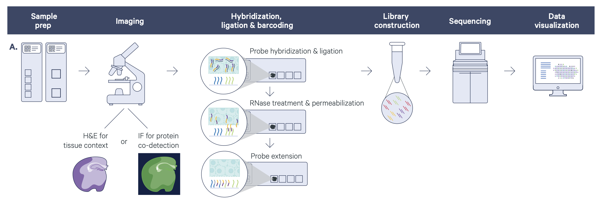
```

You can use standard fixation and staining techniques, including hematoxylin and eosin (H&E) staining, to visualize tissue sections on slides using a brightfield microscope and immunofluorescence (IF) staining to visualize protein detection in tissue sections on slides using a fluorescent microscope.

## Introduction to the spatial dataset

The [visium fresh frozen mouse brain tissue (Strain C57BL/6) dataset](https://support.10xgenomics.com/spatial-gene-expression/datasets/1.1.0/V1_Adult_Mouse_Brain) was obtained from 10X genomics. The tissue was embedded and cryosectioned as described in Visium Spatial Protocols - Tissue Preparation Guide (Demonstrated Protocol CG000240). Tissue sections of 10 µm thickness from a slice of the coronal plane were placed on Visium Gene Expression Slides.

You can find more information about his sample [here](https://support.10xgenomics.com/spatial-gene-expression/datasets/1.1.0/V1_Adult_Mouse_Brain)

## Download dataset

You need to download the expression matrix and spatial information by running these commands:

```{r, eval = FALSE}
dir.create("data")

download.file(url = "https://cf.10xgenomics.com/samples/spatial-exp/1.1.0/V1_Adult_Mouse_Brain/V1_Adult_Mouse_Brain_raw_feature_bc_matrix.tar.gz",
              destfile = "data/V1_Adult_Mouse_Brain_raw_feature_bc_matrix.tar.gz")

download.file(url = "https://cf.10xgenomics.com/samples/spatial-exp/1.1.0/V1_Adult_Mouse_Brain/V1_Adult_Mouse_Brain_spatial.tar.gz",
              destfile = "data/V1_Adult_Mouse_Brain_spatial.tar.gz")
```

After downloading, unzip the gz files. You should get the "raw_feature_bc_matrix" and "spatial" folders inside "data/".

## Create the Giotto object

createGiottoVisiumObject() will look for the standardized files organization from the visium technology in the data folder and will automatically load the expression and spatial information to create the Giotto object.


```{r, eval=FALSE}
library(Giotto)

## Set instructions
results_folder <- "results/"

python_path <- NULL

instructions <- createGiottoInstructions(
    save_dir = results_folder,
    save_plot = TRUE,
    show_plot = FALSE,
    return_plot = FALSE,
    python_path = python_path
)

## Provide the path to the visium folder
data_path <- "data"

## Create object directly from the visium folder
visium_brain <- createGiottoVisiumObject(
    visium_dir = data_path,
    expr_data = "raw",
    png_name = "tissue_lowres_image.png",
    gene_column_index = 2,
    instructions = instructions
)
```


## Subset on spots that were covered by tissue

Use the metadata column "in_tissue" to highlight the spots corresponding to the tissue area.

```{r, eval=FALSE}
spatPlot2D(
    gobject = visium_brain,
    cell_color = "in_tissue",
    point_size = 2,
    cell_color_code = c("0" = "lightgrey", "1" = "blue"),
    show_image = TRUE)
```

```{r, echo=FALSE, out.width="80%", fig.align="center"}
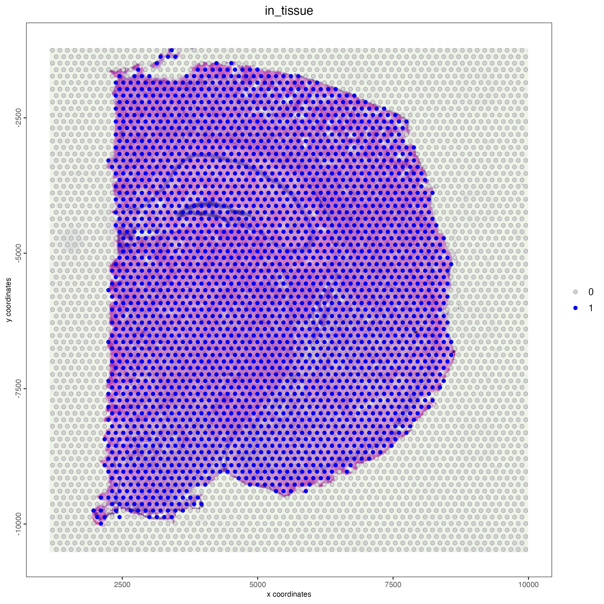
```

Use the same metadata column "in_tissue" to subset the object and keep only the spots corresponding to the tissue area.

```{r, eval=FALSE}
metadata <- getCellMetadata(gobject = visium_brain,
                            output = "data.table")

in_tissue_barcodes <- metadata[in_tissue == 1]$cell_ID

visium_brain <- subsetGiotto(gobject = visium_brain,
                             cell_ids = in_tissue_barcodes)
```


## Quality control

- Statistics

Use the function addStatistics() to count the number of features per spot. The statistics information will be stored in the metadata table under the new column "nr_feats". Then, use this column to visualize the number of features per spot across the sample.

```{r, eval=FALSE}
visium_brain_statistics <- addStatistics(gobject = visium_brain,
                                         expression_values = "raw")

## visualize
spatPlot2D(gobject = visium_brain_statistics, 
           cell_color = "nr_feats", 
           color_as_factor = FALSE)
```

```{r, echo=FALSE, out.width="80%", fig.align="center"}
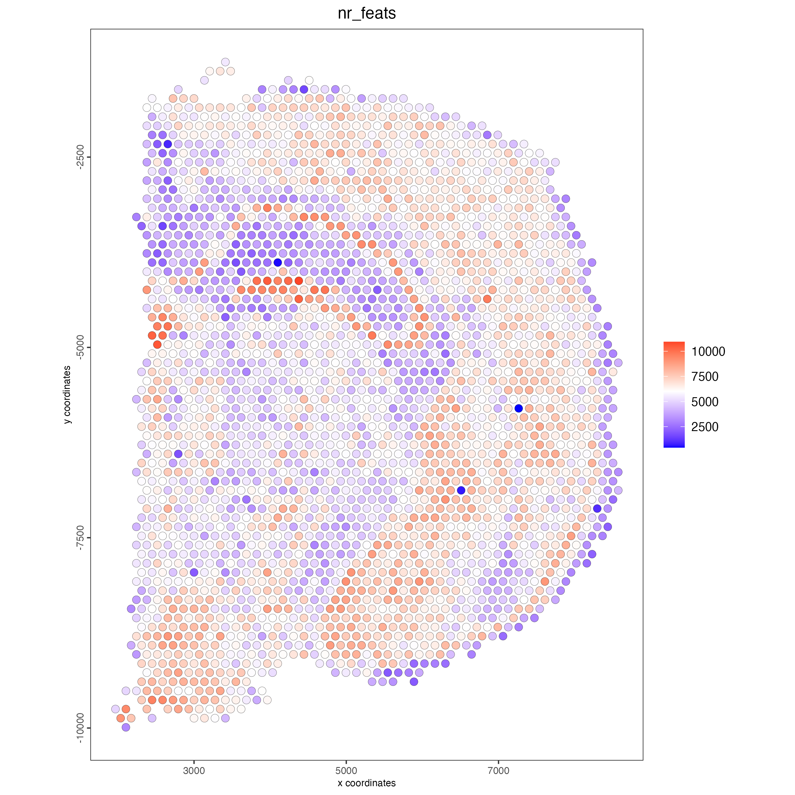
```

filterDistributions() creates a histogram to show the distribution of features per spot across the sample.

```{r, eval=FALSE}
filterDistributions(gobject = visium_brain_statistics, 
                    detection = "cells")
```

```{r, echo=FALSE, out.width="50%", fig.align="center"}

```

When setting the detection = "feats", the histogram shows the distribution of cells with certain numbers of features across the sample.

```{r, eval=FALSE}
filterDistributions(gobject = visium_brain_statistics, 
                    detection = "feats")
```

```{r, echo=FALSE, out.width="50%", fig.align="center"}
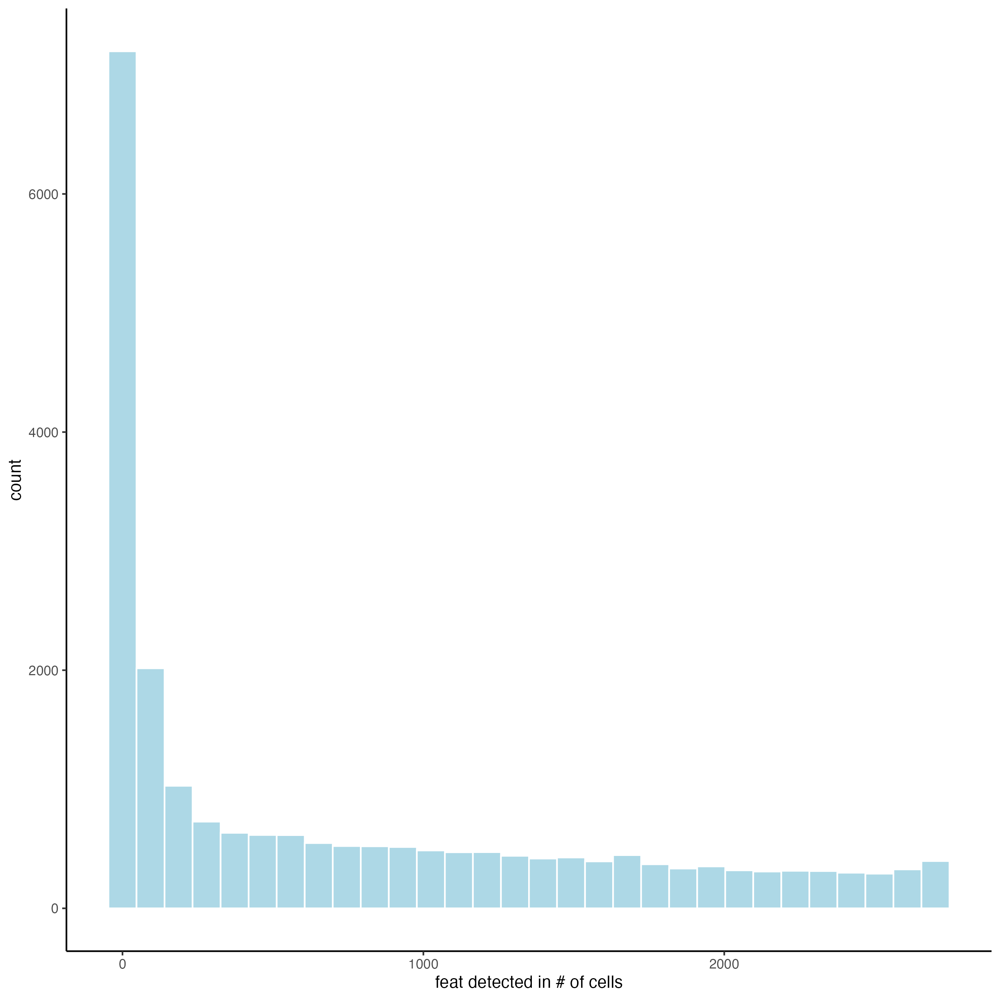
```

filterCombinations() may be used to test how different filtering parameters will affect the number of cells and features in the filtered data:

```{r, eval=FALSE}
filterCombinations(gobject = visium_brain_statistics,
                   expression_thresholds = c(1, 2, 3),
                   feat_det_in_min_cells = c(50, 100, 200),
                   min_det_feats_per_cell = c(500, 1000, 1500))
```

```{r, echo=FALSE, out.width="50%", fig.align="center"}
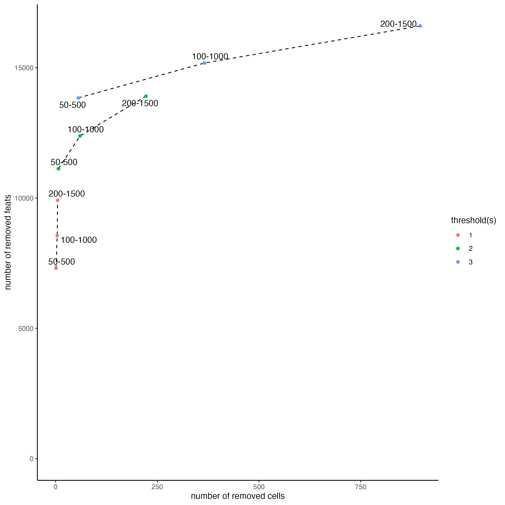
```

## Filtering

Use the arguments feat_det_in_min_cells and min_det_feats_per_cell to set the minimal number of cells where an individual feature must be detected and the minimal number of features per spot/cell, respectively, to filter the giotto object. All the features and cells under those thresholds will be removed from the sample.

```{r, eval=FALSE}
visium_brain <- filterGiotto(
    gobject = visium_brain,
    expression_threshold = 1,
    feat_det_in_min_cells = 50,
    min_det_feats_per_cell = 1000,
    expression_values = "raw",
    verbose = TRUE
)
```

```{r, eval=FALSE}
Feature type:  rna 
Number of cells removed:  4  out of  2702 
Number of feats removed:  7311  out of  22125 
```

## Normalization

Use scalefactor to set the scale factor to use after library size normalization. The default value is 6000, but you can use a different one.

```{r, eval=FALSE}
visium_brain <- normalizeGiotto(
    gobject = visium_brain,
    scalefactor = 6000,
    verbose = TRUE
)
```

Calculate the normalized number of features per spot and save the statistics in the metadata table.

```{r, eval=FALSE}
visium_brain <- addStatistics(gobject = visium_brain)

## visualize
spatPlot2D(gobject = visium_brain, 
           cell_color = "nr_feats", 
           color_as_factor = FALSE)
```

```{r, echo=FALSE, out.width="80%", fig.align="center"}
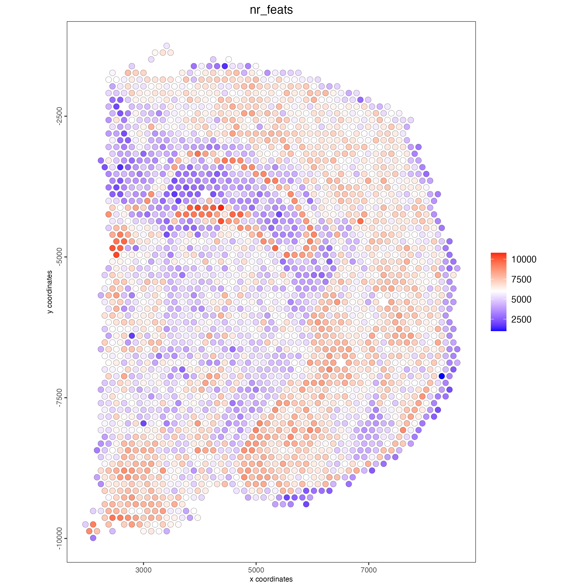
```

## Feature selection
 
### Highly Variable Features:

Calculating Highly Variable Features (HVF) is necessary to identify genes (or features) that display significant variability across the spots. There are a few methods to choose from depending on the underlying distribution of the data:

- loess regression is used when the relationship between mean expression and variance is non-linear or can be described by a non-parametric model.

```{r, eval=FALSE}
visium_brain <- calculateHVF(gobject = visium_brain, 
                             method = "cov_loess",
                             save_plot = TRUE,
                             default_save_name = "HVFplot_loess")
```

```{r, echo=FALSE, out.width="80%", fig.align="center"}
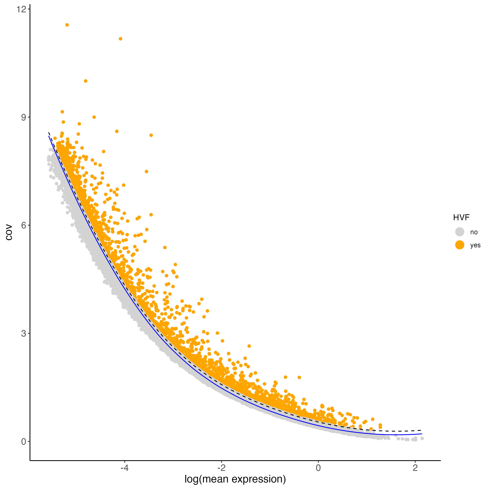
```

- pearson residuals are used when the relationship between mean expression and variance is linear or can be described by a parametric model.

```{r, eval=FALSE}
visium_brain <- calculateHVF(gobject = visium_brain, 
                             method = "var_p_resid",
                             save_plot = TRUE,
                             default_save_name = "HVFplot_pearson")
```

```{r, echo=FALSE, out.width="80%", fig.align="center"}
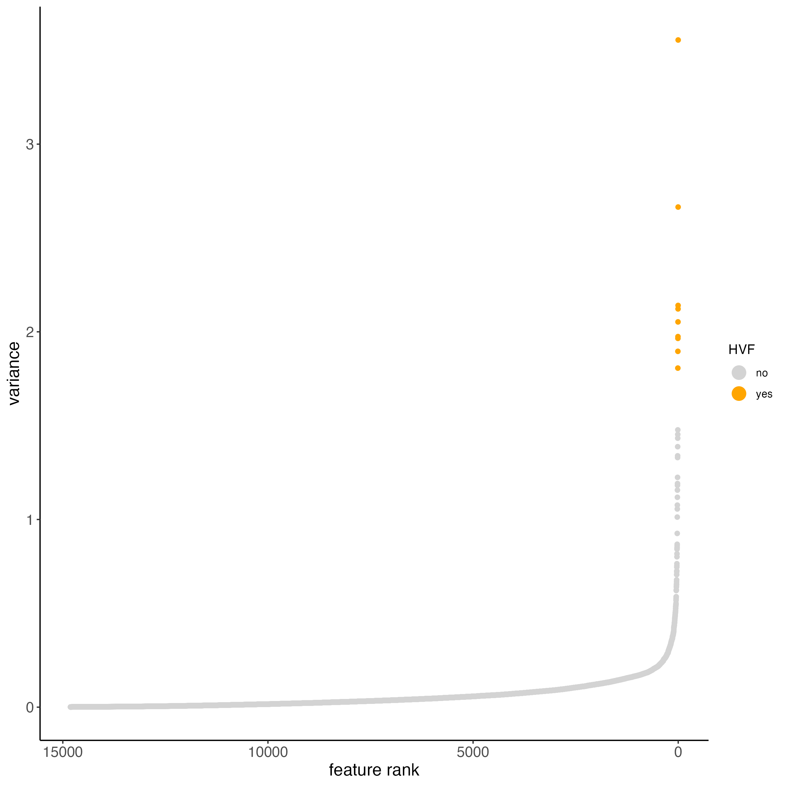
```

- binned (covariance groups) are used when variability in gene expression differs across expression levels or spatial regions, without assuming a specific relationship between mean expression and variance. This is the default method in the calculateHVF() function.

```{r, eval=FALSE}
visium_brain <- calculateHVF(gobject = visium_brain, 
                             method = "cov_groups",
                             save_plot = TRUE,
                             default_save_name = "HVFplot_binned")
```

```{r, echo=FALSE, out.width="80%", fig.align="center"}
knitr::include_graphics("img/01_session5/8-HVFplot_binned.png")
```


## Dimension Reduction

### PCA

Principal Components Analysis (PCA) is applied to reduce the dimensionality of gene expression data by transforming it into principal components, which are linear combinations of genes ranked by the variance they explain, with the first components capturing the most variance. 

- runPCA() will look for the previous calculation of highly variable features, stored as a column in the feature metadata. If the HVF labels are not found in the giotto object, then runPCA() will use all the features available in the sample to calculate the Principal Components.

```{r, eval=FALSE}
visium_brain <- runPCA(gobject = visium_brain)
```

- You can also use specific features for the Principal Components calculation, by passing a vector of features in the "feats_to_use" argument.

```{r, eval=FALSE}
my_features <- head(getFeatureMetadata(visium_brain, 
                                       output = "data.table")$feat_ID, 
                    1000)

visium_brain <- runPCA(gobject = visium_brain,
                       feats_to_use = my_features,
                       name = "custom_pca")
```

- Visualization

Create a screeplot to visualize the percentage of variance explained by each component.

```{r, eval=FALSE}
screePlot(gobject = visium_brain, 
          ncp = 30)
```

```{r, echo=FALSE, out.width="80%", fig.align="center"}
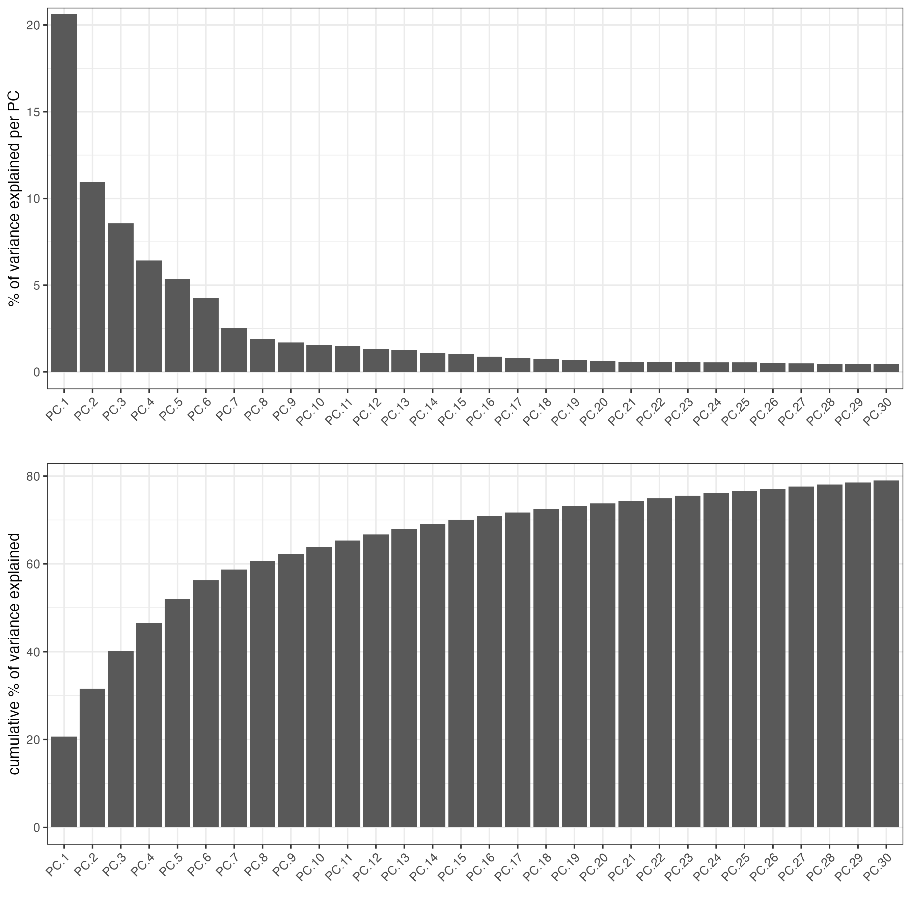
```

Visualized the PCA calculated using the HVFs.

```{r, eval=FALSE}
plotPCA(gobject = visium_brain)
```

```{r, echo=FALSE, out.width="80%", fig.align="center"}
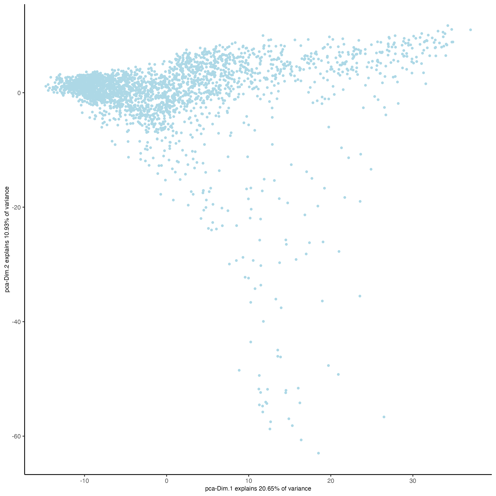
```

Visualized the custom PCA calculated using the vector of features.

```{r, eval=FALSE}
plotPCA(gobject = visium_brain,
        dim_reduction_name = "custom_pca")
```

```{r, echo=FALSE, out.width="80%", fig.align="center"}
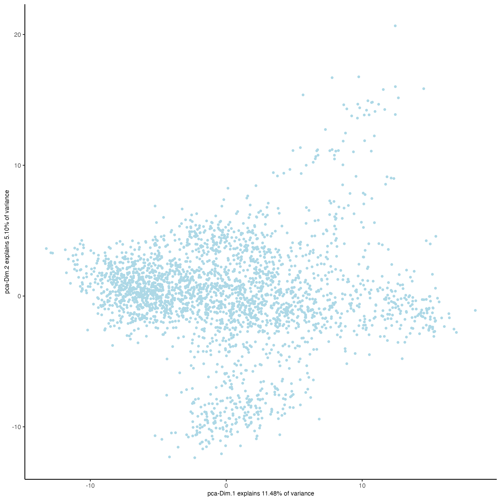
```

Unlike PCA, Unifold Manifold Approximation and Projection (UMAP) and t-Stochastic Neighbor Embedding (t-SNE) do not assume linearity. After running PCA, UMAP or t-SNE follows to further reduce the PCs.   

### UMAP

```{r, eval=FALSE}
visium_brain <- runUMAP(visium_brain, 
                        dimensions_to_use = 1:10)
```

- Visualization

```{r, eval=FALSE}
plotUMAP(gobject = visium_brain)
```

```{r, echo=FALSE, out.width="80%", fig.align="center"}
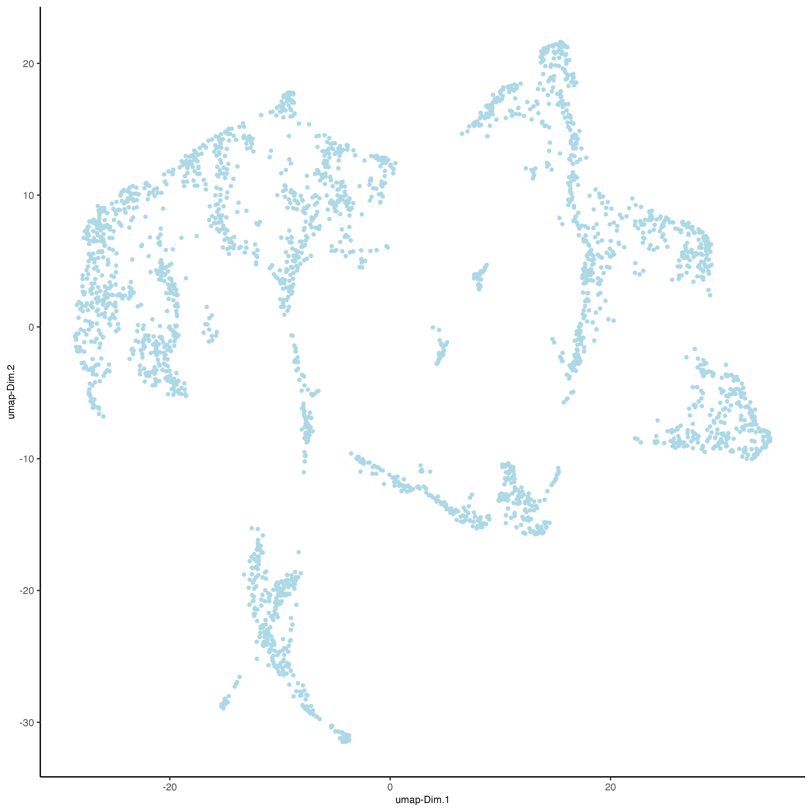
```


### t-SNE

```{r, eval=FALSE}
visium_brain <- runtSNE(gobject = visium_brain, 
                        dimensions_to_use = 1:10)
```

- Visualization

```{r, eval=FALSE}
plotTSNE(gobject = visium_brain)
```

```{r, echo=FALSE, out.width="80%", fig.align="center"}
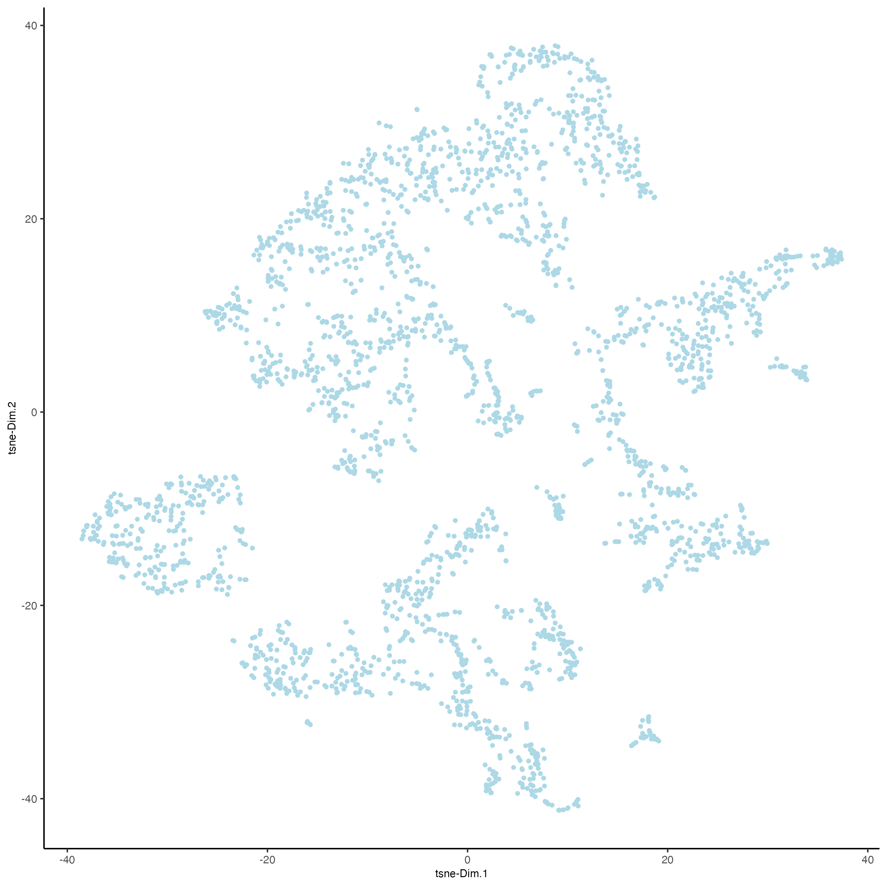
```

UMAP generally provides a more balanced view of expression relationships and biological context, while t-SNE can be more effective in highlighting specific clusters or proximal groups.


## Clustering

Shared Nearest Neighbor (sNN) emphasizes local coherence by considering spots that share nearest neighbors, highlighting cohesive spatial structures in the data. k-Nearest Neighbors (kNN) defines spatial relationships based on direct proximity, focusing on the nearest neighbors of each spot without considering shared neighborhood patterns as explicitly as sNN. 

- Create a sNN network (default)

```{r, eval=FALSE}
visium_brain <- createNearestNetwork(gobject = visium_brain, 
                                     dimensions_to_use = 1:10, 
                                     k = 15)
```

- Create a kNN network

```{r, eval=FALSE}
visium_brain <- createNearestNetwork(gobject = visium_brain, 
                                     dimensions_to_use = 1:10, 
                                     k = 15,
                                     type = "kNN")
```

### Calculate Leiden clustering

Use the previously calculated shared nearest neighbors to create clusters. The default resolution is 1, but you can decrease the value to avoid the over calculation of clusters.

```{r, eval=FALSE}
visium_brain <- doLeidenCluster(gobject = visium_brain, 
                                resolution = 0.4, 
                                n_iterations = 1000)
```

- Visualization

```{r, eval=FALSE}
plotPCA(gobject = visium_brain,
        cell_color = "leiden_clus")
```

```{r, echo=FALSE, out.width="80%", fig.align="center"}
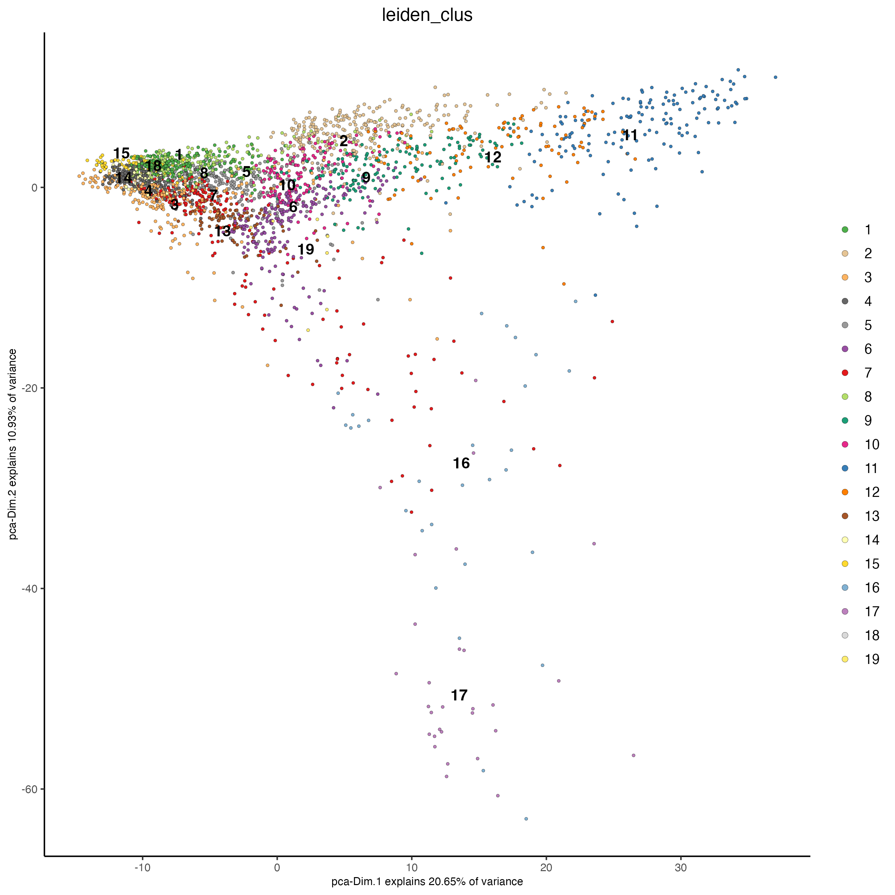
```

Use the cluster IDs to visualize the clusters in the UMAP space.

```{r, eval=FALSE}
plotUMAP(gobject = visium_brain,
         cell_color = "leiden_clus", 
         show_NN_network = FALSE, 
         point_size = 2.5)
```
 
```{r, echo=FALSE, out.width="80%", fig.align="center"}
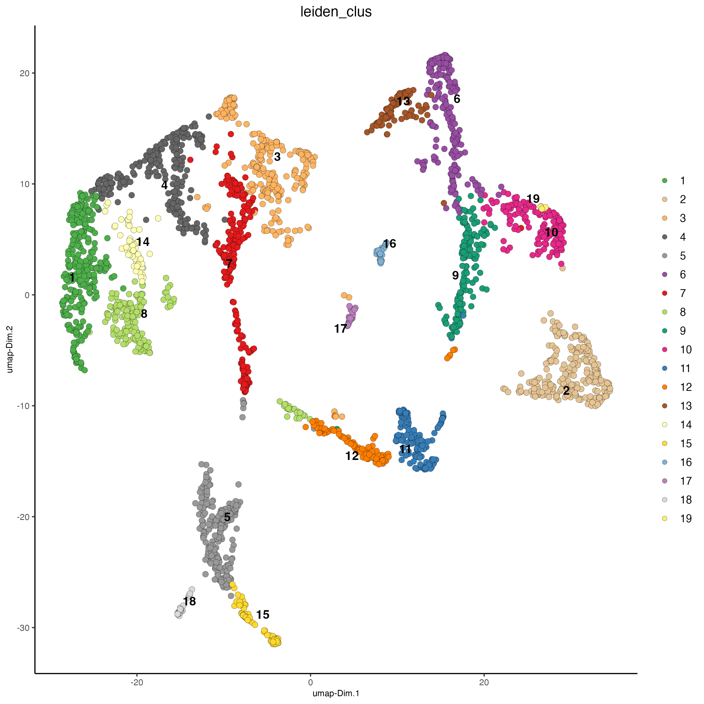
```

Set the argument "show_NN_network = TRUE" to visualize the connections between spots.

```{r, eval=FALSE}
plotUMAP(gobject = visium_brain,
         cell_color = "leiden_clus", 
         show_NN_network = TRUE, 
         point_size = 2.5)
```

```{r, echo=FALSE, out.width="80%", fig.align="center"}
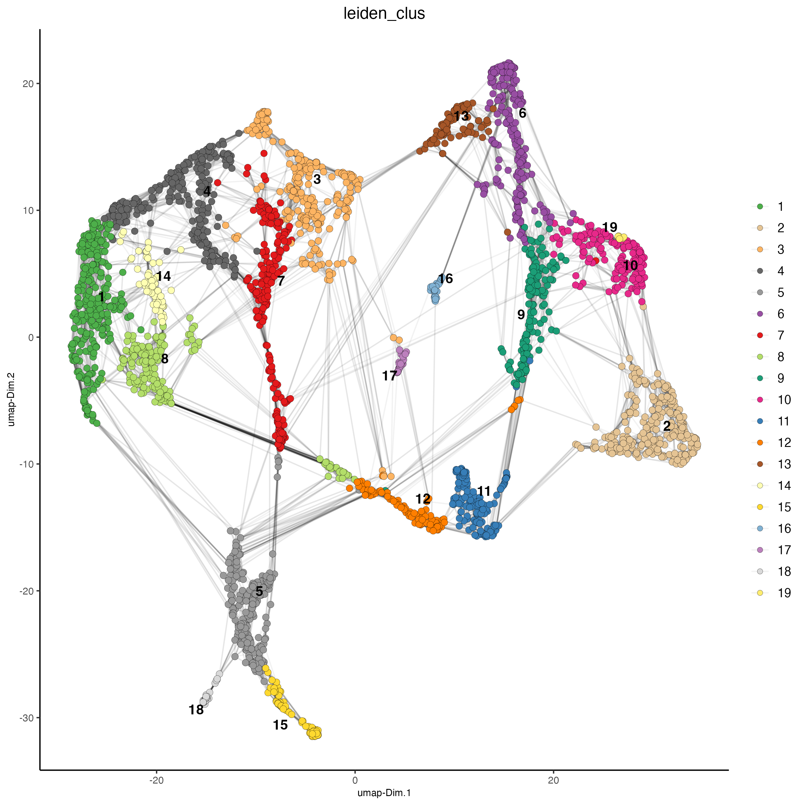
```

Use the cluster IDs to visualize the clusters on the tSNE.

```{r, eval=FALSE}
plotTSNE(gobject = visium_brain,
         cell_color = "leiden_clus",
         point_size = 2.5)
```

```{r, echo=FALSE, out.width="80%", fig.align="center"}
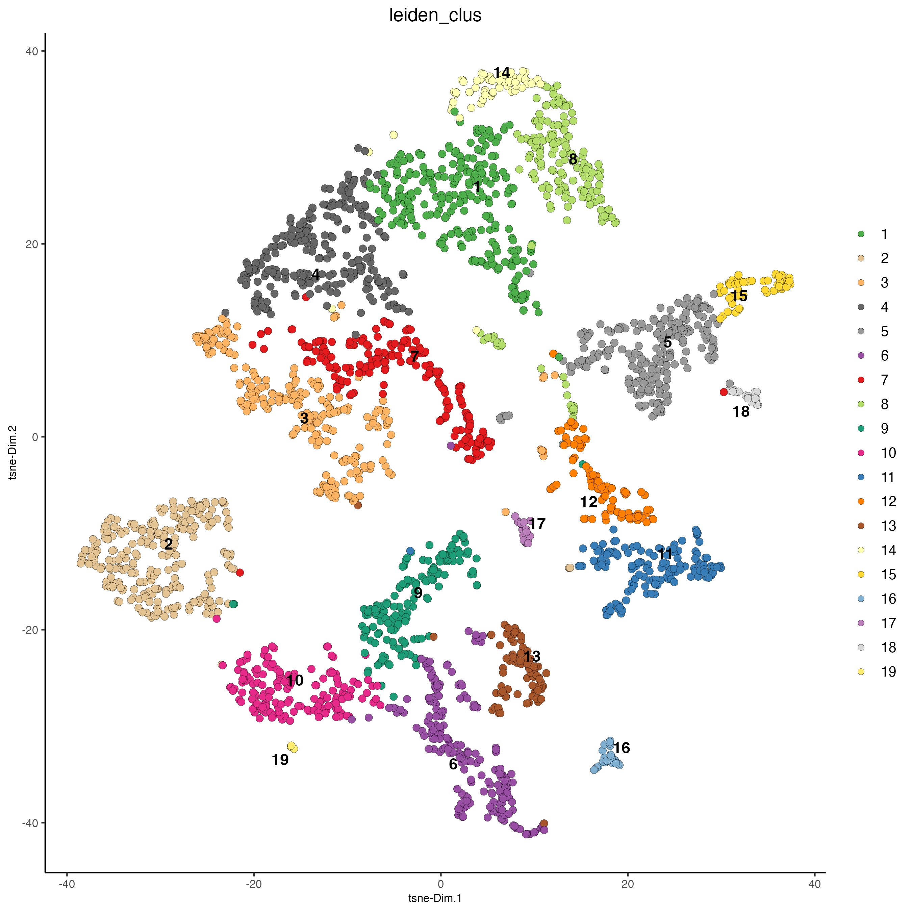
```

Set the argument "show_NN_network = TRUE" to visualize the connections between spots.

```{r, eval=FALSE}
plotTSNE(gobject = visium_brain,
         cell_color = "leiden_clus",
         point_size = 2.5,
         show_NN_network = TRUE)
```

```{r, echo=FALSE, out.width="80%", fig.align="center"}
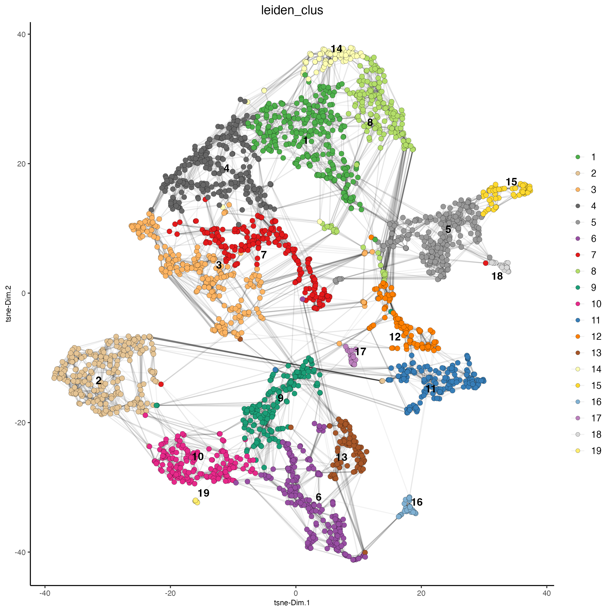
```

Use the cluster IDs to visualize their spatial location.

```{r, eval=FALSE}
spatPlot2D(visium_brain, 
           cell_color = "leiden_clus",
           point_size = 3)
```

```{r, echo=FALSE, out.width="80%", fig.align="center"}
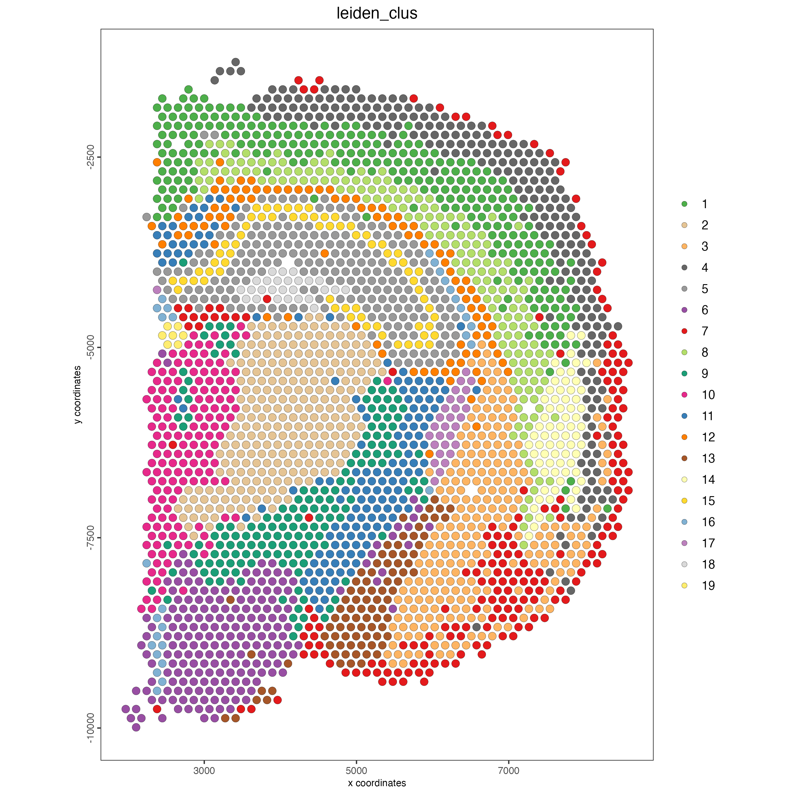
```

### Calculate Louvain clustering

Louvain is an alternative clustering method, used to detect communities in large networks.

```{r, eval=FALSE}
visium_brain <- doLouvainCluster(visium_brain)
```

```{r, eval=FALSE}
spatPlot2D(visium_brain, 
           cell_color = "louvain_clus")
```

```{r, echo=FALSE, out.width="80%", fig.align="center"}
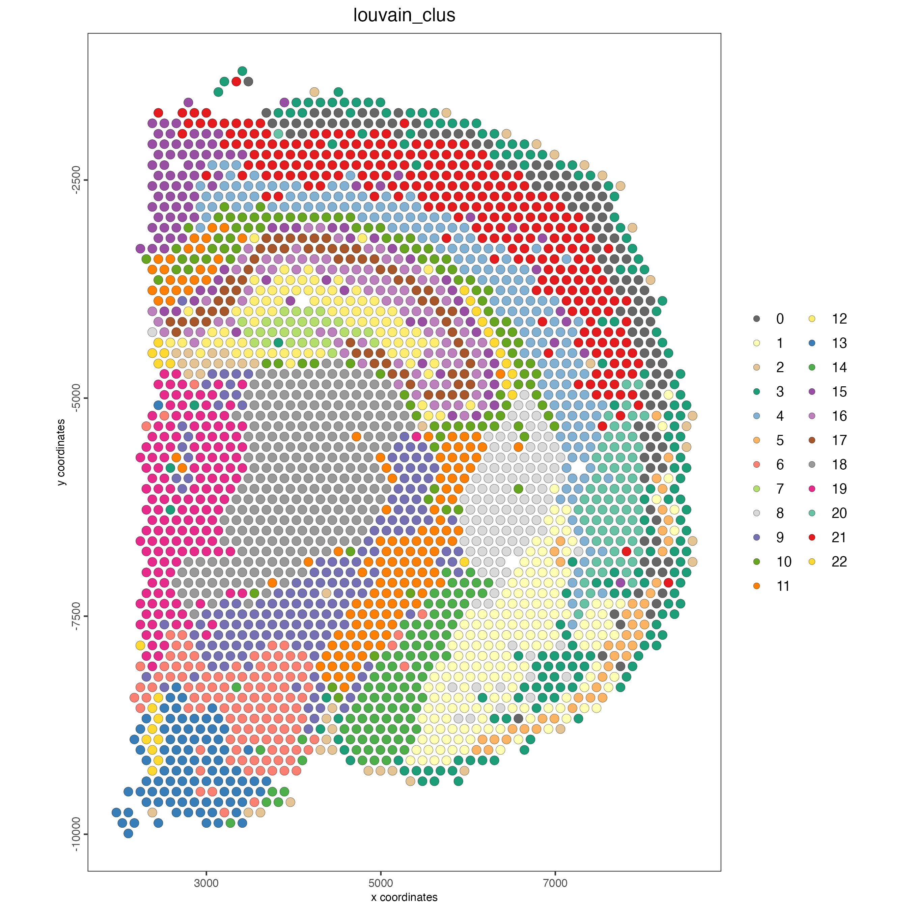
```

Leiden clustering is generally preferred for larger and more complex datasets, where as Louvain clustering may be suitable for more smaller datasets or scenarios where computational efficiency is a priority. 

You can find more information about the differences between the Leiden and Louvain methods in this paper: [From Louvain to Leiden: guaranteeing well-connected communities, 2019](https://www.nature.com/articles/s41598-019-41695-z#:~:text=Unlike%20the%20Louvain%20algorithm%2C%20the,moved%20to%20a%20different%20community.)


## Save the object

```{r, eval=FALSE}
saveGiotto(visium_brain, "visium_brain_object")
```

## Session info

```{r, eval=FALSE}
sessionInfo()
```

```{r, eval=FALSE}
R version 4.4.1 (2024-06-14)
Platform: aarch64-apple-darwin20
Running under: macOS Sonoma 14.5

Matrix products: default
BLAS:   /System/Library/Frameworks/Accelerate.framework/Versions/A/Frameworks/vecLib.framework/Versions/A/libBLAS.dylib 
LAPACK: /Library/Frameworks/R.framework/Versions/4.4-arm64/Resources/lib/libRlapack.dylib;  LAPACK version 3.12.0

locale:
[1] en_US.UTF-8/en_US.UTF-8/en_US.UTF-8/C/en_US.UTF-8/en_US.UTF-8

time zone: America/New_York
tzcode source: internal

attached base packages:
[1] stats     graphics  grDevices utils     datasets  methods   base     

other attached packages:
[1] Giotto_4.1.0      GiottoClass_0.3.3

loaded via a namespace (and not attached):
  [1] colorRamp2_0.1.0            deldir_2.0-4               
  [3] rlang_1.1.4                 magrittr_2.0.3             
  [5] GiottoUtils_0.1.10          matrixStats_1.3.0          
  [7] compiler_4.4.1              png_0.1-8                  
  [9] systemfonts_1.1.0           vctrs_0.6.5                
 [11] reshape2_1.4.4              stringr_1.5.1              
 [13] pkgconfig_2.0.3             SpatialExperiment_1.14.0   
 [15] crayon_1.5.3                fastmap_1.2.0              
 [17] backports_1.5.0             magick_2.8.4               
 [19] XVector_0.44.0              labeling_0.4.3             
 [21] utf8_1.2.4                  rmarkdown_2.27             
 [23] UCSC.utils_1.0.0            ragg_1.3.2                 
 [25] purrr_1.0.2                 xfun_0.46                  
 [27] beachmat_2.20.0             zlibbioc_1.50.0            
 [29] GenomeInfoDb_1.40.1         jsonlite_1.8.8             
 [31] DelayedArray_0.30.1         BiocParallel_1.38.0        
 [33] terra_1.7-78                irlba_2.3.5.1              
 [35] parallel_4.4.1              R6_2.5.1                   
 [37] stringi_1.8.4               RColorBrewer_1.1-3         
 [39] reticulate_1.38.0           parallelly_1.37.1          
 [41] GenomicRanges_1.56.1        scattermore_1.2            
 [43] Rcpp_1.0.13                 bookdown_0.40              
 [45] SummarizedExperiment_1.34.0 knitr_1.48                 
 [47] future.apply_1.11.2         R.utils_2.12.3             
 [49] FNN_1.1.4                   IRanges_2.38.1             
 [51] Matrix_1.7-0                igraph_2.0.3               
 [53] tidyselect_1.2.1            rstudioapi_0.16.0          
 [55] abind_1.4-5                 yaml_2.3.9                 
 [57] codetools_0.2-20            listenv_0.9.1              
 [59] lattice_0.22-6              tibble_3.2.1               
 [61] plyr_1.8.9                  Biobase_2.64.0             
 [63] withr_3.0.0                 Rtsne_0.17                 
 [65] evaluate_0.24.0             future_1.33.2              
 [67] pillar_1.9.0                MatrixGenerics_1.16.0      
 [69] checkmate_2.3.1             stats4_4.4.1               
 [71] plotly_4.10.4               generics_0.1.3             
 [73] dbscan_1.2-0                sp_2.1-4                   
 [75] S4Vectors_0.42.1            ggplot2_3.5.1              
 [77] munsell_0.5.1               scales_1.3.0               
 [79] globals_0.16.3              gtools_3.9.5               
 [81] glue_1.7.0                  lazyeval_0.2.2             
 [83] tools_4.4.1                 GiottoVisuals_0.2.4        
 [85] data.table_1.15.4           ScaledMatrix_1.12.0        
 [87] cowplot_1.1.3               grid_4.4.1                 
 [89] tidyr_1.3.1                 colorspace_2.1-0           
 [91] SingleCellExperiment_1.26.0 GenomeInfoDbData_1.2.12    
 [93] BiocSingular_1.20.0         rsvd_1.0.5                 
 [95] cli_3.6.3                   textshaping_0.4.0          
 [97] fansi_1.0.6                 S4Arrays_1.4.1             
 [99] viridisLite_0.4.2           dplyr_1.1.4                
[101] uwot_0.2.2                  gtable_0.3.5               
[103] R.methodsS3_1.8.2           digest_0.6.36              
[105] BiocGenerics_0.50.0         SparseArray_1.4.8          
[107] ggrepel_0.9.5               farver_2.1.2               
[109] rjson_0.2.21                htmlwidgets_1.6.4          
[111] htmltools_0.5.8.1           R.oo_1.26.0                
[113] lifecycle_1.0.4             httr_1.4.7 
```

