# Visium Part I

Joselyn Cristina Chávez Fuentes

August 5th 2024

## Introduction to spatial dataset

10X genomics recently launched a new platform to obtain spatial expression data using a Visium Spatial Gene Expression slide.

The Visium brain data to run this tutorial can be found [here](https://support.10xgenomics.com/spatial-gene-expression/datasets/1.1.0/V1_Adult_Mouse_Brain)

You need to download the expression matrix and spatial information by running these commands in the bash terminal:

```{bash, eval = FALSE}
wget https://cf.10xgenomics.com/samples/spatial-exp/1.1.0/V1_Adult_Mouse_Brain/V1_Adult_Mouse_Brain_raw_feature_bc_matrix.tar.gz

wget https://cf.10xgenomics.com/samples/spatial-exp/1.1.0/V1_Adult_Mouse_Brain/V1_Adult_Mouse_Brain_spatial.tar.gz
```

After downloading, unzip the gz files. You should get 'raw_feature_bc_matrix' and 'spatial' folders. Place both of them inside a 'data' folder.

## Create the Giotto object

```{r, eval=FALSE}
library(Giotto)

## Set instructions
results_folder <- "results/"

my_python_path <- NULL

instrs <- createGiottoInstructions(
    save_dir = results_folder,
    save_plot = TRUE,
    show_plot = FALSE,
    python_path = my_python_path
)

## Provide path to visium folder
data_path <- "data/"

## Create object directly from visium folder
visium_brain <- createGiottoVisiumObject(
    visium_dir = data_path,
    expr_data = "raw",
    png_name = "tissue_lowres_image.png",
    gene_column_index = 2,
    instructions = instrs
)
```


## Subset on spots that were covered by tissue

```{r, eval=FALSE}
## show plot
spatPlot2D(
    gobject = visium_brain,
    cell_color = "in_tissue",
    point_size = 2,
    cell_color_code = c("0" = "lightgrey", "1" = "blue"),
    show_image = TRUE,
    largeImage_name = "image"
)
```

```{r, echo=FALSE, out.width="80%", fig.align='center'}
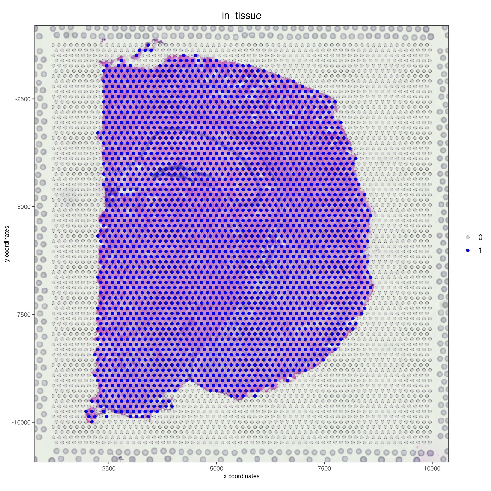
```


```{r, eval=FALSE}
metadata <- pDataDT(gobject = visium_brain)
in_tissue_barcodes <- metadata[in_tissue == 1]$cell_ID

visium_brain <- subsetGiotto(gobject = visium_brain,
                             cell_ids = in_tissue_barcodes)
```


## Quality control

- Statistics

```{r, eval=FALSE}
visium_brain_statistics <- addStatistics(gobject = visium_brain,
                                         expression_values = "raw")

## visualize
spatPlot2D(gobject = visium_brain_statistics, 
           cell_color = "nr_feats", 
           color_as_factor = FALSE)
```

```{r, echo=FALSE, out.width="80%", fig.align='center'}
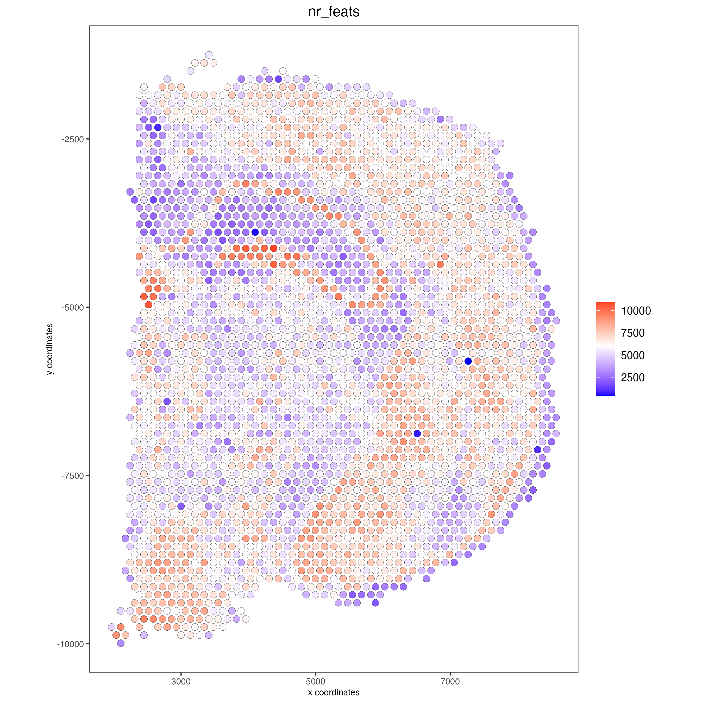
```

```{r, eval=FALSE}
filterDistributions(gobject = visium_brain_statistics, 
                    detection = "cells")
```

```{r, echo=FALSE, out.width="50%", fig.align='center'}
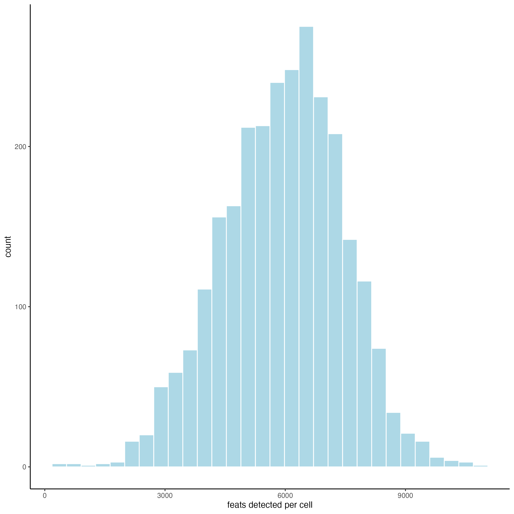
```

```{r, eval=FALSE}
filterDistributions(gobject = visium_brain_statistics, 
                    detection = "feats")
```

```{r, echo=FALSE, out.width="50%", fig.align='center'}

```

filterCombinations may be used to test how different filtering parameters will affect the number of cells and features in the filtered data:


```{r, eval=FALSE}
filterCombinations(gobject = visium_brain_statistics,
                   expression_thresholds = c(1, 2, 3),
                   feat_det_in_min_cells = c(50, 100, 200),
                   min_det_feats_per_cell = c(500, 1000, 1500))
```

```{r, echo=FALSE, out.width="50%", fig.align='center'}
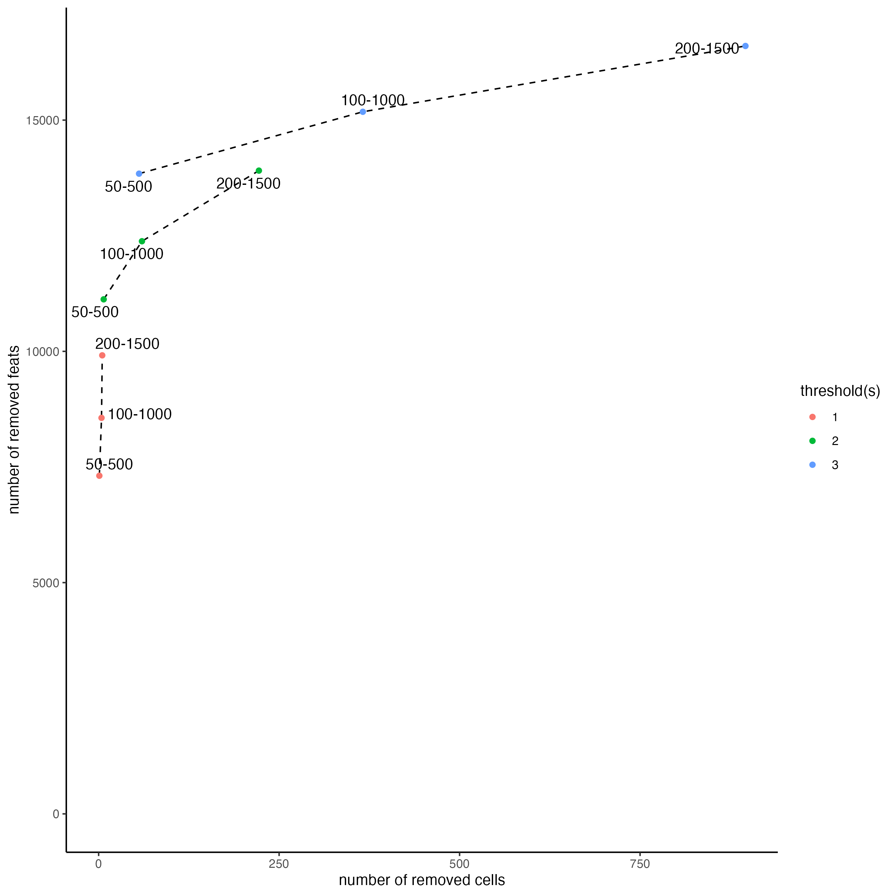
```

## Filtering

```{r, eval=FALSE}
visium_brain <- filterGiotto(
    gobject = visium_brain,
    expression_threshold = 1,
    feat_det_in_min_cells = 50,
    min_det_feats_per_cell = 1000,
    expression_values = "raw",
    verbose = TRUE
)
```

```{r, eval=FALSE}
Feature type:  rna 
Number of cells removed:  4  out of  2702 
Number of feats removed:  7311  out of  22125 
```

## Normalization

```{r, eval=FALSE}
visium_brain <- normalizeGiotto(
    gobject = visium_brain,
    scalefactor = 6000,
    verbose = TRUE
)
```

```{r, eval=FALSE}
visium_brain <- addStatistics(gobject = visium_brain)

## visualize
spatPlot2D(gobject = visium_brain, 
           cell_color = "nr_feats", 
           color_as_factor = FALSE)
```

```{r, echo=FALSE, out.width="80%", fig.align='center'}
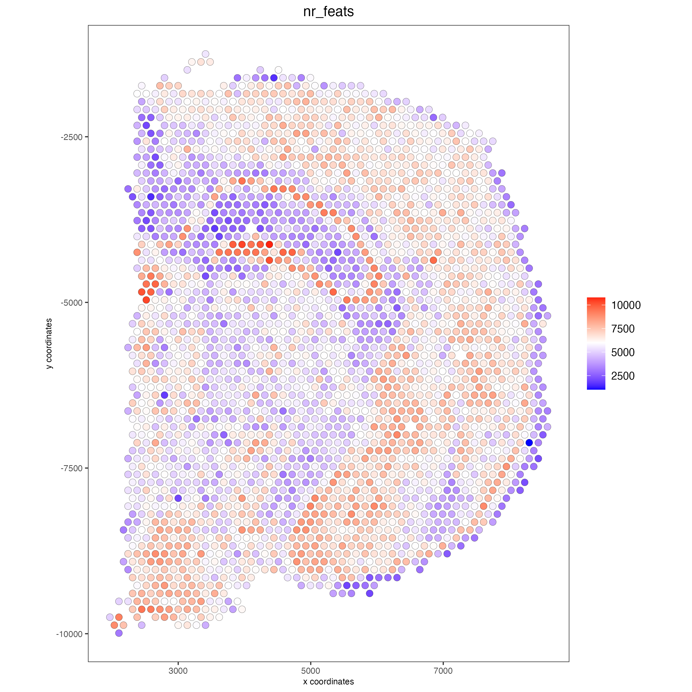
```

## Feature selection
 
### Highly Variable Features:

- loess regression

```{r, eval=FALSE}
visium_brain <- calculateHVF(gobject = visium_brain, 
                             method = "cov_loess",
                             default_save_name = "HVFplot_loess")
```

```{r, echo=FALSE, out.width="80%", fig.align='center'}
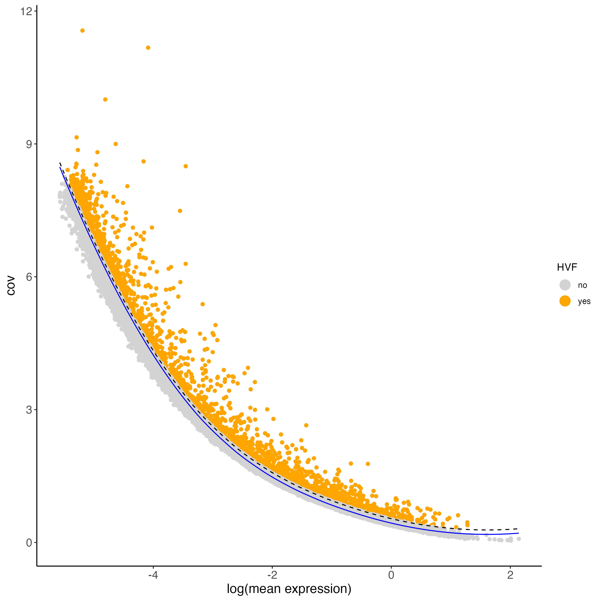
```

- pearson residuals

```{r, eval=FALSE}
visium_brain <- calculateHVF(gobject = visium_brain, 
                             method = "var_p_resid",
                             default_save_name = "HVFplot_pearson")
```

```{r, echo=FALSE, out.width="80%", fig.align='center'}
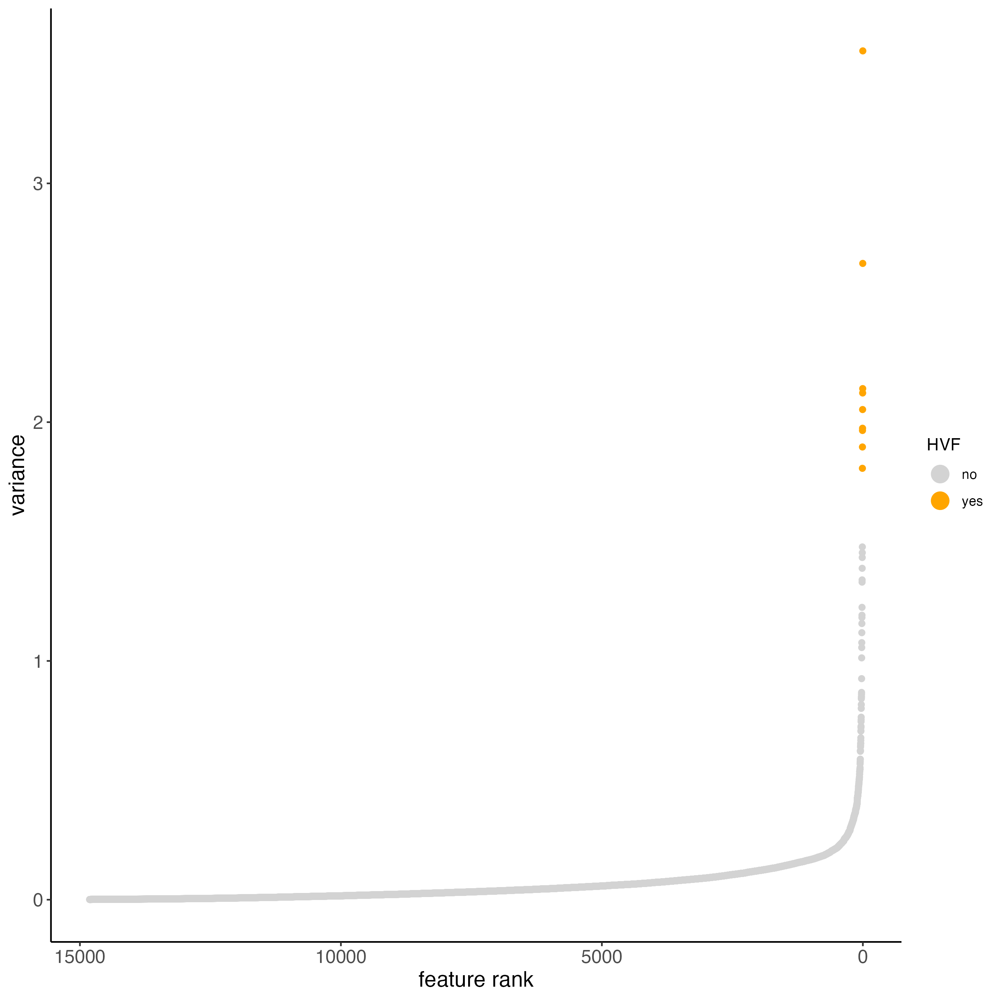
```

- binned

```{r, eval=FALSE}
visium_brain <- calculateHVF(gobject = visium_brain, 
                             method = "cov_groups",
                             default_save_name = "HVFplot_binned")
```

```{r, echo=FALSE, out.width="80%", fig.align='center'}
knitr::include_graphics("img/visium/8-HVFplot_binned.png")
```

### Spatial variable genes

```{r, eval=FALSE}
my_spatial_genes <- c("gene1", "gene2", "gene3")
```


## Dimension Reduction

### PCA

- Default

```{r, eval=FALSE}
visium_brain <- runPCA(gobject = visium_brain)
```

- Using specific genes

```{r, eval=FALSE}
visium_brain <- runPCA(gobject = visium_brain,
                       feats_to_use = my_spatial_genes)
```

- Visualization

Screeplot 

```{r, eval=FALSE}
screePlot(gobject = visium_brain, ncp = 30)
```

```{r, echo=FALSE, out.width="80%", fig.align='center'}
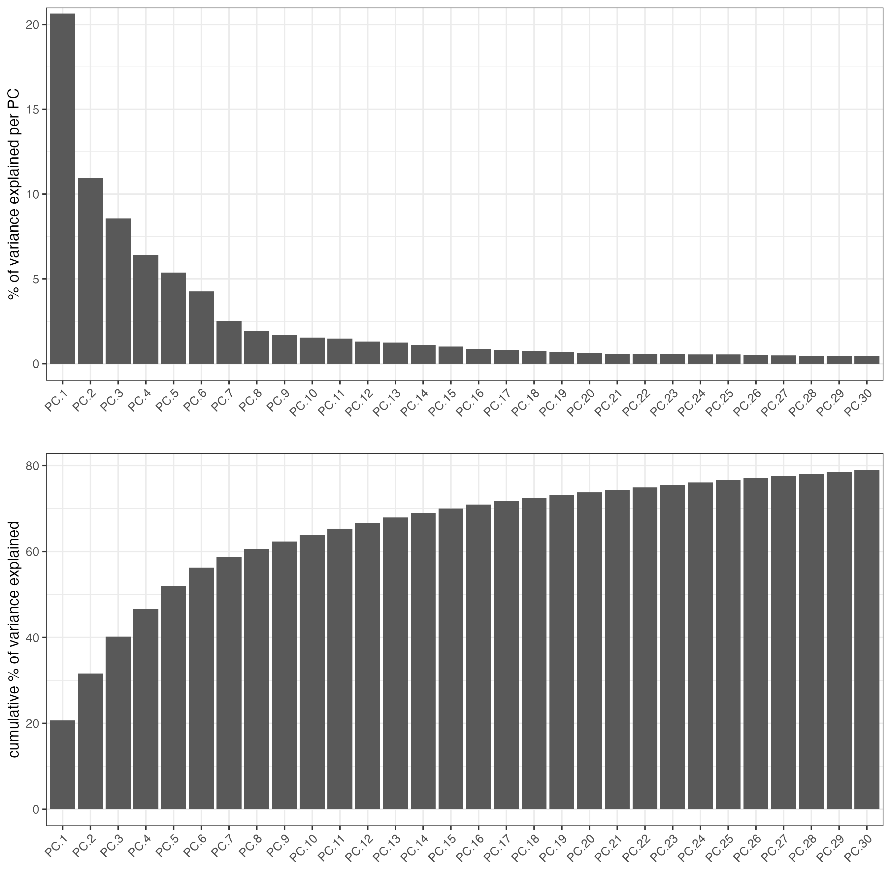
```

PCA 

```{r, eval=FALSE}
plotPCA(gobject = visium_brain)
```

```{r, echo=FALSE, out.width="80%", fig.align='center'}
knitr::include_graphics("img/visium/10-PCA.png")
```

### UMAP

```{r, eval=FALSE}
visium_brain <- runUMAP(visium_brain, 
                        dimensions_to_use = 1:10)
```

- Visualization

```{r, eval=FALSE}
plotUMAP(gobject = visium_brain)
```

```{r, echo=FALSE, out.width="80%", fig.align='center'}
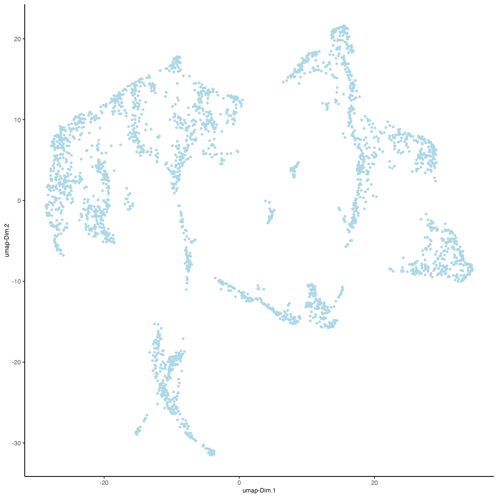
```


### t-SNE

```{r, eval=FALSE}
visium_brain <- runtSNE(gobject = visium_brain, 
                        dimensions_to_use = 1:10)
```

- Visualization

```{r, eval=FALSE}
plotTSNE(gobject = visium_brain)
```

```{r, echo=FALSE, out.width="80%", fig.align='center'}
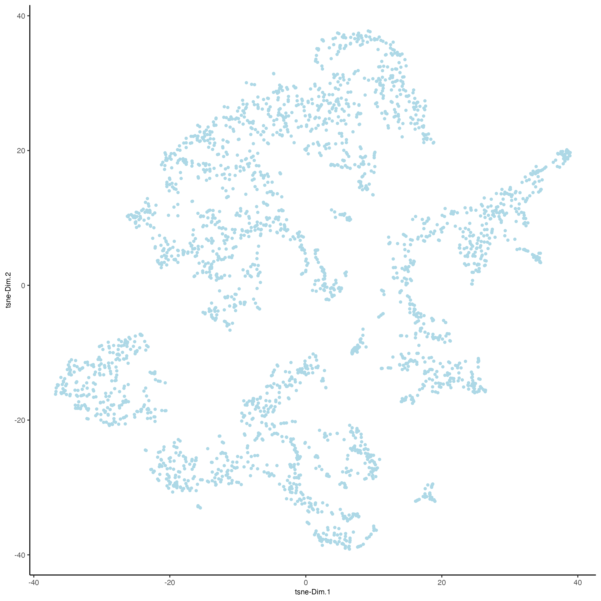
```

## Clustering


### Non-spatial

- Create a sNN network (default)

```{r, eval=FALSE}
visium_brain <- createNearestNetwork(gobject = visium_brain, 
                                     dimensions_to_use = 1:10, 
                                     k = 15)
```

- Create a kNN network

```{r, eval=FALSE}
visium_brain <- createNearestNetwork(gobject = visium_brain, 
                                     dimensions_to_use = 1:10, 
                                     k = 15,
                                     type = "kNN")
```

- Calculate Leiden clustering

```{r, eval=FALSE}
visium_brain <- doLeidenCluster(gobject = visium_brain, 
                                resolution = 0.4, 
                                n_iterations = 1000)
```

- Visualization

```{r, eval=FALSE}
plotPCA(gobject = visium_brain,
        cell_color = 'leiden_clus')
```

```{r, echo=FALSE, out.width="80%", fig.align='center'}

```

```{r, eval=FALSE}
plotUMAP(gobject = visium_brain,
         cell_color = 'leiden_clus', 
         show_NN_network = FALSE, 
         point_size = 2.5)
```
 
```{r, echo=FALSE, out.width="80%", fig.align='center'}
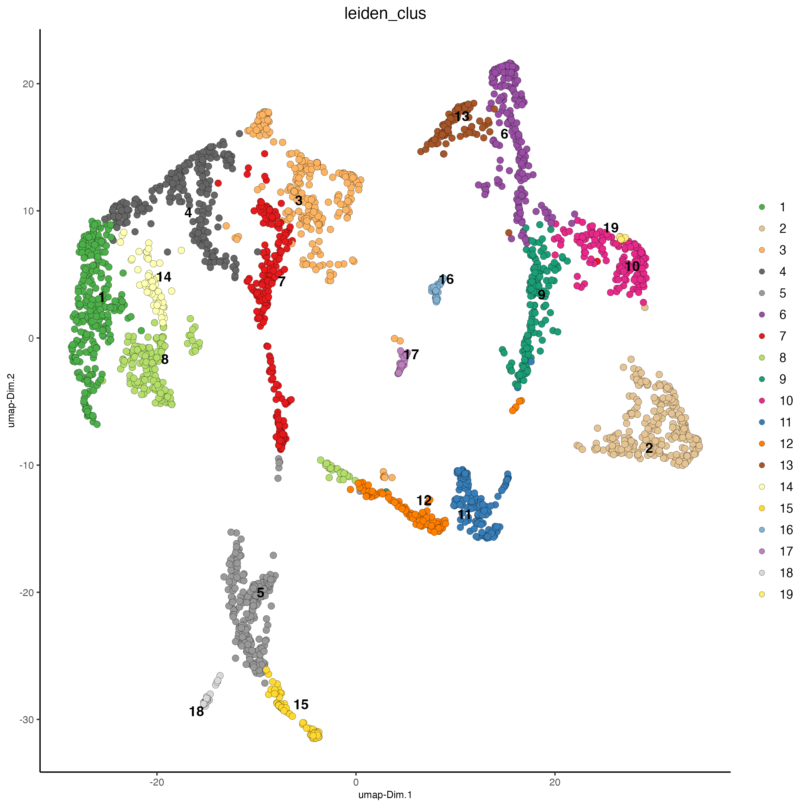
```

```{r, eval=FALSE}
plotUMAP(gobject = visium_brain,
         cell_color = 'leiden_clus', 
         show_NN_network = TRUE, 
         point_size = 2.5)
```

```{r, echo=FALSE, out.width="80%", fig.align='center'}

```

```{r, eval=FALSE}
plotTSNE(gobject = visium_brain,
         cell_color = 'leiden_clus',
         point_size = 2.5)
```

```{r, echo=FALSE, out.width="80%", fig.align='center'}
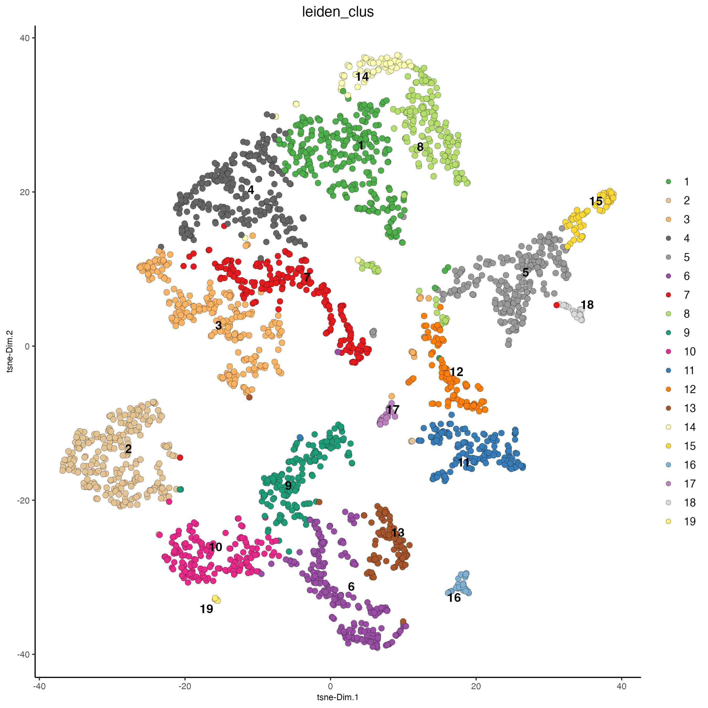
```

```{r, eval=FALSE}
plotTSNE(gobject = visium_brain,
         cell_color = 'leiden_clus',
         point_size = 2.5,
         show_NN_network = TRUE)
```

```{r, echo=FALSE, out.width="80%", fig.align='center'}
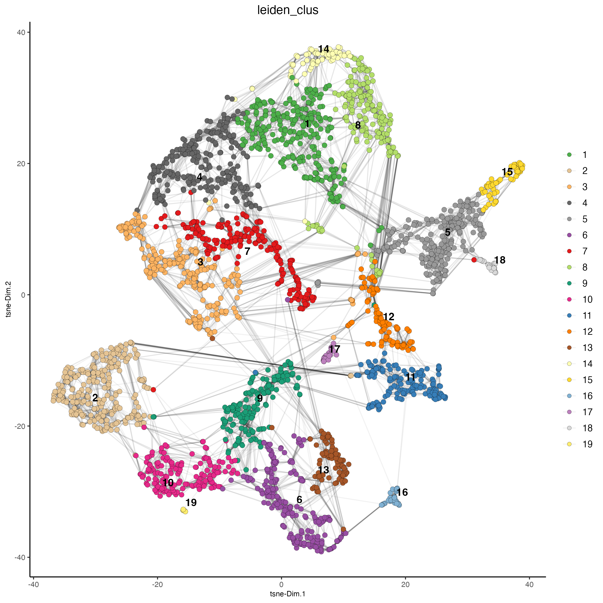
```

Dimension plots grouped by cluster

```{r, eval=FALSE}
spatPlot2D(visium_brain, 
           cell_color = 'leiden_clus')
```

```{r, echo=FALSE, out.width="80%", fig.align='center'}
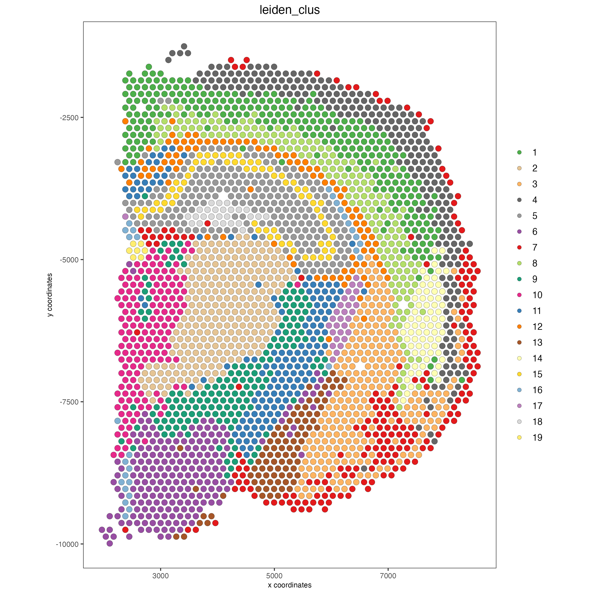
```

### Spatial

- Spatial variable genes
- Spatial co-expression modules
