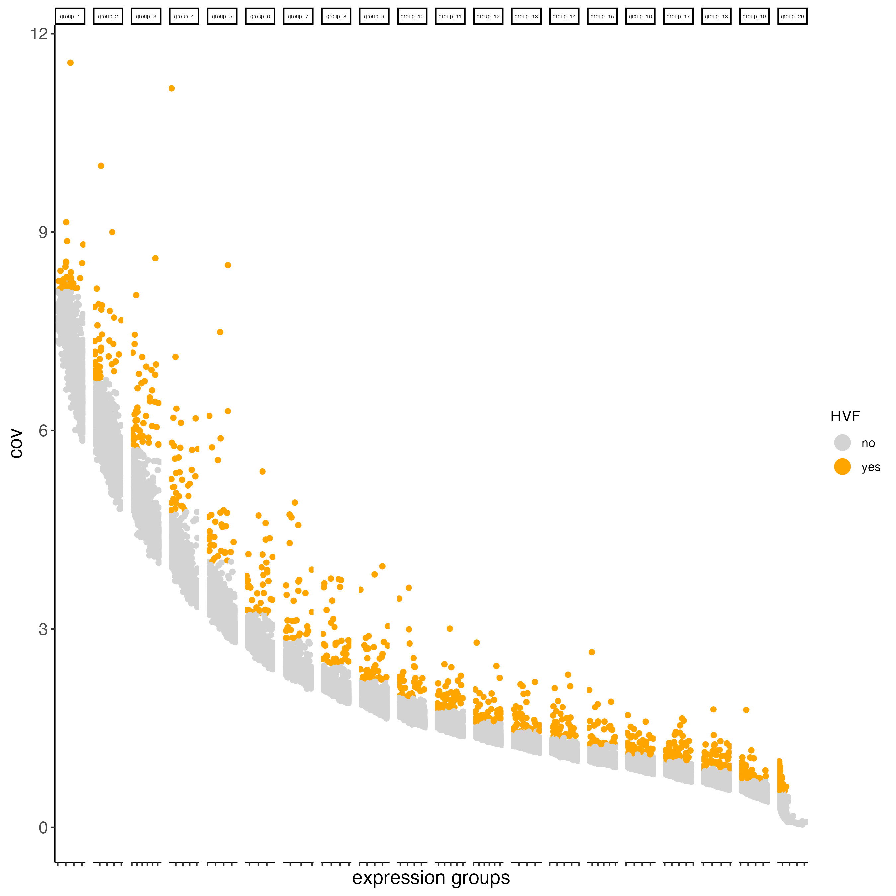

# Visium Part I

Joselyn Cristina Chávez Fuentes

August 5th 2024

## The Visium technology

Visium allows you to perform spatial transcriptomics, which combines histological information with whole transcriptome gene expression profiles (fresh frozen or FFPE) to provide you with spatially resolved gene expression.

```{r, echo=FALSE, out.width="100%", fig.align='center'}
knitr::include_graphics("img/01_session5/workflow.png")
```

You can use standard fixation and staining techniques, including hematoxylin and eosin (H&E) staining, to visualize tissue sections on slides using a brightfield microscope and immunofluorescence (IF) staining to visualize protein detection in tissue sections on slides using a fluorescent microscope.

## Introduction to the spatial dataset

The [visium fresh frozen mouse brain tissue (Strain C57BL/6) dataset](https://support.10xgenomics.com/spatial-gene-expression/datasets/1.1.0/V1_Adult_Mouse_Brain) was obtained from 10X genomics. The tissue was embedded and cryosectioned as described in Visium Spatial Protocols - Tissue Preparation Guide (Demonstrated Protocol CG000240). Tissue sections of 10 µm thickness from a slice of the coronal plane were placed on Visium Gene Expression Slides.

You can find more information about his sample [here](https://support.10xgenomics.com/spatial-gene-expression/datasets/1.1.0/V1_Adult_Mouse_Brain)

## Download dataset

You need to download the expression matrix and spatial information by running these commands:

```{r, eval = FALSE}
dir.create("data")

download.file(url = "https://cf.10xgenomics.com/samples/spatial-exp/1.1.0/V1_Adult_Mouse_Brain/V1_Adult_Mouse_Brain_raw_feature_bc_matrix.tar.gz",
              destfile = "data/V1_Adult_Mouse_Brain_raw_feature_bc_matrix.tar.gz")

download.file(url = "https://cf.10xgenomics.com/samples/spatial-exp/1.1.0/V1_Adult_Mouse_Brain/V1_Adult_Mouse_Brain_spatial.tar.gz",
              destfile = "data/V1_Adult_Mouse_Brain_spatial.tar.gz")
```

After downloading, unzip the gz files. You should get the "raw_feature_bc_matrix" and "spatial" folders inside "data/".

## Create the Giotto object

```{r, eval=FALSE}
library(Giotto)

## Set instructions
results_folder <- "results/"

python_path <- NULL

instructions <- createGiottoInstructions(
    save_dir = results_folder,
    save_plot = TRUE,
    show_plot = FALSE,
    return_plot = FALSE,
    python_path = python_path
)

## Provide the path to the visium folder
data_path <- "data"

## Create object directly from the visium folder
visium_brain <- createGiottoVisiumObject(
    visium_dir = data_path,
    expr_data = "raw",
    png_name = "tissue_lowres_image.png",
    gene_column_index = 2,
    instructions = instructions
)
```


## Subset on spots that were covered by tissue

```{r, eval=FALSE}
spatPlot2D(
    gobject = visium_brain,
    cell_color = "in_tissue",
    point_size = 2,
    cell_color_code = c("0" = "lightgrey", "1" = "blue"),
    show_image = TRUE,
    image_name = "image"
)
```

```{r, echo=FALSE, out.width="80%", fig.align="center"}
knitr::include_graphics("img/01_session5/0-spatPlot2D.png")
```


```{r, eval=FALSE}
metadata <- getCellMetadata(gobject = visium_brain,
                            output = "data.table")

in_tissue_barcodes <- metadata[in_tissue == 1]$cell_ID

visium_brain <- subsetGiotto(gobject = visium_brain,
                             cell_ids = in_tissue_barcodes)
```


## Quality control

- Statistics

```{r, eval=FALSE}
visium_brain_statistics <- addStatistics(gobject = visium_brain,
                                         expression_values = "raw")

## visualize
spatPlot2D(gobject = visium_brain_statistics, 
           cell_color = "nr_feats", 
           color_as_factor = FALSE)
```

```{r, echo=FALSE, out.width="80%", fig.align="center"}
knitr::include_graphics("img/01_session5/1-spatPlot2D.png")
```

```{r, eval=FALSE}
filterDistributions(gobject = visium_brain_statistics, 
                    detection = "cells")
```

```{r, echo=FALSE, out.width="50%", fig.align="center"}

```

```{r, eval=FALSE}
filterDistributions(gobject = visium_brain_statistics, 
                    detection = "feats")
```

```{r, echo=FALSE, out.width="50%", fig.align="center"}
knitr::include_graphics("img/01_session5/3-filterDistributions.png")
```

filterCombinations() may be used to test how different filtering parameters will affect the number of cells and features in the filtered data:


```{r, eval=FALSE}
filterCombinations(gobject = visium_brain_statistics,
                   expression_thresholds = c(1, 2, 3),
                   feat_det_in_min_cells = c(50, 100, 200),
                   min_det_feats_per_cell = c(500, 1000, 1500))
```

```{r, echo=FALSE, out.width="50%", fig.align="center"}
knitr::include_graphics("img/01_session5/4-filterCombinations.png")
```

## Filtering

```{r, eval=FALSE}
visium_brain <- filterGiotto(
    gobject = visium_brain,
    expression_threshold = 1,
    feat_det_in_min_cells = 50,
    min_det_feats_per_cell = 1000,
    expression_values = "raw",
    verbose = TRUE
)
```

```{r, eval=FALSE}
Feature type:  rna 
Number of cells removed:  4  out of  2702 
Number of feats removed:  7311  out of  22125 
```

## Normalization

```{r, eval=FALSE}
visium_brain <- normalizeGiotto(
    gobject = visium_brain,
    scalefactor = 6000,
    verbose = TRUE
)
```

```{r, eval=FALSE}
visium_brain <- addStatistics(gobject = visium_brain)

## visualize
spatPlot2D(gobject = visium_brain, 
           cell_color = "nr_feats", 
           color_as_factor = FALSE)
```

```{r, echo=FALSE, out.width="80%", fig.align="center"}
knitr::include_graphics("img/01_session5/5-spatPlot2D.png")
```

## Feature selection
 
### Highly Variable Features:

Calculating Highly Variable Features (HVF) is necessary to identify genes (or features) that display significant variability across spatial locations. There are a few methods to choose from:

- loess regression

```{r, eval=FALSE}
visium_brain <- calculateHVF(gobject = visium_brain, 
                             method = "cov_loess",
                             save_plot = TRUE,
                             default_save_name = "HVFplot_loess")
```

```{r, echo=FALSE, out.width="80%", fig.align="center"}

```

- pearson residuals

```{r, eval=FALSE}
visium_brain <- calculateHVF(gobject = visium_brain, 
                             method = "var_p_resid",
                             save_plot = TRUE,
                             default_save_name = "HVFplot_pearson")
```

```{r, echo=FALSE, out.width="80%", fig.align="center"}
knitr::include_graphics("img/01_session5/7-HVFplot_pearson.png")
```

- binned

```{r, eval=FALSE}
visium_brain <- calculateHVF(gobject = visium_brain, 
                             method = "cov_groups",
                             save_plot = TRUE,
                             default_save_name = "HVFplot_binned")
```

```{r, echo=FALSE, out.width="80%", fig.align="center"}

```

Depending on the underlying distribution of the data: 

- loess regression is used when the relationship between mean expression and variance is non-linear or can be described by a non-parametric model

- pearson residuals are used when the relationship between mean expression and variance is linear or can be described by a parametric model 

- binned (covariance groups) are used when variability in gene expression differs across expression levels or spatial regions, without assuming a specific relationship between mean expression and variance

## Dimension Reduction

### PCA

Principal Components Analysis (PCA) is applied to reduce the dimensionality of gene expression data by transforming it into principal components, which are linear combinations of genes ranked by the variance they explain, with the first components capturing the most variance. 

- Default

```{r, eval=FALSE}
visium_brain <- runPCA(gobject = visium_brain)
```

- Using specific features

```{r, eval=FALSE}
my_features <- head(getFeatureMetadata(visium_brain, 
                                       output = "data.table")$feat_ID, 
                    1000)

visium_brain <- runPCA(gobject = visium_brain,
                       feats_to_use = my_features,
                       name = "custom_pca")
```

- Visualization

Screeplot 

```{r, eval=FALSE}
screePlot(gobject = visium_brain, 
          ncp = 30)
```

```{r, echo=FALSE, out.width="80%", fig.align="center"}
knitr::include_graphics("img/01_session5/9-screePlot.png")
```

PCA 

```{r, eval=FALSE}
plotPCA(gobject = visium_brain)
```

```{r, echo=FALSE, out.width="80%", fig.align="center"}
knitr::include_graphics("img/01_session5/10-PCA.png")
```

Custom PCA

```{r, eval=FALSE}
plotPCA(gobject = visium_brain,
        dim_reduction_name = "custom_pca")
```

```{r, echo=FALSE, out.width="80%", fig.align="center"}
knitr::include_graphics("img/01_session5/11-PCA.png")
```

Unlike PCA, Unifold Manifold Approximation and Projection (UMAP) and t-Stochastic Neighbor Embedding (t-SNE) do not assume linearity. After running PCA, UMAP or t-SNE follows to further reduce PCs.   

### UMAP

```{r, eval=FALSE}
visium_brain <- runUMAP(visium_brain, 
                        dimensions_to_use = 1:10)
```

- Visualization

```{r, eval=FALSE}
plotUMAP(gobject = visium_brain)
```

```{r, echo=FALSE, out.width="80%", fig.align="center"}

```


### t-SNE

```{r, eval=FALSE}
visium_brain <- runtSNE(gobject = visium_brain, 
                        dimensions_to_use = 1:10)
```

- Visualization

```{r, eval=FALSE}
plotTSNE(gobject = visium_brain)
```

```{r, echo=FALSE, out.width="80%", fig.align="center"}
knitr::include_graphics("img/01_session5/13-tSNE.png")
```

UMAP generally provides a more balanced view of spatial relationships and biological context, while t-SNE can be more effective in highlighting specific clusters or spatially proximal groups.


## Clustering

Shared Nearest Neighbor (sNN) emphasizes local coherence by considering spots that share nearest neighbors, highlighting cohesive spatial structures in the data. k-Nearest Neighbors (kNN) defines spatial relationships based on direct proximity, focusing on the nearest neighbors of each spot without considering shared neighborhood patterns as explicitly as sNN. 

- Create a sNN network (default)

```{r, eval=FALSE}
visium_brain <- createNearestNetwork(gobject = visium_brain, 
                                     dimensions_to_use = 1:10, 
                                     k = 15)
```

- Create a kNN network

```{r, eval=FALSE}
visium_brain <- createNearestNetwork(gobject = visium_brain, 
                                     dimensions_to_use = 1:10, 
                                     k = 15,
                                     type = "kNN")
```

### Calculate Leiden clustering

```{r, eval=FALSE}
visium_brain <- doLeidenCluster(gobject = visium_brain, 
                                resolution = 0.4, 
                                n_iterations = 1000)
```

- Visualization

```{r, eval=FALSE}
plotPCA(gobject = visium_brain,
        cell_color = "leiden_clus")
```

```{r, echo=FALSE, out.width="80%", fig.align="center"}
knitr::include_graphics("img/01_session5/14-PCA.png")
```

```{r, eval=FALSE}
plotUMAP(gobject = visium_brain,
         cell_color = "leiden_clus", 
         show_NN_network = FALSE, 
         point_size = 2.5)
```
 
```{r, echo=FALSE, out.width="80%", fig.align="center"}
knitr::include_graphics("img/01_session5/15-UMAP.png")
```

```{r, eval=FALSE}
plotUMAP(gobject = visium_brain,
         cell_color = "leiden_clus", 
         show_NN_network = TRUE, 
         point_size = 2.5)
```

```{r, echo=FALSE, out.width="80%", fig.align="center"}
knitr::include_graphics("img/01_session5/16-UMAP.png")
```

```{r, eval=FALSE}
plotTSNE(gobject = visium_brain,
         cell_color = "leiden_clus",
         point_size = 2.5)
```

```{r, echo=FALSE, out.width="80%", fig.align="center"}
knitr::include_graphics("img/01_session5/17-tSNE.png")
```

```{r, eval=FALSE}
plotTSNE(gobject = visium_brain,
         cell_color = "leiden_clus",
         point_size = 2.5,
         show_NN_network = TRUE)
```

```{r, echo=FALSE, out.width="80%", fig.align="center"}
knitr::include_graphics("img/01_session5/18-tSNE.png")
```

- Dimension plots grouped by cluster

```{r, eval=FALSE}
spatPlot2D(visium_brain, 
           cell_color = "leiden_clus")
```

```{r, echo=FALSE, out.width="80%", fig.align="center"}

```

### Calculate Louvain clustering

```{r, eval=FALSE}
visium_brain <- doLouvainCluster(visium_brain)
```

```{r, eval=FALSE}
spatPlot2D(visium_brain, 
           cell_color = "louvain_clus")
```

```{r, echo=FALSE, out.width="80%", fig.align="center"}
knitr::include_graphics("img/01_session5/20-spatPlot2D.png")
```

Leiden clustering is generally preferred for larger and more complex datasets, where as Louvain clustering may be suitable for more smaller datasets or scenarios where computational efficiency is a priority. 

## Save the object

```{r, eval=FALSE}
saveGiotto(visium_brain, "visium_brain_object")
```

## Session info

```{r, eval=FALSE}
sessionInfo()
```

```{r, eval=FALSE}

```

