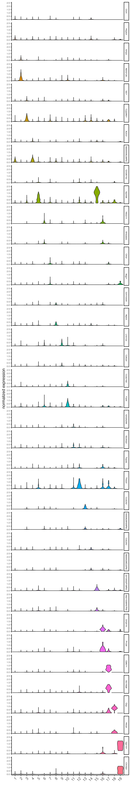
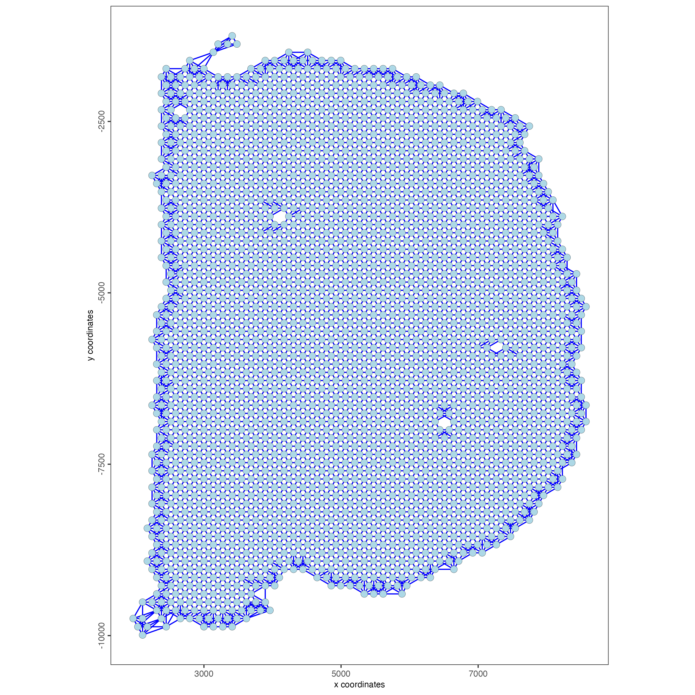
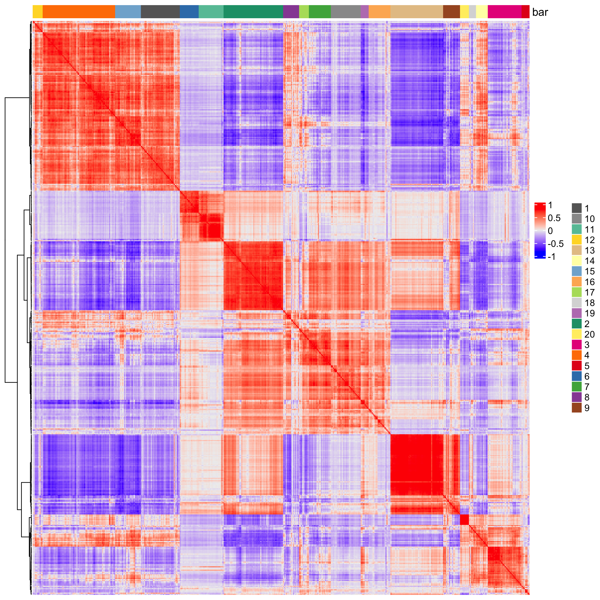
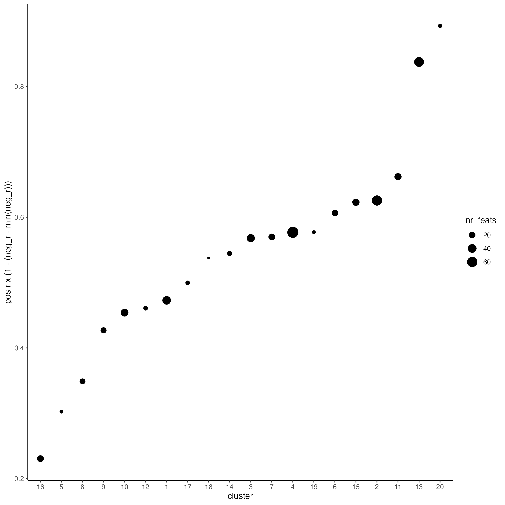
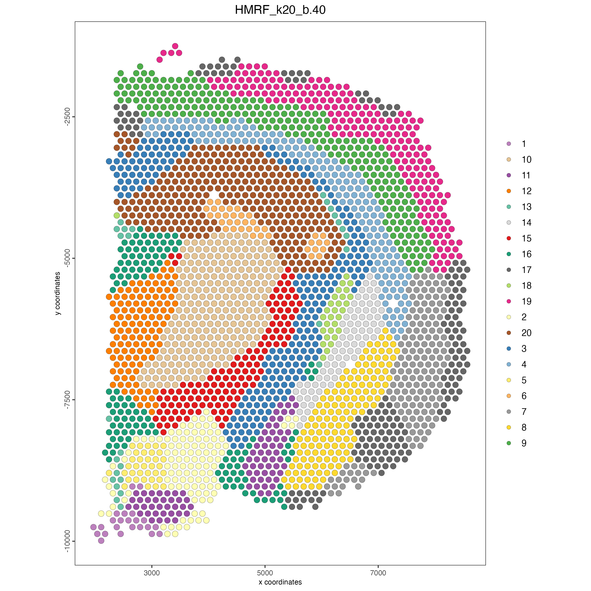
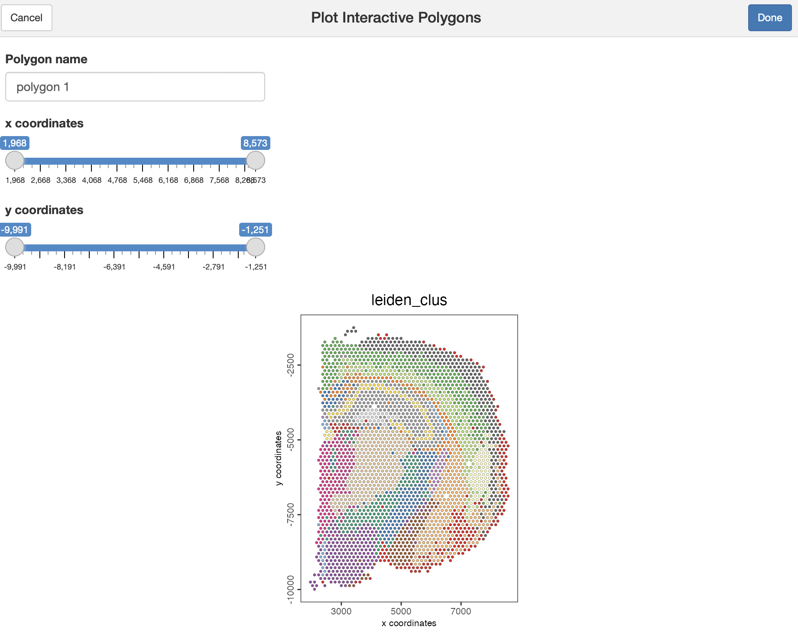
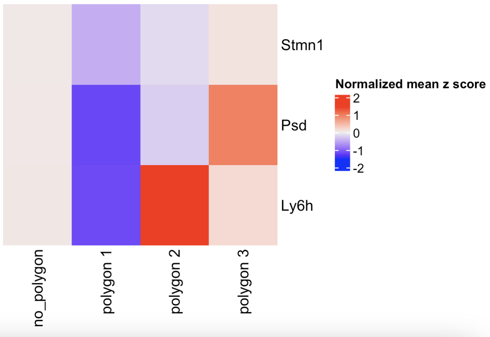

# Visium Part II

Joselyn Cristina Chávez Fuentes

August 6th 2024

## Load the object

```{r, eval=FALSE}
library(Giotto)

visium_brain <- loadGiotto("results/01_session5/visium_brain_object")
```


## Differential expression

### Gini markers

The Gini method identifies genes that are very selectively expressed in a specific cluster, however not always expressed in all cells of that cluster. In other words, highly specific but not necessarily sensitive at the single-cell level.

- Calculate the top marker genes per cluster using the gini method.

```{r, eval=FALSE}
gini_markers <- findMarkers_one_vs_all(gobject = visium_brain,
                                       method = "gini",
                                       expression_values = "normalized",
                                       cluster_column = "leiden_clus",
                                       min_feats = 10)

topgenes_gini <- gini_markers[, head(.SD, 2), by = "cluster"]$feats
```

- Visualize 

Plot the normalized expression distribution of the top expressed genes.

```{r, eval=FALSE}
violinPlot(visium_brain, 
           feats = unique(topgenes_gini), 
           cluster_column = "leiden_clus",
           strip_text = 6, 
           strip_position = "right",
           save_param = list(base_width = 5, base_height = 30))
```

```{r, echo=FALSE, out.width="50%", fig.align="center", fig.cap="Violin plot showing the top gini genes normalized expression."}

```

Use the cluster IDs to create a heatmap with the normalized expression of the top expressed genes per cluster.

```{r, eval=FALSE}
plotMetaDataHeatmap(visium_brain, 
                    selected_feats = unique(topgenes_gini),
                    metadata_cols = "leiden_clus",
                    x_text_size = 10, y_text_size = 10)
```

```{r, echo=FALSE, out.width="80%", fig.align="center", fig.cap="Heatmap showing the top gini genes normalized expression per Leiden cluster."}
knitr::include_graphics("img/02_session1/1-plotMetaDataHeatmap.png")
```

Visualize the scaled expression spatial distribution of the top expressed genes across the sample.

```{r, eval=FALSE}
dimFeatPlot2D(visium_brain, 
              expression_values = "scaled",
              feats = sort(unique(topgenes_gini)),
              cow_n_col = 5, 
              point_size = 1,
              save_param = list(base_width = 15, base_height = 20))
```

```{r, echo=FALSE, out.width="100%", fig.align="center", fig.cap="Spatial distribution of the top gini genes scaled expression."}
knitr::include_graphics("img/02_session1/2-dimFeatPlot2D.png")
```

### Scran markers

The Scran method is preferred for robust differential expression analysis, especially when addressing technical variability or differences in sequencing depth across spatial locations. [redo]

- Calculate the top marker genes per cluster using the scran method

```{r, eval=FALSE}
scran_markers <- findMarkers_one_vs_all(gobject = visium_brain,
                                       method = "scran",
                                       expression_values = "normalized",
                                       cluster_column = "leiden_clus",
                                       min_feats = 10)

topgenes_scran <- scran_markers[, head(.SD, 2), by = "cluster"]$feats
```

- Visualize 

Plot the normalized expression distribution of the top expressed genes.

```{r, eval=FALSE}
violinPlot(visium_brain, 
           feats = unique(topgenes_scran), 
           cluster_column = "leiden_clus",
           strip_text = 6, 
           strip_position = "right",
           save_param = list(base_width = 5, base_height = 30))
```

```{r, echo=FALSE, out.width="50%", fig.align="center", fig.cap="Violin plot of the top scran genes normalized expression."}
knitr::include_graphics("img/02_session1/3-violinPlot.png")
```

Use the cluster IDs to create a heatmap with the normalized expression of the top expressed genes per cluster.

```{r, eval=FALSE}
plotMetaDataHeatmap(visium_brain, 
                    selected_feats = unique(topgenes_scran),
                    metadata_cols = "leiden_clus",
                    x_text_size = 10, y_text_size = 10)
```

```{r, echo=FALSE, out.width="100%", fig.align="center", fig.cap="Heatmap showing the top scran genes normalized expression per Leiden cluster."}
knitr::include_graphics("img/02_session1/4-plotMetaDataHeatmap.png")
```

Visualize the scaled expression spatial distribution of the top expressed genes across the sample.

```{r, eval=FALSE}
dimFeatPlot2D(visium_brain, 
              expression_values = "scaled",
              feats = sort(unique(topgenes_scran)),
              cow_n_col = 5, 
              point_size = 1,
              save_param = list(base_width = 20, base_height = 20))
```

```{r, echo=FALSE, out.width="100%", fig.align="center", fig.cap="Spatial distribution of the top scran genes scaled expression."}
knitr::include_graphics("img/02_session1/5-dimFeatPlot2D.png")
```


In practice, it is often beneficial to apply both Gini and Scran methods and compare results for a more complete understanding of differential gene expression across clusters. 


## Enrichment & Deconvolution

Visium spatial transcriptomics does not provide single-cell resolution, making cell type annotation a harder problem. Giotto provides several ways to calculate enrichment of specific cell-type signature gene lists.

- Download the single-cell dataset

```{r, eval=FALSE}
GiottoData::getSpatialDataset(dataset = "scRNA_mouse_brain", 
                              directory = "data/02_session1")
```

- Create the single-cell object and run the normalization step

```{r, eval=FALSE}
results_folder <- "results/02_session1"

python_path <- NULL

instructions <- createGiottoInstructions(
    save_dir = results_folder,
    save_plot = TRUE,
    show_plot = FALSE,
    python_path = python_path
)

sc_expression <- "data/02_session1/brain_sc_expression_matrix.txt.gz"
sc_metadata <- "data/02_session1/brain_sc_metadata.csv"

giotto_SC <- createGiottoObject(expression = sc_expression,
                                instructions = instructions)

giotto_SC <- addCellMetadata(giotto_SC, 
                             new_metadata = data.table::fread(sc_metadata))

giotto_SC <- normalizeGiotto(giotto_SC)
```

### PAGE/Rank

Parametric Analysis of Gene Set Enrichment (PAGE) and Rank enrichment both aim to determine whether a predefined set of genes show statistically significant differences in expression compared to other genes in the dataset. 

- Calculate the cell type markers

```{r, eval=FALSE}
markers_scran <- findMarkers_one_vs_all(gobject = giotto_SC, 
                                        method = "scran",
                                        expression_values = "normalized",
                                        cluster_column = "Class", 
                                        min_feats = 3)

top_markers <- markers_scran[, head(.SD, 10), by = "cluster"]
celltypes <- levels(factor(markers_scran$cluster)) 
```

- Create the signature matrix

```{r, eval=FALSE}
sign_list <- list()

for (i in 1:length(celltypes)){
  sign_list[[i]] = top_markers[which(top_markers$cluster == celltypes[i]),]$feats
}

sign_matrix <- makeSignMatrixPAGE(sign_names = celltypes,
                                  sign_list = sign_list)

```

- Run the enrichment test with PAGE

```{r, eval=FALSE}
visium_brain <- runPAGEEnrich(gobject = visium_brain, 
                              sign_matrix = sign_matrix)
```

- Visualize

Create a heatmap showing the enrichment of cell types (from the single-cell data annotation) in the spatial dataset clusters.

```{r, eval=FALSE}
cell_types_PAGE <- colnames(sign_matrix)

plotMetaDataCellsHeatmap(gobject = visium_brain,
                         metadata_cols = "leiden_clus",
                         value_cols = cell_types_PAGE,
                         spat_enr_names = "PAGE",
                         x_text_size = 8,
                         y_text_size = 8)
```

```{r, echo=FALSE, out.width="100%", fig.align="center", fig.cap="Cell types enrichment per Leiden cluster, identified using the PAGE method."}
knitr::include_graphics("img/02_session1/6-plotMetaDataCellsHeatmap.png")
```

Plot the spatial distribution of the cell types.

```{r, eval=FALSE}
spatCellPlot2D(gobject = visium_brain,
               spat_enr_names = "PAGE",
               cell_annotation_values = cell_types_PAGE,
               cow_n_col = 3,
               coord_fix_ratio = 1, 
               point_size = 1, 
               show_legend = TRUE)
```

```{r, echo=FALSE, out.width="100%", fig.align="center", fig.cap="Spatial distribution of cell types identified using the PAGE method."}
knitr::include_graphics("img/02_session1/7-spatCellPlot2D.png")
```

### SpatialDWLS

Spatial Dampened Weighted Least Squares (DWLS) estimates the proportions of different cell types across spots in a tissue. 

- Create the signature matrix

```{r, eval=FALSE}
sign_matrix <- makeSignMatrixDWLSfromMatrix(
    matrix = getExpression(giotto_SC,
                           values = "normalized",
                           output = "matrix"),
    cell_type = pDataDT(giotto_SC)$Class,
    sign_gene = top_markers$feats)
```

- Run the DWLS Deconvolution

This step may take a couple of minutes to run.

```{r, eval=FALSE}
visium_brain <- runDWLSDeconv(gobject = visium_brain, 
                              sign_matrix = sign_matrix)
```

- Visualize

Plot the DWLS deconvolution result creating with pie plots showing the proportion of each cell type per spot.

```{r, eval=FALSE}
spatDeconvPlot(visium_brain, 
               show_image = FALSE,
               radius = 50,
               save_param = list(save_name = "8_spat_DWLS_pie_plot"))
```

```{r, echo=FALSE, out.width="100%", fig.align="center", fig.cap="Spatial deconvolution plot showing the proportion of cell types per spot, identified using the DWLS method."}
knitr::include_graphics("img/02_session1/8_spat_DWLS_pie_plot.png")
```

## Spatial expression patterns

### Spatial variable genes

- Create a spatial network

```{r, eval=FALSE}
visium_brain <- createSpatialNetwork(gobject = visium_brain,
                                     method = "kNN", 
                                     k = 6,
                                     maximum_distance_knn = 400,
                                     name = "spatial_network")

spatPlot2D(gobject = visium_brain,  
           show_network= TRUE,
           network_color = "blue", 
           spatial_network_name = "spatial_network")
```

```{r, echo=FALSE, out.width="100%", fig.align="center", fig.cap="Spatial network across spots in the Visium mouse sample."}

```

- Rank binarization

Rank the genes on the spatial dataset depending on whether they exhibit a spatial pattern location or not.

This step may take a few minutes to run.

```{r, eval=FALSE}
ranktest <- binSpect(visium_brain, 
                     bin_method = "rank",
                     calc_hub = TRUE, 
                     hub_min_int = 5,
                     spatial_network_name = "spatial_network")
```

- Visualize top results

Plot the scaled expression of genes with the highest probability of being spatial genes.

```{r, eval=FALSE}
spatFeatPlot2D(visium_brain, 
               expression_values = "scaled",
               feats = ranktest$feats[1:6], 
               cow_n_col = 2, 
               point_size = 1)
```

```{r, echo=FALSE, out.width="100%", fig.align="center", fig.cap="Spatial distribution of the top spatial genes scaled expression."}
knitr::include_graphics("img/02_session1/10-spatFeatPlot2D.png")
```

### Spatial co-expression modules

- Cluster the top 500 spatial genes into 20 clusters

```{r, eval=FALSE}
ext_spatial_genes <- ranktest[1:500,]$feats
```

- Use detectSpatialCorGenes function to calculate pairwise distances between genes.

```{r, eval=FALSE}
spat_cor_netw_DT <- detectSpatialCorFeats(
    visium_brain,
    method = "network",
    spatial_network_name = "spatial_network",
    subset_feats = ext_spatial_genes)
```

- Identify most similar spatially correlated genes for one gene

```{r, eval=FALSE}
top10_genes <- showSpatialCorFeats(spat_cor_netw_DT, 
                                  feats = "Mbp", 
                                  show_top_feats = 10)
```

- Visualize

Plot the scaled expression of the 3 genes with most similar spatial patterns to Mbp.

```{r, eval=FALSE}
spatFeatPlot2D(visium_brain, 
               expression_values = "scaled",
               feats = top10_genes$variable[1:4], 
               point_size = 1.5)
```

```{r, echo=FALSE, out.width="100%", fig.align="center", fig.cap="Spatial distribution of the scaled expression of 3 genes with similar spatial pattern to Mbp."}
knitr::include_graphics("img/02_session1/11-spatFeatPlot2D.png")
```

- Cluster spatial genes

```{r, eval=FALSE}
spat_cor_netw_DT <- clusterSpatialCorFeats(spat_cor_netw_DT, 
                                           name = "spat_netw_clus", 
                                           k = 20)
```

- Visualize clusters

Plot the correlation of the top 500 spatial genes with their assigned cluster.

```{r, eval=FALSE}
heatmSpatialCorFeats(visium_brain,
                     spatCorObject = spat_cor_netw_DT,
                     use_clus_name = "spat_netw_clus",
                     heatmap_legend_param = list(title = NULL))
```

```{r, echo=FALSE, out.width="100%", fig.align="center", fig.cap="Correlations heatmap between spatial genes and correlated clusters."}

```

- Rank spatial correlated clusters and show genes for selected clusters

```{r, eval=FALSE}
netw_ranks <- rankSpatialCorGroups(
  visium_brain,
  spatCorObject = spat_cor_netw_DT, 
  use_clus_name = "spat_netw_clus")
```

Plot the correlation and number of spatial genes in each cluster.

```{r, eval=FALSE}
top_netw_spat_cluster <- showSpatialCorFeats(spat_cor_netw_DT, 
                                            use_clus_name = "spat_netw_clus",
                                            selected_clusters = 6, 
                                            show_top_feats = 1)
```

```{r, echo=FALSE, out.width="100%", fig.align="center", fig.cap="Ranking of spatial correlated groups. Size indicates the number spatial genes per group."}

```

- Create the metagene enrichment score per co-expression cluster

```{r, eval=FALSE}
cluster_genes_DT <- showSpatialCorFeats(spat_cor_netw_DT, 
                                        use_clus_name = "spat_netw_clus", 
                                        show_top_feats = 1)

cluster_genes <- cluster_genes_DT$clus 
names(cluster_genes) <- cluster_genes_DT$feat_ID

visium_brain <- createMetafeats(visium_brain, 
                                feat_clusters = cluster_genes, 
                                name = "cluster_metagene")
```

Plot the spatial distribution of the metagene enrichment scores of each spatial co-expression cluster.

```{r, eval=FALSE}
spatCellPlot(visium_brain,
             spat_enr_names = "cluster_metagene",
             cell_annotation_values = netw_ranks$clusters,
             point_size = 1, 
             cow_n_col = 5)
```

```{r, echo=FALSE, out.width="100%", fig.align="center", fig.cap="Spatial distribution of metagene enrichment scores per co-expression cluster."}
knitr::include_graphics("img/02_session1/14-spatCellPlot2D.png")
```


## Spatially informed clusters

- Get the top 30 genes per spatial co-expression cluster

```{r, eval=FALSE}
coexpr_dt <- data.table::data.table(
  genes = names(spat_cor_netw_DT$cor_clusters$spat_netw_clus),
  cluster = spat_cor_netw_DT$cor_clusters$spat_netw_clus)

data.table::setorder(coexpr_dt, cluster)

top30_coexpr_dt <- coexpr_dt[, head(.SD, 30) , by = cluster]

spatial_genes <- top30_coexpr_dt$genes
```

- Re-calculate the clustering

Use the spatial genes to calculate again the principal components, umap, network and clustering

```{r, eval=FALSE}
visium_brain <- runPCA(gobject = visium_brain,
                       feats_to_use = spatial_genes,
                       name = "custom_pca")

visium_brain <- runUMAP(visium_brain, 
                        dim_reduction_name = "custom_pca", 
                        dimensions_to_use = 1:20,
                        name = "custom_umap")

visium_brain <- createNearestNetwork(gobject = visium_brain,
                                     dim_reduction_name = "custom_pca",
                                     dimensions_to_use = 1:20, 
                                     k = 5,
                                     name = "custom_NN")

visium_brain <- doLeidenCluster(gobject = visium_brain, 
                                network_name = "custom_NN",
                                resolution = 0.15, 
                                n_iterations = 1000,
                                name = "custom_leiden")
```

- Visualize

Plot the spatial distribution of the Leiden clusters calculated based on the spatial genes.

```{r, eval=FALSE}
spatPlot2D(visium_brain, 
           cell_color = "custom_leiden",
           point_size = 3)
```

```{r, echo=FALSE, out.width="100%", fig.align="center", fig.cap="Spatial distribution of Leiden clusters calculated using spatial genes."}
knitr::include_graphics("img/02_session1/15-spatPlot2D.png")
```

Plot the UMAP and color the spots using the Leiden clusters calculated based on the spatial genes.

```{r, eval=FALSE}
plotUMAP(gobject = visium_brain, 
         cell_color = "custom_leiden")
```

```{r, echo=FALSE, out.width="100%", fig.align="center", fig.cap="UMAP plot, colors indicate the Leiden clusters calculated using spatial genes."}
knitr::include_graphics("img/02_session1/16-UMAP.png")
```

## Spatial domains HMRF

Hidden Markov Random Field (HMRF) models capture spatial dependencies and segment tissue regions based on shared and gene expression patterns. 

- Do HMRF with different betas on top 30 genes per spatial co-expression module

This step may take several minutes to run.

```{r, eval=FALSE}
HMRF_spatial_genes <- doHMRF(gobject = visium_brain,
                            expression_values = "scaled",
                            spatial_genes = spatial_genes, 
                            k = 20,
                            spatial_network_name = "spatial_network",
                            betas = c(0, 10, 5),
                            output_folder = "11_HMRF/")
```

Add the HMRF results to the giotto object

```{r, eval=FALSE}
visium_brain <- addHMRF(gobject = visium_brain, 
                        HMRFoutput = HMRF_spatial_genes,
                        k = 20, 
                        betas_to_add = c(0, 10, 20, 30, 40),
                        hmrf_name = "HMRF")
```

- Visualize 

Plot the spatial distribution of the HMRF domains.

```{r, eval=FALSE}
spatPlot2D(gobject = visium_brain, 
           cell_color = "HMRF_k20_b.40")
```

```{r, echo=FALSE, out.width="100%", fig.align="center", fig.cap="Spatial distribution of HMRF domains."}

```

## Interactive tools

We have integrated a shiny app in Giotto to interactively select regions of a spatial plot.

- Create a spatial plot

```{r, eval=FALSE}
brain_spatPlot <- spatPlot2D(gobject = visium_brain,
                          cell_color = "leiden_clus",
                          show_image = FALSE,
                          return_plot = TRUE,
                          point_size = 1)

brain_spatPlot
```

- Run the Shiny app

```{r, eval=FALSE}
plotInteractivePolygons(brain_spatPlot)
```

```{r, echo=FALSE, out.width="100%", fig.align="center", fig.cap="Shiny app using the visium brain sample."}

```

- Select the regions of interest and save the coordinates

```{r, eval=FALSE}
polygon_coordinates <- plotInteractivePolygons(brain_spatPlot)
```

```{r, echo=FALSE, out.width="60%", fig.align="center", fig.cap="Polygons selected using the interactive Shiny app."}
knitr::include_graphics("img/02_session1/19-spatPlot2D.png")
```

- Transform the data.table or data.frame with coordinates into a Giotto polygon object

```{r, eval=FALSE}
giotto_polygons <- createGiottoPolygonsFromDfr(polygon_coordinates, 
                                               name = "selections",
                                               calc_centroids = TRUE)
```

- Add the polygons to the Giotto object

```{r, eval=FALSE}
visium_brain <- addGiottoPolygons(gobject = visium_brain,
                                  gpolygons = list(giotto_polygons))
```

- Add the corresponding polygon IDs to the cell metadata

```{r, eval=FALSE}
visium_brain <- addPolygonCells(visium_brain,
                                polygon_name = "selections")
```

- Extract the coordinates and IDs from cells located within one or multiple regions of interest.

```{r, eval=FALSE}
getCellsFromPolygon(visium_brain,
                    polygon_name = "selections",
                    polygons = "polygon 1")
```

If no polygon name is provided, the function will retrieve cells located within all polygons

```{r, eval=FALSE}
getCellsFromPolygon(visium_brain,
                    polygon_name = "selections")
```

- Compare the expression levels of some genes of interest between the selected regions

```{r, eval=FALSE}
comparePolygonExpression(visium_brain,
                         selected_feats = c("Stmn1", "Psd", "Ly6h"))
```

```{r, echo=FALSE, out.width="60%", fig.align="center", fig.cap="Heatmap showing the z-scores of three genes per selected polygon."}

```

- Calculate the top genes expressed within each region, then provide the result to compare polygons

```{r, eval=FALSE}
scran_results <- findMarkers_one_vs_all(
  visium_brain,
  spat_unit = "cell",
  feat_type = "rna",
  method = "scran",
  expression_values = "normalized",
  cluster_column = "selections",
  min_feats = 2)

top_genes <- scran_results[, head(.SD, 2), by = "cluster"]$feats

comparePolygonExpression(visium_brain,
                         selected_feats = top_genes)
```

```{r, echo=FALSE, out.width="60%", fig.align="center", fig.cap="Heatmap showing the z-scores of top scran genes per selected polygon."}
knitr::include_graphics("img/02_session1/21-heatmap.png")
```

- Compare the abundance of cell types between the selected regions

```{r, eval=FALSE}
compareCellAbundance(visium_brain)
```

```{r, echo=FALSE, out.width="60%", fig.align="center", fig.cap="Heatmap showing the cell abundance per selected polygon."}
knitr::include_graphics("img/02_session1/22-heatmap.png")
```

- Use other columns within the cell metadata table to compare the cell type abundances

```{r, eval=FALSE}
compareCellAbundance(visium_brain, 
                     cell_type_column = "custom_leiden")
```

```{r, echo=FALSE, out.width="60%", fig.align="center", fig.cap="Heatmap showing the Leiden clusters abundance per selected polygon."}
knitr::include_graphics("img/02_session1/23-heatmap.png")
```

- Use the spatPlot arguments to isolate and plot each region.

```{r, eval=FALSE}
spatPlot2D(visium_brain,
           cell_color = "leiden_clus",
           group_by = "selections",
           cow_n_col = 3,
           point_size = 2,
           show_legend = FALSE)
```

```{r, echo=FALSE, out.width="80%", fig.align="center", fig.cap="Spatial distribution of Leiden clusters across the selected polygons."}
knitr::include_graphics("img/02_session1/24-spatPlot2D.png")
```

- Color each cell by cluster, cell type or expression level.

```{r, eval=FALSE}
spatFeatPlot2D(visium_brain,
               expression_values = "scaled",
               group_by = "selections",
               feats = "Psd",
               point_size = 2)
```

```{r, echo=FALSE, out.width="80%", fig.align="center", fig.cap="Spatial distribution of Psd scaled expression across the selected polygons."}
knitr::include_graphics("img/02_session1/25-spatFeatPlot2D.png")
```

- Plot again the polygons

```{r, eval=FALSE}
plotPolygons(visium_brain,
             polygon_name = "selections",
             x = brain_spatPlot)
```

```{r, echo=FALSE, out.width="60%", fig.align="center", fig.cap="Spatial location of selected polygons."}
knitr::include_graphics("img/02_session1/26-spatPlot2D.png")
```

## Save the object

```{r, eval=FALSE}
saveGiotto(visium_brain, "results/02_session1/visium_brain_object")
```

## Session info

```{r, eval=FALSE}
sessionInfo()
```

```{r, eval=FALSE}
R version 4.4.1 (2024-06-14)
Platform: aarch64-apple-darwin20
Running under: macOS Sonoma 14.5

Matrix products: default
BLAS:   /System/Library/Frameworks/Accelerate.framework/Versions/A/Frameworks/vecLib.framework/Versions/A/libBLAS.dylib 
LAPACK: /Library/Frameworks/R.framework/Versions/4.4-arm64/Resources/lib/libRlapack.dylib;  LAPACK version 3.12.0

locale:
[1] en_US.UTF-8/en_US.UTF-8/en_US.UTF-8/C/en_US.UTF-8/en_US.UTF-8

time zone: America/New_York
tzcode source: internal

attached base packages:
[1] stats     graphics  grDevices utils     datasets  methods   base     

other attached packages:
[1] shiny_1.8.1.1     Giotto_4.1.0      GiottoClass_0.3.3

loaded via a namespace (and not attached):
  [1] later_1.3.2                 tibble_3.2.1               
  [3] R.oo_1.26.0                 polyclip_1.10-7            
  [5] lifecycle_1.0.4             edgeR_4.2.1                
  [7] doParallel_1.0.17           lattice_0.22-6             
  [9] MASS_7.3-61                 backports_1.5.0            
 [11] magrittr_2.0.3              sass_0.4.9                 
 [13] limma_3.60.4                plotly_4.10.4              
 [15] rmarkdown_2.27              jquerylib_0.1.4            
 [17] yaml_2.3.9                  metapod_1.12.0             
 [19] httpuv_1.6.15               sp_2.1-4                   
 [21] reticulate_1.38.0           cowplot_1.1.3              
 [23] RColorBrewer_1.1-3          abind_1.4-5                
 [25] zlibbioc_1.50.0             quadprog_1.5-8             
 [27] GenomicRanges_1.56.1        purrr_1.0.2                
 [29] R.utils_2.12.3              BiocGenerics_0.50.0        
 [31] tweenr_2.0.3                circlize_0.4.16            
 [33] GenomeInfoDbData_1.2.12     IRanges_2.38.1             
 [35] S4Vectors_0.42.1            ggrepel_0.9.5              
 [37] irlba_2.3.5.1               terra_1.7-78               
 [39] dqrng_0.4.1                 DelayedMatrixStats_1.26.0  
 [41] colorRamp2_0.1.0            codetools_0.2-20           
 [43] DelayedArray_0.30.1         scuttle_1.14.0             
 [45] ggforce_0.4.2               tidyselect_1.2.1           
 [47] shape_1.4.6.1               UCSC.utils_1.0.0           
 [49] farver_2.1.2                ScaledMatrix_1.12.0        
 [51] matrixStats_1.3.0           stats4_4.4.1               
 [53] GiottoData_0.2.12.0         jsonlite_1.8.8             
 [55] GetoptLong_1.0.5            BiocNeighbors_1.22.0       
 [57] progressr_0.14.0            iterators_1.0.14           
 [59] systemfonts_1.1.0           foreach_1.5.2              
 [61] dbscan_1.2-0                tools_4.4.1                
 [63] ragg_1.3.2                  Rcpp_1.0.13                
 [65] glue_1.7.0                  SparseArray_1.4.8          
 [67] xfun_0.46                   MatrixGenerics_1.16.0      
 [69] GenomeInfoDb_1.40.1         dplyr_1.1.4                
 [71] withr_3.0.0                 fastmap_1.2.0              
 [73] bluster_1.14.0              fansi_1.0.6                
 [75] digest_0.6.36               rsvd_1.0.5                 
 [77] R6_2.5.1                    mime_0.12                  
 [79] textshaping_0.4.0           colorspace_2.1-0           
 [81] scattermore_1.2             Cairo_1.6-2                
 [83] gtools_3.9.5                R.methodsS3_1.8.2          
 [85] utf8_1.2.4                  tidyr_1.3.1                
 [87] generics_0.1.3              data.table_1.15.4          
 [89] FNN_1.1.4                   httr_1.4.7                 
 [91] htmlwidgets_1.6.4           S4Arrays_1.4.1             
 [93] scatterpie_0.2.3            uwot_0.2.2                 
 [95] pkgconfig_2.0.3             gtable_0.3.5               
 [97] ComplexHeatmap_2.20.0       GiottoVisuals_0.2.4        
 [99] SingleCellExperiment_1.26.0 XVector_0.44.0             
[101] htmltools_0.5.8.1           bookdown_0.40              
[103] clue_0.3-65                 scales_1.3.0               
[105] Biobase_2.64.0              GiottoUtils_0.1.10         
[107] png_0.1-8                   SpatialExperiment_1.14.0   
[109] scran_1.32.0                ggfun_0.1.5                
[111] knitr_1.48                  rstudioapi_0.16.0          
[113] reshape2_1.4.4              rjson_0.2.21               
[115] checkmate_2.3.1             cachem_1.1.0               
[117] GlobalOptions_0.1.2         stringr_1.5.1              
[119] parallel_4.4.1              miniUI_0.1.1.1             
[121] RcppZiggurat_0.1.6          pillar_1.9.0               
[123] grid_4.4.1                  vctrs_0.6.5                
[125] promises_1.3.0              BiocSingular_1.20.0        
[127] beachmat_2.20.0             xtable_1.8-4               
[129] cluster_2.1.6               evaluate_0.24.0            
[131] magick_2.8.4                cli_3.6.3                  
[133] locfit_1.5-9.10             compiler_4.4.1             
[135] rlang_1.1.4                 crayon_1.5.3               
[137] labeling_0.4.3              plyr_1.8.9                 
[139] stringi_1.8.4               viridisLite_0.4.2          
[141] deldir_2.0-4                BiocParallel_1.38.0        
[143] munsell_0.5.1               lazyeval_0.2.2             
[145] Matrix_1.7-0                sparseMatrixStats_1.16.0   
[147] ggplot2_3.5.1               statmod_1.5.0              
[149] SummarizedExperiment_1.34.0 Rfast_2.1.0                
[151] memoise_2.0.1               igraph_2.0.3               
[153] bslib_0.7.0                 RcppParallel_5.1.8  
```
