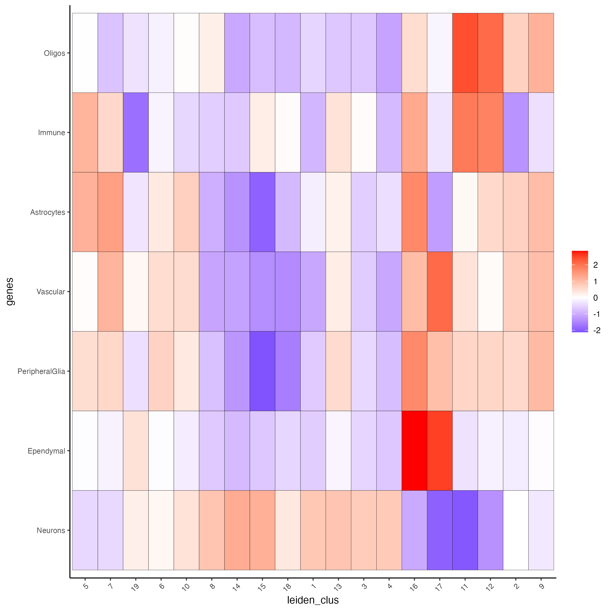

# Visium Part II

Joselyn Cristina Chávez Fuentes

August 6th 2024

## Load the object

```{r, eval=FALSE}
library(Giotto)

visium_brain <- loadGiotto("visium_brain_object")
```


## Differential expression

### Gini markers

Calculate the top marker genes per cluster using the gini method

```{r, eval=FALSE}
gini_markers <- findMarkers_one_vs_all(gobject = visium_brain,
                                       method = "gini",
                                       expression_values = "normalized",
                                       cluster_column = "leiden_clus",
                                       min_feats = 10)

topgenes_gini <- gini_markers[, head(.SD, 2), by = "cluster"]$feats
```

- Visualize

```{r, eval=FALSE}
violinPlot(visium_brain, 
           feats = unique(topgenes_gini), 
           cluster_column = "leiden_clus",
           strip_text = 6, 
           strip_position = "right",
           save_param = list(base_width = 5, base_height = 30))
```

```{r, echo=FALSE, out.width="50%", fig.align="center"}
knitr::include_graphics("img/02_session1/0-violinPlot.png")
```

```{r, eval=FALSE}
plotMetaDataHeatmap(visium_brain, 
                    selected_feats = unique(topgenes_gini),
                    metadata_cols = "leiden_clus",
                    x_text_size = 10, y_text_size = 10)
```

```{r, echo=FALSE, out.width="80%", fig.align="center"}
knitr::include_graphics("img/02_session1/1-plotMetaDataHeatmap.png")
```

```{r, eval=FALSE}
dimFeatPlot2D(visium_brain, 
              expression_values = "scaled",
              feats = sort(unique(topgenes_gini)),
              cow_n_col = 5, 
              point_size = 1,
              save_param = list(base_width = 15, base_height = 20))
```

```{r, echo=FALSE, out.width="100%", fig.align="center"}
knitr::include_graphics("img/02_session1/2-dimFeatPlot2D.png")
```

### Scran markers

Calculate the top marker genes per cluster using the scran method


```{r, eval=FALSE}
scran_markers <- findMarkers_one_vs_all(gobject = visium_brain,
                                       method = "scran",
                                       expression_values = "normalized",
                                       cluster_column = "leiden_clus",
                                       min_feats = 10)

topgenes_scran <- scran_markers[, head(.SD, 2), by = "cluster"]$feats
```

- Visualize

```{r, eval=FALSE}
violinPlot(visium_brain, 
           feats = unique(topgenes_scran), 
           cluster_column = "leiden_clus",
           strip_text = 6, 
           strip_position = "right",
           save_param = list(base_width = 5, base_height = 30))
```

```{r, echo=FALSE, out.width="50%", fig.align="center"}
knitr::include_graphics("img/02_session1/3-violinPlot.png")
```

```{r, eval=FALSE}
plotMetaDataHeatmap(visium_brain, 
                    selected_feats = unique(topgenes_scran),
                    metadata_cols = "leiden_clus",
                    x_text_size = 10, y_text_size = 10)
```

```{r, echo=FALSE, out.width="80%", fig.align="center"}
knitr::include_graphics("img/02_session1/4-plotMetaDataHeatmap.png")
```

```{r, eval=FALSE}
dimFeatPlot2D(visium_brain, 
              expression_values = "scaled",
              feats = sort(unique(topgenes_scran)),
              cow_n_col = 5, 
              point_size = 1,
              save_param = list(base_width = 20, base_height = 20))
```

```{r, echo=FALSE, out.width="100%", fig.align="center"}
knitr::include_graphics("img/02_session1/5-dimFeatPlot2D.png")
```

## Enrichment & Deconvolution

Visium spatial transcriptomics does not provide single-cell resolution, making cell type annotation a harder problem. Giotto provides several ways to calculate enrichment of specific cell-type signature gene lists.

- Download the single-cell dataset

```{r, eval=FALSE}
GiottoData::getSpatialDataset(dataset = "scRNA_mouse_brain", directory = "data/")
```

- Create the single-cell object

```{r, eval=FALSE}
results_folder <- "results/"

python_path <- NULL

instructions <- createGiottoInstructions(
    save_dir = results_folder,
    save_plot = TRUE,
    show_plot = FALSE,
    python_path = python_path
)

sc_expression <- "data/brain_sc_expression_matrix.txt.gz"
sc_metadata <- "data/brain_sc_metadata.csv"

giotto_SC <- createGiottoObject(expression = sc_expression,
                                instructions = instructions)

giotto_SC <- addCellMetadata(giotto_SC, 
                             new_metadata = data.table::fread(sc_metadata))

giotto_SC <- normalizeGiotto(giotto_SC)
```

### PAGE/Rank

Calculate the cell type markers

```{r, eval=FALSE}
markers_scran <- findMarkers_one_vs_all(gobject = giotto_SC, 
                                        method = "scran",
                                        expression_values = "normalized",
                                        cluster_column = "Class", 
                                        min_feats = 3)

top_markers <- markers_scran[, head(.SD, 10), by = "cluster"]
celltypes <- levels(factor(markers_scran$cluster)) 
```

- Create the signature matrix

```{r, eval=FALSE}
sign_list <- list()

for (i in 1:length(celltypes)){
  sign_list[[i]] = top_markers[which(top_markers$cluster == celltypes[i]),]$feats
}

sign_matrix <- makeSignMatrixPAGE(sign_names = celltypes,
                                  sign_list = sign_list)

```

- Run the enrichment test with PAGE

```{r, eval=FALSE}
visium_brain <- runPAGEEnrich(gobject = visium_brain, 
                              sign_matrix = sign_matrix)
```

- Visualize

```{r, eval=FALSE}
cell_types_PAGE <- colnames(sign_matrix)

plotMetaDataCellsHeatmap(gobject = visium_brain,
                         metadata_cols = "leiden_clus",
                         value_cols = cell_types_PAGE,
                         spat_enr_names = "PAGE",
                         x_text_size = 8,
                         y_text_size = 8)
```

```{r, echo=FALSE, out.width="100%", fig.align="center"}

```

```{r, eval=FALSE}
spatCellPlot2D(gobject = visium_brain,
               spat_enr_names = "PAGE",
               cell_annotation_values = cell_types_PAGE,
               cow_n_col = 3,
               coord_fix_ratio = 1, 
               point_size = 1, 
               show_legend = TRUE)
```

```{r, echo=FALSE, out.width="100%", fig.align="center"}
knitr::include_graphics("img/02_session1/7-spatCellPlot2D.png")
```

### SpatialDWLS


## Spatial expression patterns

### Spatial variable genes

Rank binarization

```{r, eval=FALSE}
ranktest = binSpect(visium_brain, 
                    bin_method = "rank",
                    calc_hub = TRUE, 
                    hub_min_int = 5,
                    spatial_network_name = "spatial_network")
```

Visualize

```{r, eval=FALSE}
spatFeatPlot2D(visium_brain, 
               expression_values = "scaled",
               feats = ranktest$feats[1:6], 
               cow_n_col = 2, 
               point_size = 1.5)
```

### Spatial co-expression modules

Cluster the top 500 spatial genes into 20 clusters

```{r, eval=FALSE}
ext_spatial_genes = ranktest[1:1500,]$feats
```

Use existing detectSpatialCorGenes function to calculate pairwise distances between genes (but set network_smoothing=0 to use default clustering)

```{r, eval=FALSE}
spat_cor_netw_DT = detectSpatialCorFeats(visium_brain,
                                         method = "network",
                                         spatial_network_name = "spatial_network",
                                         subset_feats = ext_spatial_genes)
```

Identify most similar spatially correlated genes for one gene

```{r, eval=FALSE}
top10_genes = showSpatialCorFeats(spat_cor_netw_DT, 
                                  feats = "Ptprn", 
                                  show_top_feats = 10)
```

Visualize

```{r, eval=FALSE}
spatFeatPlot2D(visium_brain, 
               expression_values = "scaled",
               feats = top10_genes$variable[1:4], 
               point_size = 3)
```


Cluster spatial genes

```{r, eval=FALSE}
spat_cor_netw_DT = clusterSpatialCorFeats(spat_cor_netw_DT, 
                                          name = "spat_netw_clus", 
                                          k = 20)
```

Visualize clusters

```{r, eval=FALSE}
heatmSpatialCorFeats(visium_brain,
                     spatCorObject = spat_cor_netw_DT,
                     use_clus_name = "spat_netw_clus",
                     heatmap_legend_param = list(title = NULL),
                     save_param = list(base_height = 6, base_width = 8, units = "cm"))
```

Rank spatial correlated clusters and show genes for selected clusters

```{r, eval=FALSE}
netw_ranks = rankSpatialCorGroups(visium_brain,
                                  spatCorObject = spat_cor_netw_DT, 
                                  use_clus_name = "spat_netw_clus",
                                  save_param = list(base_height = 3, base_width = 5))

top_netw_spat_cluster = showSpatialCorFeats(spat_cor_netw_DT, 
                                            use_clus_name = "spat_netw_clus",
                                            selected_clusters = 6, 
                                            show_top_feats = 1)
```

Create metagene enrichment score for clusters

```{r, eval=FALSE}
cluster_genes_DT = showSpatialCorFeats(spat_cor_netw_DT, 
                                       use_clus_name = "spat_netw_clus", 
                                       show_top_feats = 1)

cluster_genes = cluster_genes_DT$clus 
names(cluster_genes) = cluster_genes_DT$feat_ID

visium_brain <- createMetafeats(visium_brain, 
                                feat_clusters = cluster_genes, 
                                name = "cluster_metagene")

spatCellPlot(visium_brain,
             spat_enr_names = "cluster_metagene",
             cell_annotation_values = netw_ranks$clusters,
             point_size = 1, 
             cow_n_col = 5, 
             save_param = list(base_width = 15))
```

- Spatially informed clusters

Get the top 30 genes per spatial co-expression cluster

```{r, eval=FALSE}
table(spat_cor_netw_DT$cor_clusters$spat_netw_clus)

coexpr_dt = data.table::data.table(genes = names(spat_cor_netw_DT$cor_clusters$spat_netw_clus),
                                   cluster = spat_cor_netw_DT$cor_clusters$spat_netw_clus)

data.table::setorder(coexpr_dt, cluster)
top30_coexpr_dt = coexpr_dt[, head(.SD, 30) , by = cluster]
my_spatial_genes = top30_coexpr_dt$genes
```

Re-calculate the clustering

```{r, eval=FALSE}
visium_brain <- runPCA(gobject = visium_brain,
                       feats_to_use = my_spatial_genes,
                       name = "custom_pca")

visium_brain <- runUMAP(visium_brain, 
                        dim_reduction_name = "custom_pca", 
                        dimensions_to_use = 1:20,
                        name = "custom_umap")

visium_brain <- createNearestNetwork(gobject = visium_brain,
                                     dim_reduction_name = "custom_pca",
                                     dimensions_to_use = 1:20, 
                                     k = 5,
                                     name = "custom_NN")

visium_brain <- doLeidenCluster(gobject = visium_brain, 
                                network_name = "custom_NN",
                                resolution = 0.15, 
                                n_iterations = 1000,
                                name = "custom_leiden")

cell_meta = pDataDT(visium_brain)
cell_clusters = unique(cell_meta$custom_leiden)

selected_colors = getDistinctColors(length(cell_clusters))
names(selected_colors) = cell_clusters
```

Visualize

```{r, eval=FALSE}
spatPlot2D(visium_brain, 
           cell_color = "custom_leiden", 
           cell_color_code = selected_colors, 
           coord_fix_ratio = 1)
```

```{r, eval=FALSE}
plotUMAP(gobject = visium_brain, 
         cell_color = "custom_leiden", 
         cell_color_code = selected_colors, 
         point_size = 1.5)
```

- Spatial domains HMRF

Do HMRF with different betas on top 30 genes per spatial co-expression module

```{r, eval=FALSE}
hmrf_folder = paste0(results_folder,"/","11_HMRF/")
if(!file.exists(hmrf_folder)) dir.create(hmrf_folder, recursive = T)

HMRF_spatial_genes = doHMRF(gobject = visium_brain,
                            expression_values = "scaled",
                            spatial_genes = my_spatial_genes, 
                            k = 20,
                            spatial_network_name="spatial_network",
                            betas = c(0, 10, 5),
                            output_folder = paste0(hmrf_folder, "/", "Spatial_genes/SG_topgenes_k20_scaled"))

visium_brain <- addHMRF(gobject = visium_brain, 
                        HMRFoutput = HMRF_spatial_genes,
                        k = 20, 
                        betas_to_add = c(0, 10, 20, 30, 40),
                        hmrf_name = "HMRF")

spatPlot2D(gobject = visium_brain, 
           cell_color = "HMRF_k20_b.40")
```


## Interactive tools

text
