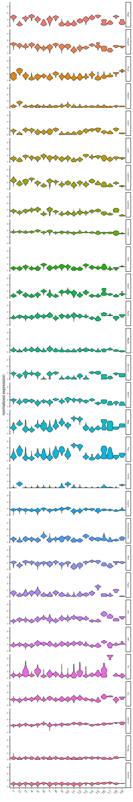
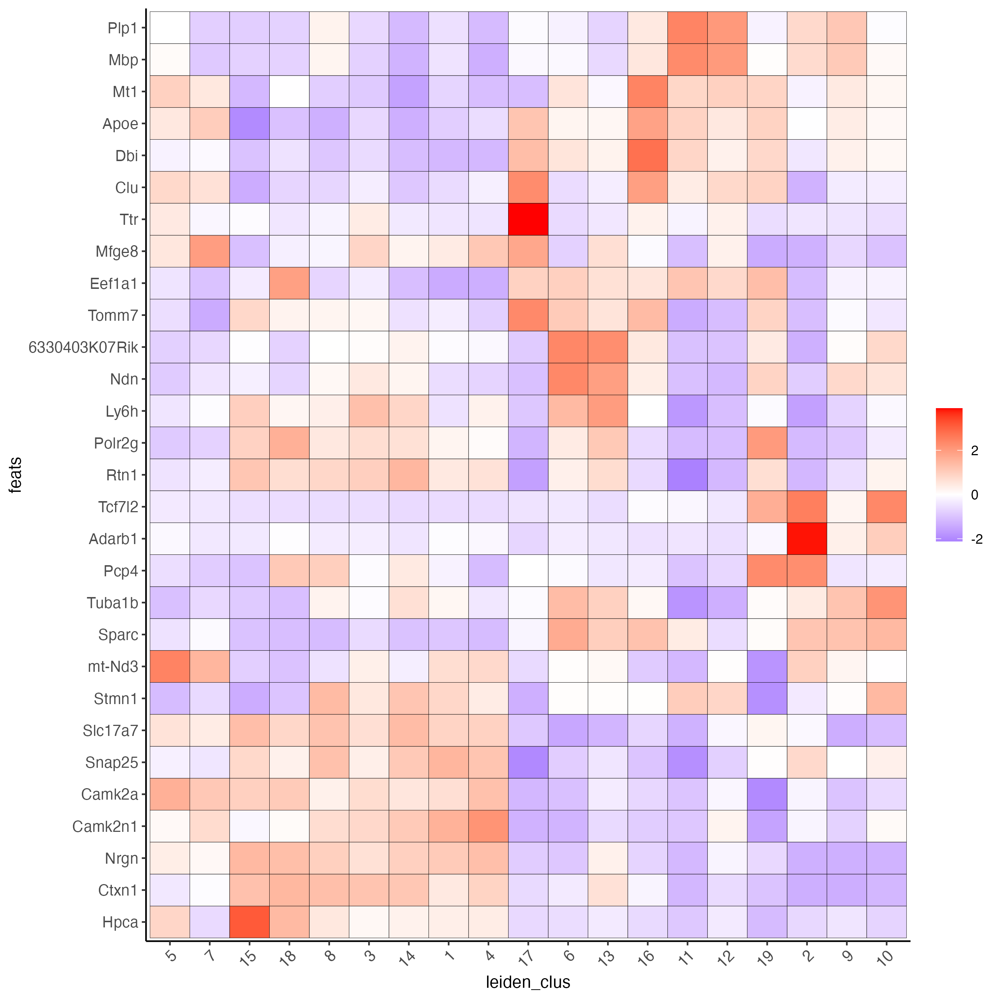
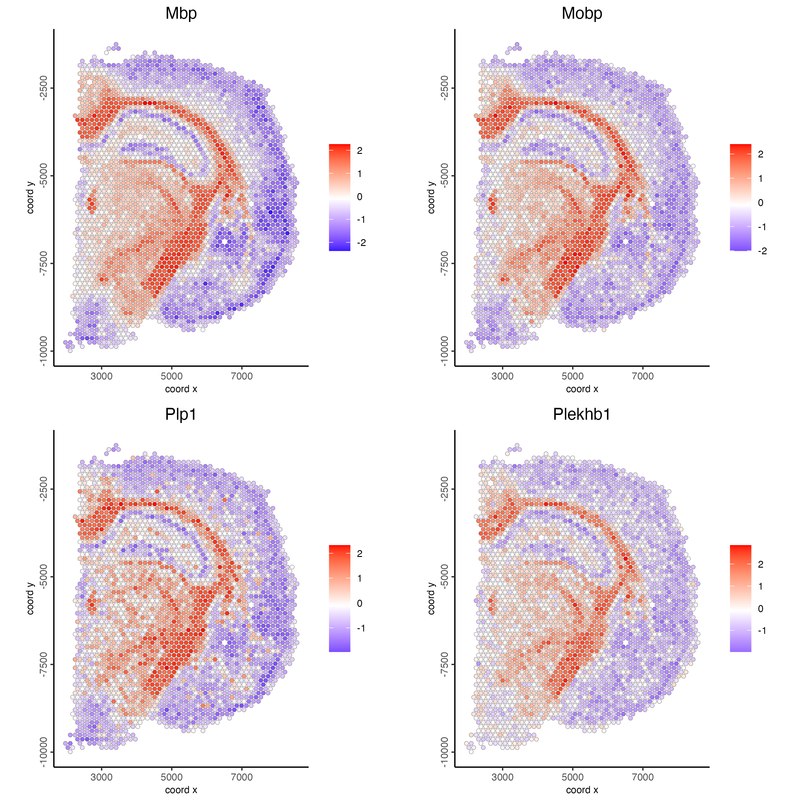
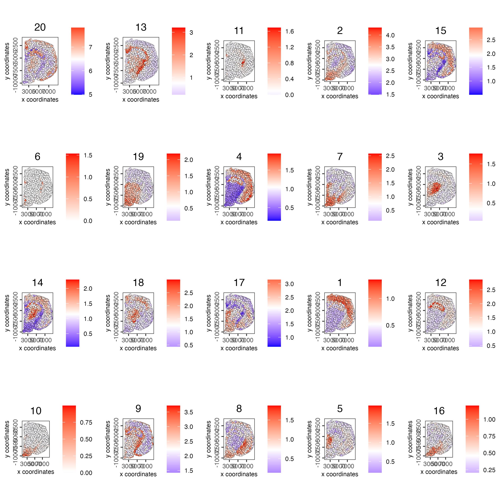
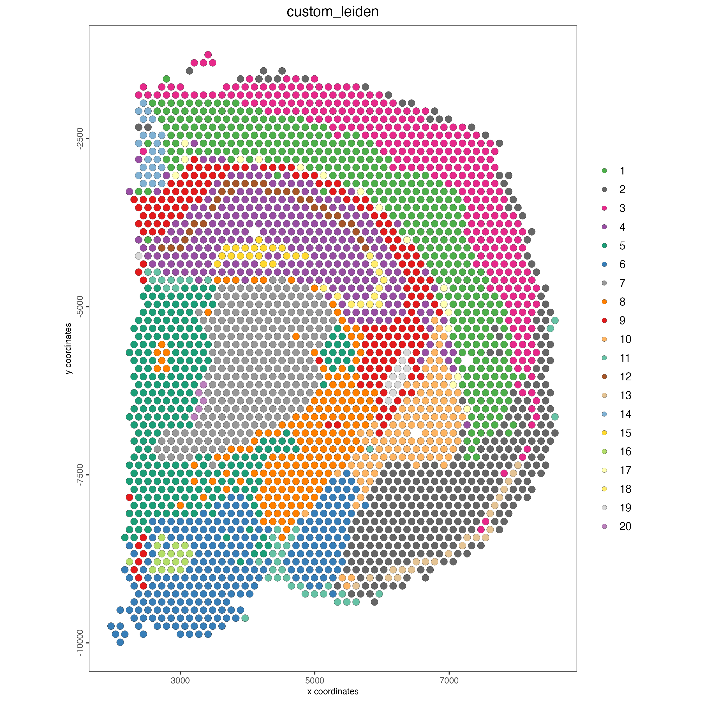
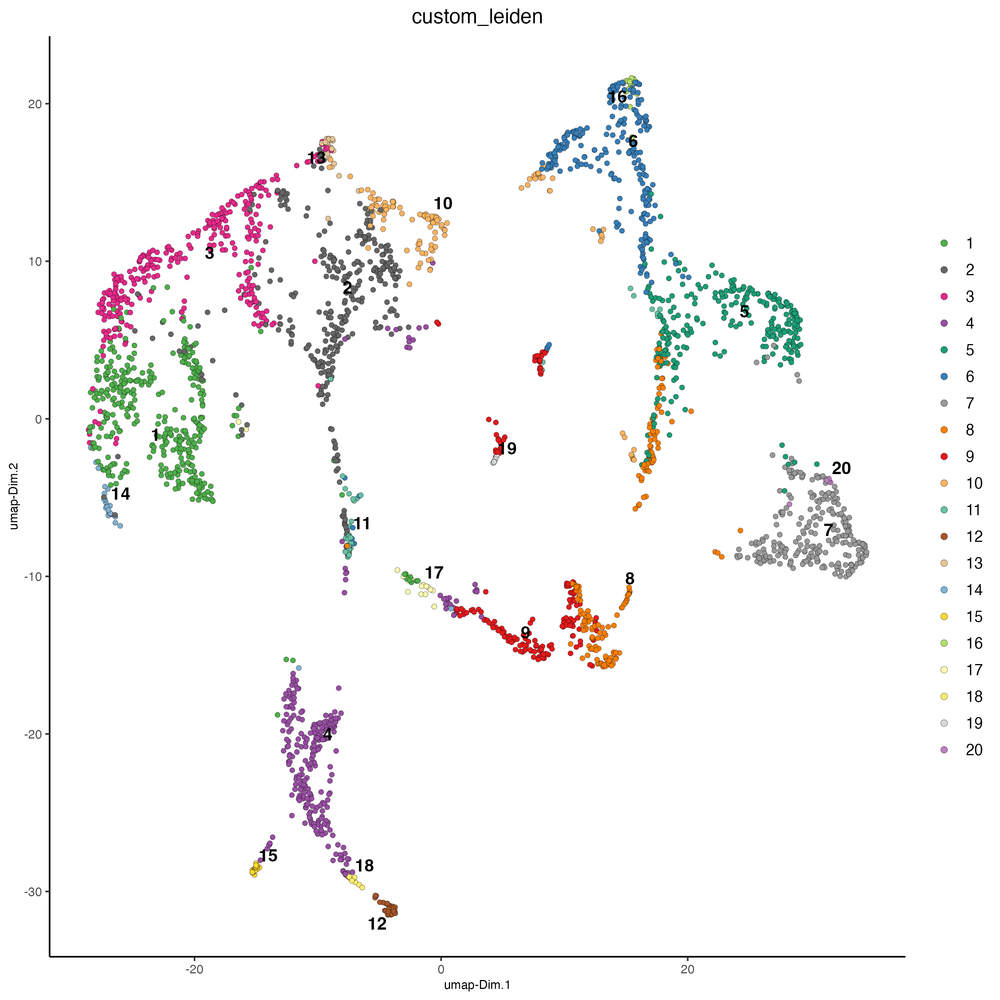

# Visium Part II

Joselyn Cristina Chávez Fuentes

August 6th 2024

## Load the object

```{r, eval=FALSE}
library(Giotto)

visium_brain <- loadGiotto("visium_brain_object")
```


## Differential expression

### Gini markers

- Calculate the top marker genes per cluster using the gini method

```{r, eval=FALSE}
gini_markers <- findMarkers_one_vs_all(gobject = visium_brain,
                                       method = "gini",
                                       expression_values = "normalized",
                                       cluster_column = "leiden_clus",
                                       min_feats = 10)

topgenes_gini <- gini_markers[, head(.SD, 2), by = "cluster"]$feats
```

- Visualize

```{r, eval=FALSE}
violinPlot(visium_brain, 
           feats = unique(topgenes_gini), 
           cluster_column = "leiden_clus",
           strip_text = 6, 
           strip_position = "right",
           save_param = list(base_width = 5, base_height = 30))
```

```{r, echo=FALSE, out.width="50%", fig.align="center"}
knitr::include_graphics("img/02_session1/0-violinPlot.png")
```

```{r, eval=FALSE}
plotMetaDataHeatmap(visium_brain, 
                    selected_feats = unique(topgenes_gini),
                    metadata_cols = "leiden_clus",
                    x_text_size = 10, y_text_size = 10)
```

```{r, echo=FALSE, out.width="80%", fig.align="center"}
knitr::include_graphics("img/02_session1/1-plotMetaDataHeatmap.png")
```

```{r, eval=FALSE}
dimFeatPlot2D(visium_brain, 
              expression_values = "scaled",
              feats = sort(unique(topgenes_gini)),
              cow_n_col = 5, 
              point_size = 1,
              save_param = list(base_width = 15, base_height = 20))
```

```{r, echo=FALSE, out.width="100%", fig.align="center"}
knitr::include_graphics("img/02_session1/2-dimFeatPlot2D.png")
```

### Scran markers

- Calculate the top marker genes per cluster using the scran method


```{r, eval=FALSE}
scran_markers <- findMarkers_one_vs_all(gobject = visium_brain,
                                       method = "scran",
                                       expression_values = "normalized",
                                       cluster_column = "leiden_clus",
                                       min_feats = 10)

topgenes_scran <- scran_markers[, head(.SD, 2), by = "cluster"]$feats
```

- Visualize

```{r, eval=FALSE}
violinPlot(visium_brain, 
           feats = unique(topgenes_scran), 
           cluster_column = "leiden_clus",
           strip_text = 6, 
           strip_position = "right",
           save_param = list(base_width = 5, base_height = 30))
```

```{r, echo=FALSE, out.width="50%", fig.align="center"}

```

```{r, eval=FALSE}
plotMetaDataHeatmap(visium_brain, 
                    selected_feats = unique(topgenes_scran),
                    metadata_cols = "leiden_clus",
                    x_text_size = 10, y_text_size = 10)
```

```{r, echo=FALSE, out.width="100%", fig.align="center"}

```

```{r, eval=FALSE}
dimFeatPlot2D(visium_brain, 
              expression_values = "scaled",
              feats = sort(unique(topgenes_scran)),
              cow_n_col = 5, 
              point_size = 1,
              save_param = list(base_width = 20, base_height = 20))
```

```{r, echo=FALSE, out.width="100%", fig.align="center"}
knitr::include_graphics("img/02_session1/5-dimFeatPlot2D.png")
```


In practice, it is often beneficial to apply both gini and scran methods and compare results for a more complete understanding of differential gene expression across clusters. 

## Enrichment & Deconvolution

Visium spatial transcriptomics does not provide single-cell resolution, making cell type annotation a harder problem. Giotto provides several ways to calculate enrichment of specific cell-type signature gene lists.

- Download the single-cell dataset

```{r, eval=FALSE}
GiottoData::getSpatialDataset(dataset = "scRNA_mouse_brain", directory = "data/")
```

- Create the single-cell object

```{r, eval=FALSE}
results_folder <- "results/"

python_path <- NULL

instructions <- createGiottoInstructions(
    save_dir = results_folder,
    save_plot = TRUE,
    show_plot = FALSE,
    python_path = python_path
)

sc_expression <- "data/brain_sc_expression_matrix.txt.gz"
sc_metadata <- "data/brain_sc_metadata.csv"

giotto_SC <- createGiottoObject(expression = sc_expression,
                                instructions = instructions)

giotto_SC <- addCellMetadata(giotto_SC, 
                             new_metadata = data.table::fread(sc_metadata))

giotto_SC <- normalizeGiotto(giotto_SC)
```

### PAGE/Rank

Parametric Analysis of Gene Set Enrichment (PAGE) and Rank enrichment both aim to determine whether a predefined set of genes show statistically significant differences in expression compared to other genes in the dataset. 

- Calculate the cell type markers

```{r, eval=FALSE}
markers_scran <- findMarkers_one_vs_all(gobject = giotto_SC, 
                                        method = "scran",
                                        expression_values = "normalized",
                                        cluster_column = "Class", 
                                        min_feats = 3)

top_markers <- markers_scran[, head(.SD, 10), by = "cluster"]
celltypes <- levels(factor(markers_scran$cluster)) 
```

- Create the signature matrix

```{r, eval=FALSE}
sign_list <- list()

for (i in 1:length(celltypes)){
  sign_list[[i]] = top_markers[which(top_markers$cluster == celltypes[i]),]$feats
}

sign_matrix <- makeSignMatrixPAGE(sign_names = celltypes,
                                  sign_list = sign_list)

```

- Run the enrichment test with PAGE

```{r, eval=FALSE}
visium_brain <- runPAGEEnrich(gobject = visium_brain, 
                              sign_matrix = sign_matrix)
```

- Visualize

```{r, eval=FALSE}
cell_types_PAGE <- colnames(sign_matrix)

plotMetaDataCellsHeatmap(gobject = visium_brain,
                         metadata_cols = "leiden_clus",
                         value_cols = cell_types_PAGE,
                         spat_enr_names = "PAGE",
                         x_text_size = 8,
                         y_text_size = 8)
```

```{r, echo=FALSE, out.width="100%", fig.align="center"}
knitr::include_graphics("img/02_session1/6-plotMetaDataCellsHeatmap.png")
```

```{r, eval=FALSE}
spatCellPlot2D(gobject = visium_brain,
               spat_enr_names = "PAGE",
               cell_annotation_values = cell_types_PAGE,
               cow_n_col = 3,
               coord_fix_ratio = 1, 
               point_size = 1, 
               show_legend = TRUE)
```

```{r, echo=FALSE, out.width="100%", fig.align="center"}
knitr::include_graphics("img/02_session1/7-spatCellPlot2D.png")
```

### SpatialDWLS

Spatial Dampened Weighted Least Squares (DWLS) estimates the proportions of different cell types across spots in a tissue. 

- Create the signature matrix

```{r, eval=FALSE}
sign_matrix <- makeSignMatrixDWLSfromMatrix(
    matrix = getExpression(giotto_SC,
                           values = "normalized",
                           output = "matrix"),
    cell_type = pDataDT(giotto_SC)$Class,
    sign_gene = top_markers$feats)
```

- Run the DWLS Deconvolution

```{r, eval=FALSE}
visium_brain <- runDWLSDeconv(gobject = visium_brain, 
                              sign_matrix = sign_matrix)
```

- Visualize

```{r, eval=FALSE}
# Plot DWLS deconvolution result with Pie plots
spatDeconvPlot(visium_brain, 
               show_image = FALSE,
               radius = 50,
               save_param = list(save_name = "8_spat_DWLS_pie_plot"))
```

```{r, echo=FALSE, out.width="100%", fig.align="center"}
knitr::include_graphics("img/02_session1/8_spat_DWLS_pie_plot.png")
```

## Spatial expression patterns

### Spatial variable genes

- Create a spatial network

```{r, eval=FALSE}
visium_brain <- createSpatialNetwork(gobject = visium_brain,
                                     method = "kNN", 
                                     k = 6,
                                     maximum_distance_knn = 400,
                                     name = "spatial_network")

spatPlot2D(gobject = visium_brain,  
           show_network= TRUE,
           network_color = "blue", 
           spatial_network_name = "spatial_network")
```

```{r, echo=FALSE, out.width="100%", fig.align="center"}
knitr::include_graphics("img/02_session1/9-spatPlot2D.png")
```

- Rank binarization

```{r, eval=FALSE}
ranktest <- binSpect(visium_brain, 
                     bin_method = "rank",
                     calc_hub = TRUE, 
                     hub_min_int = 5,
                     spatial_network_name = "spatial_network")
```

- Visualize top results

```{r, eval=FALSE}
spatFeatPlot2D(visium_brain, 
               expression_values = "scaled",
               feats = ranktest$feats[1:6], 
               cow_n_col = 2, 
               point_size = 1)
```

```{r, echo=FALSE, out.width="100%", fig.align="center"}
knitr::include_graphics("img/02_session1/10-spatFeatPlot2D.png")
```

### Spatial co-expression modules

- Cluster the top 500 spatial genes into 20 clusters

```{r, eval=FALSE}
ext_spatial_genes <- ranktest[1:500,]$feats
```

- Use detectSpatialCorGenes function to calculate pairwise distances between genes.

```{r, eval=FALSE}
spat_cor_netw_DT <- detectSpatialCorFeats(
    visium_brain,
    method = "network",
    spatial_network_name = "spatial_network",
    subset_feats = ext_spatial_genes)
```

- Identify most similar spatially correlated genes for one gene

```{r, eval=FALSE}
top10_genes <- showSpatialCorFeats(spat_cor_netw_DT, 
                                  feats = "Mbp", 
                                  show_top_feats = 10)
```

- Visualize

```{r, eval=FALSE}
spatFeatPlot2D(visium_brain, 
               expression_values = "scaled",
               feats = top10_genes$variable[1:4], 
               point_size = 1.5)
```

```{r, echo=FALSE, out.width="100%", fig.align="center"}

```

- Cluster spatial genes

```{r, eval=FALSE}
spat_cor_netw_DT <- clusterSpatialCorFeats(spat_cor_netw_DT, 
                                           name = "spat_netw_clus", 
                                           k = 20)
```

- Visualize clusters

```{r, eval=FALSE}
heatmSpatialCorFeats(visium_brain,
                     spatCorObject = spat_cor_netw_DT,
                     use_clus_name = "spat_netw_clus",
                     heatmap_legend_param = list(title = NULL))
```

```{r, echo=FALSE, out.width="100%", fig.align="center"}
knitr::include_graphics("img/02_session1/12-heatmSpatialCorFeats.png")
```

- Rank spatial correlated clusters and show genes for selected clusters

```{r, eval=FALSE}
netw_ranks <- rankSpatialCorGroups(
  visium_brain,
  spatCorObject = spat_cor_netw_DT, 
  use_clus_name = "spat_netw_clus")

top_netw_spat_cluster <- showSpatialCorFeats(spat_cor_netw_DT, 
                                            use_clus_name = "spat_netw_clus",
                                            selected_clusters = 6, 
                                            show_top_feats = 1)
```

```{r, echo=FALSE, out.width="100%", fig.align="center"}
knitr::include_graphics("img/02_session1/13-rankSpatialCorGroups.png")
```

- Create metagene enrichment score for clusters

```{r, eval=FALSE}
cluster_genes_DT <- showSpatialCorFeats(spat_cor_netw_DT, 
                                        use_clus_name = "spat_netw_clus", 
                                        show_top_feats = 1)

cluster_genes <- cluster_genes_DT$clus 
names(cluster_genes) <- cluster_genes_DT$feat_ID

visium_brain <- createMetafeats(visium_brain, 
                                feat_clusters = cluster_genes, 
                                name = "cluster_metagene")

spatCellPlot(visium_brain,
             spat_enr_names = "cluster_metagene",
             cell_annotation_values = netw_ranks$clusters,
             point_size = 1, 
             cow_n_col = 5)
```

```{r, echo=FALSE, out.width="100%", fig.align="center"}

```


## Spatially informed clusters

- Get the top 30 genes per spatial co-expression cluster

```{r, eval=FALSE}
coexpr_dt <- data.table::data.table(
  genes = names(spat_cor_netw_DT$cor_clusters$spat_netw_clus),
  cluster = spat_cor_netw_DT$cor_clusters$spat_netw_clus)

data.table::setorder(coexpr_dt, cluster)

top30_coexpr_dt <- coexpr_dt[, head(.SD, 30) , by = cluster]

spatial_genes <- top30_coexpr_dt$genes
```

- Re-calculate the clustering

```{r, eval=FALSE}
visium_brain <- runPCA(gobject = visium_brain,
                       feats_to_use = spatial_genes,
                       name = "custom_pca")

visium_brain <- runUMAP(visium_brain, 
                        dim_reduction_name = "custom_pca", 
                        dimensions_to_use = 1:20,
                        name = "custom_umap")

visium_brain <- createNearestNetwork(gobject = visium_brain,
                                     dim_reduction_name = "custom_pca",
                                     dimensions_to_use = 1:20, 
                                     k = 5,
                                     name = "custom_NN")

visium_brain <- doLeidenCluster(gobject = visium_brain, 
                                network_name = "custom_NN",
                                resolution = 0.15, 
                                n_iterations = 1000,
                                name = "custom_leiden")
```

- Visualize

```{r, eval=FALSE}
spatPlot2D(visium_brain, 
           cell_color = "custom_leiden")
```

```{r, echo=FALSE, out.width="100%", fig.align="center"}

```

```{r, eval=FALSE}
plotUMAP(gobject = visium_brain, 
         cell_color = "custom_leiden", 
         point_size = 1.5)
```

```{r, echo=FALSE, out.width="100%", fig.align="center"}

```

## Spatial domains HMRF

Hidden Markov Random Field (HMRF) models capture spatial dependencies and segment tissue regions based on shared and gene expression patterns. 

- Do HMRF with different betas on top 30 genes per spatial co-expression module

```{r, eval=FALSE}
HMRF_spatial_genes <- doHMRF(gobject = visium_brain,
                            expression_values = "scaled",
                            spatial_genes = spatial_genes, 
                            k = 20,
                            spatial_network_name = "spatial_network",
                            betas = c(0, 10, 5),
                            output_folder = "11_HMRF/")

visium_brain <- addHMRF(gobject = visium_brain, 
                        HMRFoutput = HMRF_spatial_genes,
                        k = 20, 
                        betas_to_add = c(0, 10, 20, 30, 40),
                        hmrf_name = "HMRF")
```

```{r, eval=FALSE}
spatPlot2D(gobject = visium_brain, 
           cell_color = "HMRF_k20_b.40")
```

- Visualize 

```{r, echo=FALSE, out.width="100%", fig.align="center"}
knitr::include_graphics("img/02_session1/17-spatPlot2D.png")
```

## Interactive tools

- Create a spatial plot

```{r, eval=FALSE}
brain_spatPlot <- spatPlot2D(gobject = visium_brain,
                          cell_color = "leiden_clus",
                          show_image = FALSE,
                          return_plot = TRUE,
                          point_size = 1)

brain_spatPlot
```

- Run the Shiny app

```{r, eval=FALSE}
plotInteractivePolygons(brain_spatPlot)
```

```{r, echo=FALSE, out.width="100%", fig.align="center"}
knitr::include_graphics("img/02_session1/18-spatPlot2D.png")
```

- Select the regions of interest and save the coordinates

```{r, eval=FALSE}
polygon_coordinates <- plotInteractivePolygons(brain_spatPlot)
```

```{r, echo=FALSE, out.width="60%", fig.align="center"}
knitr::include_graphics("img/02_session1/19-spatPlot2D.png")
```

- Transform the data.table or data.frame with coordinates into a Giotto polygon object

```{r, eval=FALSE}
giotto_polygons <- createGiottoPolygonsFromDfr(polygon_coordinates, 
                                               name = "selections",
                                               calc_centroids = TRUE)
```

- Add the polygons to the Giotto object

```{r, eval=FALSE}
visium_brain <- addGiottoPolygons(gobject = visium_brain,
                                  gpolygons = list(giotto_polygons))
```

- Add the corresponding polygon IDs to the cell metadata

```{r, eval=FALSE}
visium_brain <- addPolygonCells(visium_brain,
                                polygon_name = "selections")
```

- Extract the coordinates and IDs from cells located within one or multiple regions of interest.

```{r, eval=FALSE}
getCellsFromPolygon(visium_brain,
                    polygon_name = "selections",
                    polygons = "polygon 1")
```

If no polygon name is provided, the function will retrieve cells located within all polygons

```{r, eval=FALSE}
getCellsFromPolygon(visium_brain,
                    polygon_name = "selections")
```

- Compare the expression levels of some genes of interest between the selected regions

```{r, eval=FALSE}
comparePolygonExpression(visium_brain,
                         selected_feats = c("Stmn1", "Psd", "Ly6h"))
```

```{r, echo=FALSE, out.width="60%", fig.align="center"}
knitr::include_graphics("img/02_session1/20-heatmap.png")
```

- Calculate the top genes expressed within each region, then provide the result to compare polygons

```{r, eval=FALSE}
scran_results <- findMarkers_one_vs_all(visium_brain,
                                        spat_unit = "cell",
                                        feat_type = "rna",
                                        method = "scran",
                                        expression_values = "normalized",
                                        cluster_column = "selections",
                                        min_feats = 2)

top_genes <- scran_results[, head(.SD, 2), by = "cluster"]$feats

comparePolygonExpression(visium_brain,
                         selected_feats = top_genes)
```

```{r, echo=FALSE, out.width="60%", fig.align="center"}
knitr::include_graphics("img/02_session1/21-heatmap.png")
```

- Compare the abundance of cell types between the selected regions

```{r, eval=FALSE}
compareCellAbundance(visium_brain)
```

```{r, echo=FALSE, out.width="60%", fig.align="center"}
knitr::include_graphics("img/02_session1/22-heatmap.png")
```

- Use other columns within the cell metadata table to compare the cell type abundances

```{r, eval=FALSE}
compareCellAbundance(visium_brain, 
                     cell_type_column = "custom_leiden")
```

```{r, echo=FALSE, out.width="60%", fig.align="center"}
knitr::include_graphics("img/02_session1/23-heatmap.png")
```

- Use the spatPlot arguments to isolate and plot each region.

```{r, eval=FALSE}
spatPlot2D(visium_brain,
           cell_color = "leiden_clus",
           group_by = "selections",
           cow_n_col = 3,
           point_size = 2,
           show_legend = FALSE)
```

```{r, echo=FALSE, out.width="80%", fig.align="center"}
knitr::include_graphics("img/02_session1/24-spatPlot2D.png")
```

- Color each cell by cluster, cell type or expression level.

```{r, eval=FALSE}
spatFeatPlot2D(visium_brain,
               expression_values = "scaled",
               group_by = "selections",
               feats = "Psd",
               point_size = 2)
```

```{r, echo=FALSE, out.width="80%", fig.align="center"}
knitr::include_graphics("img/02_session1/25-spatFeatPlot2D.png")
```

- Plot again the polygons

```{r, eval=FALSE}
plotPolygons(visium_brain,
             polygon_name = "selections",
             x = brain_spatPlot)
```

```{r, echo=FALSE, out.width="60%", fig.align="center"}
knitr::include_graphics("img/02_session1/26-spatPlot2D.png")
```

## Session info

```{r, eval=FALSE}
sessionInfo()
```

```{r, eval=FALSE}

```
