# Visium HD

Ruben Dries & Edward C. Ruiz

August 6th 2024

## Objective {#objective}

This tutorial demonstrates how to process Visium HD data at the highest 2 micron 
bin resolution by using flexible tiling and aggregation steps that are available in [Giotto Suite](https://drieslab.github.io/Giotto_website/). Notably, a similar strategy can 
be used for other spatial sequencing methods that operate at the subcellular level, including:\
- Stereo-seq\
- [Seq-Scope](https://drieslab.github.io/Giotto_website/articles/seqscope_mouse_liver.html)\
- Open-ST

The resulting datasets from all these technologies can be very large since they
provide both a high spatial resolution and genome-wide capture of *all* transcripts.
We will also discuss how data projection strategies can be used to alleviate heavy
computational tasks such as PCA, UMAP, or clustering.  

This tutorial expects a general knowledge of common spatial analysis technologies
that are available in Giotto Suite, such as those that have been discussed in 
the standard Visium tutorials ([part I](#Visium Part I) and [part II](Visium Part II)).

## Background

### Visium HD Technology

```{r, echo=FALSE, out.width="80%", fig.align="center", fig.cap="Overview of Visium HD. Source: *10X Genomics*"}
knitr::include_graphics("img/02_session2/1.png")
```

Visium HD is a spatial transcriptomics technology recently developed by 10X Genomics. Details about this platform are discussed on the official [10X Genomics Visium HD website](https://www.10xgenomics.com/products/visium-hd-spatial-gene-expression) and the preprint by [Oliveira *et al.* 2024](https://doi.org/10.1101/2024.06.04.597233) on *bioRxiv*.

Visium HD has a 2 micron bin size resolution. The default SpaceRanger pipeline from 10X Genomics also returns aggregated data at the 8 and 16 micron bin size.  


### Colorectal Cancer Sample

```{r, echo=FALSE, out.width="80%", fig.align="center", fig.cap="Colorectal Cancer Overview. Source: *10X Genomics*"}
knitr::include_graphics("img/02_session2/2.png")
```

For this tutorial we will be using the publicly available Colorectal Cancer Visium HD dataset.

Details about this dataset and a link to download the raw data can be found at the [10X Genomics website](https://www.10xgenomics.com/datasets/visium-hd-cytassist-gene-expression-libraries-of-human-crc).


## Data Ingestion

### Visium HD output data format

```{r, echo=FALSE, out.width="80%", fig.align="center", fig.cap="File structure of Visium HD data processed with spaceranger pipeline."}
knitr::include_graphics("img/02_session2/3.png")
```

Visium HD data processed with the spaceranger pipeline is organized in this format containing various files associated with the sample. The files highlighted in yellow are what we will be using to read in these datasets.  

**Warning**: the VisiumHD folder structure has very recently been updated and might
be slightly different.


### Mini Visium HD dataset

For this workshop we will use a spatial subset and downsampled version of the original datasets. 
A VisiumHD folder similar to the original can be downloaded using the Zenodo link. Using this
dataset will ensure that we will not run into major memory issues.

```{r, eval = FALSE}

library(Giotto)

# set up paths
data_path <- "data/02_session2/"
save_dir <- "results/02_session2/"
dir.create(save_dir, recursive = TRUE)

# download the mini dataset and untar
options("timeout" = Inf)
download.file(
  url = "https://zenodo.org/records/13226158/files/workshop_VisiumHD.zip?download=1",
  destfile = file.path(save_dir, "workshop_visiumHD.zip")
)
untar(tarfile = file.path(save_dir, "workshop_visiumHD.zip"), 
      exdir = data_path)
```


### Giotto Visium HD convenience function

The easiest way to read in Visium HD data in Giotto is through our convenience function. 
This function will automatically read in the data at your desired resolution, align the images, 
and finally create a Giotto Object.

```{r, eval = FALSE}
# importVisiumHD()
```


### Read in data manually

However, for this tutorial we will illustrate how to create your own Giotto object in a step-by-step manner, which can also be applied to other similar technologies as discussed in the [Objective](#Objective) section.


#### Raw expression data

```{r, eval = FALSE}
expression_path <- file.path(data_path, '/Human_Colorectal_Cancer_workshop/square_002um/raw_feature_bc_matrix')
expr_results <- get10Xmatrix(path_to_data = expression_path, 
                             gene_column_index = 1)
```

#### Tissue positions data

```{r, eval = FALSE}
tissue_positions_path <- file.path(data_path, '/Human_Colorectal_Cancer_workshop/square_002um/spatial/tissue_positions.parquet')
tissue_positions <- data.table::as.data.table(arrow::read_parquet(tissue_positions_path))
```

#### Merge expression and 2 micron position data

```{r, eval = FALSE}
# convert expression matrix to minimal data.frame or data.table object
matrix_tile_dt <- data.table::as.data.table(Matrix::summary(expr_results))
genes   <- expr_results@Dimnames[[1]]
samples <- expr_results@Dimnames[[2]]
matrix_tile_dt[, gene := genes[i]]
matrix_tile_dt[, pixel := samples[j]]
```

```{r, echo=FALSE, out.width="80%", fig.align="center", fig.cap="Genes expressed for each 2 µm pixel in the array dimensions."}
knitr::include_graphics("img/02_session2/4.png")
```

```{r, eval = FALSE}
# merge data.table matrix and spatial coordinates to create input for Giotto Polygons
expr_pos_data <- data.table::merge.data.table(matrix_tile_dt, 
                                             tissue_positions, 
                                             by.x = 'pixel', 
                                             by.y = 'barcode')

expr_pos_data <- expr_pos_data[,.(pixel, pxl_row_in_fullres, pxl_col_in_fullres, gene, x)]
colnames(expr_pos_data) = c('pixel', 'x', 'y', 'gene', 'count')
```

```{r, echo=FALSE, out.width="80%", fig.align="center", fig.cap="Genes expressed with count for each 2 µm pixel in the spatial dimensions."}
knitr::include_graphics("img/02_session2/5.png")
```


## Hexbin 400 Giotto object

### create giotto points

The giottoPoints object represents the spatial expression information for each transcript:
- gene id
- count or UMI  
- spatial pixel location (x, y)  

```{r, eval = FALSE}
giotto_points = createGiottoPoints(x = expr_pos_data[,.(x, y, gene, pixel, count)])
```

### create giotto polygons

#### Tiling and aggregation

The Visium HD data is organized in a grid format. We can aggregate the data into 
larger bins to reduce the resolution of the data. Giotto Suite can work with any 
type of polygon information and already provides ready-to-use options for binning
data with squares, triangles, and hexagons. Here we will use a hexagon tesselation
to aggregate the data into arbitrary bins.

```{r, echo=FALSE, out.width="80%", fig.align="center", fig.cap="Hexagon properties"}
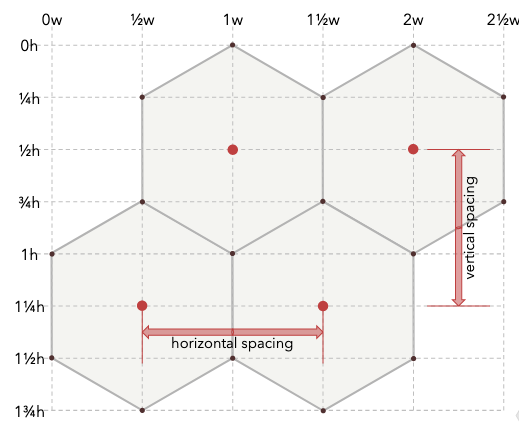
```

```{r, eval=FALSE}
# create giotto polygons, here we create hexagons
hexbin400 <- tessellate(extent = ext(giotto_points), 
                        shape = 'hexagon', 
                        shape_size = 400, 
                        name = 'hex400') 
plot(hexbin400)
```

```{r, echo=FALSE, out.width="80%", fig.align="center", fig.cap="Giotto polygon in a hexagon shape for overlapping visium HD expression data."}
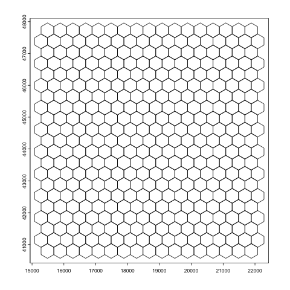
```


### combine Giotto points and polygons to create Giotto object

```{r, eval=FALSE}
instrs = createGiottoInstructions(
  save_dir = save_dir,
  save_plot = TRUE,
  show_plot = FALSE,
  return_plot = FALSE
)

# gpoints provides spatial gene expression information
# gpolygons provides spatial unit information (here = hexagon tiles)
visiumHD = createGiottoObjectSubcellular(gpoints = list('rna' = giotto_points),
                                         gpolygons = list('hex400' = hexbin400),
                                         instructions = instrs)

# create spatial centroids for each spatial unit (hexagon)
visiumHD = addSpatialCentroidLocations(gobject = visiumHD,
                                       poly_info = 'hex400')
```

Visualize the Giotto object. Make sure to set `expand_counts = TRUE` to expand 
the counts column. Each spatial bin can have multiple transcripts/UMIs. This is 
different compared to in situ technologies like seqFISH, MERFISH, Nanostring CosMx or Xenium.


```{r, echo=FALSE, out.width="80%", fig.align="center", fig.cap="Schematic showing effect of expand counts and jitter."}
knitr::include_graphics("img/02_session2/8.png")
```


Show the giotto points (transcripts) and polygons (hexagons) together using `spatInSituPlotPoints`:  
```{r, eval=FALSE}
feature_data = fDataDT(visiumHD)

spatInSituPlotPoints(visiumHD,
                     show_image = F,
                     feats = list('rna' = feature_data$feat_ID[10:20]),
                     show_legend = T,
                     spat_unit = 'hex400',
                     point_size = 0.25,
                     show_polygon = TRUE,
                     use_overlap = FALSE,
                     polygon_feat_type = 'hex400',
                     polygon_bg_color = NA,
                     polygon_color = 'white',
                     polygon_line_size = 0.1,
                     expand_counts = TRUE, 
                     count_info_column = 'count',
                     jitter = c(25,25))
```

```{r, echo=FALSE, out.width="80%", fig.align="center", fig.cap="Overlap of gene expression with the hex400 polygons. Each dot represents a single gene. Jitter used to better vizualize individual transcripts"}
knitr::include_graphics("img/02_session2/0-spatInSituPlotPoints.png")
```

You can set `plot_method = scattermore` or `scattermost` to convert high-resolution images to low(er) resolution rasterized images. It's usually faster and will save on disk space.

```{r, eval=FALSE}
spatInSituPlotPoints(visiumHD,
                     show_image = F,
                     feats = list('rna' = feature_data$feat_ID[10:20]),
                     show_legend = T,
                     spat_unit = 'hex400',
                     point_size = 0.25,
                     show_polygon = TRUE,
                     use_overlap = FALSE,
                     polygon_feat_type = 'hex400',
                     polygon_bg_color = NA,
                     polygon_color = 'white',
                     polygon_line_size = 0.1,
                     expand_counts = TRUE, 
                     count_info_column = 'count',
                     jitter = c(25,25), 
                     plot_method = 'scattermore')

```

```{r, echo=FALSE, out.width="80%", fig.align="center", fig.cap="Overlap of gene expression with the hex400 polygons. Genes/transcripts are rasterized. Jitter used to better vizualize individual transcripts"}
knitr::include_graphics("img/02_session2/1-spatInSituPlotPoints.png")
```


### Process Giotto object

#### calculate overlap between points and polygons

At the moment the giotto points (transcripts) and polygons (hexagons) are two separate
layers of information. Here we will determine which transcripts overlap with which
hexagons so that we can aggregate the gene expression information and convert this
into a gene expression matrix (genes-by-hexagons) that can be used in default spatial
pipelines.

```{r, eval=FALSE}

# calculate overlap between points and polygons
visiumHD = calculateOverlap(visiumHD,
                            spatial_info = 'hex400',
                            feat_info = 'rna')

showGiottoSpatialInfo(visiumHD)
```

#### convert overlap results to a gene-by-hexagon matrix

```{r, eval=FALSE}
# convert overlap results to bin by gene matrix
visiumHD = overlapToMatrix(visiumHD,
                           poly_info = 'hex400',
                           feat_info = 'rna',
                           name = 'raw')

# this action will automatically create an active spatial unit, ie. hexbin 400
activeSpatUnit(visiumHD)
```


#### default processing steps

This part is similar to that described in the Visium tutorials ([Part I](#Visium Part I) 
and [Part II](#Visium Part II)).

```{r, eval=FALSE}
# filter on gene expression matrix
visiumHD <- filterGiotto(visiumHD,
                         expression_threshold = 1,
                         feat_det_in_min_cells = 5,
                         min_det_feats_per_cell = 25)

# normalize and scale gene expression data
visiumHD <- normalizeGiotto(visiumHD, 
                            scalefactor = 1000, 
                            verbose = T)

# add cell and gene statistics
visiumHD <- addStatistics(visiumHD)
```

##### visualize number of features

At the centroid level.

```{r, eval=FALSE}
# each dot here represents a 200x200 aggregation of spatial barcodes (bin size 200)
spatPlot2D(gobject = visiumHD,
           cell_color = "nr_feats",
           color_as_factor = F,
           point_size = 2.5)
```

```{r, echo=FALSE, out.width="100%", fig.align="center", fig.cap="Number of features detected in each of the centroids."}
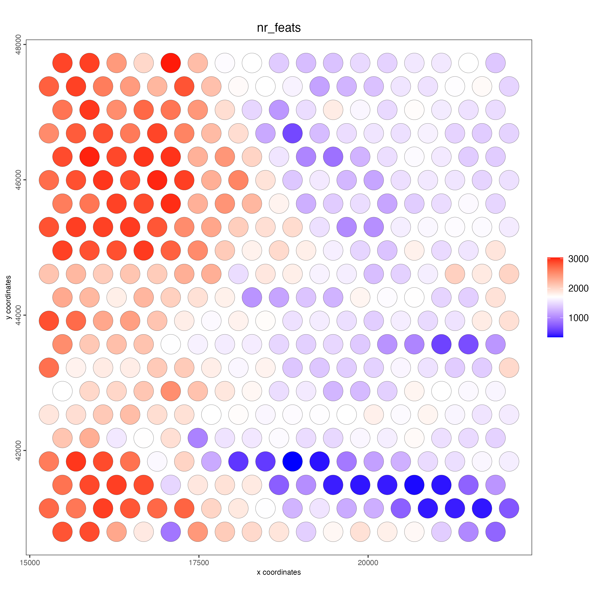
```

Using the spatial polygon (hexagon) tiles

```{r, eval=FALSE}
spatInSituPlotPoints(visiumHD,
                     show_image = F,
                     feats = NULL,
                     show_legend = F,
                     spat_unit = 'hex400',
                     point_size = 0.1,
                     show_polygon = TRUE,
                     use_overlap = TRUE,
                     polygon_feat_type = 'hex400', 
                     polygon_fill = 'nr_feats', 
                     polygon_fill_as_factor = F,
                     polygon_bg_color = NA,
                     polygon_color = 'white',
                     polygon_line_size = 0.1)


```

```{r, echo=FALSE, out.width="100%", fig.align="center", fig.cap="Number of features detected in each of the hex400 polygons."}
knitr::include_graphics("img/02_session2/3-spatInSituPlotPoints.png")
```


#### Dimension reduction + clustering

##### Highly variable features + PCA

```{r, eval=FALSE}
visiumHD <- calculateHVF(visiumHD, 
                         zscore_threshold = 1)
visiumHD <- runPCA(visiumHD, 
                   expression_values = 'normalized', 
                   feats_to_use = 'hvf')
screePlot(visiumHD, ncp = 30)
```

```{r, echo=FALSE, out.width="100%", fig.align="center"}
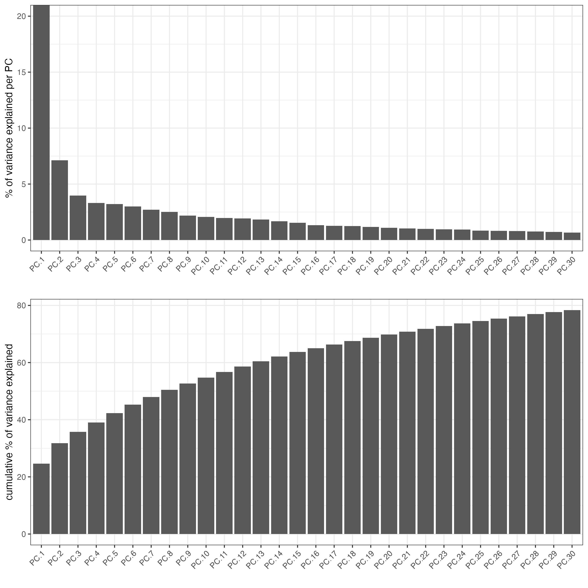
```

```{r, eval=FALSE}
plotPCA(visiumHD)
```

```{r, echo=FALSE, out.width="100%", fig.align="center"}
knitr::include_graphics("img/02_session2/5-PCA.png")
```

##### UMAP reduction for visualization

```{r, eval=FALSE}
visiumHD <- runUMAP(visiumHD, 
                    dimensions_to_use = 1:14, 
                    n_threads = 10)

plotUMAP(gobject = visiumHD,
         point_size = 1)
```

```{r, echo=FALSE, out.width="100%", fig.align="center"}
knitr::include_graphics("img/02_session2/6-UMAP.png")
```

##### Create network based on expression similarity + graph partition cluster

```{r, eval=FALSE}
# sNN network (default)
visiumHD <- createNearestNetwork(visiumHD, 
                                 dimensions_to_use = 1:14, 
                                 k = 5)

## leiden clustering ####
visiumHD <- doLeidenClusterIgraph(visiumHD, resolution = 0.5, n_iterations = 1000, spat_unit = 'hex400')
```

```{r, eval=FALSE}
plotUMAP(gobject = visiumHD,
         cell_color = 'leiden_clus', 
         point_size = 1.5,
         show_NN_network = F, 
         edge_alpha = 0.05)
```

```{r, echo=FALSE, out.width="100%", fig.align="center", fig.cap="Leiden clustering for the hex400 bins."}
knitr::include_graphics("img/02_session2/7-UMAP.png")
```

```{r, eval=FALSE}
spatInSituPlotPoints(visiumHD,
                     show_image = F,
                     feats = NULL,
                     show_legend = F,
                     spat_unit = 'hex400',
                     point_size = 0.25,
                     show_polygon = TRUE,
                     use_overlap = FALSE,
                     polygon_feat_type = 'hex400',
                     polygon_fill_as_factor = TRUE,
                     polygon_fill = 'leiden_clus',
                     polygon_color = 'black',
                     polygon_line_size = 0.3)

```

```{r, echo=FALSE, out.width="100%", fig.align="center", fig.cap="Spat plot for hex400 bin colored by leiden clusters."}
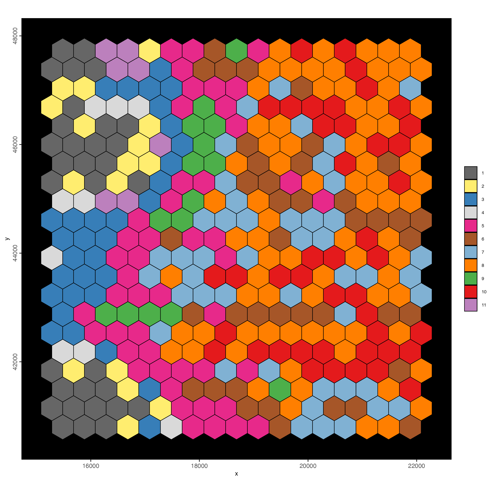
```


## Hexbin 100

Observation: Hexbin 400 results in very coarse information about the tissue.  

Goal is to create a higher resolution bin (hex100), then add this to the 
Giotto object to compare difference in resolution.


### Standard subcellular pipeline

1. Create new spatial unit layer, e.g. with tessellate function  
2. Add spatial units to Giottoo object  
3. Calculate centroids (optional)  
4. Compute overlap between transcript and polygon (hexagon) locations.  
5. Convert overlap data into a gene-by-polygon matrix  

```{r, eval=FALSE}
hexbin100 <- tessellate(extent = ext(visiumHD), 
                        shape = 'hexagon', 
                        shape_size = 100, 
                        name = 'hex100') 

visiumHD = setPolygonInfo(gobject = visiumHD,
                          x = hexbin100,
                          name = 'hex100',
                          initialize = T)

visiumHD = addSpatialCentroidLocations(gobject = visiumHD,
                                       poly_info = 'hex100')
```

Set active spatial unit. This can also be set manually in each function.

```{r, eval=FALSE}
activeSpatUnit(visiumHD) <- 'hex100'
```

Let's visualize the higher resolution hexagons.  

```{r, eval=FALSE}
spatInSituPlotPoints(visiumHD,
                     show_image = F,
                     feats = list('rna' = feature_data$feat_ID[1:20]),
                     show_legend = T,
                     spat_unit = 'hex100',
                     point_size = 0.1,
                     show_polygon = TRUE,
                     use_overlap = FALSE,
                     polygon_feat_type = 'hex100',
                     polygon_bg_color = NA,
                     polygon_color = 'white',
                     polygon_line_size = 0.2,
                     expand_counts = TRUE, 
                     count_info_column = 'count',
                     jitter = c(25,25))
```

```{r, echo=FALSE, out.width="100%", fig.align="center", fig.cap="Polygon overlay of hex100 bins over 2 µm pixel. Jitter applied to vizualize individual features."}
knitr::include_graphics("img/02_session2/9-spatInSituPlotPoints.png")
```

```{r, eval=FALSE}
visiumHD = calculateOverlap(visiumHD,
                            spatial_info = 'hex100',
                            feat_info = 'rna')

visiumHD = overlapToMatrix(visiumHD,
                           poly_info = 'hex100',
                           feat_info = 'rna',
                           name = 'raw')

visiumHD <- filterGiotto(visiumHD,
                         expression_threshold = 1,
                         feat_det_in_min_cells = 10,
                         min_det_feats_per_cell = 10)

visiumHD <- normalizeGiotto(visiumHD, scalefactor = 1000, verbose = T)

visiumHD <- addStatistics(visiumHD)
```

Your Giotto object will have metadata for each spatial unit.
```{r, eval=FALSE}
pDataDT(visiumHD, spat_unit = 'hex100')
pDataDT(visiumHD, spat_unit = 'hex400')
```

```{r, eval=FALSE}
## dimension reduction ####
# --------------------------- #
visiumHD <- calculateHVF(visiumHD, zscore_threshold = 1)

visiumHD <- runPCA(visiumHD, expression_values = 'normalized', feats_to_use = 'hvf')

plotPCA(visiumHD)
```

```{r, echo=FALSE, out.width="100%", fig.align="center", fig.cap=""}
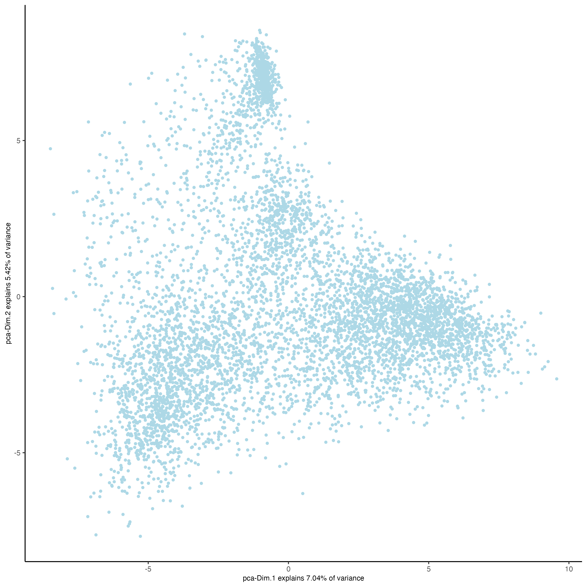
```

```{r, eval=FALSE}
visiumHD <- runUMAP(visiumHD, dimensions_to_use = 1:14, n_threads = 10)

# plot UMAP, coloring cells/points based on nr_feats
plotUMAP(gobject = visiumHD,
         point_size = 2)
```

```{r, echo=FALSE, out.width="100%", fig.align="center", fig.cap="UMAP for the hex100 bin."}
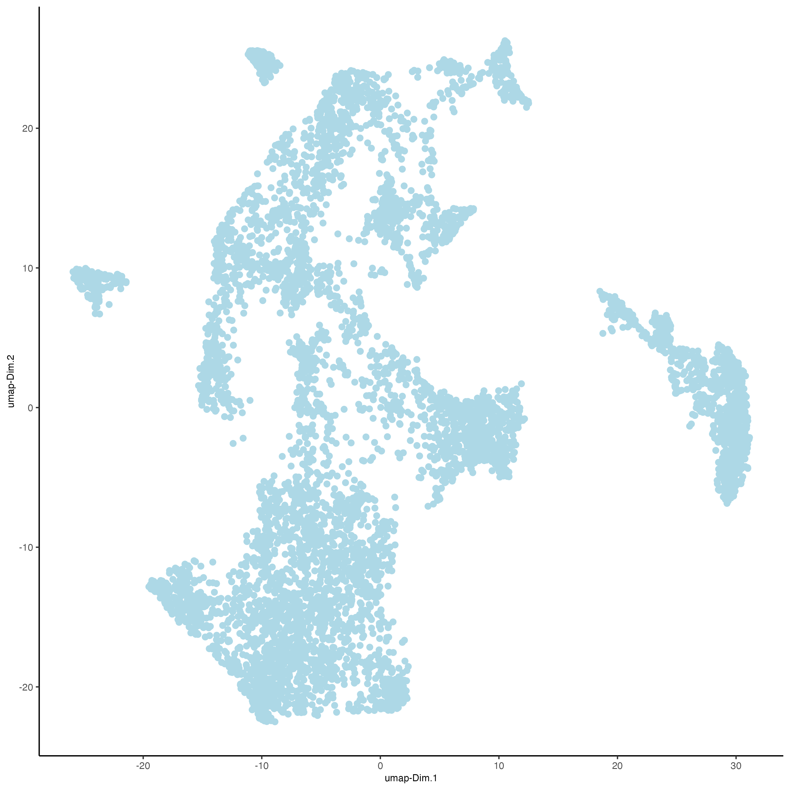
```

```{r, eval=FALSE}
# sNN network (default)
visiumHD <- createNearestNetwork(visiumHD, 
                                 dimensions_to_use = 1:14, 
                                 k = 5)

## leiden clustering ####
visiumHD <- doLeidenClusterIgraph(visiumHD, resolution = 0.2, n_iterations = 1000)

plotUMAP(gobject = visiumHD,
         cell_color = 'leiden_clus', 
         point_size = 1.5,
         show_NN_network = F, 
         edge_alpha = 0.05)
```

```{r, echo=FALSE, out.width="100%", fig.align="center", fig.cap="UMAP for the hex100 bin colored by ledien clusters."}
knitr::include_graphics("img/02_session2/12-UMAP.png")
```

```{r, eval=FALSE}
spatInSituPlotPoints(visiumHD,
                     show_image = F,
                     feats = NULL,
                     show_legend = F,
                     spat_unit = 'hex100',
                     point_size = 0.5,
                     show_polygon = TRUE,
                     use_overlap = FALSE,
                     polygon_feat_type = 'hex100',
                     polygon_fill_as_factor = TRUE,
                     polygon_fill = 'leiden_clus',
                     polygon_color = 'black',
                     polygon_line_size = 0.3)

```

```{r, echo=FALSE, out.width="100%", fig.align="center", fig.cap="Spat plot for the hex100 bin colored by leiden clusters."}
knitr::include_graphics("img/02_session2/13-spatInSituPlotPoints.png")
```

This resolution definitely shows more promise to identify interesting spatial patterns.  

### Spatial expression patterns

#### Identify single genes

Here we will use binSpect as a quick method to rank genes with high potential for
spatial coherent expression patterns.  

```{r, eval=FALSE}
featData = fDataDT(visiumHD)
hvf_genes = featData[hvf == 'yes']$feat_ID

visiumHD = createSpatialNetwork(visiumHD,
                                name = 'kNN_network',
                                spat_unit = 'hex100', 
                                method = 'kNN',
                                k = 8)

ranktest = binSpect(visiumHD,
                    spat_unit = 'hex100',
                    subset_feats = hvf_genes,
                    bin_method = 'rank',
                    calc_hub = FALSE,
                    do_fisher_test = TRUE,
                    spatial_network_name = 'kNN_network')

```

Visualize top 2 ranked spatial genes per expression bin:

```{r, eval=FALSE}
set0 = ranktest[high_expr < 50][1:2]$feats
set1 = ranktest[high_expr > 50 & high_expr < 100][1:2]$feats
set2 = ranktest[high_expr > 100 & high_expr < 200][1:2]$feats
set3 = ranktest[high_expr > 200 & high_expr < 400][1:2]$feats
set4 = ranktest[high_expr > 400 & high_expr < 1000][1:2]$feats
set5 = ranktest[high_expr > 1000][1:2]$feats

spatFeatPlot2D(visiumHD,
               expression_values = 'scaled',
               feats = c(set0, set1, set2),
               gradient_style = "sequential",
               cell_color_gradient = c('blue', 'white', 'yellow', 'orange', 'red', 'darkred'),
               cow_n_col = 2, point_size = 1)
```

```{r, echo=FALSE, out.width="100%", fig.align="center", fig.cap="Spat feature plot showing gene expression for the top 2 ranked spatial genes per expression bin (<50, >50 and >100) across the hex100 bin."}
knitr::include_graphics("img/02_session2/14-spatFeatPlot2D.png")
```

```{r, eval=FALSE}

spatFeatPlot2D(visiumHD,
               expression_values = 'scaled',
               feats = c(set3, set4, set5),
               gradient_style = "sequential",
               cell_color_gradient = c('blue', 'white', 'yellow', 'orange', 'red', 'darkred'),
               cow_n_col = 2, point_size = 1)
```

```{r, echo=FALSE, out.width="100%", fig.align="center", fig.cap="Spat feature plot showing gene expression for the top 2 ranked spatial genes per expression bin (>200, >400 and >1000) across the hex100 bin."}
knitr::include_graphics("img/02_session2/15-spatFeatPlot2D.png")
```


#### Spatial co-expression modules

Investigating individual genes is a good start, but here we would like to identify
recurrent spatial expression patterns that are shared by spatial co-expression modules
that might represent spatially organized biological processes.  

```{r, eval=FALSE}
ext_spatial_genes = ranktest[adj.p.value < 0.001]$feats

spat_cor_netw_DT = detectSpatialCorFeats(visiumHD,
                                         method = 'network',
                                         spatial_network_name = 'kNN_network',
                                         subset_feats = ext_spatial_genes)

# cluster spatial genes
spat_cor_netw_DT = clusterSpatialCorFeats(spat_cor_netw_DT, 
                                          name = 'spat_netw_clus', 
                                          k = 16)

# visualize clusters
heatmSpatialCorFeats(visiumHD,
                     spatCorObject = spat_cor_netw_DT,
                     use_clus_name = 'spat_netw_clus',
                     heatmap_legend_param = list(title = NULL))
```

```{r, echo=FALSE, out.width="100%", fig.align="center", fig.cap="Heatmap showing spatially correlated genes split into 16 clusters."}
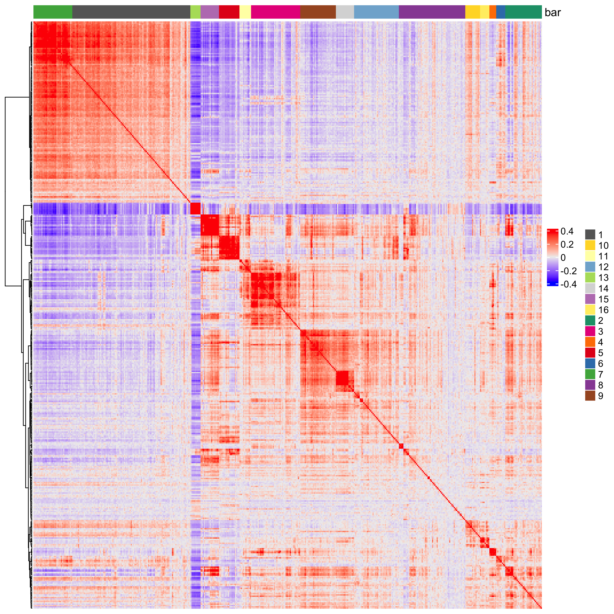
```

```{r, eval=FALSE}
# create metagene enrichment score for clusters
cluster_genes_DT = showSpatialCorFeats(spat_cor_netw_DT, 
                                       use_clus_name = 'spat_netw_clus', 
                                       show_top_feats = 1)
cluster_genes = cluster_genes_DT$clus; names(cluster_genes) = cluster_genes_DT$feat_ID

visiumHD = createMetafeats(visiumHD,
                           expression_values = 'normalized',
                           feat_clusters = cluster_genes,
                           name = 'cluster_metagene')

showGiottoSpatEnrichments(visiumHD)
```

```{r, eval=FALSE}
spatCellPlot(visiumHD,
             spat_enr_names = 'cluster_metagene',
             gradient_style = "sequential",
             cell_color_gradient = c('blue', 'white', 'yellow', 'orange', 'red', 'darkred'),
             cell_annotation_values = as.character(c(1:4)),
             point_size = 1, cow_n_col = 2)
```

```{r, echo=FALSE, out.width="100%", fig.align="center", fig.cap="Spat plot vizualizing metagenes (1-4) based on spatially correlated genes vizualized on the hex100 bin"}
knitr::include_graphics("img/02_session2/17-spatCellPlot2D.png")
```

```{r, eval=FALSE}
spatCellPlot(visiumHD,
             spat_enr_names = 'cluster_metagene',
             gradient_style = "sequential",
             cell_color_gradient = c('blue', 'white', 'yellow', 'orange', 'red', 'darkred'),
             cell_annotation_values = as.character(c(5:8)),
             point_size = 1, cow_n_col = 2)
```

```{r, echo=FALSE, out.width="100%", fig.align="center", fig.cap="Spat plot vizualizing metagenes (5-8) based on spatially correlated genes vizualized on the hex100 bin"}
knitr::include_graphics("img/02_session2/18-spatCellPlot2D.png")
```

```{r, eval=FALSE}
spatCellPlot(visiumHD,
             spat_enr_names = 'cluster_metagene',
             gradient_style = "sequential",
             cell_color_gradient = c('blue', 'white', 'yellow', 'orange', 'red', 'darkred'),
             cell_annotation_values = as.character(c(9:12)),
             point_size = 1, cow_n_col = 2)
```

```{r, echo=FALSE, out.width="100%", fig.align="center", fig.cap="Spat plot vizualizing metagenes (9-12) based on spatially correlated genes vizualized on the hex100 bin"}
knitr::include_graphics("img/02_session2/19-spatCellPlot2D.png")
```

```{r, eval=FALSE}
spatCellPlot(visiumHD,
             spat_enr_names = 'cluster_metagene',
             gradient_style = "sequential",
             cell_color_gradient = c('blue', 'white', 'yellow', 'orange', 'red', 'darkred'),
             cell_annotation_values = as.character(c(13:16)),
             point_size = 1, cow_n_col = 2)
```

```{r, echo=FALSE, out.width="100%", fig.align="center", fig.cap="Spat plot vizualizing metagenes (13-16) based on spatially correlated genes vizualized on the hex100 bin"}
knitr::include_graphics("img/02_session2/20-spatCellPlot2D.png")
```


A simple follow up analysis could be to perform gene set enrichment analysis on each spatial
co-expression module.  


#### Plot spatial gene groups

Hack! Vendors of spatial technologies typically like to show very interesting spatial 
gene expression patterns. Here we will follow a similar strategy by selecting a 
balanced set of genes for each spatial co-expression module and then to simply 
give them the same color in the `spatInSituPlotPoints` function. 

```{r, eval=FALSE}
balanced_genes = getBalancedSpatCoexpressionFeats(spatCorObject = spat_cor_netw_DT, 
                                                  maximum = 5)
selected_feats = names(balanced_genes)

# give genes from same cluster same color
distinct_colors = getDistinctColors(n = 20)
names(distinct_colors) = 1:20

my_colors = distinct_colors[balanced_genes]
names(my_colors) = names(balanced_genes)

spatInSituPlotPoints(visiumHD,
                     show_image = F,
                     feats = list('rna' = selected_feats), 
                     feats_color_code = my_colors,
                     show_legend = F,
                     spat_unit = 'hex100',
                     point_size = 0.20,
                     show_polygon = FALSE,
                     use_overlap = FALSE,
                     polygon_feat_type = 'hex100',
                     polygon_bg_color = NA,
                     polygon_color = 'white',
                     polygon_line_size = 0.01,
                     expand_counts = TRUE, 
                     count_info_column = 'count',
                     jitter = c(25,25))

```

```{r, echo=FALSE, out.width="100%", fig.align="center", fig.cap="Coloring individual features based on the spatially correlated gene clusters."}
knitr::include_graphics("img/02_session2/21-spatInSituPlotPoints.png")
```


## Hexbin 25

Goal is to create a higher resolution bin (hex25) and add to the Giotto object. We will aim to identify individual cell types and local neighborhood niches.

### Subcellular workflow and projection functions

-   filter and normalization workflow
-   PCA projection

```{r, eval=FALSE}
visiumHD_subset = subsetGiottoLocs(gobject = visiumHD,
                                   x_min = 16000, 
                                   x_max = 20000, 
                                   y_min = 44250,
                                   y_max = 45500)
```


```{r, eval=FALSE}
spatInSituPlotPoints(visiumHD_subset,
                     show_image = F,
                     feats = NULL,
                     show_legend = F,
                     spat_unit = 'hex100',
                     point_size = 0.5,
                     show_polygon = TRUE,
                     use_overlap = FALSE,
                     polygon_feat_type = 'hex100',
                     polygon_fill_as_factor = TRUE,
                     polygon_fill = 'leiden_clus',
                     polygon_color = 'black',
                     polygon_line_size = 0.3)
```

```{r, echo=FALSE, out.width="100%", fig.align="center", fig.cap="xxx"}
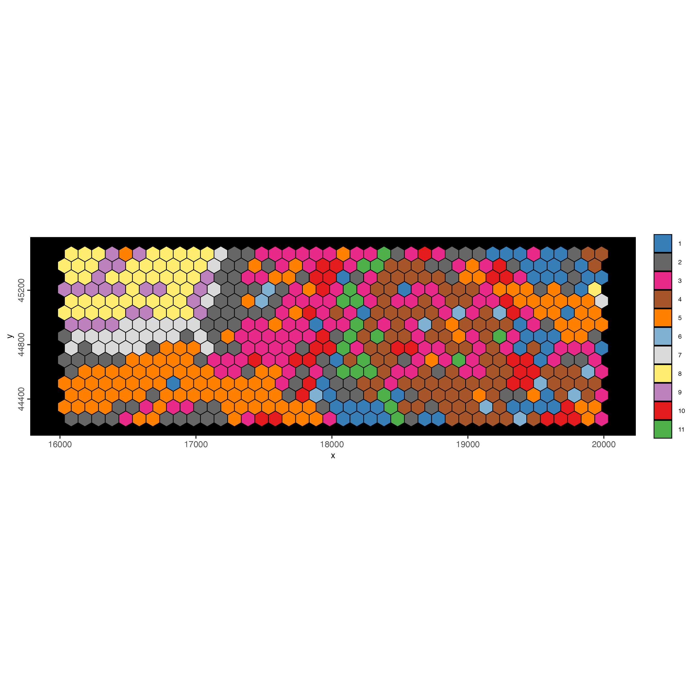
```

```{r, eval=FALSE}
spatInSituPlotPoints(visiumHD_subset,
                     show_image = F,
                     feats = list('rna' = selected_feats), 
                     feats_color_code = my_colors,
                     show_legend = F,
                     spat_unit = 'hex100',
                     point_size = 0.40,
                     show_polygon = TRUE,
                     use_overlap = FALSE,
                     polygon_feat_type = 'hex100',
                     polygon_bg_color = NA,
                     polygon_color = 'white',
                     polygon_line_size = 0.05,
                     jitter = c(25,25))

```

```{r, echo=FALSE, out.width="100%", fig.align="center", fig.cap="xxx"}
knitr::include_graphics("img/02_session2/23-spatInSituPlotPoints.png")
```


```{r, eval=FALSE}
hexbin25 <- tessellate(extent = ext(visiumHD_subset@feat_info$rna), 
                       shape = 'hexagon', 
                       shape_size = 25, 
                       name = 'hex25') 

visiumHD_subset = setPolygonInfo(gobject = visiumHD_subset,
                                 x = hexbin25,
                                 name = 'hex25',
                                 initialize = T)

showGiottoSpatialInfo(visiumHD_subset)

visiumHD_subset = addSpatialCentroidLocations(gobject = visiumHD_subset,
                                              poly_info = 'hex25')

activeSpatUnit(visiumHD_subset) <- 'hex25'

spatInSituPlotPoints(visiumHD_subset,
                     show_image = F,
                     feats = list('rna' = selected_feats), 
                     feats_color_code = my_colors,
                     show_legend = F,
                     spat_unit = 'hex25',
                     point_size = 0.40,
                     show_polygon = TRUE,
                     use_overlap = FALSE,
                     polygon_feat_type = 'hex25',
                     polygon_bg_color = NA,
                     polygon_color = 'white',
                     polygon_line_size = 0.05,
                     jitter = c(25,25))
```

```{r, echo=FALSE, out.width="100%", fig.align="center", fig.cap="xxx"}
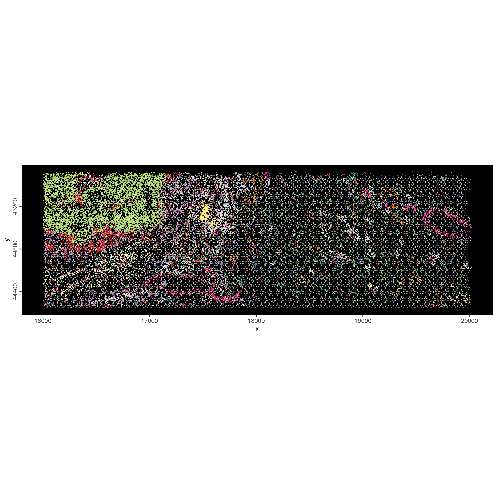
```


```{r, eval=FALSE}
visiumHD_subset = calculateOverlap(visiumHD_subset,
                                   spatial_info = 'hex25',
                                   feat_info = 'rna')

showGiottoSpatialInfo(visiumHD_subset)


# convert overlap results to bin by gene matrix
visiumHD_subset = overlapToMatrix(visiumHD_subset,
                                  poly_info = 'hex25',
                                  feat_info = 'rna',
                                  name = 'raw')

visiumHD_subset <- filterGiotto(visiumHD_subset,
                                expression_threshold = 1,
                                feat_det_in_min_cells = 3,
                                min_det_feats_per_cell = 5)

activeSpatUnit(visiumHD_subset)


# normalize
visiumHD_subset <- normalizeGiotto(visiumHD_subset, scalefactor = 1000, verbose = T)

# add statistics
visiumHD_subset <- addStatistics(visiumHD_subset)

feature_data = fDataDT(visiumHD_subset)

visiumHD_subset <- calculateHVF(visiumHD_subset, zscore_threshold = 1)

```

### projections

#### dimension reduction with projections
```{r, eval=FALSE}

n_25_percent <- round(length(spatIDs(visiumHD_subset, 'hex25')) * 0.25)

# pca projection on subset
visiumHD_subset <- runPCAprojection(
  gobject = visiumHD_subset,
  spat_unit = "hex25",
  feats_to_use = 'hvf',
  name = 'pca.projection',
  set_seed = TRUE,
  seed_number = 12345,
  random_subset = n_25_percent
)

showGiottoDimRed(visiumHD_subset)
plotPCA(visiumHD_subset, dim_reduction_name = 'pca.projection')
```

```{r, echo=FALSE, out.width="100%", fig.align="center", fig.cap="xxx"}
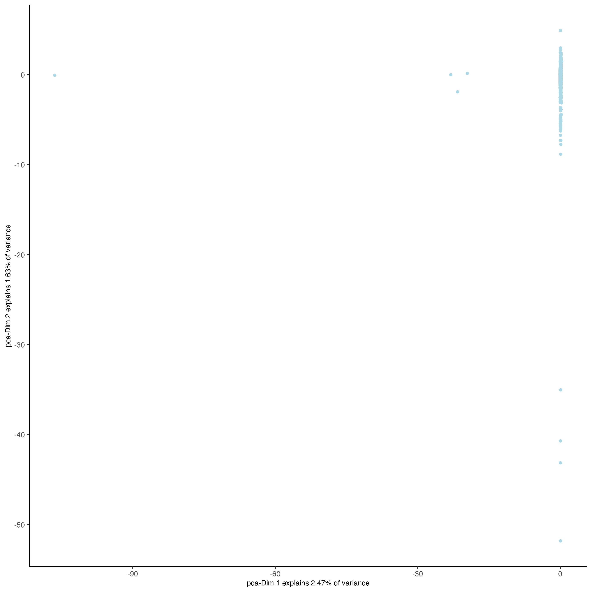
```


```{r, eval=FALSE}
# umap projection on subset
visiumHD_subset <- runUMAPprojection(
  gobject = visiumHD_subset,
  spat_unit = "hex25",
  dim_reduction_to_use = 'pca',
  dim_reduction_name = "pca.projection",
  dimensions_to_use = 1:10,
  name = "umap.projection",
  random_subset = n_25_percent, 
  n_neighbors = 10,
  min_dist = 0.005,
  n_threads = 4
)

showGiottoDimRed(visiumHD_subset)

# plot UMAP, coloring cells/points based on nr_feats
plotUMAP(gobject = visiumHD_subset,
         point_size = 1, 
         dim_reduction_name = 'umap.projection')

```

```{r, echo=FALSE, out.width="100%", fig.align="center", fig.cap="xxx"}
knitr::include_graphics("img/02_session2/26-UMAP.png")
```


#### clustering with projection

```{r, eval=FALSE}

# subset to smaller giotto object
set.seed(1234)
subset_IDs = sample(x = spatIDs(visiumHD_subset, 'hex25'), size = n_25_percent)

temp_gobject = subsetGiotto(
  gobject = visiumHD_subset,
  spat_unit = 'hex25',
  cell_ids = subset_IDs
)


# hierarchical clustering
temp_gobject = doHclust(gobject = temp_gobject, 
                        spat_unit = 'hex25', 
                        k = 8, name = 'sub_hclust', 
                        dim_reduction_to_use = 'pca', 
                        dim_reduction_name = 'pca.projection', 
                        dimensions_to_use = 1:10)


# show umap
dimPlot2D(
  gobject = temp_gobject,
  point_size = 2.5,
  spat_unit = 'hex25',
  dim_reduction_to_use = 'umap',
  dim_reduction_name = 'umap.projection',
  cell_color = 'sub_hclust'
)

```

```{r, echo=FALSE, out.width="100%", fig.align="center", fig.cap="xxx"}
knitr::include_graphics("img/02_session2/27-dimPlot2D.png")
```


```{r, eval=FALSE}
# project clusterings back to full dataset
visiumHD_subset <- doClusterProjection(
  target_gobject = visiumHD_subset,
  source_gobject = temp_gobject,
  spat_unit = "hex25",
  source_cluster_labels = "sub_hclust",
  reduction_method = 'pca',
  reduction_name = 'pca.projection',
  prob = FALSE,
  knn_k = 5,
  dimensions_to_use = 1:10
)

pDataDT(visiumHD_subset)

dimPlot2D(
  gobject = visiumHD_subset,
  point_size = 1.5,
  spat_unit = 'hex25',
  dim_reduction_to_use = 'umap',
  dim_reduction_name = 'umap.projection',
  cell_color = 'knn_labels'
)

```

```{r, echo=FALSE, out.width="100%", fig.align="center", fig.cap="xxx"}
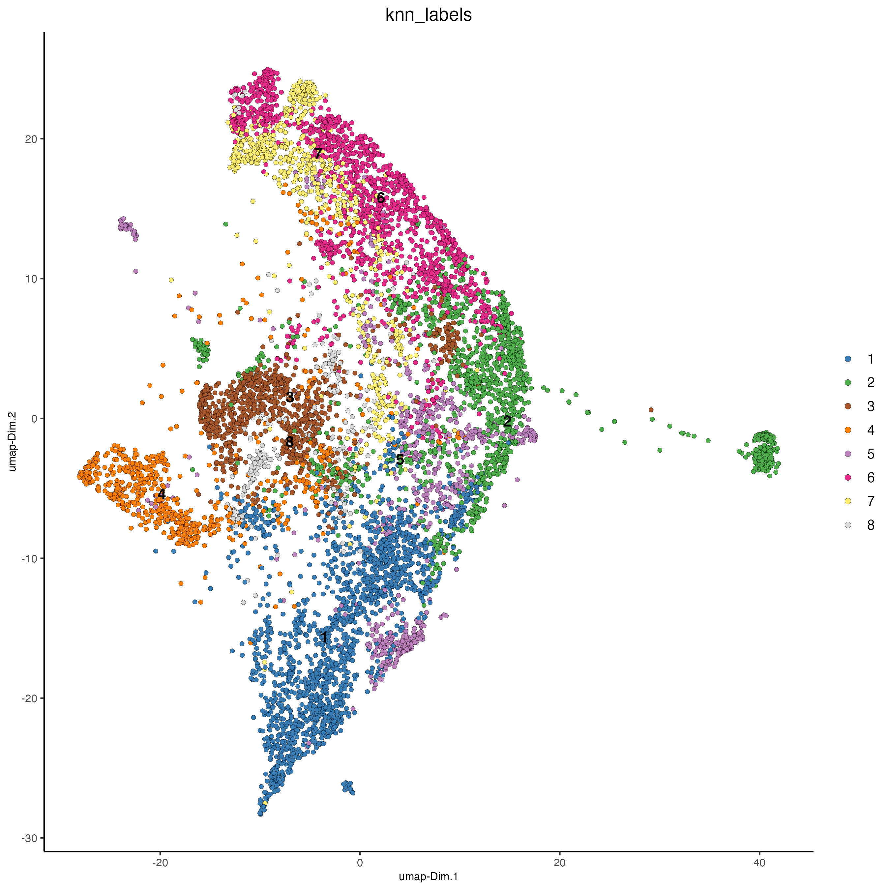
```


```{r, eval=FALSE}
spatInSituPlotPoints(visiumHD_subset,
                     show_image = F,
                     feats = NULL,
                     show_legend = F,
                     spat_unit = 'hex25',
                     point_size = 0.5,
                     show_polygon = TRUE,
                     use_overlap = FALSE,
                     polygon_feat_type = 'hex25',
                     polygon_fill_as_factor = TRUE,
                     polygon_fill = 'knn_labels',
                     polygon_color = 'black',
                     polygon_line_size = 0.3)
```

```{r, echo=FALSE, out.width="100%", fig.align="center", fig.cap="xxx"}
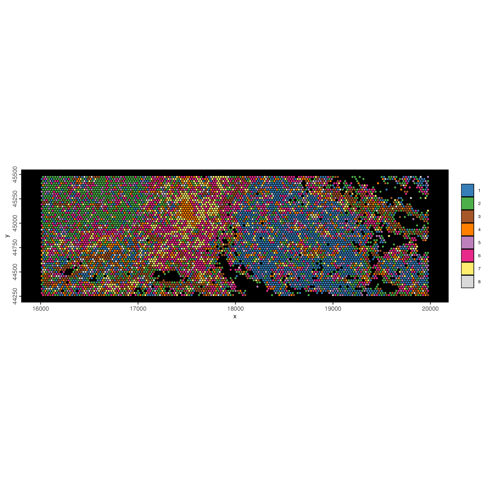
```

### niche clusters


```{r, eval=FALSE}
visiumHD_subset = createSpatialNetwork(visiumHD_subset,
                                name = 'kNN_network',
                                spat_unit = 'hex25', 
                                method = 'kNN',
                                k = 6)

pDataDT(visiumHD_subset)
visiumHD_subset = calculateSpatCellMetadataProportions(gobject = visiumHD_subset,
                                                       spat_unit = 'hex25',
                                                       feat_type = 'rna',
                                                       metadata_column = 'knn_labels',
                                                       spat_network = 'kNN_network')

prop_table = getSpatialEnrichment(visiumHD_subset, name = 'proportion', output = 'data.table')
prop_matrix = GiottoUtils:::dt_to_matrix(prop_table)

set.seed(1234)
prop_kmeans = kmeans(x = prop_matrix, centers = 10, iter.max = 1000, nstart = 100)
prop_kmeansDT = data.table::data.table(cell_ID = names(prop_kmeans$cluster), niche = prop_kmeans$cluster)

visiumHD_subset = addCellMetadata(visiumHD_subset, 
                                  new_metadata = prop_kmeansDT, 
                                  by_column = T, 
                                  column_cell_ID = 'cell_ID')
pDataDT(visiumHD_subset)

spatInSituPlotPoints(visiumHD_subset,
                     show_image = F,
                     feats = NULL,
                     show_legend = F,
                     spat_unit = 'hex25',
                     point_size = 0.5,
                     show_polygon = TRUE,
                     use_overlap = FALSE,
                     polygon_feat_type = 'hex25',
                     polygon_fill_as_factor = TRUE,
                     polygon_fill = 'niche',
                     polygon_color = 'black',
                     polygon_line_size = 0.3)

```

```{r, echo=FALSE, out.width="100%", fig.align="center", fig.cap="xxx"}
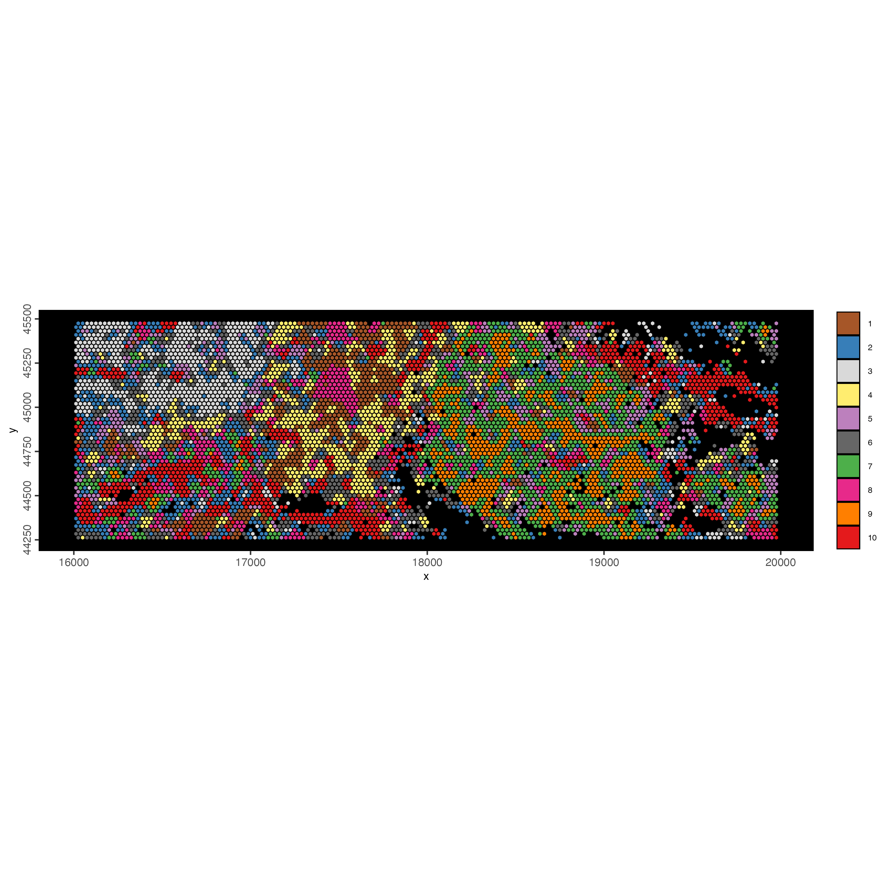
```


## Database backend - Work in progress, but coming soon!

Memory problems:  
- data ingestion  
- spatial operations  
- matrix operations  
- matrix and spatial geometry object sizes  


