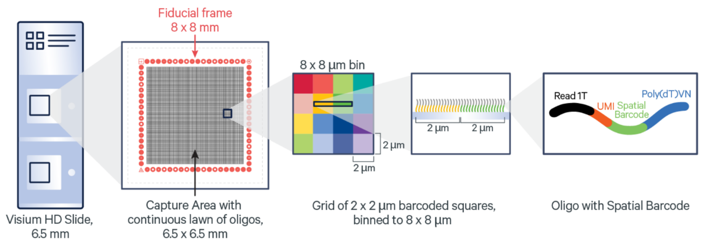
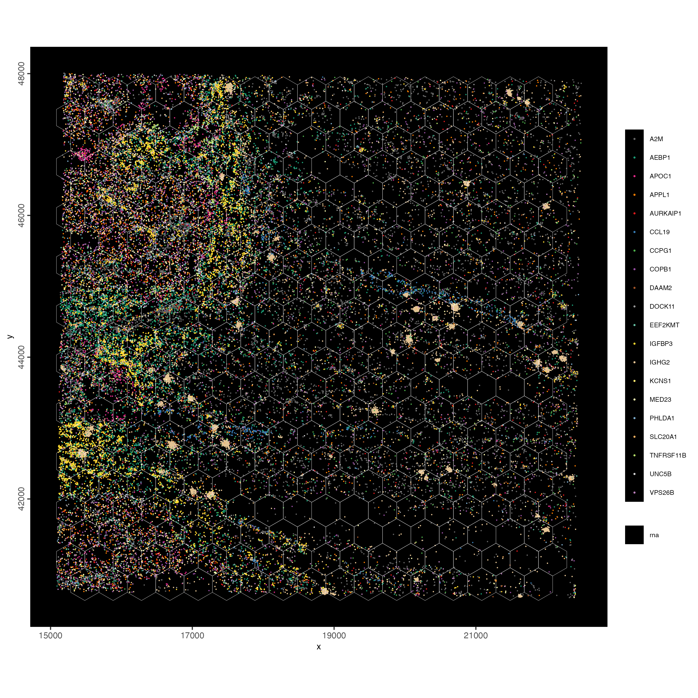
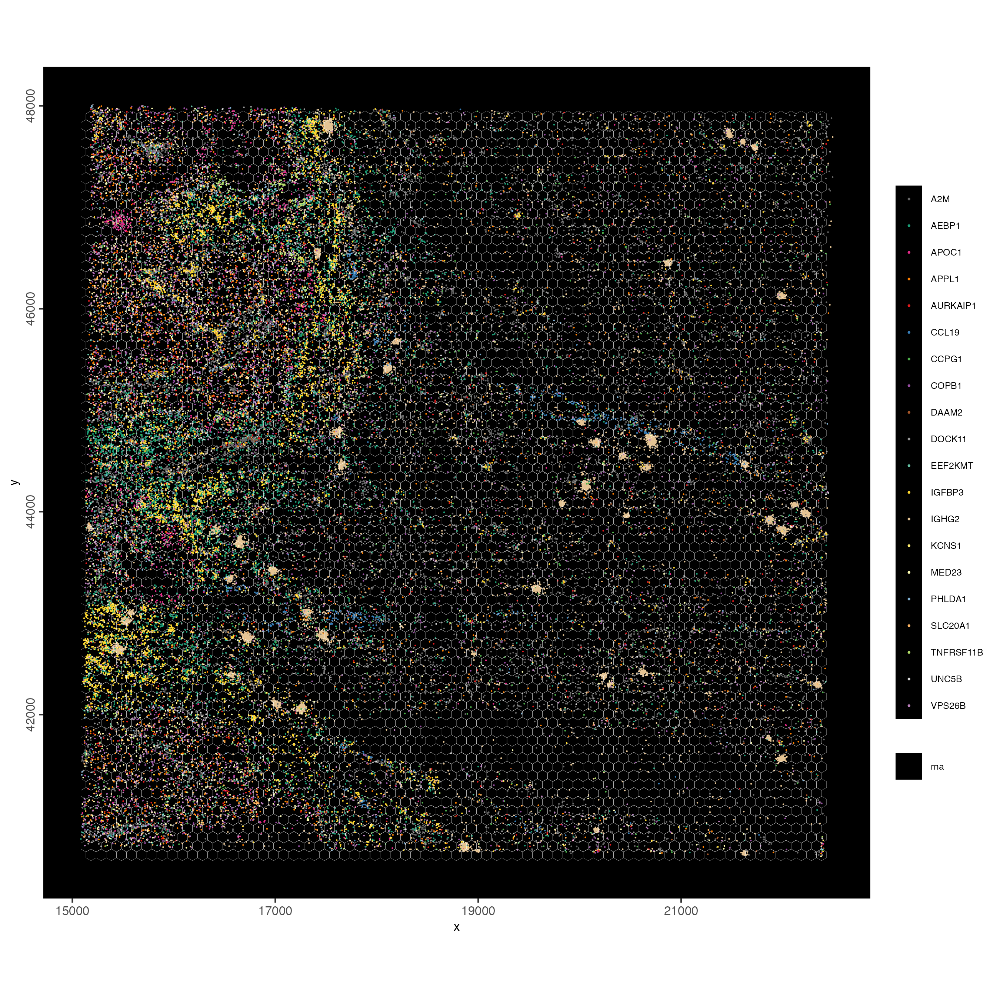

# Visium HD

Ruben Dries & Edward C. Ruiz

August 6th 2024

## Objective {#objective}

This tutorial demonstrates how to process Visium HD data at the highest 2 micron bin resolution using [Giotto Suite](https://drieslab.github.io/Giotto_website/). Notably, a similar strategy can be used for other spatial sequencing methods that operate at the subcellular level, including:\
- Stereo-seq\
- [Seq-Scope](https://drieslab.github.io/Giotto_website/articles/seqscope_mouse_liver.html)\
- Open-ST

The resulting datasets from all these technologies can be very large since they provide both a high spatial resolution and genome-wide capture of *all* transcripts.


## Background

### Visium HD Technology

```{r, echo=FALSE, out.width="80%", fig.align="center", fig.cap="Overview of Visium HD. Source: *10X Genomics*"}

```

Visium HD is a spatial transcriptomics technology recently developed by 10X Genomics. Details about this platform are discussed on the official [10X Genomics Visium HD website](https://www.10xgenomics.com/products/visium-hd-spatial-gene-expression) and the preprint by [Oliveira *et al.* 2024](https://doi.org/10.1101/2024.06.04.597233) on *bioRxiv*.

Visium HD has a 2 micron bin size resolution. The default SpaceRanger pipeline from 10X Genomics also returns aggregated data at the 8 and 16 micron bin size.

### Colorectal Cancer Sample

```{r, echo=FALSE, out.width="80%", fig.align="center", fig.cap="Colorectal Cancer Overview. Source: *10X Genomics*"}
knitr::include_graphics("img/02_session2/2.png")
```

For this tutorial we will be using the publicly available Colorectal Cancer Visium HD dataset.

Details about this dataset and a link to download the raw data can be found at the [10X Genomics website](https://www.10xgenomics.com/datasets/visium-hd-cytassist-gene-expression-libraries-of-human-crc).


## Data Ingestion

### Visium HD output data format

```{r, echo=FALSE, out.width="80%", fig.align="center", fig.cap="File structure of Visium HD data processed with spaceranger pipeline."}
knitr::include_graphics("img/02_session2/3.png")
```

Visium HD data processed with the spaceranger pipeline is organized in this format containing various files associated with the sample. The files highlighted in yellow are what we will be using to read in these datasets.


### Mini Visium HD dataset
```{r, eval = FALSE}

library(Giotto)

# set up paths
data_path <- "data/02_session2/"
save_dir <- "results/02_session2/"
dir.create(save_dir, recursive = TRUE)

# download the mini dataset and untar
options("timeout" = Inf)
download.file(
    url = "https://zenodo.org/records/13212855/files/workshop_VisiumHD.zip?download=1",
    destfile = file.path(save_dir, "workshop_visiumHD.zip")
)
untar(tarfile = file.path(save_dir, "workshop_visiumHD.zip"), 
      exdir = data_path)
```


### Giotto Visium HD convenience function

The easiest way to read in Visium HD data in Giotto is through our convenience function. This function will automatically read in the data at your desired resolution, align the images, and finally create a Giotto Object.

```{r, eval = FALSE}
# importVisiumHD()
```


### Read in data manually

However, for this tutorial we will illustrate how to create your own Giotto object in a step-by-step manner, which can also be applied to other similar technologies as discussed in the [Objective](#Objective) section.

#### Raw expression data
```{r, eval = FALSE}
expression_path <- file.path(data_path, 'workshop_visiumHD/Human_Colorectal_Cancer_workshop/square_002um/raw_feature_bc_matrix')
expr_results <- get10Xmatrix(path_to_data = expression_path, 
                             gene_column_index = 1)
```


#### Tissue positions data
```{r, eval = FALSE}
tissue_positions_path <- file.path(data_path, 'workshop_visiumHD/Human_Colorectal_Cancer_workshop/square_002um/spatial/tissue_positions.parquet')
tissue_positions <- data.table::as.data.table(arrow::read_parquet(tissue_positions_path))
```


#### Merge expression and 2 micron position data
```{r, eval = FALSE}
# convert expression matrix to minimal data.frame or data.table object
matrix_tile_dt <- data.table::as.data.table(Matrix::summary(expr_results))
genes   <- expr_results@Dimnames[[1]]
samples <- expr_results@Dimnames[[2]]
matrix_tile_dt[, gene := genes[i]]
matrix_tile_dt[, pixel := samples[j]]
```

```{r, echo=FALSE, out.width="80%", fig.align="center"}
knitr::include_graphics("img/02_session2/4.png")
```


```{r, eval = FALSE}
# merge data.table matrix and spatial coordinates to create input for Giotto Polygons
expr_pos_data <- data.table::merge.data.table(matrix_tile_dt, 
                                             tissue_positions, 
                                             by.x = 'pixel', 
                                             by.y = 'barcode')

expr_pos_data <- expr_pos_data[,.(pixel, pxl_row_in_fullres, pxl_col_in_fullres, gene, x)]
colnames(expr_pos_data) = c('pixel', 'x', 'y', 'gene', 'count')
```

```{r, echo=FALSE, out.width="80%", fig.align="center"}
knitr::include_graphics("img/02_session2/5.png")
```

## Giotto object at Hexbin 400

### create giotto points 

```{r, eval = FALSE}
giotto_points = createGiottoPoints(x = expr_pos_data[,.(x, y, gene, pixel, count)])
```


### create giotto polygons 

#### Tiling and aggregation

The Visium HD data is organized in a grid format. We can aggregate the data into larger bins to reduce the dimensionality of the data. Giotto Suite provides options to bin data not only with squares, but also through hexagons and triangles. Here we use a hexagon tesselation to aggregate the data into arbitrary cells.

```{r, eval=FALSE}
# create giotto polygons, here we create hexagons
hexbin400 <- tessellate(extent = ext(giotto_points), 
                        shape = 'hexagon', 
                        shape_size = 400, 
                        name = 'hex400') 
plot(hexbin400)
```

```{r, echo=FALSE, out.width="80%", fig.align="center"}
knitr::include_graphics("img/02_session2/6.png")
```


### combine Giotto points and polygons to create Giotto object

```{r, eval=FALSE}
instrs = createGiottoInstructions(
  save_dir = save_dir,
  save_plot = TRUE,
  show_plot = FALSE,
  return_plot = FALSE
)

visiumHD = createGiottoObjectSubcellular(gpoints = list('rna' = giotto_points),
                                         gpolygons = list('hex400' = hexbin400),
                                         instructions = instrs)

visiumHD = addSpatialCentroidLocations(gobject = visiumHD,
                                       poly_info = 'hex400')
```

Visualize the Giotto object. Make sure to set `expand_counts = TRUE` to expand the counts
column. Each spatial bin can have multiple transcripts/UMIs. This is different 
compared to in situ technologies like seqFISH, MERFISH, Nanostring CosMx or Xenium.
```{r, eval=FALSE}
feature_data = fDataDT(visiumHD)

spatInSituPlotPoints(visiumHD,
                     show_image = F,
                     feats = list('rna' = feature_data$feat_ID[10:20]),
                     show_legend = T,
                     spat_unit = 'hex400',
                     point_size = 0.25,
                     show_polygon = TRUE,
                     use_overlap = FALSE,
                     polygon_feat_type = 'hex400',
                     polygon_bg_color = NA,
                     polygon_color = 'white',
                     polygon_line_size = 0.1,
                     expand_counts = TRUE, 
                     count_info_column = 'count',
                     jitter = c(25,25))
```

```{r, echo=FALSE, out.width="80%", fig.align="center"}

```

You can set `plot_method = scattermore` or `scattermost` to convert high-resolution
images to low(er) resolution rasterized images. It's usually faster and will save on disk space.
```{r, eval=FALSE}
spatInSituPlotPoints(visiumHD,
                     show_image = F,
                     feats = list('rna' = feature_data$feat_ID[10:20]),
                     show_legend = T,
                     spat_unit = 'hex400',
                     point_size = 0.25,
                     show_polygon = TRUE,
                     use_overlap = FALSE,
                     polygon_feat_type = 'hex400',
                     polygon_bg_color = NA,
                     polygon_color = 'white',
                     polygon_line_size = 0.1,
                     expand_counts = TRUE, 
                     count_info_column = 'count',
                     jitter = c(25,25), 
                     plot_method = 'scattermore')

```

```{r, echo=FALSE, out.width="80%", fig.align="center"}
knitr::include_graphics("img/02_session2/1-spatInSituPlotPoints.png")
```

### Process Giotto object


#### calculate overlap between points and polygons
```{r, eval=FALSE}

# calculate overlap between points and polygons
visiumHD = calculateOverlap(visiumHD,
                            spatial_info = 'hex400',
                            feat_info = 'rna')

showGiottoSpatialInfo(visiumHD)
```

#### convert overlap results to a bin-by-gene matrix
```{r, eval=FALSE}
# convert overlap results to bin by gene matrix
visiumHD = overlapToMatrix(visiumHD,
                           poly_info = 'hex400',
                           feat_info = 'rna',
                           name = 'raw')

activeSpatUnit(visiumHD)
```


#### default processing steps
```{r, eval=FALSE}
visiumHD <- filterGiotto(visiumHD,
                         expression_threshold = 1,
                         feat_det_in_min_cells = 5,
                         min_det_feats_per_cell = 25)

# normalize
visiumHD <- normalizeGiotto(visiumHD, 
                            scalefactor = 1000, 
                            verbose = T)

# add statistics
visiumHD <- addStatistics(visiumHD)
```


#### visualize number of features

At the centroid level.
```{r, eval=FALSE}
# each dot here represents a 200x200 aggregation of spatial barcodes (bin size 200)
spatPlot2D(gobject = visiumHD,
           cell_color = "nr_feats",
           color_as_factor = F,
           point_size = 2.5)
```


```{r, echo=FALSE, out.width="100%", fig.align="center"}
knitr::include_graphics("img/02_session2/2-spatPlot2D.png")
```


Using the spatial polygon (hexagon) tiles
```{r, eval=FALSE}
spatInSituPlotPoints(visiumHD,
                     show_image = F,
                     feats = NULL,
                     show_legend = F,
                     spat_unit = 'hex400',
                     point_size = 0.1,
                     show_polygon = TRUE,
                     use_overlap = TRUE,
                     polygon_feat_type = 'hex400', 
                     polygon_fill = 'nr_feats', 
                     polygon_fill_as_factor = F,
                     polygon_bg_color = NA,
                     polygon_color = 'white',
                     polygon_line_size = 0.1)


```

```{r, echo=FALSE, out.width="100%", fig.align="center"}
knitr::include_graphics("img/02_session2/3-spatInSituPlotPoints.png")
```

### Dimension reduction + clustering

#### Highly variable features + PCA
```{r, eval=FALSE}
visiumHD <- calculateHVF(visiumHD, 
                         zscore_threshold = 1)
visiumHD <- runPCA(visiumHD, 
                   expression_values = 'normalized', 
                   feats_to_use = 'hvf')
screePlot(visiumHD, ncp = 30)
```

```{r, echo=FALSE, out.width="100%", fig.align="center"}
knitr::include_graphics("img/02_session2/4-screePlot.png")
```


```{r, eval=FALSE}
plotPCA(visiumHD)
```

```{r, echo=FALSE, out.width="100%", fig.align="center"}
knitr::include_graphics("img/02_session2/5-PCA.png")
```


#### UMAP reduction for visualization
```{r, eval=FALSE}
visiumHD <- runUMAP(visiumHD, 
                    dimensions_to_use = 1:14, 
                    n_threads = 10)

plotUMAP(gobject = visiumHD,
         point_size = 1)
```

```{r, echo=FALSE, out.width="100%", fig.align="center"}
knitr::include_graphics("img/02_session2/6-UMAP.png")
```


#### Create network based on expression similarity + graph partition cluster
```{r, eval=FALSE}
# sNN network (default)
visiumHD <- createNearestNetwork(visiumHD, 
                                 dimensions_to_use = 1:14, 
                                 k = 5)


## leiden clustering ####
visiumHD <- doLeidenClusterIgraph(visiumHD, resolution = 0.5, n_iterations = 1000, spat_unit = 'hex400')
```

```{r, eval=FALSE}
plotUMAP(gobject = visiumHD,
         cell_color = 'leiden_clus', 
         point_size = 1.5,
         show_NN_network = F, 
         edge_alpha = 0.05)
```

```{r, echo=FALSE, out.width="100%", fig.align="center"}
knitr::include_graphics("img/02_session2/7-UMAP.png")
```


```{r, eval=FALSE}
spatInSituPlotPoints(visiumHD,
                     show_image = F,
                     feats = NULL,
                     show_legend = F,
                     spat_unit = 'hex400',
                     point_size = 0.25,
                     show_polygon = TRUE,
                     use_overlap = FALSE,
                     polygon_feat_type = 'hex400',
                     polygon_fill_as_factor = TRUE,
                     polygon_fill = 'leiden_clus',
                     polygon_color = 'black',
                     polygon_line_size = 0.3)

```

```{r, echo=FALSE, out.width="100%", fig.align="center"}
knitr::include_graphics("img/02_session2/8-spatInSituPlotPoints.png")
```


## Hexbin 100

Goal is to create a higher resolution bin (hex100) and add to the Giotto object.


### Standard subcellular pipeline
```{r, eval=FALSE}


hexbin100 <- tessellate(extent = ext(visiumHD), 
                        shape = 'hexagon', 
                        shape_size = 100, 
                        name = 'hex100') 

visiumHD = setPolygonInfo(gobject = visiumHD,
                          x = hexbin100,
                          name = 'hex100',
                          initialize = T)

visiumHD = addSpatialCentroidLocations(gobject = visiumHD,
                                       poly_info = 'hex100')
```

Set active spatial unit. This can also be set manually.
```{r, eval=FALSE}
activeSpatUnit(visiumHD) <- 'hex100'
```


```{r, eval=FALSE}
spatInSituPlotPoints(visiumHD,
                     show_image = F,
                     feats = list('rna' = feature_data$feat_ID[1:20]),
                     show_legend = T,
                     spat_unit = 'hex100',
                     point_size = 0.1,
                     show_polygon = TRUE,
                     use_overlap = FALSE,
                     polygon_feat_type = 'hex100',
                     polygon_bg_color = NA,
                     polygon_color = 'white',
                     polygon_line_size = 0.2,
                     expand_counts = TRUE, 
                     count_info_column = 'count',
                     jitter = c(25,25))
```

```{r, echo=FALSE, out.width="100%", fig.align="center"}

```


```{r, eval=FALSE}
visiumHD = calculateOverlap(visiumHD,
                            spatial_info = 'hex100',
                            feat_info = 'rna')

visiumHD = overlapToMatrix(visiumHD,
                           poly_info = 'hex100',
                           feat_info = 'rna',
                           name = 'raw')

visiumHD <- filterGiotto(visiumHD,
                         expression_threshold = 1,
                         feat_det_in_min_cells = 10,
                         min_det_feats_per_cell = 10)

visiumHD <- normalizeGiotto(visiumHD, scalefactor = 1000, verbose = T)

visiumHD <- addStatistics(visiumHD)
```


```{r, eval=FALSE}
pDataDT(visiumHD, spat_unit = 'hex100')
pDataDT(visiumHD, spat_unit = 'hex400')
```

```{r, eval=FALSE}
## dimension reduction ####
# --------------------------- #
visiumHD <- calculateHVF(visiumHD, zscore_threshold = 1)

visiumHD <- runPCA(visiumHD, expression_values = 'normalized', feats_to_use = 'hvf')

plotPCA(visiumHD)
```

```{r, echo=FALSE, out.width="100%", fig.align="center"}
knitr::include_graphics("img/02_session2/10-PCA.png")
```

```{r, eval=FALSE}
visiumHD <- runUMAP(visiumHD, dimensions_to_use = 1:14, n_threads = 10)

# plot UMAP, coloring cells/points based on nr_feats
plotUMAP(gobject = visiumHD,
         point_size = 2)
```

```{r, echo=FALSE, out.width="100%", fig.align="center"}
knitr::include_graphics("img/02_session2/11-UMAP.png")
```


```{r, eval=FALSE}
# sNN network (default)
visiumHD <- createNearestNetwork(visiumHD, 
                                 dimensions_to_use = 1:14, 
                                 k = 5)

## leiden clustering ####
visiumHD <- doLeidenClusterIgraph(visiumHD, resolution = 0.2, n_iterations = 1000)

plotUMAP(gobject = visiumHD,
         cell_color = 'leiden_clus', 
         point_size = 1.5,
         show_NN_network = F, 
         edge_alpha = 0.05)
```

```{r, echo=FALSE, out.width="100%", fig.align="center"}
knitr::include_graphics("img/02_session2/12-UMAP.png")
```


```{r, eval=FALSE}
spatInSituPlotPoints(visiumHD,
                     show_image = F,
                     feats = NULL,
                     show_legend = F,
                     spat_unit = 'hex100',
                     point_size = 0.5,
                     show_polygon = TRUE,
                     use_overlap = FALSE,
                     polygon_feat_type = 'hex100',
                     polygon_fill_as_factor = TRUE,
                     polygon_fill = 'leiden_clus',
                     polygon_color = 'black',
                     polygon_line_size = 0.3)

```

```{r, echo=FALSE, out.width="100%", fig.align="center"}
knitr::include_graphics("img/02_session2/13-spatInSituPlotPoints.png")
```


### Spatial expression patterns

#### Identify single genes
```{r, eval=FALSE}
featData = fDataDT(visiumHD)
hvf_genes = featData[hvf == 'yes']$feat_ID

visiumHD = createSpatialNetwork(visiumHD,
                                name = 'kNN_network',
                                spat_unit = 'hex100', 
                                method = 'kNN',
                                k = 8)

ranktest = binSpect(visiumHD,
                    spat_unit = 'hex100',
                    subset_feats = hvf_genes,
                    bin_method = 'rank',
                    calc_hub = FALSE,
                    do_fisher_test = TRUE,
                    spatial_network_name = 'kNN_network')

```

Visualize top 2 ranked spatial genes per expression bin:  
```{r, eval=FALSE}
set0 = ranktest[high_expr < 50][1:2]$feats
set1 = ranktest[high_expr > 50 & high_expr < 100][1:2]$feats
set2 = ranktest[high_expr > 100 & high_expr < 200][1:2]$feats
set3 = ranktest[high_expr > 200 & high_expr < 400][1:2]$feats
set4 = ranktest[high_expr > 400 & high_expr < 1000][1:2]$feats
set5 = ranktest[high_expr > 1000][1:2]$feats

spatFeatPlot2D(visiumHD,
               expression_values = 'scaled',
               feats = c(set0, set1, set2),
               gradient_style = "sequential",
               cell_color_gradient = c('blue', 'white', 'yellow', 'orange', 'red', 'darkred'),
               cow_n_col = 2, point_size = 1)
```

```{r, echo=FALSE, out.width="100%", fig.align="center"}
knitr::include_graphics("img/02_session2/14-spatFeatPlot2D.png")
```


```{r, eval=FALSE}

spatFeatPlot2D(visiumHD,
               expression_values = 'scaled',
               feats = c(set3, set4, set5),
               gradient_style = "sequential",
               cell_color_gradient = c('blue', 'white', 'yellow', 'orange', 'red', 'darkred'),
               cow_n_col = 2, point_size = 1)
```


```{r, echo=FALSE, out.width="100%", fig.align="center"}
knitr::include_graphics("img/02_session2/15-spatFeatPlot2D.png")
```


#### Spatial co-expression modules


```{r, eval=FALSE}
ext_spatial_genes = ranktest[adj.p.value < 0.001]$feats

spat_cor_netw_DT = detectSpatialCorFeats(visiumHD,
                                         method = 'network',
                                         spatial_network_name = 'kNN_network',
                                         subset_feats = ext_spatial_genes)

# cluster spatial genes
spat_cor_netw_DT = clusterSpatialCorFeats(spat_cor_netw_DT, 
                                          name = 'spat_netw_clus', 
                                          k = 16)

# visualize clusters
heatmSpatialCorFeats(visiumHD,
                     spatCorObject = spat_cor_netw_DT,
                     use_clus_name = 'spat_netw_clus',
                     heatmap_legend_param = list(title = NULL))
```

```{r, echo=FALSE, out.width="100%", fig.align="center"}
knitr::include_graphics("img/02_session2/16-heatmSpatialCorFeats.png")
```


```{r, eval=FALSE}
# create metagene enrichment score for clusters
cluster_genes_DT = showSpatialCorFeats(spat_cor_netw_DT, 
                                       use_clus_name = 'spat_netw_clus', 
                                       show_top_feats = 1)
cluster_genes = cluster_genes_DT$clus; names(cluster_genes) = cluster_genes_DT$feat_ID

visiumHD = createMetafeats(visiumHD,
                           expression_values = 'normalized',
                           feat_clusters = cluster_genes,
                           name = 'cluster_metagene')

showGiottoSpatEnrichments(visiumHD)
```


```{r, eval=FALSE}
spatCellPlot(visiumHD,
             spat_enr_names = 'cluster_metagene',
             gradient_style = "sequential",
             cell_color_gradient = c('blue', 'white', 'yellow', 'orange', 'red', 'darkred'),
             cell_annotation_values = as.character(c(1:4)),
             point_size = 1, cow_n_col = 2)
```


```{r, echo=FALSE, out.width="100%", fig.align="center"}
knitr::include_graphics("img/02_session2/17-spatCellPlot2D.png")
```


```{r, eval=FALSE}
spatCellPlot(visiumHD,
             spat_enr_names = 'cluster_metagene',
             gradient_style = "sequential",
             cell_color_gradient = c('blue', 'white', 'yellow', 'orange', 'red', 'darkred'),
             cell_annotation_values = as.character(c(5:8)),
             point_size = 1, cow_n_col = 2)
```


```{r, echo=FALSE, out.width="100%", fig.align="center"}
knitr::include_graphics("img/02_session2/18-spatCellPlot2D.png")
```


```{r, eval=FALSE}
spatCellPlot(visiumHD,
             spat_enr_names = 'cluster_metagene',
             gradient_style = "sequential",
             cell_color_gradient = c('blue', 'white', 'yellow', 'orange', 'red', 'darkred'),
             cell_annotation_values = as.character(c(9:12)),
             point_size = 1, cow_n_col = 2)
```


```{r, echo=FALSE, out.width="100%", fig.align="center"}
knitr::include_graphics("img/02_session2/19-spatCellPlot2D.png")
```

```{r, eval=FALSE}
spatCellPlot(visiumHD,
             spat_enr_names = 'cluster_metagene',
             gradient_style = "sequential",
             cell_color_gradient = c('blue', 'white', 'yellow', 'orange', 'red', 'darkred'),
             cell_annotation_values = as.character(c(13:16)),
             point_size = 1, cow_n_col = 2)
```


```{r, echo=FALSE, out.width="100%", fig.align="center"}
knitr::include_graphics("img/02_session2/20-spatCellPlot2D.png")
```


#### Plot spatial gene groups

```{r, eval=FALSE}
balanced_genes = getBalancedSpatCoexpressionFeats(spatCorObject = spat_cor_netw_DT, 
                                                  maximum = 5)
selected_feats = names(balanced_genes)

# give genes from same cluster same color
distinct_colors = getDistinctColors(n = 20)
names(distinct_colors) = 1:20

my_colors = distinct_colors[balanced_genes]
names(my_colors) = names(balanced_genes)

spatInSituPlotPoints(visiumHD,
                     show_image = F,
                     feats = list('rna' = selected_feats), 
                     feats_color_code = my_colors,
                     show_legend = F,
                     spat_unit = 'hex100',
                     point_size = 0.20,
                     show_polygon = FALSE,
                     use_overlap = FALSE,
                     polygon_feat_type = 'hex100',
                     polygon_bg_color = NA,
                     polygon_color = 'white',
                     polygon_line_size = 0.01,
                     expand_counts = TRUE, 
                     count_info_column = 'count',
                     jitter = c(25,25))

```

```{r, echo=FALSE, out.width="100%", fig.align="center"}
knitr::include_graphics("img/02_session2/21-spatInSituPlotPoints.png")
```


## Hexbin 25

Goal is to create a higher resolution bin (hex25) and add to the Giotto object. 
We will aim to identify individual cell types and local neighborhood niches.


### Subcellular workflow and projection functions

-   filter and normalization workflow
-   PCA projection

```{r, eval=FALSE}
visiumHD_subset = subsetGiottoLocs(gobject = visiumHD,
                                   x_min = 16000, 
                                   x_max = 20000, 
                                   y_min = 44250,
                                   y_max = 45500)
```


```{r, eval=FALSE}
hexbin25 <- tessellate(extent = ext(visiumHD_subset@feat_info$rna), 
                       shape = 'hexagon', 
                       shape_size = 25, 
                       name = 'hex25') 

visiumHD_subset = setPolygonInfo(gobject = visiumHD_subset,
                                 x = hexbin25,
                                 name = 'hex25',
                                 initialize = T)

visiumHD_subset = addSpatialCentroidLocations(gobject = visiumHD_subset,
                                              poly_info = 'hex25')

activeSpatUnit(visiumHD_subset) <- 'hex25'
```


```{r, eval=FALSE}
visiumHD_subset = calculateOverlap(visiumHD_subset,
                                   spatial_info = 'hex25',
                                   feat_info = 'rna')

# convert overlap results to bin by gene matrix
visiumHD_subset = overlapToMatrix(visiumHD_subset,
                                  poly_info = 'hex25',
                                  feat_info = 'rna',
                                  name = 'raw')

visiumHD_subset <- filterGiotto(visiumHD_subset,
                                expression_threshold = 1,
                                feat_det_in_min_cells = 25,
                                min_det_feats_per_cell = 25)

# normalize
visiumHD_subset <- normalizeGiotto(visiumHD_subset, scalefactor = 1000, verbose = T)

# add statistics
visiumHD_subset <- addStatistics(visiumHD_subset)
```


## Database backend - Work in progress, but coming soon!


