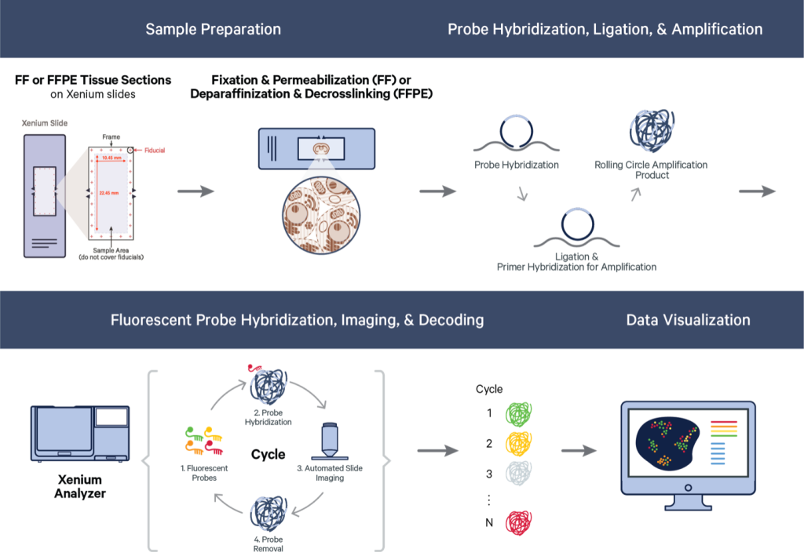

# Xenium

Jiaji George Chen

August 6th 2024

## Introduction to spatial dataset

```{r, echo=FALSE, out.width="80%", fig.align='center'}

```

This is the 10X Xenium FFPE Human Lung Cancer dataset. Xenium captures
individual transcript detections with a spatial resolution of 100s of
nanometers, providing an extremely highly resolved subcellular spatial
dataset. This particular dataset also showcases their recent
multimodal cell segmentation outputs.

The Xenium Human Multi-Tissue and Cancer Panel (377) genes was used. The
exported data is from their Xenium Onboard Analysis v2.0.0 pipeline.

The full data for this example can be found here:
[here](https://www.10xgenomics.com/datasets/preview-data-ffpe-human-lung-cancer-with-xenium-multimodal-cell-segmentation-1-standard)

The relevant items are:

 - Xenium Output Bundle (full)
 - Supplemental: Post-Xenium H&E image (OME-TIFF)
 - Supplemental: H&E Image Alignment File (CSV)

**Additional package requirements**

When working with this data and trying to open the parquet files, you will need _arrow_ built with ZTSD support. See the datasets & packages section for specific install instructions.


## Output directory structure
```
    ├── analysis.tar.gz
    ├── analysis.zarr.zip
    ├── analysis_summary.html
    ├── aux_outputs.tar.gz
    ├── transcripts.csv.gz
    ├── transcripts.parquet
    ├── transcripts.zarr.zip
    ├── cell_boundaries.csv.gz
    ├── cell_boundaries.parquet
    ├── nucleus_boundaries.csv.gz
    ├── nucleus_boundaries.parquet
    ├── cell_feature_matrix.tar.gz
    ├── cell_feature_matrix
    │   ├── barcodes.tsv.gz
    │   ├── features.tsv.gz
    │   └── matrix.mtx.gz
    ├── cell_feature_matrix.h5
    ├── cell_feature_matrix.zarr.zip
    ├── cells.csv.gz
    ├── cells.parquet
    ├── cells.zarr.zip
    ├── experiment.xenium
    ├── gene_panel.json
    ├── metrics_summary.csv
    ├── morphology.ome.tif
    ├── morphology_focus
    │   ├── morphology_focus_0000.ome.tif
    │   ├── morphology_focus_0001.ome.tif
    │   ├── morphology_focus_0002.ome.tif
    │   ├── morphology_focus_0003.ome.tif
    ├── Xenium_V1_humanLung_Cancer_FFPE_gene_panel.json
    ├── Xenium_V1_humanLung_Cancer_FFPE_he_image.ome.tif
    └── Xenium_V1_humanLung_Cancer_FFPE_he_imagealignment.csv
```
The above directory structuring and naming is characteristic of Xenium v2.0 pipeline outputs. The only items that may not be exactly the same across all outputs are the morphology focus directory and the naming of the aligned image items.

For the morphology focus images, you may have fewer images if the experiment did not include the multimodal cell segmentation. As for the aligned images, this is usually done after the Xenium experiment concludes and is added on using Xenium Explorer. Naming and location of the aligned image and associated alignment .csv are entirely up to the user. In this example dataset, they have very detailed names.


```{r, eval=FALSE}
library(Giotto)
# set up paths
data_path <- "[PATH/TO/XENIUM/DATASET/UNZIPPED/DIRECTORY]"
save_dir <- "results/02_session3/"
```

## Convenience function

Giotto has flexible methods for working with the Xenium outputs. The convenience function will generate a `giotto` object in a single step when provided the output directory.

The default behavior is to load:

- transcripts information
- cell and nucleus boundaries
- feature metadata (gene_panel.json)

For the full dataset:    
_time: 1-2min_    
_memory: 24GB on HPC_     
```{r}
?createGiottoXeniumObject
g <- createGiottoXeniumObject(xenium_dir = data_path)
```

There are a lot of other params for additional or alternative items you can load

### Specific filepaths

```
    expression_path = ,
    cell_metadata_path = ,
    transcript_path = ,
    bounds_path = ,
    gene_panel_json_path = , 
```

There is no need to supply these filepaths params to the convenience function when the naming within the Xenium output is in the expected format. However, if needed, a specific filepath can be supplied to the convenience function using these params. 

You can also select a different file format to be used by passing in a different filepath. Giotto prefers the .parquet tabular and .h5 matrix formats over other formats when available. .zarr is also currently not supported.


### Quality value
```
    qv_threshold = 20 # default
```
The Quality Value is a Phred-based 0-40 value that 10X provides for every detection in their transcripts output. Higher values mean higher confidence in the decoded transcript identity. By default 10X uses a cutoff of QV = 20 for transcripts to use downstream.

<details>
<summary>QV Calculation<\summary>

1. Raw Q-score based on how likely it is that an observed code is to be the codeword that it gets mapped to vs less likely codeword.
2. Adjustment of raw Q-score by binning the transcripts by Q-value then adjusting the exact Q per bin based on proportion of **Negative Control Codewords** detected within.

[further info](https://www.10xgenomics.com/support/software/xenium-onboard-analysis/latest/algorithms-overview/xoa-algorithms#qvs)

<\details>

### Transcript type splitting
```
    feat_type =  c(
        "rna",
        "NegControlProbe",
        "UnassignedCodeword",
        "NegControlCodeword"
    ),
    split_keyword = list(
        c("NegControlProbe"),
        c("UnassignedCodeword"),
        c("NegControlCodeword)"
    )
```
There are 4 types of transcript detections that 10X reports with their v2.0 pipeline:

- **Gene expression** - This is the rna gene detections
- **Negative Control Codeword** - (QC) Codewords that do not map to genes, but are in the codebook. Used to determine specificity of decoding algorithm.
- **Negative Control Probe** - (QC) Probes in panel but target non-biological sequences. Used to determine specificity of assay.
- **Unassigned Codeword** - (QC) Codewords that should not be used in the current panel

With V3 on their Xenium prime outputs, there is additionally:

- **Genomic Control Codeword** (QC) Probes for intergenic genomic DNA instead of transcripts

<hr>

How to deal with these different types of detections is easily adjustable. With the `feat_type` param you declare which categories/`feat_types` you want to split transcript detections into. Then with `split_keyword`, you provide a list of character vectors containing `grep()` terms to search for.

Note that there are 4 `feat_types` declared in this set of defaults, but 3 items passed to `split_keyword`. Any transcripts not matched by items in `split_keyword`, get categorized as the first provided `feat_type` ("rna").

### (optional) Loading pre-aggregated data

```
    load_expression = TRUE, # default is FALSE
    load_cellmeta = TRUE    # default is FALSE
```

Giotto can spatially aggregate the transcripts information based on a provided set of boundaries information, however 10X also provides a pre-aggregated set of cell by feature information and metadata. These values may be slightly different from those calculated by Giotto's pipeline, and are not loaded by default.

Some care needs to be taken when loading this information:

- The `feat_type` of the loaded expression information should be matched to the used `feat_type` params passed to the convenience function.
- The `qv_threshold` used should be 20 since the 10X outputs are based on that cutoff.


### Image conversion (may change)

Xenium generates ome.tif images which Giotto is currently not fully compatible with. So we convert them to normal tif images. By default, `ometif_to_tif()` will convert
```{r, eval=FALSE}
image_paths <- list.files(
  data_path, pattern = "morphology_focus|he_image.ome", recursive = TRUE
)
```


### Image loading

```
    load_images = list(
        img1 = "[img_path1.tif]",
        img2 = "[img_path2.tif]",
        img3 = "..."
    ),
    load_aligned_images = list(
        aligned_img = c(
            "[path to image.tif]",
            "imagealignment.csv"
        )
    ),

)
```


### Specific imports with `importXenium()`
```{r}
x <- importXenium(data_path)
force(x)
```
```
Giotto <XeniumReader>
dir       : /projectnb2/rd-[...]enium/v2.0_pipeline/FFPE_LungCancer/ 
qv_cutoff : 20 
filetype  : transcripts -- parquet
            boundaries  -- parquet
            expression  -- h5
            cell_meta   -- parquet
funs      : load_transcripts()
            load_polys()
            load_cellmeta()
            load_featmeta()
            load_expression()
            load_image()
            load_aligned_image()
            create_gobject()
```


```{r}

```


```{r}

```

## Introduce mini object


```{r, eval=FALSE}

```

## Read in raw data

        # 3D stack - DAPI
        
                # 2D fusion images
        # - DAPI
        # - stainings for multimodal segmentation

        # Maximum intensity projection (MIP) of the morphology image.
        # (Xenium Outputs v1.0 - 1.9. only)
- image mip 


- Transcript coordinates
- Polygon coordinates
- Visualizations

- affine mapping?

## Overlap txs & polygons

- Typical aggregated workflow
- Feature/molecule specific analysis
- Visualizations


## Transcript enrichment GSEA


text

## Spatial location analysis

- Spatial cell type co-localization analysis
- Spatial niche analysis
- Spatial niche trajectory analysis

## Visualizations


