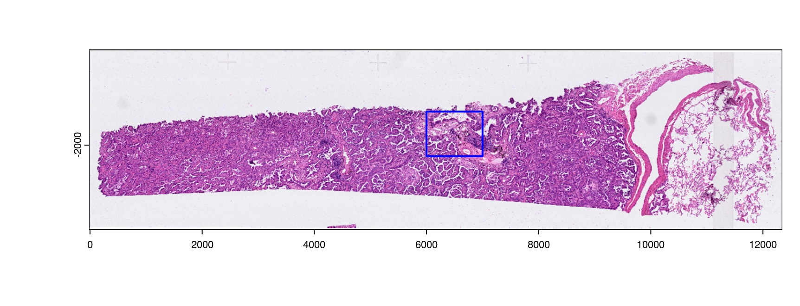
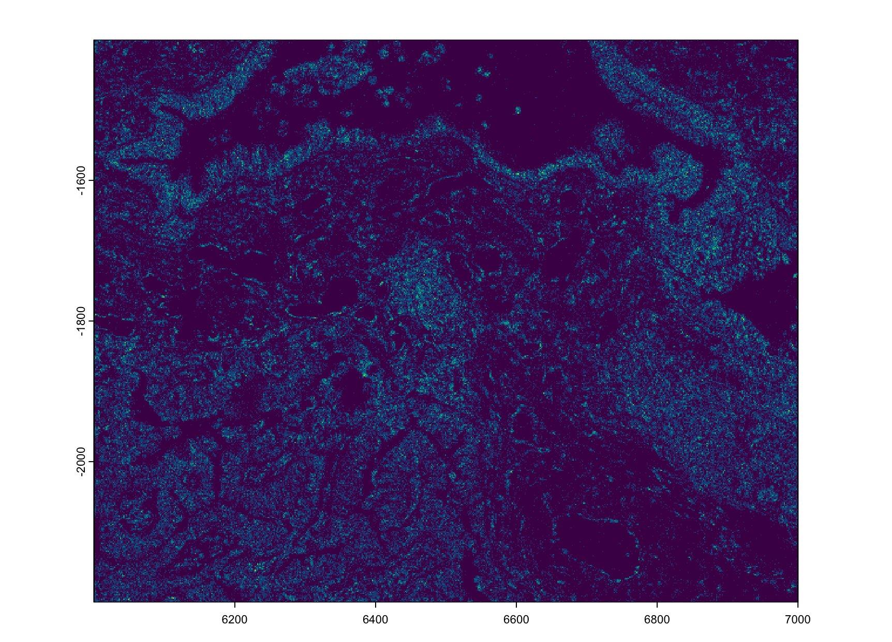
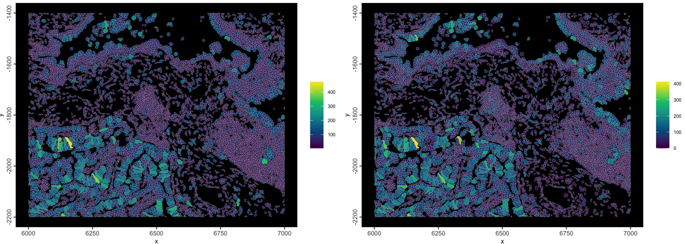

# Xenium

Jiaji George Chen

August 6th 2024

## Introduction to spatial dataset

```{r, echo=FALSE, out.width="80%", fig.align='center'}

```

This is the 10X Xenium FFPE Human Lung Cancer dataset. Xenium captures
individual transcript detections with a spatial resolution of 100s of
nanometers, providing an extremely highly resolved subcellular spatial
dataset. This particular dataset also showcases their recent
multimodal cell segmentation outputs.

The Xenium Human Multi-Tissue and Cancer Panel (377) genes was used. The
exported data is from their Xenium Onboard Analysis v2.0.0 pipeline.

The full data for this example can be found here:
[here](https://www.10xgenomics.com/datasets/preview-data-ffpe-human-lung-cancer-with-xenium-multimodal-cell-segmentation-1-standard)

The relevant items are:

 - Xenium Output Bundle (full)
 - Supplemental: Post-Xenium H&E image (OME-TIFF)
 - Supplemental: H&E Image Alignment File (CSV)

**Additional package requirements**

When working with this data and trying to open the parquet files, you will need _arrow_ built with ZTSD support. See the datasets & packages section for specific install instructions.


## Output directory structure
```{,fig.cap="10X Xenium FFPE Human Lung Cancer Output Bundle Structure"}
    ├── analysis.tar.gz
    ├── analysis.zarr.zip
    ├── analysis_summary.html
    ├── aux_outputs.tar.gz
    ├── transcripts.csv.gz
    ├── transcripts.parquet
    ├── transcripts.zarr.zip
    ├── cell_boundaries.csv.gz
    ├── cell_boundaries.parquet
    ├── nucleus_boundaries.csv.gz
    ├── nucleus_boundaries.parquet
    ├── cell_feature_matrix.tar.gz
    ├── cell_feature_matrix
    │   ├── barcodes.tsv.gz
    │   ├── features.tsv.gz
    │   └── matrix.mtx.gz
    ├── cell_feature_matrix.h5
    ├── cell_feature_matrix.zarr.zip
    ├── cells.csv.gz
    ├── cells.parquet
    ├── cells.zarr.zip
    ├── experiment.xenium
    ├── gene_panel.json
    ├── metrics_summary.csv
    ├── morphology.ome.tif
    ├── morphology_focus
    │   ├── morphology_focus_0000.ome.tif
    │   ├── morphology_focus_0001.ome.tif
    │   ├── morphology_focus_0002.ome.tif
    │   ├── morphology_focus_0003.ome.tif
    ├── Xenium_V1_humanLung_Cancer_FFPE_he_image.ome.tif
    └── Xenium_V1_humanLung_Cancer_FFPE_he_imagealignment.csv
```
The above directory structuring and naming is characteristic of Xenium v2.0 pipeline outputs. The only items that may not be exactly the same across all outputs are the morphology focus directory and the naming of the aligned image items.

For the morphology focus images, you may have fewer images if the experiment did not include the multimodal cell segmentation. As for the aligned images, this is usually done after the Xenium experiment concludes and is added on using Xenium Explorer. Naming and location of the aligned image (`he_image.ome.tif`) and associated alignment info `he_imagealignment.csv` are entirely up to the user.


## Mini Xenium Dataset

```{r, eval=FALSE}
library(Giotto)
# set up paths
data_path <- "data/02_session3/"
save_dir <- "results/02_session3/"
dir.create(save_dir, recursive = TRUE)

# download the mini dataset and untar
options("timeout" = Inf)
download.file(
    url = "https://zenodo.org/records/13207308/files/workshop_xenium.zip?download=1",
    destfile = file.path(save_dir, "workshop_xenium.zip")
)
untar(tarfile = file.path(save_dir, "workshop_xenium.zip"), 
      exdir = data_path)
```

In order to speed up the steps of the workshop and make it locally runnable, we provide a subset of the full dataset.
```
- Full: -16.039, 12342.984, -3511.515, -294.455 (xmin, xmax, ymin, ymax)
- Mini: 6000,    7000,      -2200,     -1400    (xmin, xmax, ymin, ymax)
```

```{r, echo=FALSE, fig.cap="Shown is the H&E aligned to the Xenium dataset with micron scaling. The blue bounds mark out the area provided as a mini dataset"}

```


## Data prep

### Image conversion (may change)

First is actually dealing with the image formats. Xenium generates `ome.tif` images which Giotto is currently not fully compatible with. So we convert them to normal `tif` images using `ometif_to_tif()` which works through the python _tifffile_ package.

The image files can then be loaded in downstream steps.

_These commented out steps are not needed for today since the mini dataset provides .tif images that have already been spatially aligned and converted. However, the code needed to do this is provided below._
```{r, eval=FALSE}
# image_paths <- list.files(
#   data_path, pattern = "morphology_focus|he_image.ome", 
#   recursive = TRUE, full.names = TRUE
# )
```
`ometif_to_tif()` `output_dir` can be specified, but by default, it writes to a new subdirectory called `tif_exports` underneath the source image's directory.
_Keep in mind that where the exported tifs get exported to should be where downstream image reading functions should point to. The code run today is with the filepaths that the mini dataset has._
```{r, eval=FALSE}
# lapply(image_paths, function(img) {
#     GiottoClass::ometif_to_tif(img, overwrite = TRUE)
# })
```

We are also working on a method of directly accessing the `ome.tifs` for better compatibility in the future.


## Convenience function

Giotto has flexible methods for working with the Xenium outputs. The `createGiottoXeniumObject()` will generate a `giotto` object in a single step when provided the output directory.

The default behavior is to load:

- transcripts information
- cell and nucleus boundaries
- feature metadata (gene_panel.json)

For the full dataset (HPC): _time: /1-2min | memory: 24GBC_   

```{r, eval=FALSE}
?createGiottoXeniumObject
g <- createGiottoXeniumObject(xenium_dir = data_path)
# set instructions
instructions(g, "save_dir") <- save_dir
instructions(g, "save_plot") <- TRUE
```

There are a lot of other params for additional or alternative items you can load. The next subsections will explain a couple of them.

### Specific filepaths

```
    expression_path = ,
    cell_metadata_path = ,
    transcript_path = ,
    bounds_path = ,
    gene_panel_json_path = , 
```

The convenience function auto-detects filepaths based on the Xenium directory path and the preferred file formats

- `.parquet` for tabular (vs `.csv`)
- `.h5` for matrix over other formats when available (vs `.mtx`)
- `.zarr` is currently not supported.

When you need to use a different file format or something is not in the expected output structure, you can supply a specific filepath to the convenience function using these params.


### Quality value
```
    qv_threshold = 20 # default
```
The _Quality Value_ is a Phred-based 0-40 value that 10X provides for every detection in their transcripts output. Higher values mean higher confidence in the decoded transcript identity. By default 10X uses a cutoff of QV = 20 for transcripts to use downstream.

_*setting a value other than 20 will make the loaded dataset different from the 10X-provided expression matrix and cell metadata._

<details>
<summary>QV Calculation</summary>

1. Raw Q-score based on how likely it is that an observed code is to be the codeword that it gets mapped to vs less likely codeword.
2. Adjustment of raw Q-score by binning the transcripts by Q-value then adjusting the exact Q per bin based on proportion of **Negative Control Codewords** detected within.

[further info](https://www.10xgenomics.com/support/software/xenium-onboard-analysis/latest/algorithms-overview/xoa-algorithms#qvs)

</details>

### Transcript type splitting
```
    feat_type =  c(
        "rna",
        "NegControlProbe",
        "UnassignedCodeword",
        "NegControlCodeword"
    ),
    split_keyword = list(
        c("NegControlProbe"),
        c("UnassignedCodeword"),
        c("NegControlCodeword)"
    )
```
There are 4 types of transcript detections that 10X reports with their v2.0 pipeline:

- **Gene expression** - This is the rna gene detections
- **Negative Control Codeword** - (QC) Codewords that do not map to genes, but are in the codebook. Used to determine specificity of decoding algorithm.
- **Negative Control Probe** - (QC) Probes in panel but target non-biological sequences. Used to determine specificity of assay.
- **Unassigned Codeword** - (QC) Codewords that should not be used in the current panel

With V3 on their Xenium prime outputs, there is additionally:

- **Genomic Control Codeword** (QC) Probes for intergenic genomic DNA instead of transcripts

<hr>

The main thing to watch out for is that the other probe types should be separated out from the the **Gene expression** or **rna** feature type.

How to deal with these different types of detections is easily adjustable. With the `feat_type` param you declare which categories/`feat_types` you want to split transcript detections into. Then with `split_keyword`, you provide a list of character vectors containing `grep()` terms to search for.

Note that there are 4 `feat_types` declared in this set of defaults, but 3 items passed to `split_keyword`. Any transcripts not matched by items in `split_keyword`, get categorized as the first provided `feat_type` ("rna").


### Centroids calculation
Several Giotto operations require that a set of centroids are calculated for polygon spatial units.
```{r, eval=FALSE}
g <- addSpatialCentroidLocations(g, poly_info = "cell")
g <- addSpatialCentroidLocations(g, poly_info = "nucleus")
```


### Simple visualization

```{r, eval=FALSE}
spatInSituPlotPoints(g,
    polygon_feat_type = "cell",
    feats = list(rna = head(featIDs(g))), 
    use_overlap = FALSE, 
    polygon_color = "cyan", 
    polygon_line_size = 0.1
)
```

```{r, echo=FALSE, fig.align="center", out.width="80%", fig.cap="Simple subcellular plotting to check data"}
knitr::include_graphics("img/02_session3/situ_plot_head.png")
```


## Piecewise loading

Giotto also provides the `importXenium()` import utility that allows independent creation of compatible Giotto subobjects for more flexibility.

```{r, eval=FALSE}
x <- importXenium(data_path)
force(x)
```

```
Giotto <XeniumReader>
dir       : data/02_session3/ 
qv_cutoff : 20 
filetype  : transcripts -- parquet
            boundaries  -- parquet
            expression  -- h5
            cell_meta   -- parquet
funs      : load_transcripts()
            load_polys()
            load_cellmeta()
            load_featmeta()
            load_expression()
            load_image()
            load_aligned_image()
            create_gobject()
```

### load giottoPoints transcripts

```{r, eval=FALSE}
x$qv <- 20 # default
tx <- x$load_transcripts()
plot(tx[[1]]$rna, dens = TRUE)
```

```{r, echo=FALSE, fig.align="center", out.width="80%, fig.cap="plot of Gene expression ('rna') density"}

```

```{r, eval=FALSE}
force(tx[[1]]$rna)
rm(tx) # save space
```

```
An object of class giottoPoints
feat_type : "rna"
Feature Information:
 class       : SpatVector 
 geometry    : points 
 dimensions  : 479097, 10  (geometries, attributes)
 extent      : 6000.001, 7000, -2200, -1400.012  (xmin, xmax, ymin, ymax)
 coord. ref. :  
 names       : feat_ID   transcript_id    cell_id overlaps_nucleus z_location    qv fov_name
 type        :   <chr>           <chr>      <chr>            <int>      <num> <num>    <chr>
 values      :   FBLN1 281487861612869 mcnjadoe-1                0      19.32    40      B11
                PDGFRB 281487861612872 mcnjbidl-1                1      18.75    40      B11
                PDGFRB 281487861612873 mcnjbidl-1                1      18.74    40      B11
 nucleus_distance codeword_index feat_ID_uniq
            <num>          <int>        <int>
                0            334            1
                0            289            2
                0            289            3
```


### (optional) Loading pre-aggregated data

Giotto can spatially aggregate the transcripts information based on a provided set of boundaries information, however 10X also provides a pre-aggregated set of cell by feature information and metadata. These values may be slightly different from those calculated by Giotto's pipeline, and are not loaded by default.

Some care needs to be taken when loading this information:

- The `feat_type` of the loaded expression information should be matched to the used `feat_type` params passed to the convenience function.
- The `qv_threshold` used must be 20 since the 10X outputs are based on that cutoff.


```{r, eval=FALSE}
x$filetype$expression <- "mtx" # change to mtx instead of .h5 which is not in the mini dataset
ex <- x$load_expression()
featType(ex)
```
```
[1] "rna"                       "Negative Control Probe"    "Negative Control Codeword"
[4] "Unassigned Codeword"      
```

The feature types here do not match what we established for the transcripts, so we can just change them.
```{r, eval=FALSE}
force(g)
```
```
An object of class giotto 
>Active spat_unit:  cell 
>Active feat_type:  rna 
[SUBCELLULAR INFO]
polygons      : cell nucleus 
features      : rna NegControlProbe UnassignedCodeword NegControlCodeword 
[AGGREGATE INFO]
spatial locations ----------------
  [cell] raw
  [nucleus] raw
```

```{r, eval=FALSE}
featType(ex[[2]]) <- c("NegControlProbe")
featType(ex[[3]]) <- c("NegControlCodeword")
featType(ex[[4]]) <- c("UnassignedCodeword")
```

Then we can just append them to the Giotto object.    
Here we set up a second object since we will be using Giotto's own aggregation method downstream.
```{r, eval=FALSE}
g2 <- g
# append the expression info
g2 <- setGiotto(g2, ex)

# load cell metadata
cx <- x$load_cellmeta()
g2 <- setGiotto(g2, cx)
force(g2)
```

```
An object of class giotto 
>Active spat_unit:  cell 
>Active feat_type:  rna 
[SUBCELLULAR INFO]
polygons      : cell nucleus 
features      : rna NegControlProbe UnassignedCodeword NegControlCodeword 
[AGGREGATE INFO]
expression -----------------------
  [cell][rna] raw
  [cell][NegControlProbe] raw
  [cell][NegControlCodeword] raw
  [cell][UnassignedCodeword] raw
spatial locations ----------------
  [cell] raw
  [nucleus] raw
```

```{r, eval=FALSE}
spatInSituPlotPoints(g2,
        # polygon shading params
    polygon_fill = "cell_area",
    polygon_fill_as_factor = FALSE,
    polygon_fill_gradient_style = "sequential",
    # polygon line params
    polygon_color = "grey",
    polygon_line_size = 0.1
)

spatInSituPlotPoints(g2,
    # polygon shading params
    polygon_fill = "transcript_counts",
    polygon_fill_as_factor = FALSE,
    polygon_fill_gradient_style = "sequential",
    # polygon line params
    polygon_color = "grey",
    polygon_line_size = 0.1
)
```


```{r, echo=FALSE, fig.cap="Example plot using 10X metadata. Left is 'cell_area', right is 'transcript_counts'"}

```

```{r, eval=FALSE}
rm(g2) # save space
```

## Xenium Images

Xenium outputs have several image outputs. For this dataset:

- `morphology.ome.tif` is a z-stacked image of the DAPI staining, with z levels separated as pages within the `ome.tif`. In this dataset, only pages 6 and 7 are really in focus.
- `morphology_focus` is a folder containing several single-channel images, but with the original z information collapsed into a single in-focus layer. These are the recommended immunofluorescence staining images to import.
- `Xenium_V1_humanLung_Cancer_FFPE_he_image.ome.tif`


        # 3D stack - DAPI
        
                # 2D fusion images
        # - DAPI
        # - stainings for multimodal segmentation

        # Maximum intensity projection (MIP) of the morphology image.
        # (Xenium Outputs v1.0 - 1.9. only)
- image mip 

### Image metadata

```{r, eval=FALSE}
img_xml_path <- file.path(data_path, "morphology_focus", "morphology_focus_0000.xml")
omemeta <- xml2::read_xml(imeta_savepath)
res <- xml2::xml_find_all(omemeta, "//d1:Channel", ns = xml2::xml_ns(omemeta))
res <- Reduce(rbind, xml2::xml_attrs(res))
rownames(res) <- NULL
res <- as.data.frame(res)
force(res)
```

```
         ID                   Name SamplesPerPixel
1 Channel:0                   DAPI               1
2 Channel:1                    18S               1
3 Channel:2 ATP1A1/CD45/E-Cadherin               1
4 Channel:3      alphaSMA/Vimentin               1
```

### Image loading

```
    load_images = list(
        img1 = "[img_path1.tif]",
        img2 = "[img_path2.tif]",
        img3 = "..."
    ),
    load_aligned_images = list(
        aligned_img = c(
            "[path to image.tif]",
            "imagealignment.csv"
        )
    ),

)
```


morphology_focus images only require a scaling by the pixel to micron scaling factor. This can be found from the `experiment.xenium` to be 0.2125 for this dataset and is auto-detected by the convenience functions.

aligned images are usually additional images added on with manual affine registration. 

```{r, echo=FALSE, fig.align="center", out.width="80%, fig.cap="Spatial extent/bounds of transcripts (red), immunofluorescence morphology focus images (blue), H&E aligned image (gold). Lower right shows the affine matrix for aligning the H&E"}
knitr::include_graphics("img/02_session3/img_orig_ext.png")
```


## Read in raw data


- Transcript coordinates
- Polygon coordinates
- Visualizations


```{r, eval=FALSE}

```


```{r, eval=FALSE}

```


```{r, eval=FALSE}

```


## Spatial aggregation


## Aggregate analyses workflow

## Niche clustering


## Pseudovisium


- Feature/molecule specific analysis


## Transcript enrichment GSEA


## Spatial location analysis


