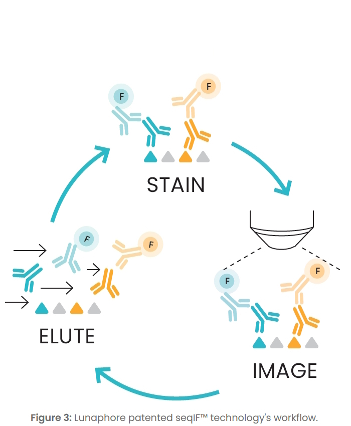
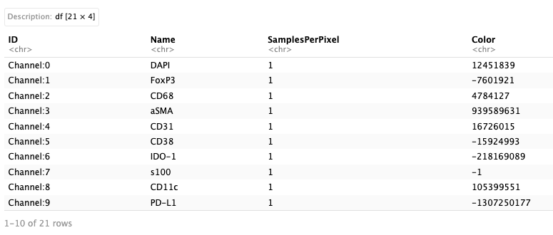
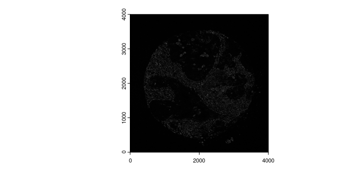
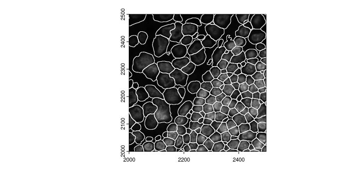
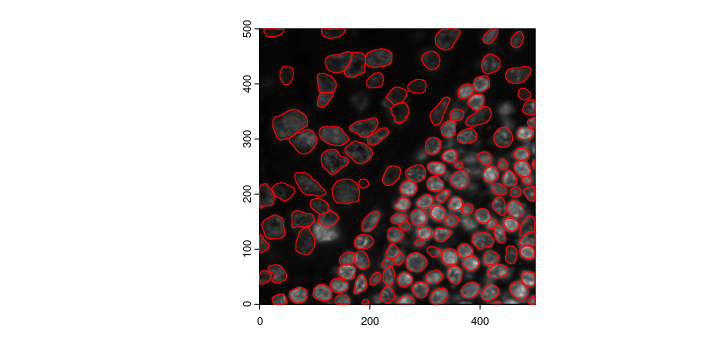

# Spatial proteomics: Multiplexed Immunofluorescence

Junxiang Xu

August 6th 2024

Before you start, this tutorial contains an optional part to run image segmentation using Giotto wrapper of Cellpose. If considering to use that function, please restart R session as we will need to activate a new Giotto python environment. The environment is also compatible with other Giotto functions. We will also need to install the Cellpose supported Giotto environment if haven't done so.
```{r eval=FALSE}
#Install the Giotto Environment with Cellpose, note that we only need to do it once
reticulate::conda_create(envname = "giotto_cellpose",
                         python_version = 3.8)
#.re.restartR()
reticulate::use_condaenv('giotto_cellpose')
reticulate::py_install(
  pip = TRUE,
  envname = 'giotto_cellpose',
  packages = c(
    "pandas",
    "networkx",
    "python-igraph",
    "leidenalg",
    "scikit-learn",
    "cellpose",
    "smfishhmrf",
    'tifffile',
    'scikit-image'
  )
)
#.rs.restartR()
```

Now, activate the Giotto python environment.
```{r eval = F}
#.rs.restartR()
# Activate the Giotto python environment of your choice
GiottoClass::set_giotto_python_path('giotto_cellpose')
# Check if cellpose was successfully installed
GiottoUtils::package_check('cellpose',repository = 'pip')
```


## Spatial Proteomics Technologies
This tutorial is aimed at analyzing spatially resolved multiplexed immunofluorescence data. It is compatible for different kinds of image based spatial proteomics data, such as Akoya(CODEX), CyCIF, IMC, MIBI, and Lunaphore(seqIF). Note that this tutorial will focus on starting directly with the intensity data(image), not the decoded count matrix.
```{r, echo=FALSE, out.width="80%", fig.align='center'}

```
This is the example Lunaphore dataset from Lunaphore the official [website](https://lunaphore.com/download-center-tma-downstream-analysis/) and we are using the cropped one small area as an example. This is an overview of a subset of how the data would look like.
```{r, echo=FALSE, out.width="80%", fig.align='center'}
knitr::include_graphics("img/02_session4/Lunaphore_sample.png")
```


## Raw data type coming out of different technologies

### Use ome.tiff as an example output data to begin with
OME-TIFF (Open Microscopy Environment Tagged Image File Format) is a file format designed for including detailed metadata and support for multi-dimensional image data. This is a common output file format for spatial proteomics platform such as lunaphore.
```{r eval = F}
library(Giotto)
instrs = createGiottoInstructions(save_dir = file.path(getwd(),'/img/02_session4/'),
                                  save_plot = TRUE,
                                  show_plot = TRUE,
                                  python_path = 'giotto_cellpose')
options(timeout = 9999999)
download_dir =file.path(getwd(),'/data/02_session4/')
destfile = file.path(download_dir,'Lunaphore.zip')
if (!dir.exists(download_dir)) { dir.create(download_dir, recursive = TRUE) }
download.file('https://zenodo.org/records/13175721/files/Lunaphore.zip?download=1', destfile = destfile)
unzip(paste0(download_dir,'/Lunaphore.zip'), exdir = download_dir)
list.files(paste0(download_dir,'/Lunaphore'))
```
We provide a way to extract meta data information directly from ome.tiffs. Please note that different platforms may store the meta data such as channel information in a different format, we will probably need to change the node names of the ome-XML.
```{r eval=FALSE}
img_path <- paste0(download_dir,"/Lunaphore/Lunaphore_example.ome.tiff")
img_meta <- ometif_metadata(img_path, node = "Channel", output = "data.frame")
img_meta
```

However, sometimes a simple ometiff file manipulation like cropping could result in a loss of ome-XML information from the ome.tiff file. That way, we can use a different strategy to parse the xml information seperately and get channel information from it.  
```{r eval=FALSE}
##Get channel information
Luna = paste0(download_dir,"/Lunaphore/Lunaphore_example.ome.tiff")
xmldata = xml2::read_xml(paste0(download_dir,"/Lunaphore/Lunaphore_sample_metadata.xml"))
node <- xml2::xml_find_all(xmldata, "//d1:Channel", ns = xml2::xml_ns(xmldata))
channel_df <- as.data.frame(Reduce("rbind", xml2::xml_attrs(node)))
channel_df
```

```{r, echo=FALSE, out.width="80%", fig.align='center'}

```

### Use single channel images as an example output data to begin with

Some platforms may also deconvolute and output gray scale single channel images. And we can create single channel images from ome.tiffs, the single channel images will be of the same format if the platform provide single channel gray scale images. With the single channel images, we can create a GiottoLargeImage and see what it looks like.
```{r eval=FALSE}
#Create multichannel raster and extract each single channels
Luna_terra = terra::rast(Luna)
names(Luna_terra) <- channel_df$Name
gimg_DAPI = createGiottoLargeImage(Luna_terra[[1]],negative_y = F,flip_vertical = T)
plot(gimg_DAPI)
```

```{r, echo=FALSE, out.width="80%", fig.align='center'}
knitr::include_graphics("img/02_session4/gimg_DAPI.png")
```


Extract and save the raster image for future use.
```{r eval = F}
single_channel_dir = paste0(download_dir,'/Lunaphore/single_channels/')
if (!dir.exists(single_channel_dir)) { dir.create(single_channel_dir, recursive = TRUE) }
for (i in 1:nrow(channel_df)){
    single_channel <- terra::subset(Luna_terra, i)
    terra::writeRaster(single_channel,
                       filename = paste0(single_channel_dir,names(single_channel),'.tiff'),
                       overwrite=T)
}
```

Create a list of GiottoLargeImages using single channel rasters.
```{r eval = F}
file_names = list.files(single_channel_dir,full.names = TRUE)
image_names = sub("\\.tiff$", "", list.files(single_channel_dir))
gimg_list <- createGiottoLargeImageList(raster_objects = file_names,
                                        names = image_names,
                                        negative_y = F,
                                        flip_vertical = T)
names(gimg_list) <- image_names
plot(gimg_list[['Vimentin']])
```

```{r, echo=FALSE, out.width="80%", fig.align='center'}

```

## Cell Segmentation file to get single cell level protein expression
Cell segmentation is necessary to generate single cell level protein expression. Currently, there are multiple algorithms to generate segmentations from images and output could be different. For that purpose, Giotto provides createGiottoPolygonsFromMask(), createGiottoPolygonsFromDfr(), createGiottoPolygonsFromGeoJSON() to load different type of file to the giottoPolygon Class.

### Using segmentation output file from DeepCell(mesmer) as an example. 
We collapsed several different channels to created a pseudo memberane staining channel("nuc_and_bound.tif" provided here), and use that as an input for the deepcell mesmer segmentation pipeline. We can load the output mask from to GiottoPolygon via a convenience function.
```{r eval = F}
gpoly_mesmer = createGiottoPolygonsFromMask(paste0(download_dir,'/Lunaphore/whole_cell_mask.tif'),shift_horizontal_step = F,shift_vertical_step = F,flip_vertical = T,calc_centroids = T)
plot(gpoly_mesmer)
```

```{r, echo=FALSE, out.width="80%", fig.align='center'}
knitr::include_graphics("img/02_session4/gpoly_mesmer.png")
```

We can also zoom in to check how does the segmentation look.
```{r eval = F}
zoom <- c(2000,2500,2000,2500)
plot(gimg_DAPI,ext = zoom)
plot(gpoly_mesmer,add = TRUE, border = "white",ext = zoom)
```

```{r, echo=FALSE, out.width="80%", fig.align='center'}

```

### Using Giotto wrapper of Cellpose to perform segmentation
Here, we create a mini example by cropping the image to a smaller area. Note that crop()  is probably easier to use to directly crop image, unless cropping the image when the image is inside of a giotto object.
```{r eval = F}
gimg_cropped <- cropGiottoLargeImage(giottoLargeImage = gimg_DAPI, crop_extent = terra::ext(zoom))
writeGiottoLargeImage(gimg_cropped, filename = paste0(download_dir,'/Lunaphore/DAPI_forcellpose.tiff'),overwrite =  T)
#Create a giotto image to evaluate segmentation
gimg_for_cellpose <- createGiottoLargeImage(paste0(download_dir,'/Lunaphore/DAPI_forcellpose.tiff'),negative_y = F)
```

Now we can run the cellpose segmentation. We can provide different parameters for cellpose inference model(flow_threshold,cellprob_threshold,etc), and practically, the batch size represents how many 224X224 images are calculated in parallel, increasing the amount will increase RAM/VRAM reqirement, lowering the amount will increase the run time.For more information please refer to the [cellpose website](https://cellpose.readthedocs.io/en/latest/)
```{r eval = F}
doCellposeSegmentation(image_dir = paste0(download_dir,'/Lunaphore/DAPI_forcellpose.tiff'),
                            mask_output = paste0(download_dir,'/Lunaphore/giotto_cellpose_seg.tiff'),
                            channel_1 = 0,
                            channel_2 = 0,
                            model_name = 'cyto3',
                            batch_size=12)
cpoly = createGiottoPolygonsFromMask(paste0(download_dir,'/Lunaphore/giotto_cellpose_seg.tiff'),
                                     shift_horizontal_step = F,
                                     shift_vertical_step = F,
                                     flip_vertical = T)
plot(gimg_for_cellpose)
plot(cpoly, add = T, border = 'red')
```

```{r, echo=FALSE, out.width="80%", fig.align='center'}

```

## Create a Giotto Object using list of gitto large images and polygons
You will need to have
- list of giotto images
- giottoPolygon created from segmentation
```{r eval = F}
Lunaphore_giotto = createGiottoObjectSubcellular(gpolygons = list('cell' = gpoly_mesmer),
                                      images = gimg_list, 
                                      instructions = instrs)
Lunaphore_giotto
```

### Overlap to matrix
calculateOverlap() and overlapToMatrix() are used to overlap the intensity values with
```{r eval = F}
Lunaphore_giotto = calculateOverlap(Lunaphore_giotto,
                                    spatial_info = 'cell',
                                    image_names = names(gimg_list))

Lunaphore_giotto = overlapToMatrix(x = Lunaphore_giotto,
                                           type ='intensity',
                                           poly_info = "cell", 
                                           feat_info = "protein",
                                           aggr_function = "sum")
showGiottoExpression(Lunaphore_giotto)
```

### Manipulate Expression information
For IF data, DAPI staining is usally only used for stain nuclei, the intensity value of DAPI usually does not have meaningful result to drive difference between cell types. Similar things could happen when a platform uses some reference channel to adjust signal calling, such as TRITC or Cy5, These images will be loaded but need to be removed for expression profile.  
Therefore, we could extract the feature expression matrix, filter the DAPI information and write it back to the Giotto Object
```{r eval = F}
expr_mtx <- getExpression(Lunaphore_giotto, values = 'raw', output = 'matrix')
filtered_expr_mtx <- expr_mtx[rownames(expr_mtx) != 'DAPI',]
Lunaphore_giotto <- setExpression(Lunaphore_giotto,
                                  feat_type = 'protein',
                                  x = createExprObj(filtered_expr_mtx),
                                  name = 'raw')
showGiottoExpression(Lunaphore_giotto)
```

### Rescale polygons
rescalePolygons() will provide a quick way to manipulate the polygon size and potentially affect the expression for each cell. redo the calculateOverlap() and overlapToMatrix() will potentially change the downstream analysis
```{r eval = F}
Lunaphore_giotto = rescalePolygons(gobject = Lunaphore_giotto,
                        poly_info = 'cell',
                        name = 'smallcell',
                        fx = 0.7, fy = 0.7, calculate_centroids = T)
smallpoly = get_polygon_info(Lunaphore_giotto,polygon_name = 'smallcell')
plot(gimg_DAPI,ext = zoom)
plot(gpoly_mesmer,add = TRUE, border = "white",ext = zoom)
plot(smallpoly,add = TRUE, border = "red",ext = zoom)
```

```{r, echo=FALSE, out.width="80%", fig.align='center'}
knitr::include_graphics("img/02_session4/polygon_scale.png")
```

### Perform clustering and differential expression
The Giotto Object can then go through standard analysis pipeline normalization, dimensional reduction and clustering
```{r eval = F}
Lunaphore_giotto <- normalizeGiotto(Lunaphore_giotto,spat_unit = 'cell', feat_type = 'protein')
Lunaphore_giotto = addStatistics(Lunaphore_giotto, spat_unit = 'cell', feat_type = 'protein')

Lunaphore_giotto = runPCA(Lunaphore_giotto, spat_unit = 'cell', feat_type = 'protein',
               scale_unit = F, center = F, ncp = 20,feats_to_use = NULL,
               set_seed = TRUE)
screePlot(Lunaphore_giotto,spat_unit = 'cell', feat_type = 'protein',show_plot = T)
```
```{r, echo=FALSE, out.width="80%", fig.align='center'}
knitr::include_graphics("img/02_session4/0-screePlot.png")
```

Due to the limited number of total features we have, Leiden clustering generally does not work very well compared to Kmeans or hirechical clustering. Here we can use hirechical clustering to do a quick check. 
```{r eval = F}
Lunaphore_giotto = runUMAP(gobject = Lunaphore_giotto, spat_unit = 'cell',feat_type = 'protein',
                dimensions_to_use = 1:5,
                set_seed = TRUE)
Lunaphore_giotto = createNearestNetwork(Lunaphore_giotto, spat_unit = 'cell',feat_type = 'protein', dimensions_to_use = 1:5)
Lunaphore_giotto = doHclust(Lunaphore_giotto, 
                            k = 8,
                            dim_reduction_to_use = 'cells',
                            spat_unit = 'cell',
                            feat_type = 'protein')

spatInSituPlotPoints(gobject = Lunaphore_giotto, 
                     spat_unit = "cell",
                     polygon_feat_type = "cell",
                     show_polygon = T,
                     feat_type = "protein",
                     feats = NULL,
                     polygon_fill = 'hclust',
                     polygon_fill_as_factor = TRUE,
                     polygon_line_size = 0,largeImage_name = c('CD68'),show_image = T,return_plot = T,
                     polygon_color = 'black',
                     background_color = "white")

```
```{r, echo=FALSE, out.width="80%", fig.align='center'}
knitr::include_graphics("img/02_session4/1-spatInSituPlotPoints.png")
```

Then we can check the heatmap of protein expression and determine the first round of cluster annotation
```{r eval = F}
cluster_column = 'hclust'
plotMetaDataHeatmap(Lunaphore_giotto,
                    spat_unit = 'cell',feat_type = 'protein',
                    expression_values = "raw",
                    metadata_cols = c(cluster_column), 
                    selected_feats = names(gimg_list),
                    y_text_size = 8,
                    show_values = 'zscores_rescaled')
```
```{r, echo=FALSE, out.width="80%", fig.align='center'}
knitr::include_graphics("img/02_session4/2-plotMetaDataHeatmap.png")
```

### Give the cluster an annotation based on expression values
```{r eval = F}
annotation = c('B_cell','Macrophage','T_cell','stromal','epithelial','DC','Fibroblast','endothelial')
names(annotation) = 1:8
Lunaphore_giotto <- annotateGiotto(Lunaphore_giotto,
               cluster_column = 'hclust',
               annotation_vector  = annotation,
               name = "cell_types")
```

### spatial network 
This is to create a cellular neighborhood based on nearest neighbor of physical distance
```{r eval = F}
Lunaphore_giotto <- createSpatialNetwork(Lunaphore_giotto)

spatPlot2D(Lunaphore_giotto, 
           show_network = T,
           network_color = 'blue',
           point_size = 1.5, 
           cell_color = 'hclust')
```

```{r, echo=FALSE, out.width="80%", fig.align='center'}
knitr::include_graphics("img/02_session4/3-spatPlot2D.png")
```

### Cell Neighborhood: Cell-Type/Cell-Type Interactions
This is using cellProximityEnrichment() to statistically identify cell type interactions
```{r eval = F}
cell_proximities = cellProximityEnrichment(gobject = Lunaphore_giotto,
                                           cluster_column = 'cell_types',
                                           spatial_network_name = 'Delaunay_network',
                                           adjust_method = 'fdr',
                                           number_of_simulations = 2000)
## barplot
cellProximityBarplot(gobject = Lunaphore_giotto,
                     CPscore = cell_proximities, 
                     min_orig_ints = 5, min_sim_ints = 5)
```

```{r, echo=FALSE, out.width="80%", fig.align='center'}
knitr::include_graphics("img/02_session4/4-cellProximityBarplot.png")
```


```{r eval = F}
## network
cellProximityNetwork(gobject = Lunaphore_giotto, 
                     CPscore = cell_proximities, 
                     remove_self_edges = T,
                     only_show_enrichment_edges = F)
```

```{r, echo=FALSE, out.width="80%", fig.align='center'}
knitr::include_graphics("img/02_session4/5-cellProximityNetwork.png")
```


