# Working with multiple samples

Jeff Sheridan

August 7th 2024

## Objective

Giotto enables the grouping of multiple objects into a single object for combined analysis. Datasets can be spatially distributed across the x, y, or z axes, allowing for the creation of 3D datasets using the z-plane or the analysis of grouped datasets, such as multiple replicates or similar samples. While it's possible to integrate multiple datasets, batch effects from samples can hinder effective integration. In such cases, more sophisticated methods may be needed to successfully integrate and cluster samples as a unified dataset. One example of an advanced integration technique is [Harmony](https://www.nature.com/articles/s41592-019-0619-0), which will be discussed in more detail later in this tutorial. This tutorial will demonstrate the integration of two Visium datasets, examining the results before and after Harmony integration.

## Background

### Dataset
For this tutorial we will be using two prostate visium datasets produced by 10X Genomics, one an [Adenocarcinoma with Invasive Carcinoma](https://www.10xgenomics.com/datasets/human-prostate-cancer-adenocarcinoma-with-invasive-carcinoma-ffpe-1-standard-1-3-0) and the other a [normal prostate](https://www.10xgenomics.com/datasets/normal-human-prostate-ffpe-1-standard-1-3-0) sample.

### Visium technology

```{r, echo=FALSE, out.width="80%", fig.align="center", fig.cap="Overview of Visium. Source: 10X Genomics."}
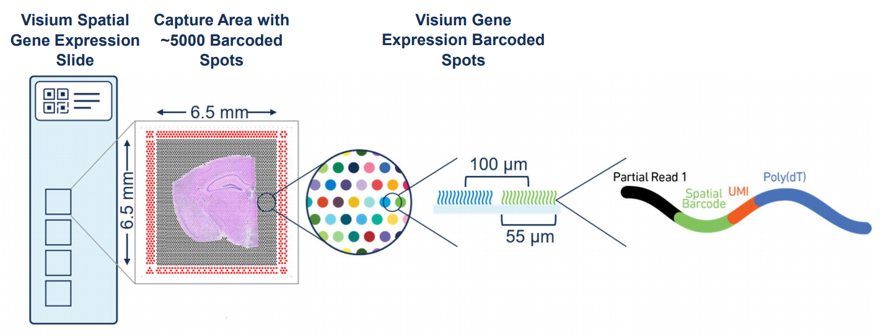
```

Visium by 10x Genomics is a spatial gene expression platform that allows for the mapping of gene expression to high-resolution histology through RNA sequencing The process involves placing a tissue section on a specially prepared slide with an array of barcoded spots, which are 55 µm in diameter with a spot to spot distance of 100 µm. Each spot contains unique barcodes that capture the mRNA from the tissue section, preserving the spatial information. After the tissue is imaged and RNA is captured, the mRNA is sequenced, and the data is mapped back to the tissue's spatial coordinates. This technology is particularly useful in understanding complex tissue environments, such as tumors, by providing insights into how gene expression varies across different regions.


## Create individual giotto objects

### Download the data

You need to download the expression matrix and spatial information by running these commands:

```{r, eval=FALSE}
data_dir <- "data/03_session1"

dir.create(file.path(data_dir, "Visium_FFPE_Human_Prostate_Cancer"), 
           showWarnings = FALSE, recursive = TRUE)

# Spatial data adenocarcinoma prostate
download.file(url = "https://cf.10xgenomics.com/samples/spatial-exp/1.3.0/Visium_FFPE_Human_Prostate_Cancer/Visium_FFPE_Human_Prostate_Cancer_spatial.tar.gz", 
              destfile = file.path(data_dir, "Visium_FFPE_Human_Prostate_Cancer/Visium_FFPE_Human_Prostate_Cancer_spatial.tar.gz"))

# Download matrix adenocarcinoma prostate
download.file(url = "https://cf.10xgenomics.com/samples/spatial-exp/1.3.0/Visium_FFPE_Human_Prostate_Cancer/Visium_FFPE_Human_Prostate_Cancer_raw_feature_bc_matrix.tar.gz", 
              destfile = file.path(data_dir, "Visium_FFPE_Human_Prostate_Cancer/Visium_FFPE_Human_Prostate_Cancer_raw_feature_bc_matrix.tar.gz"))

dir.create(file.path(data_dir, "Visium_FFPE_Human_Normal_Prostate"), 
           showWarnings = FALSE, recursive = TRUE)

# Spatial data normal prostate
download.file(url = "https://cf.10xgenomics.com/samples/spatial-exp/1.3.0/Visium_FFPE_Human_Normal_Prostate/Visium_FFPE_Human_Normal_Prostate_spatial.tar.gz",
              destfile = file.path(data_dir, "Visium_FFPE_Human_Normal_Prostate/Visium_FFPE_Human_Normal_Prostate_spatial.tar.gz"))

# Download matrix normal prostate
download.file(url = "https://cf.10xgenomics.com/samples/spatial-exp/1.3.0/Visium_FFPE_Human_Normal_Prostate/Visium_FFPE_Human_Normal_Prostate_raw_feature_bc_matrix.tar.gz",
              destfile = file.path(data_dir, "Visium_FFPE_Human_Normal_Prostate/Visium_FFPE_Human_Normal_Prostate_raw_feature_bc_matrix.tar.gz"))
```

## Extracting the downloaded files
```{r, eval=FALSE}

# The adenocarcinoma sample
untar(tarfile = file.path(data_dir, "Visium_FFPE_Human_Prostate_Cancer/Visium_FFPE_Human_Prostate_Cancer_spatial.tar.gz"), 
      exdir = file.path(data_dir, "Visium_FFPE_Human_Prostate_Cancer"))

untar(tarfile = file.path(data_dir, "Visium_FFPE_Human_Prostate_Cancer/Visium_FFPE_Human_Prostate_Cancer_raw_feature_bc_matrix.tar.gz"), 
      exdir = file.path(data_dir, "Visium_FFPE_Human_Prostate_Cancer"))

# The normal prostate sample
untar(tarfile = file.path(data_dir, "Visium_FFPE_Human_Normal_Prostate/Visium_FFPE_Human_Normal_Prostate_spatial.tar.gz"), 
      exdir = file.path(data_dir, "Visium_FFPE_Human_Normal_Prostate"))

untar(tarfile = file.path(data_dir, "Visium_FFPE_Human_Normal_Prostate/Visium_FFPE_Human_Normal_Prostate_raw_feature_bc_matrix.tar.gz"), 
      exdir = file.path(data_dir, "Visium_FFPE_Human_Normal_Prostate"))
```

### Create giotto instructions

We must first create instructions for our Giotto object. This will tell the object where to save outputs, whether to show or return plots, and the python path. Specifying the python path is often not required as Giotto will identify the relevant python environment, but might be required in some instances.

```{r, eval=FALSE}
library(Giotto)

save_dir <- "results/03_session1"

instrs <- createGiottoInstructions(save_dir = save_dir,
                                   save_plot = TRUE,
                                   show_plot = TRUE,
                                   python_path = NULL)
```

### Load visium data into Giotto

We next need to read in the data for the Giotto object. To do this we will use the createGiottoVisiumObject() convenience function. This requires us to specify the directory that contains the visium data output from 10X Genomics's Spaceranger. We also specify the expression data to use (raw or filtered) as well as the image to align. Spaceranger outputs two images, a low and high resolution image.

```{r, eval=FALSE}
## Healthy prostate
N_pros <- createGiottoVisiumObject(
  visium_dir = file.path(data_dir, "Visium_FFPE_Human_Normal_Prostate"),
  expr_data = "raw",
  png_name = "tissue_lowres_image.png",
  gene_column_index = 2,
  instructions = instrs
)

## Adenocarcinoma 
C_pros <- createGiottoVisiumObject(
  visium_dir = file.path(data_dir, "Visium_FFPE_Human_Prostate_Cancer"),
  expr_data = "raw",
  png_name = "tissue_lowres_image.png",
  gene_column_index = 2,
  instructions = instrs
)
```

We can see that the gobject contains information for the cells (polygon and spatial units), the RNA express (raw) and the relevant image.

```{r, echo=FALSE, out.width="40%", fig.align="center", fig.cap="Structure of Giotto object containing a single dataset."}
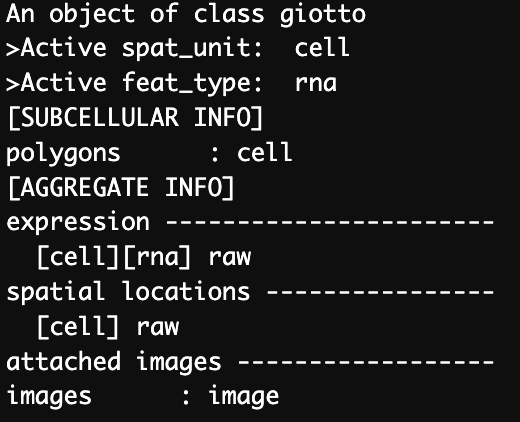
```


### Healthy prostate tissue coverage

Aligning the Visium spots to the tissue using the fiducials that border the capture area enables the identification of spots containing expression data from the tissue. These spots can be visualized using the spatPlot2D function by setting the cell_color parameter to "in_tissue".

```{r,eval=FALSE}
spatPlot2D(gobject = N_pros, 
           cell_color = "in_tissue",
           show_image = TRUE, 
           point_size = 2.5,
           cell_color_code = c("black", "red"),
           point_alpha = 0.5, 
           save_param = list(save_name = "03_ses1_normal_prostate_tissue"))
```

```{r, echo=FALSE, out.width="70%", fig.align="center", fig.cap="Tissue coverage for the normal prostate sample."}
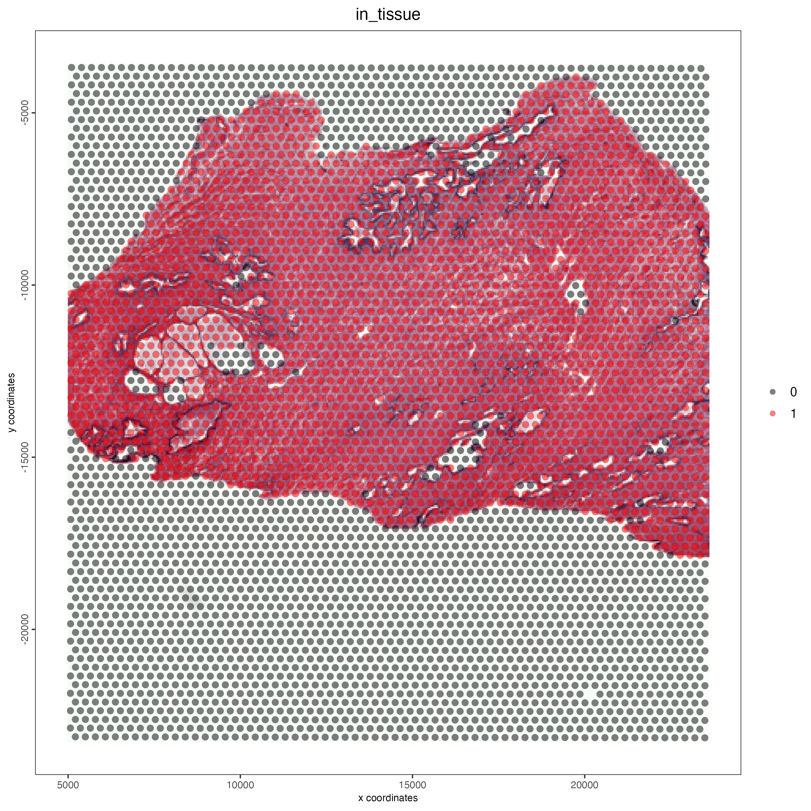
```


### Adenocarcinoma prostate tissue coverage

```{r, eval=FALSE}
spatPlot2D(gobject = C_pros, 
           cell_color = "in_tissue",
           show_image = TRUE, 
           point_size = 2.5,
           cell_color_code = c("black", "red"), 
           point_alpha = 0.5, 
           save_param = list(save_name = "03_ses1_adeno_prostate_tissue"))
```

```{r, echo=FALSE, out.width="70%", fig.align="center", fig.cap="Tissue coverage for the adenocarcinoma prostate sample."}
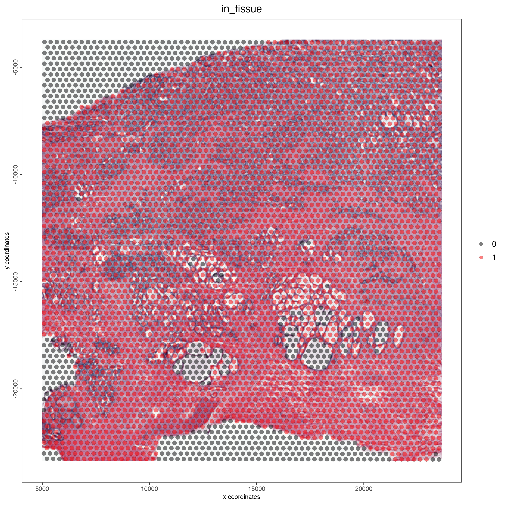
```

### Showing the data strucutre for the inidividual objects

```{r, eval=FALSE}
# Printing the file structure for the individual datasets
print(head(pDataDT(N_pros)))
print(N_pros)
```

## Join Giotto Objects

To join objects together we can use the `joinGittoObjects()` function. For this we need to supply a list of objects as well as the names for each of these objects. We can also specify the x and y padding to separate the objects in space or the Z position for 3D datasets. If the x_shift is set to NULL then the total shift will be guessed from the Giotto image.


```{r, eval=FALSE}
combined_pros <- joinGiottoObjects(gobject_list = list(N_pros, C_pros),
                                   gobject_names = c("NP", "CP"),
                                   join_method = "shift", x_padding = 1000)

# Printing the file structure for the individual datasets
print(head(pDataDT(combined_pros)))
print(combined_pros)
```

From the joined data we can see the same information that was present in the single dataset objects as well as the addition of another image. The images are renamed from "image" to include the object name in the image name e.g. "NP-image". We can also see in the cell metadata that there is a new column "list_ID" that contains the original object names. The cell_ID column also has the original object name appended to the beginning of each cell ID e.g. "NP-AAACAACGAATAGTTC-1".

```{r, echo=FALSE, out.width="100%", fig.align="center", fig.cap="Structure of Giotto object containing two datasets (left) and cell metadata on the left. Note the addition of multiple images and the addition of the list_ID column to define the dataset."}
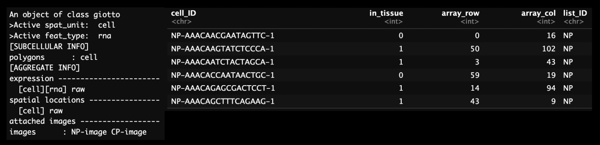
```

## Visualizing combined datasets

The combined dataset can either visualized in the same space or in two separate plots through the group_by variable. To show images both the show_image variable and the image_name variable containing both image names needs to be used.

### Vizualizing in the same plot

Due to the x_padding provided when joining the objects each of the datasets can be visualized in the same plotting area. We can see below the normal prostate sample on the left and the healthy prostate on the right. By including the show_image function and supplying both of the image names ("NP-image", "CP-image"), we can also include the relevant images within the same plot.

```{r, eval=FALSE}
spatPlot2D(gobject = combined_pros, 
           cell_color = "in_tissue", 
           cell_color_code = c("black", "red"),
           show_image = TRUE, 
           image_name = c("NP-image", "CP-image"), 
           point_size = 1, 
           point_alpha = 0.5, 
           save_param = list(save_name = "03_ses1_combined_tissue"))
```

```{r, echo=FALSE, out.width="100%", fig.align="center", fig.cap="Vizualizing the visium spots that overlap tissue in normal prostate (left) and adenocarcinoma samples (right) within the same plot."}
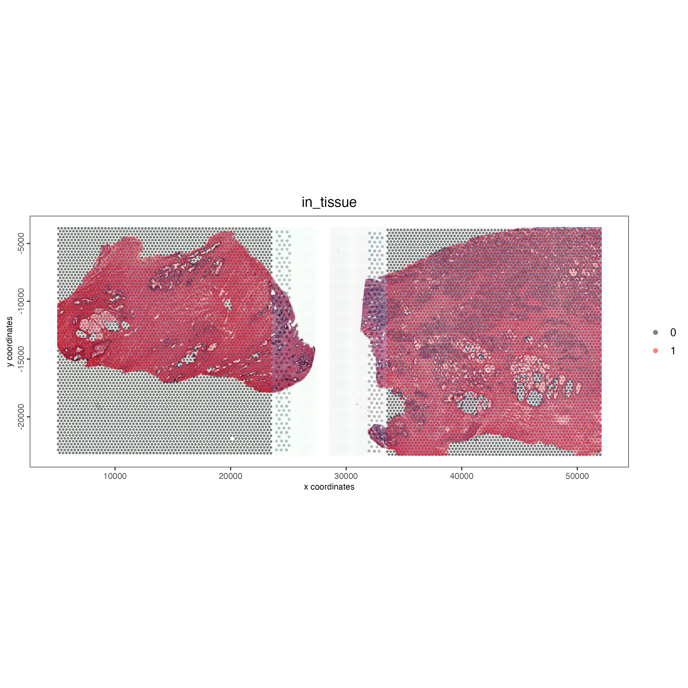
```

### Vizualizing on separate plots

If we want to visualize the datasets in separate plots we can supply the "group_by" variable. Below we group the data by "list_ID", which corresponds to each dataset. We can specify the number of columns through the "cow_n_col" variable.

```{r, eval=FALSE}
spatPlot2D(gobject = combined_pros, 
           cell_color = "in_tissue", 
           cell_color_code = c("black", "pink"),
           show_image = TRUE, 
           image_name = c("NP-image", "CP-image"),
           group_by = "list_ID", 
           point_alpha = 0.5, 
           point_size = 0.5, 
           cow_n_col = 1,
           save_param = list(save_name = "03_ses1_combined_tissue_group"))
```

```{r, echo=FALSE, out.width="100%", fig.align="center", fig.cap="Vizualizing the visium spots that overlap tissue in normal prostate (left) and adenocarcinoma samples (right) in separate plots."}
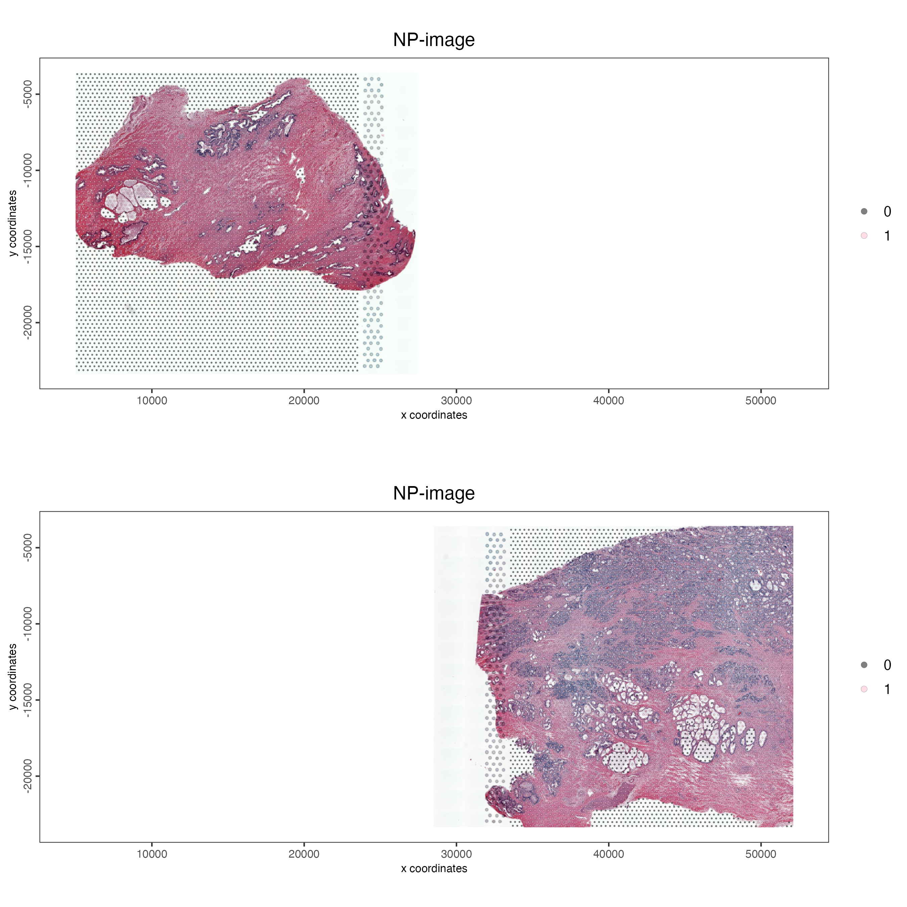
```

## Splitting combined dataset

If needed it's possible to split the individual objects into single objects again through subsetting the cell metadata as shown below.

```{r, eval=FALSE}
# Getting the cell information
combined_cells <- pDataDT(combined_pros)
np_cells <- combined_cells[list_ID == "NP"]

np_split <- subsetGiotto(combined_pros, 
                         cell_ids = np_cells$cell_ID,
                         poly_info = np_cells$cell_ID,
                         spat_unit = "cell")

spatPlot2D(gobject = np_split, 
           cell_color = "in_tissue", 
           cell_color_code = c("black", "red"),
           show_image = TRUE, 
           point_alpha = 0.5, 
           point_size = 0.5, 
           save_param = list(save_name = "03_ses1_split_object"))
```

```{r, echo=FALSE, out.width="100%", fig.align="center", fig.cap="Structure of Giotto object containing two datasets (left) and cell metadata on the left. Note the addition of multiple images and the addition of the list_ID column to define the dataset."}
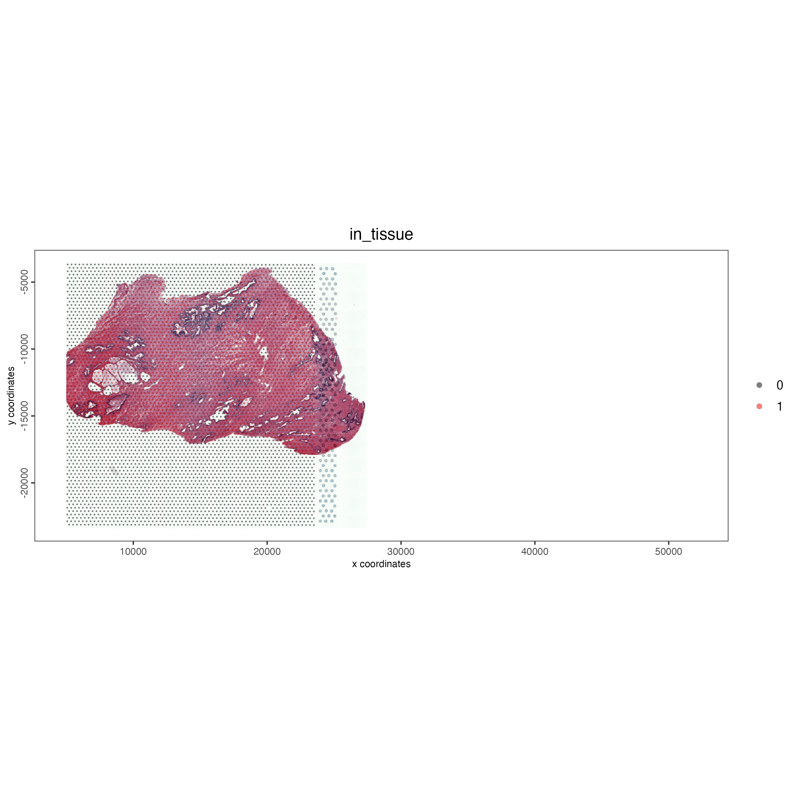
```

## Analyzing joined objects

### Normalization and adding statistics

Now that the objects have been joined we can analyze the object as if it was a single object. This means all of the analyses will be performed in parallel. Therefore, all of the filtering and normalization will be identical between datasets.

```{r, eval=FALSE}
# subset on in-tissue spots
metadata <- pDataDT(combined_pros)
in_tissue_barcodes <- metadata[in_tissue == 1]$cell_ID
combined_pros <- subsetGiotto(combined_pros, 
                              cell_ids = in_tissue_barcodes)

## filter
combined_pros <- filterGiotto(gobject = combined_pros,
                              expression_threshold = 1,
                              feat_det_in_min_cells = 50,
                              min_det_feats_per_cell = 500,
                              expression_values = "raw",
                              verbose = TRUE)

## normalize
combined_pros <- normalizeGiotto(gobject = combined_pros, 
                                 scalefactor = 6000)

## add gene & cell statistics
combined_pros <- addStatistics(gobject = combined_pros, 
                               expression_values = "raw")

## visualize
spatPlot2D(gobject = combined_pros, 
           cell_color = "nr_feats", 
           color_as_factor = FALSE, 
           point_size = 1, 
           show_image = TRUE, 
           image_name = c("NP-image", "CP-image"),
           save_param = list(save_name = "ses3_1_feat_expression"))
```

After performing the addStatistics() function on both the datasets we can see the relative expression for each spot in both samples.

```{r, echo=FALSE, out.width="100%", fig.align="center", fig.cap="Unique feat expression for visium spots for both prostate samples."}
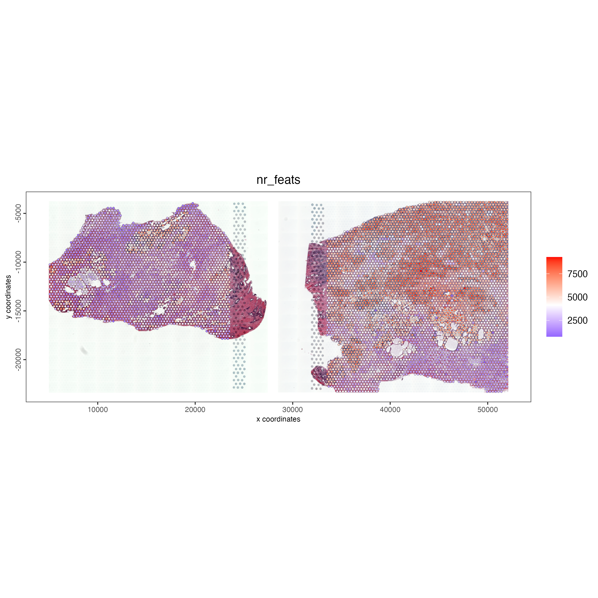
```


### Clustering the datasets

Since we shifted the objects within space the spatial networks for each dataset will remain separate, assuming that the lower limits for neighbors is smaller than the distance of each dataset. However, the individual spot clustering will be performed on all spots from both datasets as if they were a single object, meaning that the same cell types between objects should be clustered together

```{r, eval=FALSE}
## PCA ##
combined_pros <- calculateHVF(gobject = combined_pros)

combined_pros <- runPCA(gobject = combined_pros, 
                        center = TRUE, 
                        scale_unit = TRUE)

## cluster and run UMAP ##
# sNN network (default)
combined_pros <- createNearestNetwork(gobject = combined_pros,
                                      dim_reduction_to_use = "pca", 
                                      dim_reduction_name = "pca",
                                      dimensions_to_use = 1:10, 
                                      k = 15)

# Leiden clustering
combined_pros <- doLeidenCluster(gobject = combined_pros, 
                                 resolution = 0.2,
                                 n_iterations = 200)

# UMAP
combined_pros <- runUMAP(combined_pros)
```

### Vizualizing spatial location of clusters

We can visualize the clusters determined through Leiden clustering on both of the datasets within the same plot.

```{r, eval=FALSE}
spatDimPlot2D(gobject = combined_pros,
              cell_color = "leiden_clus", 
              show_image = TRUE, 
              image_name = c("NP-image", "CP-image"),
              save_param = list(save_name = "ses3_1_leiden_clus"))
```

```{r, echo=FALSE, out.width="100%", fig.align="center", fig.cap="UMAP (top) for both samples colored by Leiden clusters visualized in a spatial plot (bottom) for the normal prostate (left) and the adenocarcinoma prostate sample (right)."}
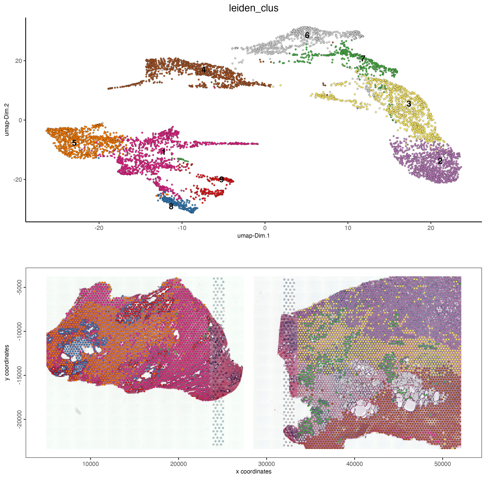
```


### Vizualizing tissue contribution to clusters

We can also color the UMAP to visualize the contribution from each tissue in the UMAP. To do this we color the UMAP by "list_ID" rather than "leiden_clus". If each of the cell types between both samples cluster together then we would expect that clusters should contain the cell color of both samples. However, we can see that the samples are clustered distinctly within the UMAP. This indicates that the cell types shared between both samples are found within different clusters indicating that more complex integration techniques might be required for these samples.

```{r, eval=FALSE}
spatDimPlot2D(gobject = combined_pros,
              cell_color = "list_ID",
              show_image = TRUE, 
              image_name = c("NP-image", "CP-image"),
              save_param = list(save_name = "ses3_1_tissue_contribution"))
```

```{r, echo=FALSE, out.width="100%", fig.align="center", fig.cap="Tissue contribution for leiden clustering for the normal prostate (left) and the adenocarcinoma prostate sample (right)."}
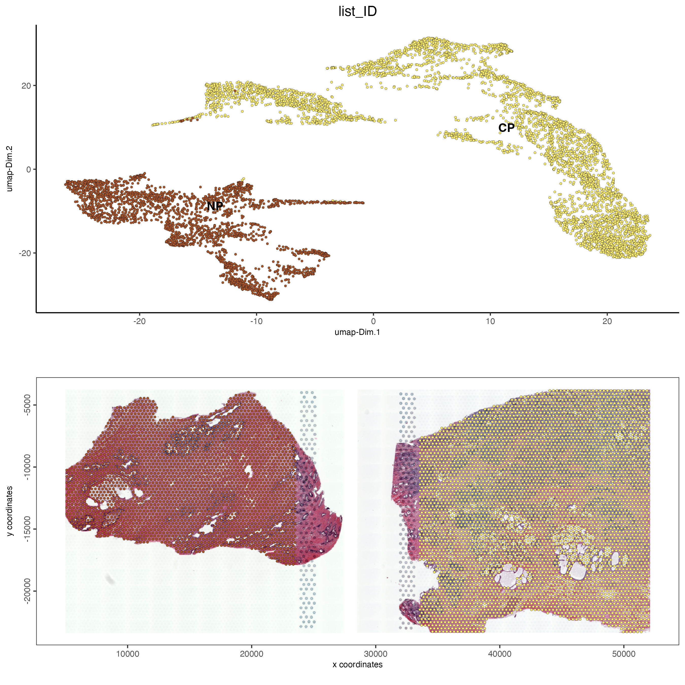
```


## Perform Harmony and default workflows

```{r, echo=FALSE, out.width="100%", fig.align="center", fig.cap="Overview of how Harmony aligns multiple datasets. First cluster cells, then get the centroids and apply a dataset correction factor then move cells based on the soft cluster membership. (Korsunsky et al. 2019)"}
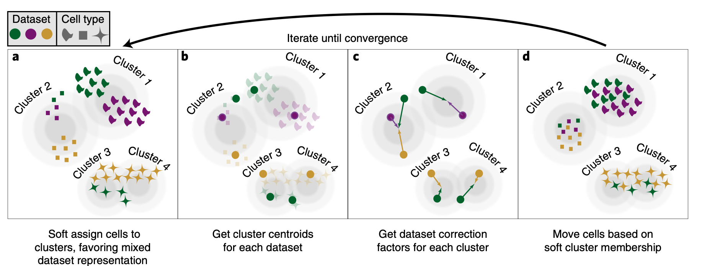
```

We can use Harmony to integrate multiple datasets, grouping equivelent cell types between samples. Harmony is an algorithm that iteratively adjusts cell coordinates in a reduced-dimensional space to correct for dataset-specific effects. It uses fuzzy clustering to assign cells to multiple clusters, calculates dataset-specific correction factors, and applies these corrections to each cell, repeating the process until the influence of the dataset diminishes. 

Before running Harmony we need to run the PCA function or set "do_pca" to TRUE. We ran this above so do not need to perform this step. Harmony will default to attempting 10 rounds of integration. Not all samples will need the full 10 and will finish accordingly. The following dataset should converge after 5 iterations.

```{r, eval=FALSE}
library(harmony)

## run harmony integration
combined_pros <- runGiottoHarmony(combined_pros, 
                                  vars_use = "list_ID",
                                  sigma = 0.1,
                                  theta = 2,
                                  lambda = 1,
                                  nclust = NULL )
```

After running the Harmony function successfully we can see that the outputted gobject has a new dim reduction names "harmony". We can use this for all subsequent spatial steps.

```{r, echo=FALSE, out.width="40%", fig.align="center", fig.cap="Data structure of the gobject after running Harmony integration."}
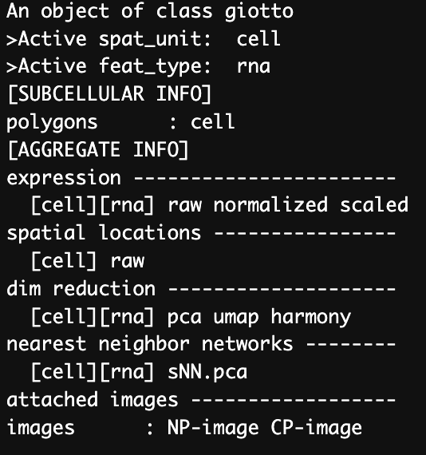
```

### Clustering harmonized object

We can now perform the same clustering steps as before but instead using the "harmony" dim reduction rather than PCA. We will also be creating new UMAP and nearest network data for the gobject that will be named differently to before to preserve the original analyses. If using the same name then this will overwrite the original analysis.

```{r, eval=FALSE}
## sNN network (default)
combined_pros <- createNearestNetwork(gobject = combined_pros,
                                      dim_reduction_to_use = "harmony",
                                      dim_reduction_name = "harmony", 
                                      name = "NN.harmony",
                                      dimensions_to_use = 1:10, 
                                      k = 15)

## Leiden clustering
combined_pros <- doLeidenCluster(gobject = combined_pros,
                                 network_name = "NN.harmony", 
                                 resolution = 0.2, 
                                 n_iterations = 1000, 
                                 name = "leiden_harmony")

# UMAP dimension reduction
combined_pros <- runUMAP(combined_pros, 
                         dim_reduction_name = "harmony", 
                         dim_reduction_to_use = "harmony", 
                         name = "umap_harmony")

spatDimPlot2D(gobject = combined_pros,
              dim_reduction_to_use = "umap", 
              dim_reduction_name = "umap_harmony",
              cell_color = "leiden_harmony", 
              show_image = TRUE, 
              image_name = c("NP-image", "CP-image"),
              spat_point_size = 1, 
              save_param = list(save_name = "leiden_clustering_harmony"))
```

We can see a different UMAP and clustering to that seen in the original steps above. We can again map these onto the tissue spots and see where the clusters are spatially.

```{r, echo=FALSE, out.width="100%", fig.align="center", fig.cap="Leiden clustering after harmony was performed for the normal prostate (left) and the adenocarcinoma prostate sample (right)."}
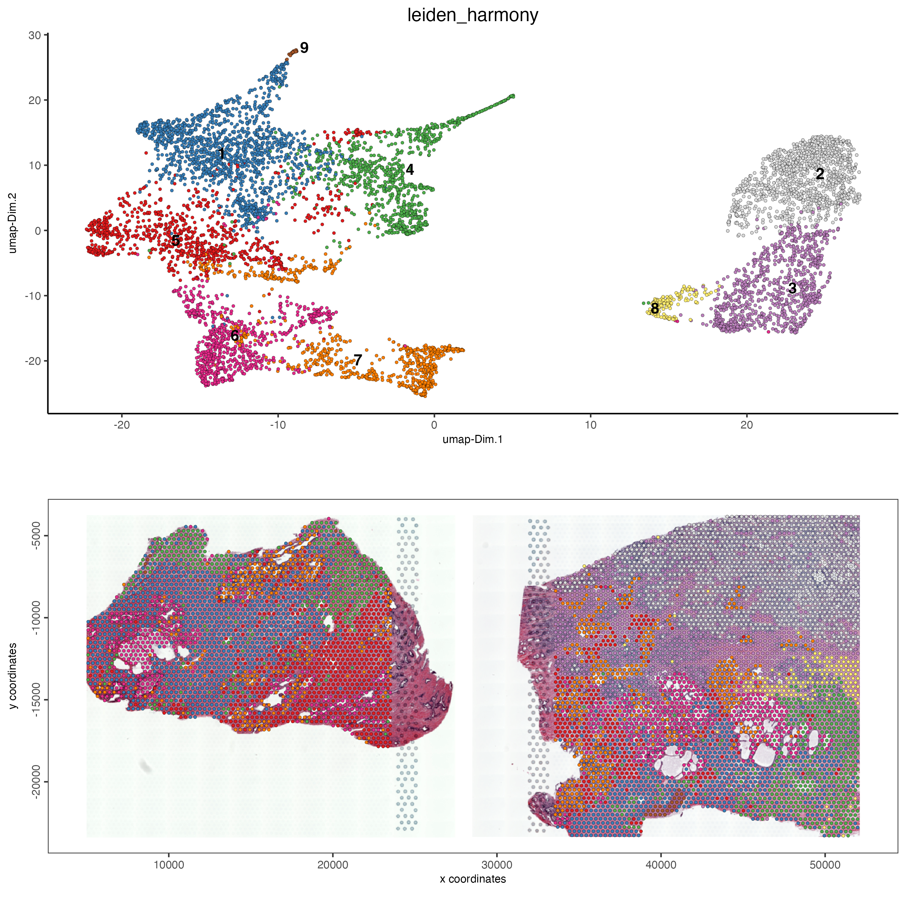
```


### Vizualizing the tissue contribution

We can see that after performing harmony that the clusters from the two tissue samples are now clustered together. There is still a cluster that is unique to the adenocarcinoma sample, however this is expected as this represents the visium spots that cover the tumor regions of the tissue, which are not found in the normal tissue.

```{r, eval=FALSE}
spatDimPlot2D(gobject = combined_pros,
              dim_reduction_to_use = "umap", 
              dim_reduction_name = "umap_harmony",
              cell_color = "list_ID", 
              save_plot = TRUE,
              save_param = list(save_name = "leiden_clustering_harmony_contribution"))
```

```{r, echo=FALSE, out.width="100%", fig.align="center", fig.cap="Tissue contribution for leiden clustering after harmony for the normal prostate (left) and the adenocarcinoma prostate sample (right)."}
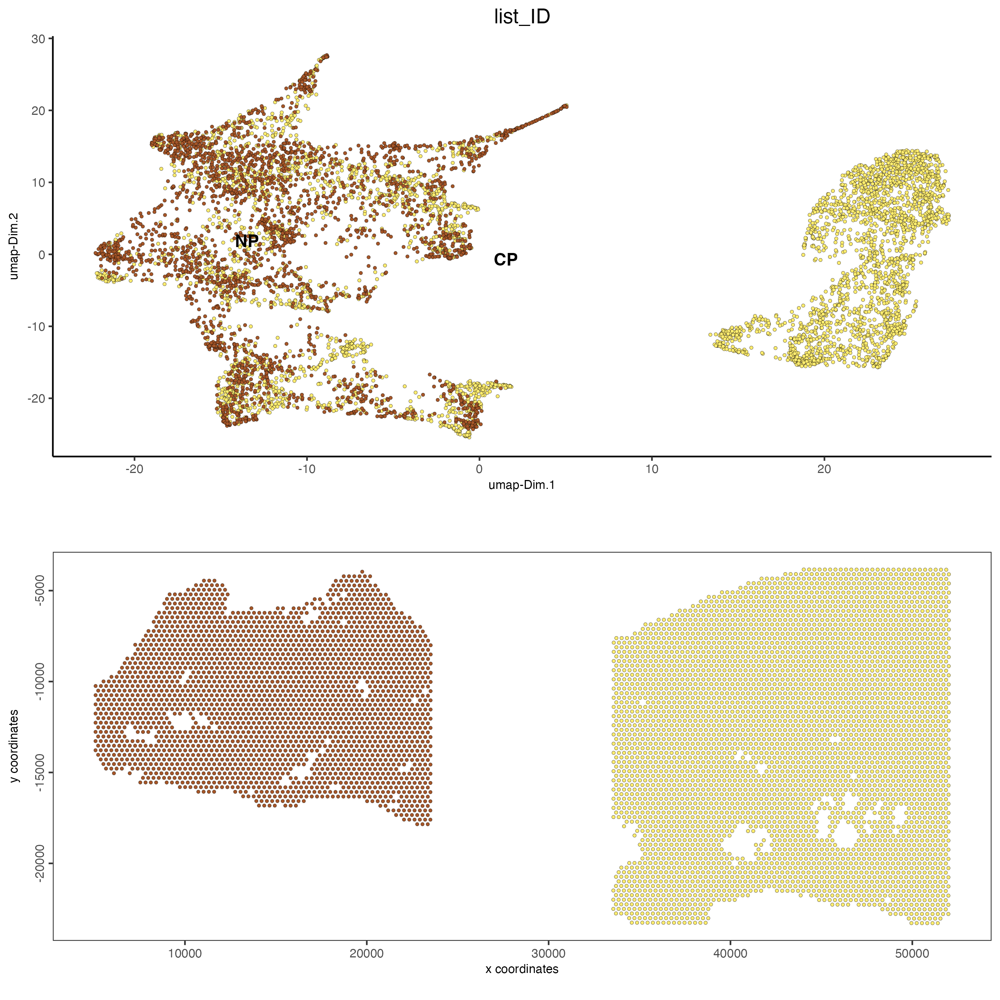
```

