# Spatial multi-modal analysis

George Chen
Junxiang Xu

August 7th 2024

## Overview

Spatial multimodal datasets are created when there is more than one modality available for a single piece of tissue. One way that these datasets can be assembled is by performing multiple spatial assays on closely adjacent tissue sections or ideally the same section. However, for these datasets, in addition to the usual expression space integration, we must also first spatially align them.

## Spatial manipulation

Performing spatial analyses across any two sections of tissue from the same block requires that data to be spatially aligned into a common coordinate space. Minute differences during the sectioning process from the cutting motion to how long an FFPE section was floated can result in even neighboring sections being distorted when compared side-by-side.

These differences make it difficult to assemble multislice and/or cross platform multimodal datasets into a cohesive 3D volume. The solution for this is to perform registration across either the dataset images or expression information. Based on the registration results, both the raster images and vector feature and polygon information can be aligned into a continuous whole.

Ideally this registration will be a free deformation based on sets of control points or a deformation matrix, however affine transforms already provide a good approximation. In either case, *the transform or deformation applied must work in the same way across both raster and vector information.*

Giotto provides spatial classes and methods for easy manipulation of data with 2D affine transformations. These functionalities are all available from *GiottoClass*.

### Spatial transforms:

We support simple transformations and more complex affine transformations which can be used to combine and encode more than one simple transform.

-   `spatShift()` - translations
-   `spin()` - rotations (degrees)
-   `rescale()` - scaling
-   `flip()` - flip vertical or horizontal across arbitrary lines
-   `t()` - transpose
-   `shear()` - shear transform
-   `affine()` - affine matrix transform

### Spatial utilities:

Helpful functions for use alongside these spatial transforms are `ext()` for finding the spatial bounding box of where your data object is, `crop()` for cutting out a spatial region of the data, and `plot()` for *terra*/*base* plots of the data.

-   `ext()` - spatial extent or bounding box
-   `crop()` - cut out a spatial region of the data
-   `plot()` - plot a spatial object

### Spatial classes:

Giotto's spatial subobjects respond to the above functions. The Giotto object itself can also be affine transformed.

-   `spatLocsObj` - xy centroids
-   `spatialNetworkObj` - spatial networks between centroids
-   `giottoPoints` - xy feature point detections
-   `giottoPolygon` - spatial polygons
-   `giottoImage` (mostly deprecated) - *magick*-based images
-   `giottoLargeImage`/`giottoAffineImage` - *terra*-based images
-   `affine2d` - affine matrix container
-   `giotto` - giotto analysis object

```{r, eval=FALSE}
# load in data
library(Giotto)

g <- GiottoData::loadGiottoMini("vizgen")

activeSpatUnit(g) <- "aggregate"

gpoly <- getPolygonInfo(g, return_giottoPolygon = TRUE)

gimg <- getGiottoImage(g)
```

## Examples of the simple transforms with a giottoPolygon

```{r, eval=FALSE, fig.height=10, fig.width=10}
rain <- rainbow(nrow(gpoly))

line_width <- 0.3

# par to setup the grid plotting layout
p <- par(no.readonly = TRUE)
par(mfrow=c(3,3))
gpoly |> 
    plot(main = "no transform", col = rain, lwd = line_width)

gpoly |> spatShift(dx = 1000) |> 
    plot(main = "spatShift(dx = 1000)", col = rain, lwd = line_width)

gpoly |> spin(45) |> 
    plot(main = "spin(45)", col = rain, lwd = line_width)

gpoly |> rescale(fx = 10, fy = 6) |> 
    plot(main = "rescale(fx = 10, fy = 6)", col = rain, lwd = line_width)

gpoly |> flip(direction = "vertical") |> 
    plot(main = "flip()", col = rain, lwd = line_width)

gpoly |> t() |> 
    plot(main = "t()", col = rain, lwd = line_width)

gpoly |> shear(fx = 0.5) |> 
    plot(main = "shear(fx = 0.5)", col = rain, lwd = line_width)
par(p)
```

```{r, echo=FALSE}
knitr::include_graphics("img/03_session2/transforms.png")
```

## Affine transforms

The above transforms are all simple to understand in how they work, but you can imagine that performing them in sequence on your dataset can be computationally expensive. 

Luckily, the above operations are all affine transformation, and they can be condensed into a single step. Affine transforms where the x and y values undergo a linear transform. These transforms in 2D, can all be represented as a 2x2 matrix or 2x3 if the xy translation values are included.

```{r, echo=FALSE}
knitr::include_graphics("img/03_session2/matrix.png")
```

To perform the linear transform, the xy coordinates just need to be matrix multiplied by the 2x2 affine matrix. The resulting values should then be added to the translate values.

```{r, echo=FALSE}
 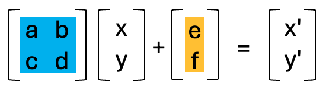
```

Due to the nature of matrix multiplication, you can simply multiply the affine matrices with each other and when the xy coordinates are multiplied by the resulting matrix, it performs both linear transforms in the same step.

_Giotto_ provides a utility `affine2d` S4 class that can be created from any affine matrix and responds to the affine transform functions to simplify this accumulation of simple transforms.

Once done, the `affine2d` can be applied to spatial objects in a single step using `affine()` in the same way that you would use a matrix.

```{r, eval=FALSE}
# create affine2d
aff <- affine() # when called without params, this is the same as affine(diag(c(1, 1)))
```

The `affine2d` object also has an anchor spatial extent, which is used in calculations of the translation values. `affine2d` generates with a default extent, but a specific one matching that of the object you are manipulating (such as that of the giottoPolygon) should be set.

```{r, eval=FALSE}
aff@anchor <- ext(gpoly)
aff <- initialize(aff)
```


```{r, eval=FALSE}
# append several simple transforms
aff <- aff |> 
    spatShift(dx = 1000) |>
    spin(45, x0 = 0, y0 = 0) |> # without the x0, y0 params, the extent center is used
    rescale(10, x0 = 0, y0 = 0) |> # without the x0, y0 params, the extent center is used
    flip(direction = "vertical") |>
    t() |>
    shear(fx = 0.5)
force(aff)
```

```
<affine2d>
anchor    : 6399.24384990901, 6903.24298517207, -5152.38959073896, -4694.86823300896  (xmin, xmax, ymin, ymax)
rotate    : -0.785398163397448  (rad)
shear     : 0.5, 0  (x, y)
scale     : 10, 10  (x, y)
translate : 963.028150700062, 7071.06781186548  (x, y)
```

The show() function displays some information about the stored affine transform, including a set of decomposed simple transformations.

You can then plot the affine object and see a projection of the spatial transform where blue is the starting position and red is the end.

```{r, eval=FALSE}
plot(aff)
```

```{r, echo=FALSE}
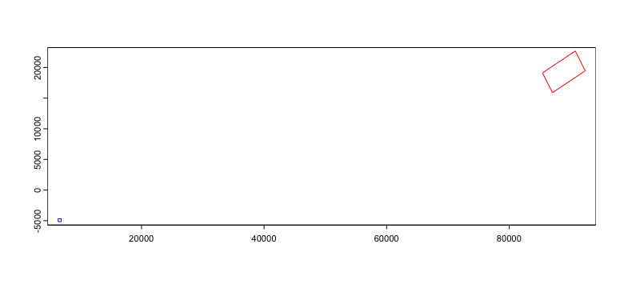
```

We can then apply the affine transforms to the `giottoPolygon` to see that it indeed in the location and orientation that the projection suggests.

```{r, eval=FALSE}
gpoly |> affine(aff) |> 
    plot(main = "affine()", col = rain, lwd = line_width)
```

```{r, echo=FALSE}
knitr::include_graphics("img/03_session2/affine.png")
```

## Image transforms

Giotto uses `giottoLargeImages` as the core image class which is based on _terra_ `SpatRaster`. Images are not loaded into memory when the object is generated and instead an amount of regular sampling appropriate to the zoom level requested is performed at time of plotting.

`spatShift()` and `rescale()` operations are supported by _terra_ `SpatRaster`, and we inherit those functionalities. `spin()`, `flip()`, `t()`, `shear()`, `affine()` operations will coerce `giottoLargeImage` to `giottoAffineImage`, which is much the same, except it contains an `affine2d` object that tracks spatial manipulations performed, so that they can be applied through `magick::image_distort()` processing after sampled values are pulled into memory. `giottoAffineImage` also has alternative `ext()` and `crop()` methods so that those operations respect both the expected post-affine space and un-transformed source image.

```{r, eval=FALSE}
# affine transform of image info matches with polygon info
gimg |> affine(aff) |> plot()
gpoly |> affine(aff) |> 
    plot(add = TRUE, 
         border = "cyan",
         lwd = 0.3)
```

```{r, echo=FALSE}
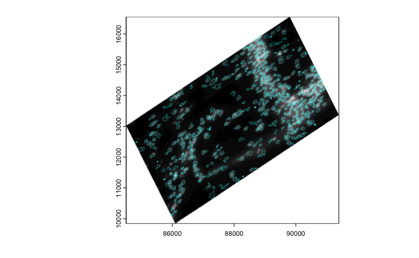
```

```{r, eval=FALSE}
# affine of the giotto object
g |> affine(aff) |> 
    spatInSituPlotPoints(
        show_image = TRUE, 
        feats = list(rna = c("Adgrl1", "Gfap", "Ntrk3", "Slc17a7")),
        feats_color_code = rainbow(4),
        polygon_color = "cyan",
        polygon_line_size = 0.1,
        point_size = 0.1,
        use_overlap = FALSE
    )
```

```{r, echo=FALSE}
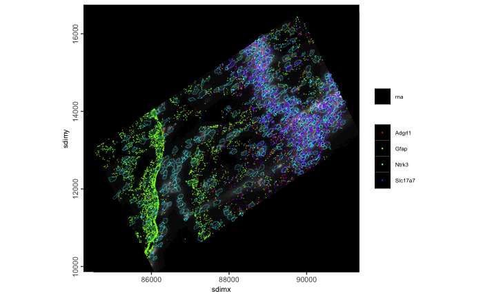
```

Currently _giotto_ image objects are not fully compatible with .ome.tif files. _terra_ which relies on _gdal_ drivers for image loading will find that the Gtiff driver opens some .ome.tif images, but fails when certain compressions (notably JP2000 as used by 10x for their single-channel stains) are used.


## The practical usage of multi-modality co-registration

### Example dataset: Xenium Breast Cancer pre-release pack
10X Genomics Released a comprehensive dataset on 2022. To capture spatial structure by complementing different spatial resolutions and modalities across different assays, they provided a dataset with Xenium in situ transcriptomics data, together with Visium on closely adjacent sections. Additional IF staining was also performed on the Xenium slides. For more information, please refer to the pre-release dataset [page](https://www.10xgenomics.com/products/xenium-in-situ/preview-dataset-human-breast) as well as the [publication](https://www.nature.com/articles/s41467-023-43458-x).

- Visium 
  -- H&E Histology
  -- 55um spot level expression with transcriptome coverage
- Xenium
  -- H&E Histology
  -- IF image staining DAPI, HER2 and CD20
  -- in situ transcripts
  -- cooresponding centroid locations

The goal of creating this multi-modal dataset is to register all the modalities listed above to the same coordinate system as Xenium in situ transcripts as the coordinate represents a certain micron distance.
```{r eval=FALSE}
library(Giotto)
instrs <- createGiottoInstructions(save_dir = file.path(getwd(),'/img/03_session2/'),
                                  save_plot = TRUE,
                                  show_plot = TRUE)
options(timeout = 999999)
download_dir <-file.path(getwd(),'/data/03_session2/')
destfile <- file.path(download_dir,'Multimodal_registration.zip')
if (!dir.exists(download_dir)) { dir.create(download_dir, recursive = TRUE) }
download.file('https://zenodo.org/records/13208139/files/Multimodal_registration.zip?download=1', destfile = destfile)
unzip(paste0(download_dir,'/Multimodal_registration.zip'), exdir = download_dir)
Xenium_dir <- paste0(download_dir,'/Multimodal_registration/Xenium/')
Visium_dir <- paste0(download_dir,'/Multimodal_registration/Visium/')
```

### Target Coordinate system
Xenium transcripts, polygon information and corresponding centroids are output from the Xenium instrument and are in the same coordinate system from the raw output. We can start with checking the centroid information as a representation of the target coordinate system.
```{r eval=FALSE}
xen_cell_df <- read.csv(paste0(Xenium_dir,"cells.csv.gz"))
xen_cell_pl <- ggplot2::ggplot() + ggplot2::geom_point(data = xen_cell_df, ggplot2::aes(x = x_centroid , y = y_centroid),size = 1e-150,,color = 'orange') + ggplot2::theme_classic()
xen_cell_pl
```

```{r, echo=FALSE, out.width="80%", fig.align='center'}
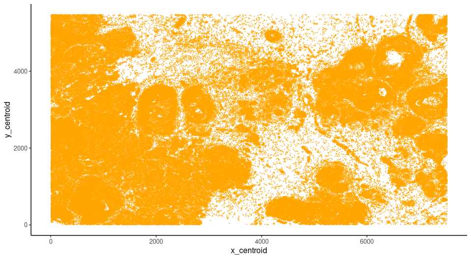
```

### Visium to register
Load the Visium directory using the Giotto convenience function, note that here we are using the "tissue_hires_image.png" as a image to plot. Using the convenience function, hires image and scale factor stored in the [spaceranger](https://www.10xgenomics.com/support/software/space-ranger/latest/analysis/outputs/output-overview) will be used for automatic alignment while the Giotto Visium Object creation. SpatPlot2D provided by Giotto will random sample pixels from the image you provide, thus providing microscopic image as the image input for createGiottoVisiumObject() will improve the visual performance for downstream registration 
```{r eval=FALSE}
G_visium <- createGiottoVisiumObject(visium_dir = Visium_dir,
                                     gene_column_index = 2,
                                     png_name = 'tissue_hires_image.png',
                                     instructions = NULL)
# In the meantime, calculate statistics for easier plot showing
G_visium <- normalizeGiotto(G_visium)
G_visium <- addStatistics(G_visium)
V_origin <- spatPlot2D(G_visium,show_image = T,point_size = 0,return_plot = T)
V_origin
```

```{r, echo=FALSE, out.width="80%", fig.align='center'}
knitr::include_graphics("img/03_session2/Visium_SpatPlot_Original.png")
```

The Visium Object needs to be transformed to the same orientation as target coordinate system, so we perform the first transform.
```{r eval=FALSE}
# create affine2d
aff <- affine(diag(c(1,1)))
aff <- aff |> 
    spin(90) |>
    flip(direction = "horizontal")
force(aff)

# Apply the transform
V_tansformed <- affine(G_visium,aff)
spatplot_to_register <- spatPlot2D(V_tansformed,show_image = T,point_size = 0,return_plot = T)
spatplot_to_register
```

```{r, echo=FALSE, out.width="80%", fig.align='center'}
knitr::include_graphics("img/03_session2/spatplot_to_regsiter.png")
```

Landmarks are considered to be a set of points that are defining same location from two different resources. They are very helpful to be used as anchors to create affine transformtion. For example, after the affine transformation source landmarks should be as close to target landmarks as possible. Since images from different modalities can share similar morphology, the easiest way is to pin landmarks at the morphological identities shared between images.
Giotto provides a interactive landmark selection tool to pin landmarks, two input plots can be generated from a ggplot object, a GiottoLargeImage object, or a path to a image you want to register for. Note that if you directly provide image path, you will need to create a separate GiottoLargeImage to perform transformation, and make sure the  GiottoLargeImage has the same coordinate system as shown in the shiny app. 
```{r eval=FALSE}
landmarks <- interactiveLandmarkSelection(spatplot_to_register, xen_cell_pl)
```

```{r, echo=FALSE, out.width="80%", fig.align='center'}
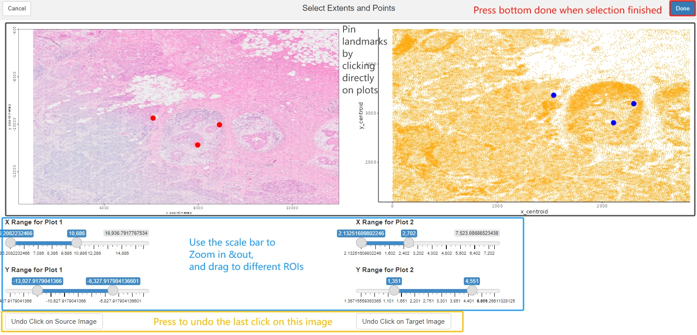
```


Now, use the landmarks to estimate the transformation matrix needed, and to register the Giotto Visium Object to the target coordinate system. For reproducibility purpose, the landmarks used in the chunck below will be loaded from saved result.
```{r eval = F}
landmarks<- readRDS(paste0(Xenium_dir,'/Visium_to_Xen_Landmarks.rds'))
affine_mtx <- calculateAffineMatrixFromLandmarks(landmarks[[1]],landmarks[[2]])

V_final <- affine(G_visium,affine_mtx %*% aff@affine)

spatplot_final <- spatPlot2D(V_final,show_image = T,point_size = 0,show_plot = F) 
spatplot_final + ggplot2::geom_point(data = xen_cell_df, ggplot2::aes(x = x_centroid , y = y_centroid),size = 1e-150,,color = 'orange') + ggplot2::theme_classic()
```

```{r, echo=FALSE, out.width="80%", fig.align='center'}
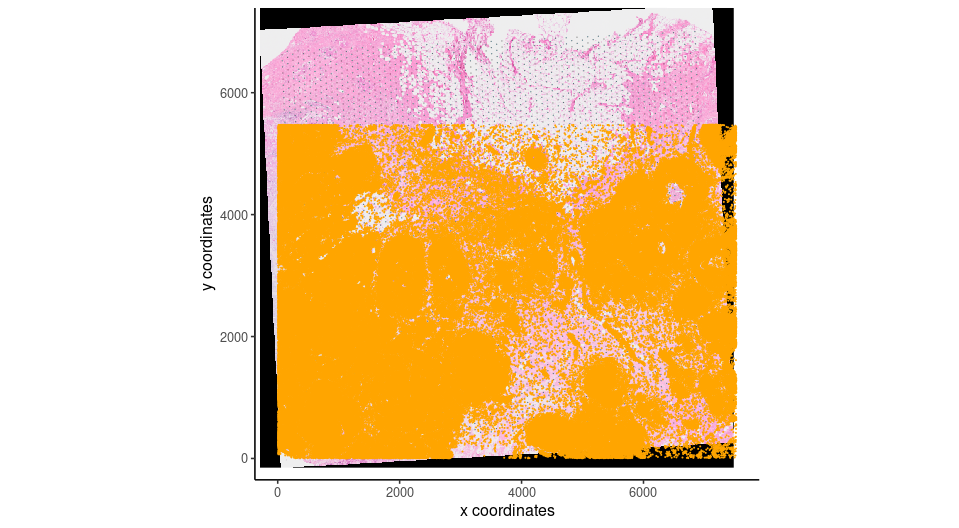
```

#### Create Pseudo Visium dataset for comparison
Giotto provides a way to create different shapes on certain locations, we can use that to create a pseudo-visium polygons to aggregate transcripts or image intensities. To do that, we will need the centroid locations, which can be get using getSpatialLocations(). and also the radius information to create circles. We know that Visium certer to center distance is 100um and spot diameter is 55um, thus we can estimate the radius from certer to center distance. And we can use a spatial network created by nearest neighbor = 2 to capture the distance.
```{r eval=FALSE}
V_final <- createSpatialNetwork(V_final, k = 1,method = 'kNN')
spat_network <- getSpatialNetwork(V_final,output = 'networkDT')
spatPlot2D(V_final, 
           show_network = T,
           network_color = 'blue',
           point_size = 1)
center_to_center <- min(spat_network$distance)
radius <- center_to_center*55/200
```

```{r, echo=FALSE, out.width="80%", fig.align='center'}
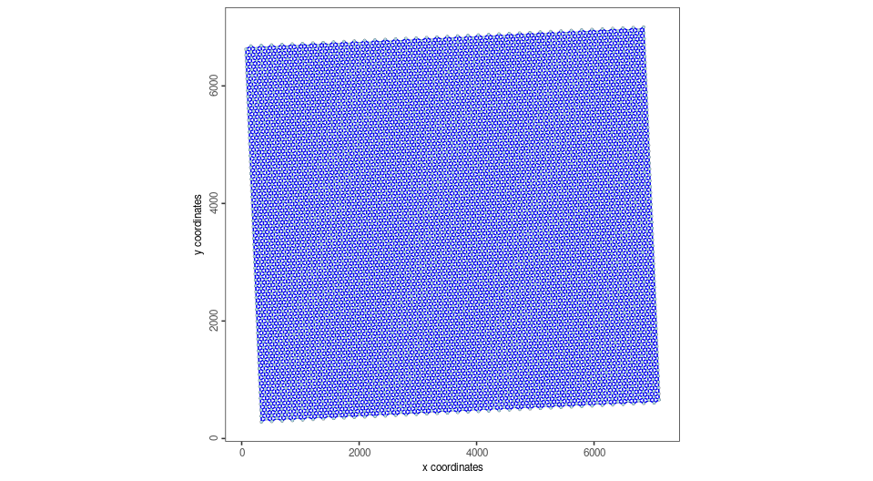
```

Now we get the Pseudo Visium polygons
```{r eval=FALSE}
Visium_centroid <- getSpatialLocations(V_final,output = 'data.table')
stamp_dt <- circleVertices(radius = radius, npoints = 100)
pseudo_visium_dt <- polyStamp(stamp_dt, Visium_centroid)
pseudo_visium_poly <- createGiottoPolygonsFromDfr(pseudo_visium_dt,calc_centroids = T)
plot(pseudo_visium_poly)
```

```{r, echo=FALSE, out.width="80%", fig.align='center'}
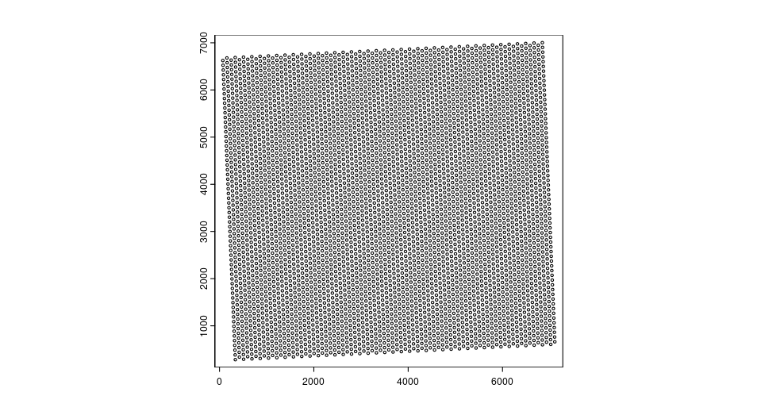
```

Create Xenium object with pseudo Visium polygon. To save run time, example shown here only have MS4A1 and ERBB2 genes to create Giotto points
```{r eval = FALSE}
xen_transcripts <- data.table::fread(paste0(Xenium_dir,'Xen_2_genes.csv.gz'))
gpoints <- createGiottoPoints(xen_transcripts)
Xen_obj <-createGiottoObjectSubcellular(gpoints = list('rna' = gpoints),
                                        gpolygons = list('visium' = pseudo_visium_poly))

```

Get gene expression information by overlapping polygon to points
```{r eval=FALSE}
Xen_obj <- calculateOverlap(Xen_obj,
                           feat_info = 'rna',
                           spatial_info = 'visium')

Xen_obj <- overlapToMatrix(x = Xen_obj,
                          type = "point", 
                          poly_info = "visium", 
                          feat_info = "rna",
                          aggr_function = "sum")

```

Manipulate the expression for plotting
```{r eval=FALSE}
Xen_obj <- filterGiotto(Xen_obj,
                        feat_type = 'rna',
                        spat_unit = 'visium',
                        expression_threshold = 1, 
                        feat_det_in_min_cells = 0,
                        min_det_feats_per_cell = 1)
tmp_exprs <- getExpression(Xen_obj,
                       feat_type = 'rna',
                       spat_unit = 'visium',
                       output = 'matrix')
Xen_obj <- setExpression(Xen_obj,
                         x = createExprObj(log(tmp_exprs+1)),
                         feat_type = 'rna',
                         spat_unit = 'visium',
                         name = 'plot')

spatFeatPlot2D(Xen_obj,
               point_size = 3.5,
               expression_values = 'plot',
               show_image = F,
               feats = 'ERBB2')
```

```{r, echo=FALSE, out.width="80%", fig.align='center'}
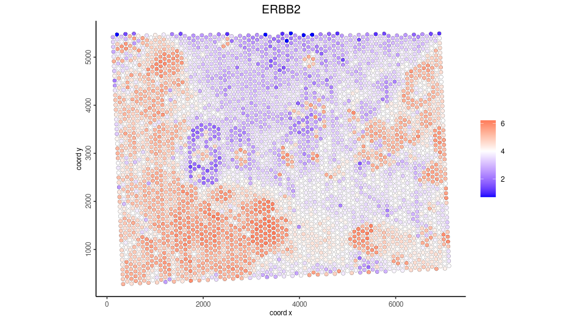
```

Subset the registered Visium and plot same gene
```{r eval=FALSE}
#get the extent of giotto points, xmin, xmax, ymin, ymax
subset_extent <- ext(gpoints@spatVector)
sub_visium <- subsetGiottoLocs(V_final,
                               x_min = subset_extent[1],
                               x_max = subset_extent[2],
                               y_min = subset_extent[3],
                               y_max = subset_extent[4])
spatFeatPlot2D(sub_visium,
               point_size = 2,
               expression_values = 'scaled',
               show_image = F,
               feats = 'ERBB2')

```

```{r, echo=FALSE, out.width="80%", fig.align='center'}
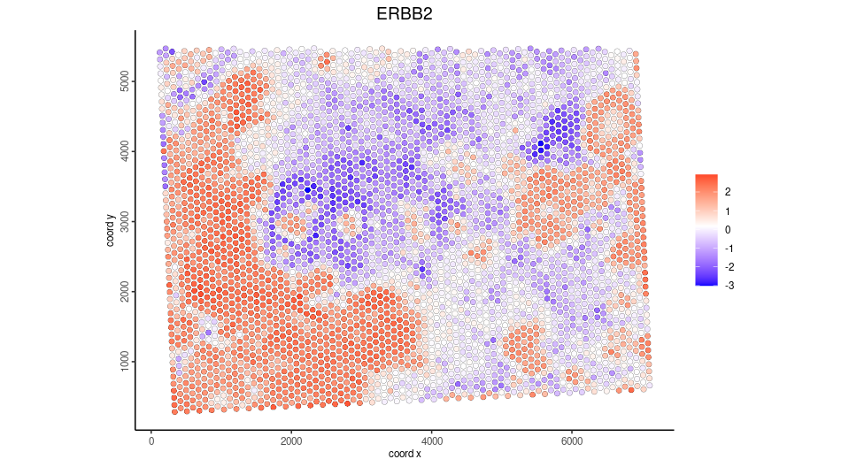
```

### Register post-Xenium H&E and IF image
For Xenium instrument output, Giotto provide a convenience function to load the output from the Xenium ranger output. Note that 10X created the affine image alignment file by applying rotation, scale at (0,0) of the top left corner and translation last. Thus, it will look different than the affine matrix created from landmarks above. In this example, we used a 0.05X compressed ometiff and the alignment file is also create by first rescale at 20X, then apply the affine matrix provided by 10X Genomics.
```{r eval = F}
HE_xen <- read10xAffineImage(file = paste0(Xenium_dir, "HE_ome_compressed.tiff"),
                           imagealignment_path = paste0(Xenium_dir,"Xenium_he_imagealignment.csv"),
                           micron = 0.2125)
plot(HE_xen)
```

```{r, echo=FALSE, out.width="80%", fig.align='center'}
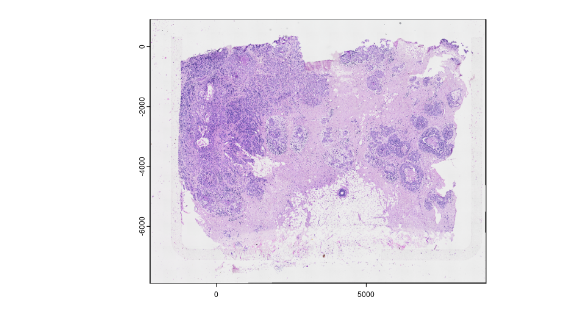
```

The image is still on the top left corner, so we flip the image to make it align with the target coordinate system. We can also save the transformed image raster by re-sample all pixel from the original image, and write it to a file on disk for future use.
```{r eval = F}
HE_xen <- HE_xen |> flip(direction = "vertical")
gimg_rast <- HE_xen@funs$realize_magick(size = prod(dim(HE_xen)))
plot(gimg_rast)
#terra::writeRaster(gimg_rast@raster_object, filename = output,  gdal = "COG" # save as GeoTIFF with extent info)
```

```{r, echo=FALSE, out.width="80%", fig.align='center'}
knitr::include_graphics("img/03_session2/HE_register_2.png")
```

Now we can check the registration results. GiottoVisuals provide a function to plot a giottoLargeImage to a ggplot object in order to plot additional layers of ggplots
```{r eval = F}
gg <- ggplot2::ggplot()
pl <- GiottoVisuals::gg_annotation_raster(gg,gimg_rast)
pl + ggplot2::geom_smooth() + 
     ggplot2::geom_point(data = xen_cell_df, ggplot2::aes(x = x_centroid , y = y_centroid),size = 1e-150,,color = 'orange') + ggplot2::theme_classic()
```


```{r, echo=FALSE, out.width="80%", fig.align='center'}
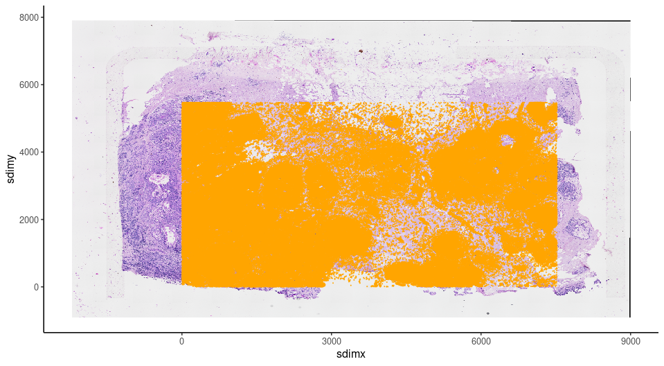
```

#### Add registered image information and compare RNA vs protein expression

With the strategy described above, affine transformed image can be saved and used for quantitive analysis. Here, we can use the same strategy as dealing with spatial proteomics data for IF
```{r eval=FALSE}
CD20_gimg <- createGiottoLargeImage(paste0(Xenium_dir,'/CD20_registered.tiff'), use_rast_ext = T,name = 'CD20')
HER2_gimg <- createGiottoLargeImage(paste0(Xenium_dir,'/HER2_registered.tiff'), use_rast_ext = T,name = 'HER2')
Xen_obj <- addGiottoLargeImage(gobject = Xen_obj,
                               largeImages = list('CD20' = CD20_gimg,'HER2' = HER2_gimg))
```

Get the cell polygons, as Xenium and IF are both subcellular resolution
```{r eval=FALSE}
cellpoly_dt <- data.table::fread(paste0(Xenium_dir,'cell_boundaries.csv.gz'))
colnames(cellpoly_dt) <- c('poly_ID','x','y')
cellpoly <- createGiottoPolygonsFromDfr(cellpoly_dt)
Xen_obj <- addGiottoPolygons(Xen_obj,gpolygons = list('cell' = cellpoly))
```

Compute the gene expression matrix by overlay the cell polygons and giotto points.
```{r eval=FALSE}
Xen_obj <- calculateOverlap(Xen_obj,
                           feat_info = 'rna',
                           spatial_info = 'cell')

Xen_obj <- overlapToMatrix(x = Xen_obj,
                          type = "point", 
                          poly_info = "cell", 
                          feat_info = "rna",
                          aggr_function = "sum")
tmp_exprs <- getExpression(Xen_obj,
                       feat_type = 'rna',
                       spat_unit = 'cell',
                       output = 'matrix')
Xen_obj <- setExpression(Xen_obj,
                         x = createExprObj(log(tmp_exprs+1)),
                         feat_type = 'rna',
                         spat_unit = 'cell',
                         name = 'plot')
spatFeatPlot2D(Xen_obj,
               feat_type = 'rna',
               expression_values = 'plot',
               spat_unit = 'cell',
               feats = 'ERBB2',
               point_size = 0.05)
```

```{r, echo=FALSE, out.width="80%", fig.align='center'}
knitr::include_graphics("img/03_session2/ERBB2_spatplot.png")
```

Now we overlay the HER2 expression from the raster image with the cell polygons.
```{r eval=FALSE}
Xen_obj <- calculateOverlap(Xen_obj,
                            spatial_info = 'cell',
                            image_names = c('HER2','CD20'))

Xen_obj <- overlapToMatrix(x = Xen_obj,
                          type = "intensity", 
                          poly_info = "cell", 
                          feat_info = "protein",
                          aggr_function = "sum")

tmp_exprs <- getExpression(Xen_obj,
                       feat_type = 'protein',
                       spat_unit = 'cell',
                       output = 'matrix')
Xen_obj <- setExpression(Xen_obj,
                         x = createExprObj(log(tmp_exprs+1)),
                         feat_type = 'protein',
                         spat_unit = 'cell',
                         name = 'plot')
spatFeatPlot2D(Xen_obj,
               feat_type = 'protein',
               expression_values = 'plot',
               spat_unit = 'cell',
               feats = 'HER2',
               point_size = 0.05)
```

```{r, echo=FALSE, out.width="80%", fig.align='center'}
knitr::include_graphics("img/03_session2/HER2_spatplot.png")
```
We can also overlay the protein expression to Visium spots
```{r eval=FALSE}
Xen_obj <- calculateOverlap(Xen_obj,
                            spatial_info = 'visium',
                            image_names = c('HER2','CD20'))
Xen_obj <- overlapToMatrix(x = Xen_obj,
                          type = "intensity", 
                          poly_info = "visium", 
                          feat_info = "protein",
                          aggr_function = "sum")

Xen_obj <- filterGiotto(Xen_obj,
                        feat_type = 'protein',
                        spat_unit = 'visium',
                        expression_threshold = 1, 
                        feat_det_in_min_cells = 0,
                        min_det_feats_per_cell = 1)

tmp_exprs <- getExpression(Xen_obj,
                       feat_type = 'protein',
                       spat_unit = 'visium',
                       output = 'matrix')
Xen_obj <- setExpression(Xen_obj,
                         x = createExprObj(log(tmp_exprs+1)),
                         feat_type = 'protein',
                         spat_unit = 'visium',
                         name = 'plot')
spatFeatPlot2D(Xen_obj,
               feat_type = 'protein',
               expression_values = 'plot',
               spat_unit = 'visium',
               feats = 'HER2',
               point_size = 2)
```

```{r, echo=FALSE, out.width="80%", fig.align='center'}
knitr::include_graphics("img/03_session2/HER2_visium.png")
```


### Automatic alignment via SIFT feature descriptor matching and affine transformation

Pin landmarks or use compounded affine transforms to register image usually provides initial registration results. However, recording landmarks or manually combine transformations require a lot of manual effort. It will require too much effort when having a large amount of images to register. As long as accurate landmarks are provided, registration will be easy to automatically perform. Here we provide a wrapper function of Scale invariant feature transform(SIFT). SIFT will first identify the extreme points in different scale spaces from paired images, then use a brutal force way to match the points. The matched points can then be used to estimate the transform and warp the image. The major drawback is once the dimension of the image become bigger, the computing time will increase exponentially.

Here, we provide an example of two compressed images to show the automatic alignment pipeline.
```{r eval = F}
HE <- createGiottoLargeImage(paste0(Xenium_dir,'mini_HE.png'),negative_y = F)
plot(HE)
```

```{r, echo=FALSE, out.width="80%", fig.align='center'}
knitr::include_graphics("img/03_session2/mini_HE.png")
```

```{r eval = F}
IF <- createGiottoLargeImage(paste0(Xenium_dir,'mini_IF.tif'),negative_y = F,flip_horizontal = T)
terra::plotRGB(IF@raster_object,r=1, g=2, b=3,, stretch="lin")
```

```{r, echo=FALSE, out.width="80%", fig.align='center'}
knitr::include_graphics("img/03_session2/mini_IF.png")
```

Now, we can use the automated transformation pipeline. Note that we will start with a path to the images, run the preprocessImageToMatrix() first to meet the requirement of estimateAutomatedImageRegistrationWithSIFT() function. The images will be preprocessed to gray scale. And for that purpose, we use the DAPI channel from the miniIF, and set invert = T for mini HE as HE image so that grayscle HE will have higher value for high intensity pixels. The function will output an estimation of the transform.
```{r eval = F}
estimation <- estimateAutomatedImageRegistrationWithSIFT(x = preprocessImageToMatrix(paste0(Xenium_dir,'mini_IF.tif'),
                                                                                     flip_horizontal = T,
                                                                                     use_single_channel = T,
                                                                                     single_channel_number = 3),
                                                         y = preprocessImageToMatrix(paste0(Xenium_dir,'mini_HE.png'),
                                                                                     invert = T),
                                                         plot_match = T,
                                                         max_ratio = 0.5,estimate_fun = 'Projective')
```

```{r, echo=FALSE, out.width="80%", fig.align='center'}
knitr::include_graphics("img/03_session2/SIFT_descriptor_match.png")
```

Use the estimation, we can quickly visualize the transformation
```{r eval = F}
mtx <- as.matrix(estimation$params)
transformed <- affine(IF, mtx)
To_see_overlay <- transformed@funs$realize_magick(size = 2e6)
plot(HE)
plot(To_see_overlay@raster_object[[2]], add=TRUE, alpha=0.5)
SIFT_registration_overlay
```

```{r, echo=FALSE, out.width="80%", fig.align='center'}
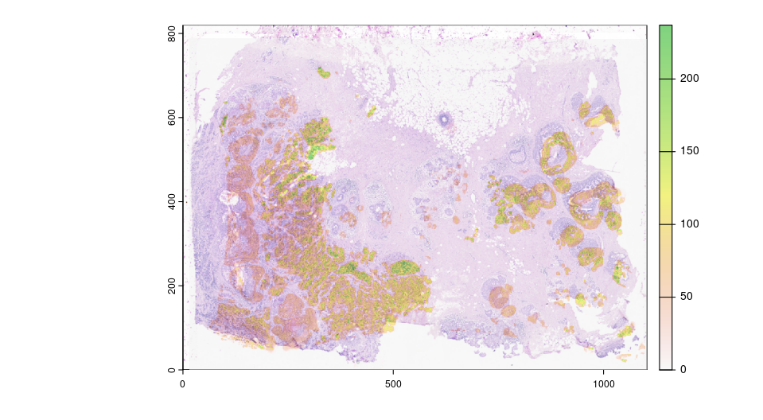
```

### Final Notes

Image registration is becoming crucial for spatial multi modal analysis. The methods included here are not the only ways to register images, and either of them may have drawbacks for a good alignment. There are multiple tools coming out for the field with different strategies, including easier landmark detection, deformable transformation as well as matching spatial patterns, etc. Some of them provides transformed images or coordinates that can be directly loaded to Giotto as a multimodal object using a standard pipeline.

