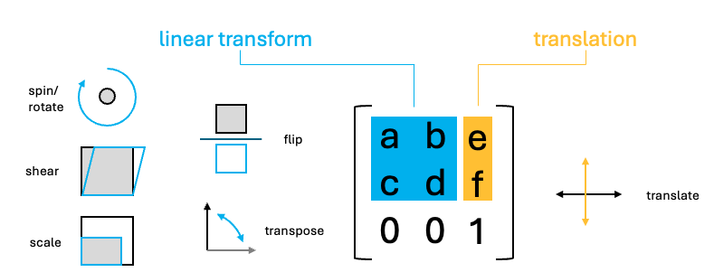

# Spatial multi-modal analysis

Junxiang Xu

August 7th 2024

## Overview

Spatial multimodal datasets are created when there is more than one modality available for a single piece of tissue. One way that these datasets can be assembled is by performing multiple spatial assays on closely adjacent tissue sections or ideally the same section. However, for these datasets, in addition to the usual expression space integration, we must also first spatially align them.

## Spatial manipulation

Performing spatial analyses across any two sections of tissue from the same block requires that data to be spatially aligned into a common coordinate space. Minute differences during the sectioning process from the cutting motion to how long an FFPE section was floated can result in even neighboring sections being distorted when compared side-by-side.

These differences make it difficult to assemble multislice and/or cross platform multimodal datasets into a cohesive 3D volume. The solution for this is to perform registration across either the dataset images or expression information. Based on the registration results, both the raster images and vector feature and polygon information can be aligned into a continuous whole.

Ideally this registration will be a free deformation based on sets of control points or a deformation matrix, however affine transforms already provide a good approximation. In either case, *the transform or deformation applied must work in the same way across both raster and vector information.*

Giotto provides spatial classes and methods for easy manipulation of data with 2D affine transformations. These functionalities are all available from *GiottoClass*.

### Spatial transforms:

We support simple transformations and more complex affine transformations which can be used to combine and encode more than one simple transform.

-   `spatShift()` - translations
-   `spin()` - rotations (degrees)
-   `rescale()` - scaling
-   `flip()` - flip vertical or horizontal across arbitrary lines
-   `t()` - transpose
-   `shear()` - shear transform
-   `affine()` - affine matrix transform

### Spatial utilities:

Helpful functions for use alongside these spatial transforms are `ext()` for finding the spatial bounding box of where your data object is, `crop()` for cutting out a spatial region of the data, and `plot()` for *terra*/*base* plots of the data.

-   `ext()` - spatial extent or bounding box
-   `crop()` - cut out a spatial region of the data
-   `plot()` - plot a spatial object

### Spatial classes:

Giotto's spatial subobjects respond to the above functions. The Giotto object itself can also be affine transformed.

-   `spatLocsObj` - xy centroids
-   `spatialNetworkObj` - spatial networks between centroids
-   `giottoPoints` - xy feature point detections
-   `giottoPolygon` - spatial polygons
-   `giottoImage` (mostly deprecated) - *magick*-based images
-   `giottoLargeImage`/`giottoAffineImage` - *terra*-based images
-   `affine2d` - affine matrix container
-   `giotto` - giotto analysis object

```{r, eval=FALSE}
# load in data
library(Giotto)
g <- GiottoData::loadGiottoMini("vizgen")
activeSpatUnit(g) <- "aggregate"
gpoly <- getPolygonInfo(g, return_giottoPolygon = TRUE)
gimg <- getGiottoImage(g)
```

## Examples of the simple transforms with a giottoPolygon
```{r, eval=FALSE, fig.height=10, fig.width=10}
rain <- rainbow(nrow(gpoly))
line_width <- 0.3

# par to setup the grid plotting layout
p <- par(no.readonly = TRUE)
par(mfrow=c(3,3))
gpoly |> 
    plot(main = "no transform", col = rain, lwd = line_width)

gpoly |> spatShift(dx = 1000) |> 
    plot(main = "spatShift(dx = 1000)", col = rain, lwd = line_width)

gpoly |> spin(45) |> 
    plot(main = "spin(45)", col = rain, lwd = line_width)

gpoly |> rescale(fx = 10, fy = 6) |> 
    plot(main = "rescale(fx = 10, fy = 6)", col = rain, lwd = line_width)

gpoly |> flip(direction = "vertical") |> 
    plot(main = "flip()", col = rain, lwd = line_width)

gpoly |> t() |> 
    plot(main = "t()", col = rain, lwd = line_width)

gpoly |> shear(fx = 0.5) |> 
    plot(main = "shear(fx = 0.5)", col = rain, lwd = line_width)
par(p)
```

```{r, echo=FALSE}
knitr::include_graphics("img/03_session2/transforms.png")
```

## Affine transforms

The above transforms are all simple to understand in how they work, but you can imagine that performing them in sequence on your dataset can be computationally expensive. 

Luckily, the above operations are all affine transformation, and they can be condensed into a single step. Affine transforms where the x and y values undergo a linear transform. These transforms in 2D, can all be represented as a 2x2 matrix or 2x3 if the xy translation values are included.

```{r, echo=FALSE}

```

To perform the linear transform, the xy coordinates just need to be matrix multiplied by the 2x2 affine matrix. The resulting values should then be added to the translate values.

```{r, echo=FALSE}
 knitr::include_graphics("img/03_session2/apply_matrix.png")
```

Due to the nature of matrix multiplication, you can simply multiply the affine matrices with each other and when the xy coordinates are multiplied by the resulting matrix, it performs both linear transforms in the same step.

_Giotto_ provides a utility `affine2d` S4 class that can be created from any affine matrix and responds to the affine transform functions to simplify this accumulation of simple transforms.
Once done, the `affine2d` can be applied to spatial objects in a single step using `affine()` in the same way that you would use a matrix.
```{r, eval=FALSE}
# create affine2d
aff <- affine() # when called without params, this is the same as affine(diag(c(1, 1)))
```
The `affine2d` object also has an anchor spatial extent, which is used in calculations of the translation values. `affine2d` generates with a default extent, but a specific one matching that of the object you are manipulating (such as that of the giottoPolygon) should be set.
```{r, eval=FALSE}
aff@anchor <- ext(gpoly)
aff <- initialize(aff)
```


```{r, eval=FALSE}
# append several simple transforms
aff <- aff |> 
    spatShift(dx = 1000) |>
    spin(45, x0 = 0, y0 = 0) |> # without the x0, y0 params, the extent center is used
    rescale(10, x0 = 0, y0 = 0) |> # without the x0, y0 params, the extent center is used
    flip(direction = "vertical") |>
    t() |>
    shear(fx = 0.5)
force(aff)
```
```
<affine2d>
anchor    : 6399.24384990901, 6903.24298517207, -5152.38959073896, -4694.86823300896  (xmin, xmax, ymin, ymax)
rotate    : -0.785398163397448  (rad)
shear     : 0.5, 0  (x, y)
scale     : 10, 10  (x, y)
translate : 963.028150700062, 7071.06781186548  (x, y)
```

The show function displays some information about the stored affine transform, including a set of decomposed simple transformations.

You can then plot the affine object and see a projection of the spatial transform where blue is the starting position and red is the end.
```{r, eval=FALSE}
plot(aff)
```

```{r, echo=FALSE}
knitr::include_graphics("img/03_session2/affplot.png")
```

We can then apply the affine transforms to the `giottoPolygon` to see that it indeed in the location and orientation that the projection suggests.
```{r, eval=FALSE}
gpoly |> affine(aff) |> 
    plot(main = "affine()", col = rain, lwd = line_width)
```

```{r, echo=FALSE}
knitr::include_graphics("img/03_session2/affine.png")
```

## Image transforms
Giotto uses `giottoLargeImages` as the core image class which is based on _terra_ `SpatRaster`. Images are not loaded into memory when the object is generated and instead an amount of regular sampling appropriate to the zoom level requested is performed at time of plotting.

`spatShift()` and `rescale()` operations are supported by _terra_ `SpatRaster`, and we inherit those functionalities. `spin()`, `flip()`, `t()`, `shear()`, `affine()` operations will coerce `giottoLargeImage` to `giottoAffineImage`, which is much the same, except it contains an `affine2d` object that tracks spatial manipulations performed, so that they can be applied through `magick::image_distort()` processing after sampled values are pulled into memory. `giottoAffineImage` also has alternative `ext()` and `crop()` methods so that those operations respect both the expected post-affine space and untransformed source image.
```{r, eval=FALSE}
# affine transform of image info matches with polygon info
gimg |> affine(aff) |> plot()
gpoly |> affine(aff) |> 
    plot(add = TRUE, 
         border = "cyan",
         lwd = 0.3)
```

```{r, echo=FALSE}
knitr::include_graphics("img/03_session2/polys_and_image.png")
```

```{r, eval=FALSE}
# affine of the giotto object
g |> affine(aff) |> 
    spatInSituPlotPoints(
        show_image = TRUE, 
        feats = list(rna = c("Adgrl1", "Gfap", "Ntrk3", "Slc17a7")),
        feats_color_code = rainbow(4),
        polygon_color = "cyan",
        polygon_line_size = 0.1,
        point_size = 0.1,
        use_overlap = FALSE
    )
```

```{r, echo=FALSE}
knitr::include_graphics("img/03_session2/gobj_affine.png")
```

Currently _giotto_ image objects are not fully compatible with .ome.tif files. _terra_ which relies on _gdal_ drivers for image loading will find that the Gtiff driver opens some .ome.tif images, but fails when certain compressions (notably JP2000 as used by 10x for their single-channel stains) are used.


## Co-registration of datasets

text

## Examples in giotto suite manuscript

text

```{r, eval=FALSE}
sessionInfo()
```
