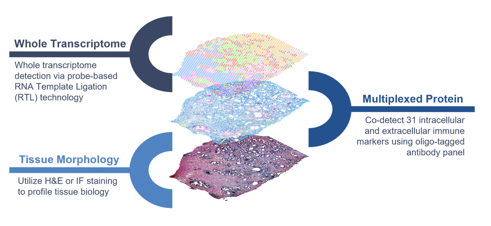
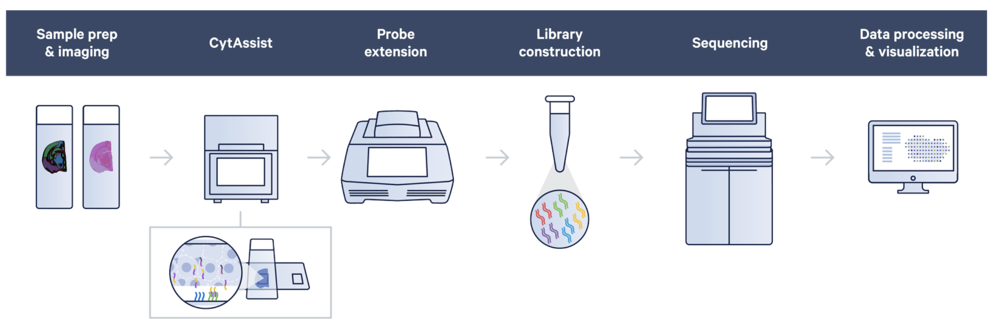
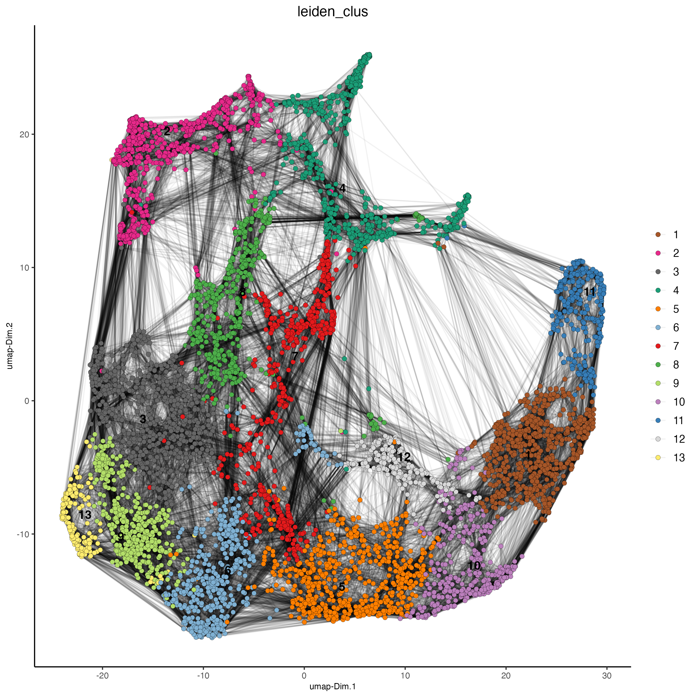
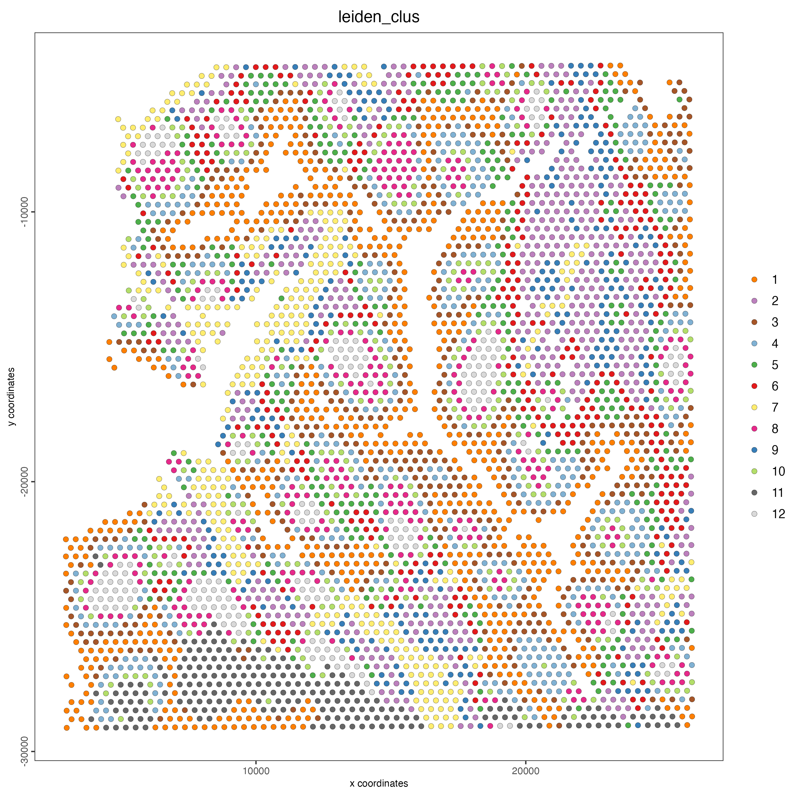
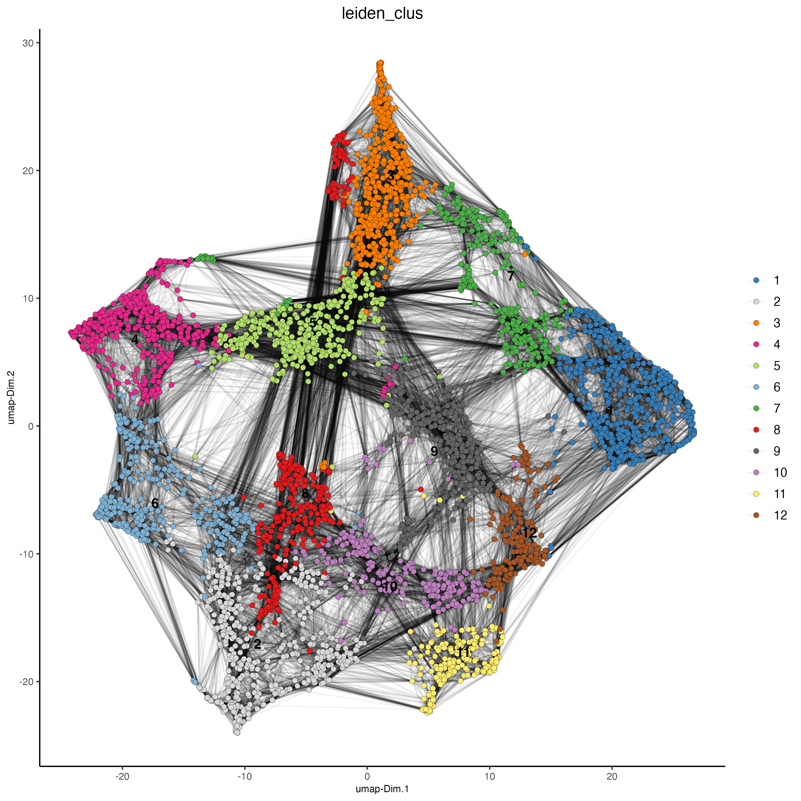
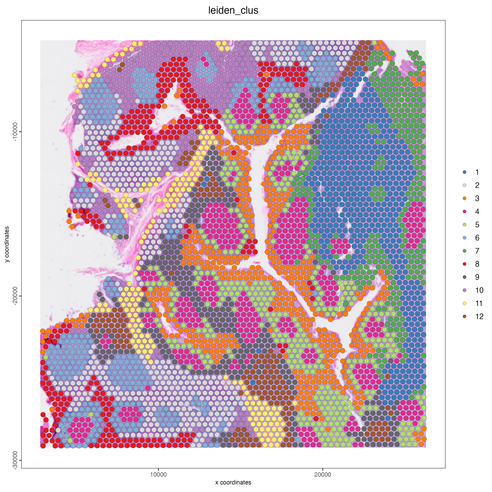
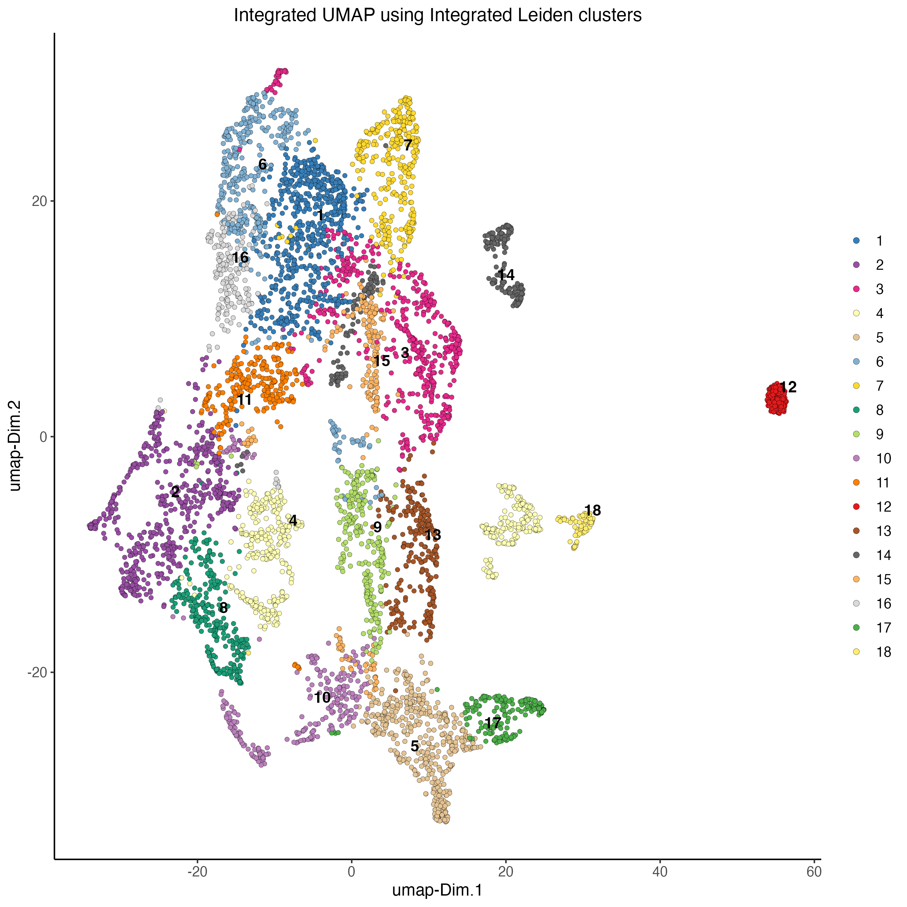
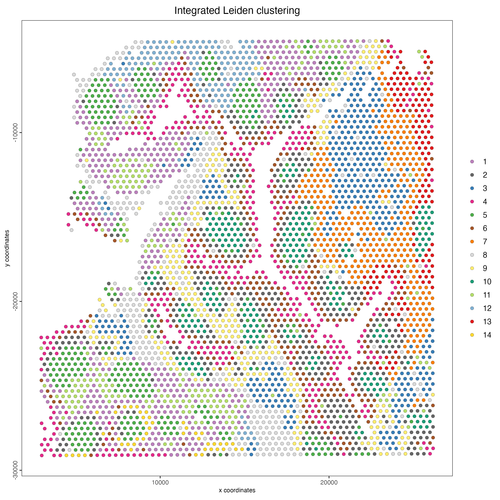

# Multi-omics integration

Joselyn Cristina Chávez Fuentes

August 7th 2024

## The CytAssist technology

The Visium CytAssist Spatial Gene and Protein Expression assay is designed to introduce simultaneous Gene Expression and Protein Expression analysis to FFPE samples processed with Visium CytAssist. The assay uses NGS to measure the abundance of oligo-tagged antibodies with spatial resolution, in addition to the whole transcriptome and a morphological image.

```{r, echo=FALSE, out.width="80%", fig.align="center", fig.cap="CystAssits multi-omics diagram. Source: 10X genomics."}

```

The 10X human immune cell profiling panel features 35 antibodies from Abcam and Biolegend, and includes cell surface and intracellular targets. The rna probes hybridize to ~18,000 genes, or RNA targets, within the tissue section to achieve whole transcriptome gene expression profiling. The remaining steps, starting with probe extension, follow the standard Visium workflow outside of the instrument.

```{r, echo=FALSE, out.width="100%", fig.align="center", fig.cap="CytAssist workflow. Source: 10X genomics."}

```

## Introduction to the spatial dataset

The [Human Tonsil (FFPE) dataset](https://www.10xgenomics.com/datasets/gene-protein-expression-library-of-human-tonsil-cytassist-ffpe-2-standard) was obtained from 10X Genomics. The tissue was sectioned as described in Visium CytAssist Spatial Gene and Protein Expression for FFPE – Tissue Preparation Guide (CG000660). 5 µm tissue sections were placed on Superfrost glass slides, deparaffinized, H&E stained (CG000658) and coverslipped. Sections were imaged, decoverslipped, followed by decrosslinking per the Staining Demonstrated Protocol (CG000658).

More information about this dataset can be found [here](https://www.10xgenomics.com/datasets/gene-protein-expression-library-of-human-tonsil-cytassist-ffpe-2-standard).

## Download dataset

You need to download the expression matrix and spatial information by running these commands:

```{r, eval=FALSE}
dir.create("data/03_session3")

download.file(url = "https://cf.10xgenomics.com/samples/spatial-exp/2.1.0/CytAssist_FFPE_Protein_Expression_Human_Tonsil/CytAssist_FFPE_Protein_Expression_Human_Tonsil_raw_feature_bc_matrix.tar.gz",
              destfile = "data/03_session3/CytAssist_FFPE_Protein_Expression_Human_Tonsil_raw_feature_bc_matrix.tar.gz")

download.file(url = "https://cf.10xgenomics.com/samples/spatial-exp/2.1.0/CytAssist_FFPE_Protein_Expression_Human_Tonsil/CytAssist_FFPE_Protein_Expression_Human_Tonsil_spatial.tar.gz",
              destfile = "data/03_session3/CytAssist_FFPE_Protein_Expression_Human_Tonsil_spatial.tar.gz")
```

After downloading, unzip the gz files. You should get the "raw_feature_bc_matrix" and "spatial" folders inside "data/03_session3/".

## Create the Giotto object

The minimum requirements are:

- matrix with expression information (or the path to)
- x,y(,z) coordinates for cells or spots (or the path to)

createGiottoVisiumObject() will automatically detect both RNA and Protein modalities in the expression matrix and will create a multi-omics Giotto object.

```{r, eval=FALSE}
library(Giotto)

## Set instructions
results_folder <- "results/03_session3/"

python_path <- NULL

instructions <- createGiottoInstructions(
  save_dir = results_folder,
  save_plot = TRUE,
  show_plot = FALSE,
  return_plot = FALSE,
  python_path = python_path
)

# Provide the path to the data folder
data_path <- "data/03_session3/"

# Create object directly from the data folder
visium_tonsil <- createGiottoVisiumObject(
  visium_dir = data_path,
  expr_data = "raw",
  png_name = "tissue_lowres_image.png",
  gene_column_index = 2,
  instructions = instructions
)
```

- Print the information of the object, note that both rna and protein are listed in the expression slot.

```{r, eval=FALSE}
visium_tonsil
```

## Subset on spots that were covered by tissue

```{r, eval=FALSE}
spatPlot2D(
  gobject = visium_tonsil,
  cell_color = "in_tissue",
  point_size = 2,
  cell_color_code = c("0" = "lightgrey", "1" = "blue"),
  show_image = TRUE,
  image_name = "image"
)
```

```{r, echo=FALSE, out.width="80%", fig.align="center", fig.cap="Spatial plot of the CytAssist human tonsil sample, color indicates wheter the spot is in tissue (1) or not (0)."}
knitr::include_graphics("img/03_session3/0-spatPlot2D.png")
```

Use the metadata table to identify the spots corresponding to the tissue area, given by the "in_tissue" column. Then use the spot IDs to subset the giotto object.

```{r, eval=FALSE}
metadata <- getCellMetadata(gobject = visium_tonsil,
                            output = "data.table")

in_tissue_barcodes <- metadata[in_tissue == 1]$cell_ID

visium_tonsil <- subsetGiotto(visium_tonsil, 
                              cell_ids = in_tissue_barcodes)
```


## RNA processing

- Run the Filtering, normalization, and statistics steps using only the RNA feature.

```{r, eval=FALSE}
visium_tonsil <- filterGiotto(
  gobject = visium_tonsil,
  expression_threshold = 1,
  feat_det_in_min_cells = 50,
  min_det_feats_per_cell = 1000,
  expression_values = "raw",
  verbose = TRUE)

visium_tonsil <- normalizeGiotto(gobject = visium_tonsil,
                                 scalefactor = 6000,
                                 verbose = TRUE)

visium_tonsil <- addStatistics(gobject = visium_tonsil)
```

- Dimension reduction

Identify the highly variable features using the RNA features, then calculate the principal components based on the HVFs.   

```{r, eval=FALSE}
visium_tonsil <- calculateHVF(gobject = visium_tonsil)

visium_tonsil <- runPCA(gobject = visium_tonsil)
```

- Clustering

Calculate the UMAP, tSNE, and shared nearest neighbor network using the first 10 principal components for the RNA modality.

```{r, eval=FALSE}
visium_tonsil <- runUMAP(visium_tonsil,
                         dimensions_to_use = 1:10)

visium_tonsil <- runtSNE(visium_tonsil, 
                         dimensions_to_use = 1:10)

visium_tonsil <- createNearestNetwork(gobject = visium_tonsil,
                                      dimensions_to_use = 1:10,
                                      k = 30)
```

Calculate the RNA-based Leiden clusters.

```{r, eval=FALSE}
visium_tonsil <- doLeidenCluster(gobject = visium_tonsil,
                                 resolution = 1,
                                 n_iterations = 1000)
```

- Visualization

Plot the RNA-based UMAP with the corresponding RNA-based Leiden cluster per spot.

```{r, eval=FALSE}
plotUMAP(gobject = visium_tonsil,
         cell_color = "leiden_clus",
         show_NN_network = TRUE,
         point_size = 2)
```

```{r, echo=FALSE, out.width="80%", fig.align="center", fig.cap="RNA UMAP, color indicates the RNA-based Leiden clusters."}

```

Plot the spatial distribution of the RNA-based Leiden cluster per spot.

```{r, eval=FALSE}
spatPlot2D(gobject = visium_tonsil,
           show_image = TRUE,
           cell_color = "leiden_clus",
           point_size = 3)
```

```{r, echo=FALSE, out.width="80%", fig.align="center", fig.cap="Spatial distribution of RNA-based Leiden clusters."}

```

## Protein processing

- Run the Filtering, normalization, and statistics steps for the protein modality.

```{r, eval=FALSE}
visium_tonsil <- filterGiotto(gobject = visium_tonsil, 
                              spat_unit = "cell",
                              feat_type = "protein",
                              expression_threshold = 1,
                              feat_det_in_min_cells = 50, 
                              min_det_feats_per_cell = 1,
                              expression_values = "raw", 
                              verbose = TRUE)

visium_tonsil <- normalizeGiotto(gobject = visium_tonsil,
                                 spat_unit = "cell", 
                                 feat_type = "protein", 
                                 scalefactor = 6000, 
                                 verbose = TRUE)

visium_tonsil <- addStatistics(gobject = visium_tonsil,
                               spat_unit = "cell", 
                               feat_type = "protein")
```

- Dimension reduction

Calculate the principal components using all the proteins available in the dataset.

```{r, eval=FALSE}
visium_tonsil <- runPCA(gobject = visium_tonsil,
                        spat_unit = "cell",
                        feat_type = "protein")
```

- Clustering

Calculate the UMAP, tSNE, and shared nearest neighbors network using the first 10 principal components for the Protein modality.

```{r, eval=FALSE}
visium_tonsil <- runUMAP(visium_tonsil,
                         spat_unit = "cell", 
                         feat_type = "protein", 
                         dimensions_to_use = 1:10)

visium_tonsil <- runtSNE(visium_tonsil, 
                         spat_unit = "cell",
                         feat_type = "protein",
                         dimensions_to_use = 1:10)

visium_tonsil <- createNearestNetwork(gobject = visium_tonsil,
                                      spat_unit = "cell",
                                      feat_type = "protein",
                                      dimensions_to_use = 1:10,
                                      k = 30)
```

Calculate the Protein-based Leiden clusters.

```{r, eval=FALSE}
visium_tonsil <- doLeidenCluster(gobject = visium_tonsil,
                                 spat_unit = "cell",
                                 feat_type = "protein",
                                 resolution = 1,
                                 n_iterations = 1000)
```

- Visualization

Plot the Protein UMAP and color the spots using the Protein-based Leiden clusters.

```{r, eval=FALSE}
plotUMAP(gobject = visium_tonsil,
         spat_unit = "cell", 
         feat_type = "protein", 
         cell_color = "leiden_clus", 
         show_NN_network = TRUE, 
         point_size = 2)
```

```{r, echo=FALSE, out.width="80%", fig.align="center", fig.cap="Protein UMAP, color indicates the Protein-based Leiden clusters."}

```

Plot the spatial distribution of the Protein-based Leiden clusters.

```{r, eval=FALSE}
spatPlot2D(gobject = visium_tonsil,
           spat_unit = "cell",
           feat_type = "protein",
           show_image = TRUE,
           cell_color = "leiden_clus",
           point_size = 3)
```

```{r, echo=FALSE, out.width="80%", fig.align="center", fig.cap="Spatial distribution of Protein-based Leiden clusters."}

```

## Multi-omics integration

- Calculate kNN

Calculate the k nearest neighbors network for each modality (RNA and Protein), using the first 10 principal components of each feature type.

```{r, eval=FALSE}
## RNA modality
visium_tonsil <- createNearestNetwork(gobject = visium_tonsil,
                                      type = "kNN",
                                      dimensions_to_use = 1:10,
                                      k = 20)

## Protein modality
visium_tonsil <- createNearestNetwork(gobject = visium_tonsil,
                                      spat_unit = "cell",
                                      feat_type = "protein",
                                      type = "kNN",
                                      dimensions_to_use = 1:10,
                                      k = 20)
```

- Run WNN

Run the Weighted Nearest Neighbor analysis to weight the contribution of each feature type per spot. The results will be saved in the multiomics slot of the giotto object.

```{r, eval=FALSE}
visium_tonsil <- runWNN(visium_tonsil,
                        spat_unit = "cell",
                        modality_1 = "rna",
                        modality_2 = "protein",
                        pca_name_modality_1 = "pca",
                        pca_name_modality_2 = "protein.pca",
                        k = 20,
                        integrated_feat_type = NULL,
                        matrix_result_name = NULL,
                        w_name_modality_1 = NULL,
                        w_name_modality_2 = NULL,
                        verbose = TRUE)
```

- Run Integrated umap

Calculate the UMAP using the weights of each feature per spot.

```{r, eval=FALSE}
visium_tonsil <- runIntegratedUMAP(visium_tonsil,
                                   modality1 = "rna",
                                   modality2 = "protein",
                                   spread = 7,
                                   min_dist = 1,
                                   force = FALSE)
```

- Calculate integrated clusters

Calculate the multiomics-based Leiden clusters using the weights of each feature per spot.

```{r, eval=FALSE}
visium_tonsil <- doLeidenCluster(gobject = visium_tonsil,
                                 spat_unit = "cell",
                                 feat_type = "rna",
                                 nn_network_to_use = "kNN",
                                 network_name = "integrated_kNN",
                                 name = "integrated_leiden_clus",
                                 resolution = 1)
```

- Visualize the integrated UMAP

Plot the integrated UMAP and color the spots using the integrated Leiden clusters.

```{r, eval=FALSE}
plotUMAP(gobject = visium_tonsil,
         spat_unit = "cell",
         feat_type = "rna",
         cell_color = "integrated_leiden_clus",
         dim_reduction_name = "integrated.umap",
         point_size = 2,
         title = "Integrated UMAP using Integrated Leiden clusters")
```

```{r, echo=FALSE, out.width="80%", fig.align="center", fig.cap="Integrated UMAP. Color represents the integrated Leiden clusters."}

```

- Visualize spatial plot with integrated clusters

Plot the spatial distribution of the integrated Leiden clusters.

```{r, eval=FALSE}
spatPlot2D(visium_tonsil,
           spat_unit = "cell",
           feat_type = "rna",
           cell_color = "integrated_leiden_clus",
           point_size = 3,
           show_image = TRUE,
           title = "Integrated Leiden clustering")
```

```{r, echo=FALSE, out.width="80%", fig.align="center", fig.cap="Spatial distribution of the integrated Leiden clusters."}

```

## Session info

```{r, eval=FALSE}
sessionInfo()
```

```{r, eval=FALSE}
R version 4.4.1 (2024-06-14)
Platform: aarch64-apple-darwin20
Running under: macOS Sonoma 14.5

Matrix products: default
BLAS:   /System/Library/Frameworks/Accelerate.framework/Versions/A/Frameworks/vecLib.framework/Versions/A/libBLAS.dylib 
LAPACK: /Library/Frameworks/R.framework/Versions/4.4-arm64/Resources/lib/libRlapack.dylib;  LAPACK version 3.12.0

locale:
[1] en_US.UTF-8/en_US.UTF-8/en_US.UTF-8/C/en_US.UTF-8/en_US.UTF-8

time zone: America/New_York
tzcode source: internal

attached base packages:
[1] stats     graphics  grDevices utils     datasets  methods   base     

other attached packages:
[1] Giotto_4.1.0      GiottoClass_0.3.3

loaded via a namespace (and not attached):
  [1] colorRamp2_0.1.0            deldir_2.0-4               
  [3] rlang_1.1.4                 magrittr_2.0.3             
  [5] RcppAnnoy_0.0.22            GiottoUtils_0.1.10         
  [7] matrixStats_1.3.0           compiler_4.4.1             
  [9] png_0.1-8                   systemfonts_1.1.0          
 [11] vctrs_0.6.5                 reshape2_1.4.4             
 [13] stringr_1.5.1               pkgconfig_2.0.3            
 [15] SpatialExperiment_1.14.0    crayon_1.5.3               
 [17] fastmap_1.2.0               backports_1.5.0            
 [19] magick_2.8.4                XVector_0.44.0             
 [21] labeling_0.4.3              utf8_1.2.4                 
 [23] rmarkdown_2.27              UCSC.utils_1.0.0           
 [25] ragg_1.3.2                  purrr_1.0.2                
 [27] xfun_0.46                   beachmat_2.20.0            
 [29] zlibbioc_1.50.0             GenomeInfoDb_1.40.1        
 [31] jsonlite_1.8.8              DelayedArray_0.30.1        
 [33] BiocParallel_1.38.0         terra_1.7-78               
 [35] irlba_2.3.5.1               parallel_4.4.1             
 [37] R6_2.5.1                    stringi_1.8.4              
 [39] RColorBrewer_1.1-3          reticulate_1.38.0          
 [41] parallelly_1.37.1           GenomicRanges_1.56.1       
 [43] scattermore_1.2             Rcpp_1.0.13                
 [45] bookdown_0.40               SummarizedExperiment_1.34.0
 [47] knitr_1.48                  future.apply_1.11.2        
 [49] R.utils_2.12.3              IRanges_2.38.1             
 [51] Matrix_1.7-0                igraph_2.0.3               
 [53] tidyselect_1.2.1            rstudioapi_0.16.0          
 [55] abind_1.4-5                 yaml_2.3.9                 
 [57] codetools_0.2-20            listenv_0.9.1              
 [59] lattice_0.22-6              tibble_3.2.1               
 [61] plyr_1.8.9                  Biobase_2.64.0             
 [63] withr_3.0.0                 Rtsne_0.17                 
 [65] evaluate_0.24.0             future_1.33.2              
 [67] pillar_1.9.0                MatrixGenerics_1.16.0      
 [69] checkmate_2.3.1             stats4_4.4.1               
 [71] plotly_4.10.4               generics_0.1.3             
 [73] dbscan_1.2-0                sp_2.1-4                   
 [75] S4Vectors_0.42.1            ggplot2_3.5.1              
 [77] munsell_0.5.1               scales_1.3.0               
 [79] globals_0.16.3              gtools_3.9.5               
 [81] glue_1.7.0                  lazyeval_0.2.2             
 [83] tools_4.4.1                 GiottoVisuals_0.2.4        
 [85] data.table_1.15.4           ScaledMatrix_1.12.0        
 [87] cowplot_1.1.3               grid_4.4.1                 
 [89] tidyr_1.3.1                 colorspace_2.1-0           
 [91] SingleCellExperiment_1.26.0 GenomeInfoDbData_1.2.12    
 [93] BiocSingular_1.20.0         rsvd_1.0.5                 
 [95] cli_3.6.3                   textshaping_0.4.0          
 [97] fansi_1.0.6                 S4Arrays_1.4.1             
 [99] viridisLite_0.4.2           dplyr_1.1.4                
[101] uwot_0.2.2                  gtable_0.3.5               
[103] R.methodsS3_1.8.2           digest_0.6.36              
[105] BiocGenerics_0.50.0         SparseArray_1.4.8          
[107] ggrepel_0.9.5               farver_2.1.2               
[109] rjson_0.2.21                htmlwidgets_1.6.4          
[111] htmltools_0.5.8.1           R.oo_1.26.0                
[113] lifecycle_1.0.4             httr_1.4.7  
```


