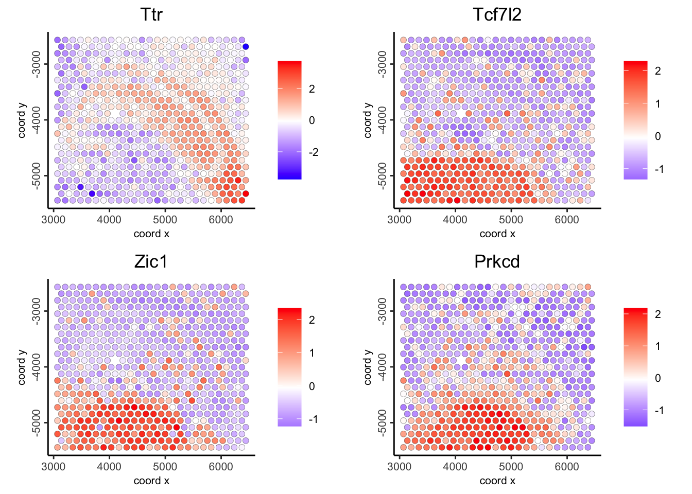

# Interoperability with other frameworks

Iqra

August 7th 2024

Giotto facilitates seamless interoperability with various tools, including Seurat, annData, and SpatialExperiment. Below is a brief introductory tutorial on how Giotto interoperates with these other tools.

## Load Giotto object
To begin the interoperability of a Giotto object with other objects, we first load the required libraries and a Giotto mini object. We then continue with the conversion process:

```{r}
library(Giotto)
library(GiottoData)
```
Here we load Giotto mini Visium object to continue with the interoperability.

```{r, message=FALSE, warning=FALSE}
gobject <- GiottoData::loadGiottoMini("visium")
```

## SpatialExperiment
The Giotto package is interoperable with SpatialExperiment, extending its functionality to include spatial coordinates, images, and image metadata.

To start the conversion of a Giotto mini Visium object to a SpatialExperiment object, we first load the required libraries.

```{r, message=FALSE, warning=FALSE}
library(SpatialExperiment)
library(ggspavis)
library(pheatmap)
library(scater)
library(scran)
library(nnSVG)
```

### Convert Giotto Object to SpatialExperiment Object
To convert the Giotto object to a SpatialExperiment object, we use the giottoToSpatialExperiment() function.

```{r, message=FALSE, warning=FALSE}
gspe <- giottoToSpatialExperiment(gobject)
```

The converter function returns a separate SpatialExperiment object for each spatial unit. The output is a list of objects (one for each unit), and we select the first object for downstream use.

```{r}
spe <- gspe[[1]]
```

## Identify top spatially variable genes with nnSVG
We employ the nnSVG package to identify the top spatially variable genes in our SpatialExperiment object.Covariates can be added to our model; in this example, we use Leiden clustering labels as a covariate. These clustering results were initially computed using the Giotto suite and then transferred to the converted SpatialExperiment object.

```{r}
# One of the assays should be "logcounts"
# We rename the normalized assay to "logcounts"
assayNames(spe)[[2]] <- "logcounts"

# Create model matrix for leiden clustering labels
X <- model.matrix(~ colData(spe)$leiden_clus)
dim(X)

# Run nnSVG
spe <- nnSVG(spe, X = X)

# Show top 10 features
rowData(spe)[order(rowData(spe)$rank)[1:10], ]$feat_ID
```

### Conversion of SpatialExperiment object back to Giotto
We then convert the processed SpatialExperiment object back into a Giotto object for further downstream analysis using the Giotto suite. This is done using the `spatialExperimentToGiotto` function, where we explicitly specify the spatial network from the SpatialExperiment object.

```{r, warning=FALSE, message=FALSE}
giottoFromSPE <- spatialExperimentToGiotto(spe = spe, 
                                           python_path = NULL, 
                                           sp_network = "Delaunay_network")
print(giottoFromSPE)
```

### Plotting top genes from nnSVG in Giotto 
Now, we visualize the genes previously identified in the SpatialExperiment object using the nnSVG package within the Giotto toolkit, leveraging the converted Giotto object.

```{r, warning=FALSE}
ext_spatial_genes <- getFeatureMetadata(giottoFromSPE, output = "data.table")
ext_spatial_genes <- ext_spatial_genes[order(ext_spatial_genes$rank)[1:10], ]$feat_ID
```

```{r, eval=FALSE}
spatFeatPlot2D(giottoFromSPE, 
               expression_values = 'scaled_rna_cell',
               feats = ext_spatial_genes[1:4], 
               point_size = 2)
```

```{r, echo=FALSE, out.width="100%"}

```

## Seurat

The process of conversion between Giotto and Seurat relies on four main functions. `giottoToSeuratV4` and `seuratToGiottoV4` are designed for Seurat version 4, whereas `giottoToSeuratV5` and `seuratToGiottoV5` are specifically for Seurat version 5. In this demonstration, we will only cover the conversion between Seurat version 5 and Giotto. 

### Giotto to Seurat

To convert Giotto object to Seurat V5 object, we first load required libraries and use the function `giottoToSeuratV5()` function 
```{r, message=FALSE, warning=FALSE}
library(Seurat)
```

```{r, warning=FALSE, message=FALSE}
gToS <- giottoToSeuratV5(gobject = gobject, spat_unit = "cell")
```

## AnnData/SpatialData

To convert the giotto object to annData, we use the Giotto's function "giottoToAnnData()"

```{r, warning=FALSE, message=FALSE}
gToAnnData <- giottoToAnnData(gobject)
```
already nn in giotto
for giotto
generate nn network in giotto and use it in anndata for visualization
 use scanpy to generate umap from nn
 
 use scanpy to visualize scanpy
 clustering with umap visuals 
 
 Optional:
 similary anndata and preprocessing on anndata
  QC, Normalization, feature selection, pca
  now convert giotto 
  use giotto function to visualize umap etc


