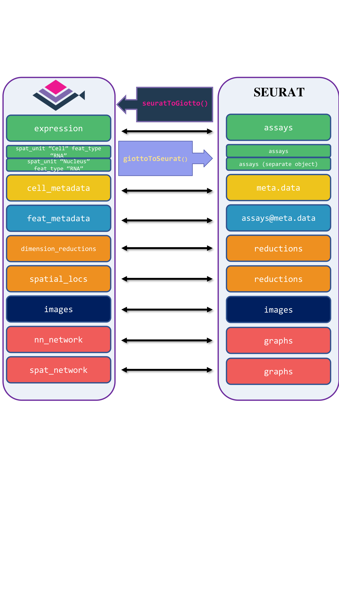
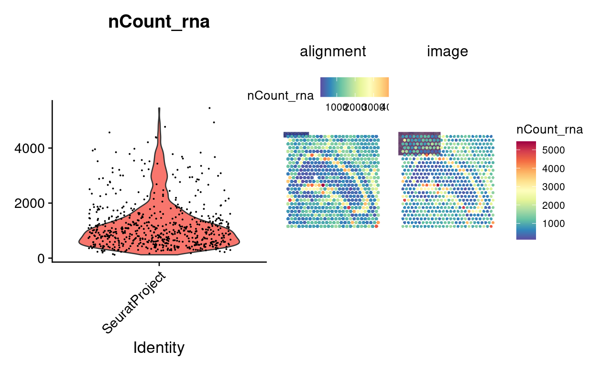
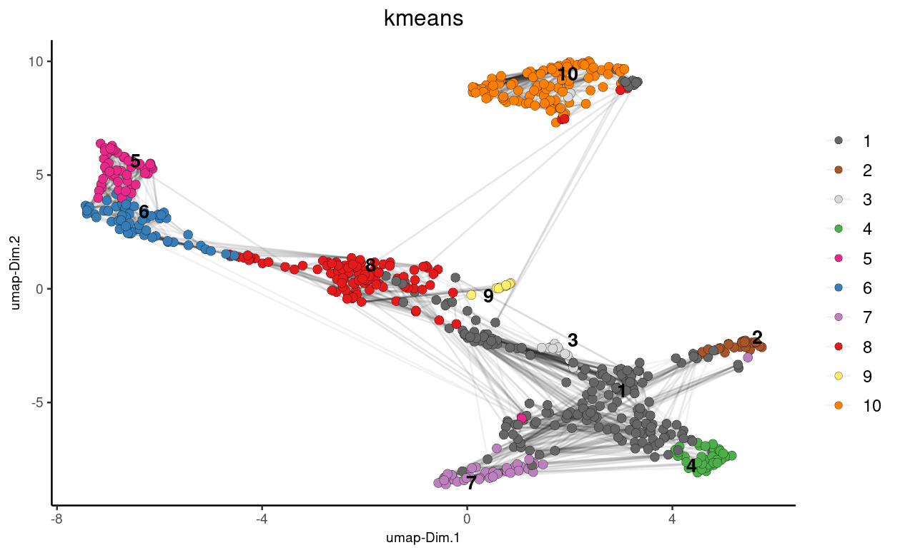
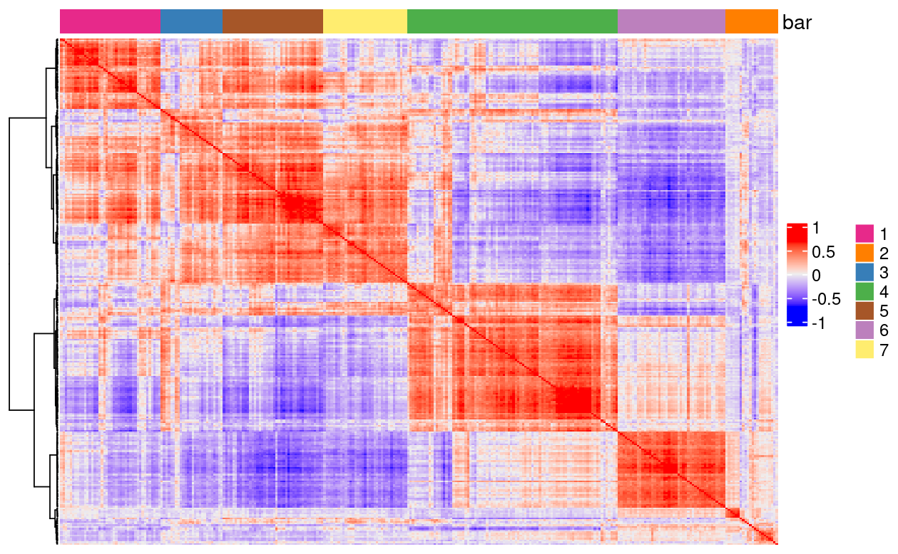
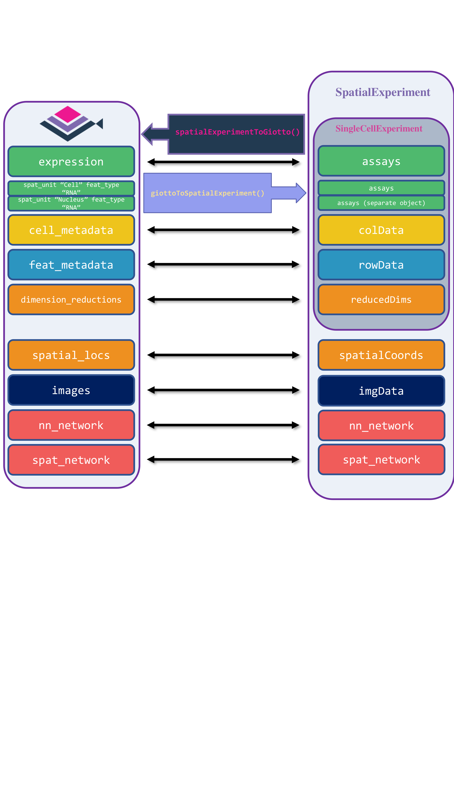
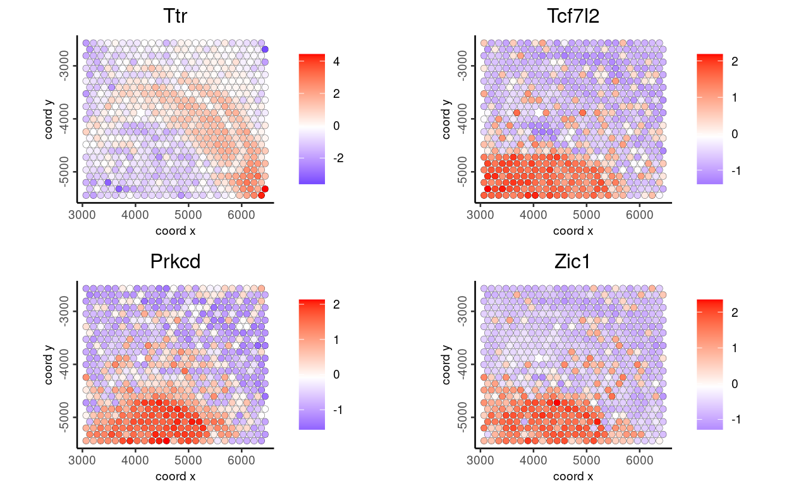
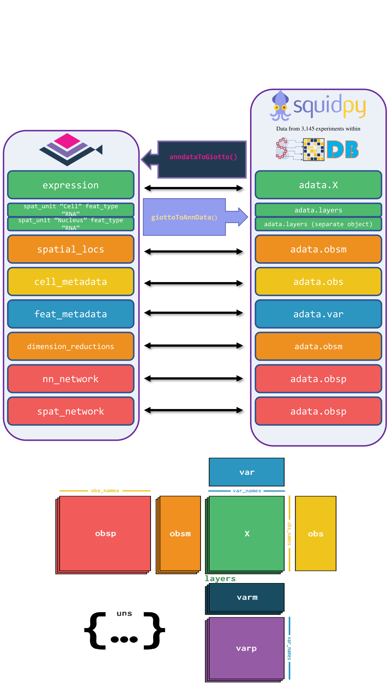
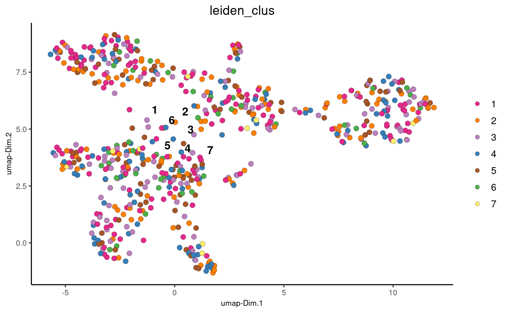

# Interoperability with other frameworks

Iqra

August 7th 2024

Giotto facilitates seamless interoperability with various tools, including Seurat, AnnData, and SpatialExperiment. Below is a comprehensive tutorial on how Giotto interoperates with these other tools.

## Load Giotto object

To begin demonstrating the interoperability of a Giotto object with other frameworks, we first load the required libraries and a Giotto mini object. We then proceed with the conversion process:

```{r, eval = FALSE}
library(Giotto)
library(GiottoData)
```

Load a Giotto mini Visium object, which will be used for demonstrating interoperability.

```{r, eval = FALSE}
gobject <- GiottoData::loadGiottoMini("visium")
```

## Seurat

Giotto Suite provides interoperability between Seurat and Giotto, supporting both older and newer versions of Seurat objects. The four tailored functions are `giottoToSeuratV4()`, `seuratToGiottoV4()` for older versions, and `giottoToSeuratV5()`, `seuratToGiottoV5()` for Seurat v5, which includes subcellular and image information. These functions map Giotto's metadata, dimension reductions, spatial locations, and images to the corresponding slots in Seurat.

```{r, echo=FALSE, out.width="80%", fig.align="center"}

```

### Conversion of Giotto Object to Seurat Object

To convert Giotto object to Seurat V5 object, we first load required libraries and use the function `giottoToSeuratV5()` function 

```{r eval=FALSE}
library(Seurat)
library(SeuratData)
library(ggplot2)
library(patchwork)
library(dplyr)
```

Now we convert the Giotto object to a Seurat V5 object and create violin and spatial feature plots to visualize the RNA count data.

```{r eval=FALSE}
gToS <- giottoToSeuratV5(gobject = gobject, 
                         spat_unit = "cell")

plot1 <- VlnPlot(gToS, 
                 features = "nCount_rna", 
                 pt.size = 0.1) + 
    NoLegend()

plot2 <- SpatialFeaturePlot(gToS, 
                            features = "nCount_rna", 
                            pt.size.factor = 2) + 
    theme(legend.position = "right")

wrap_plots(plot1, plot2)
```

```{r, echo=FALSE, out.width="80%", fig.align="center"}

```

#### Apply SCTransform

We apply SCTransform to perform data transformation on the RNA assay: `SCTransform()` function.

```{r, eval=FALSE}
gToS <- SCTransform(gToS, assay = "rna", verbose = FALSE)
```

#### Dimension Reduction

We perform Principal Component Analysis (PCA), find neighbors, and run UMAP for dimensionality reduction and clustering on the transformed Seurat object:

```{r, eval=FALSE}
gToS <- RunPCA(gToS, assay = "SCT")

gToS <- FindNeighbors(gToS, reduction = "pca", dims = 1:30)

gToS <- RunUMAP(gToS, reduction = "pca", dims = 1:30)
```

### Conversion of Seurat object Back to Giotto Object

To Convert the Seurat Object back to Giotto object, we use the funcion `seuratToGiottoV5()`, specifying the spatial assay, dimensionality reduction techniques, and spatial and nearest neighbor networks.

```{r eval=FALSE}
giottoFromSeurat <- seuratToGiottoV5(sobject = gToS, 
                                     spatial_assay = "rna", 
                                     dim_reduction = c("pca", "umap"), 
                                     sp_network = "Delaunay_network", 
                                     nn_network = c("sNN.pca", "custom_NN" ))
```

#### Clustering and Plotting UMAP

Here we perform K-means clustering on the UMAP results obtained from the Seurat object:

```{r, eval=FALSE}
## k-means clustering
giottoFromSeurat <- doKmeans(gobject = giottoFromSeurat, 
                             dim_reduction_to_use = "pca")

#Plot UMAP post-clustering to visualize kmeans
graph2 <- Giotto::plotUMAP(
    gobject = giottoFromSeurat,
    cell_color = "kmeans",
    show_NN_network = TRUE,
    point_size = 2.5
)

```

```{r, echo=FALSE, out.width="80%", fig.align="center"}

```

#### Spatial CoExpression

We can also use the `binSpect` function to analyze spatial co-expression using the spatial network `Delaunay network` from the Seurat object and then visualize the spatial co-expression using the `heatmSpatialCorFeat()` function:

```{r eval=FALSE}
ranktest <- binSpect(giottoFromSeurat, 
                     bin_method = "rank",
                     calc_hub = TRUE, 
                     hub_min_int = 5,
                     spatial_network_name = "Delaunay_network")

ext_spatial_genes <- ranktest[1:300,]$feats

spat_cor_netw_DT <- detectSpatialCorFeats(
    giottoFromSeurat,
    method = "network",
    spatial_network_name = "Delaunay_network",
    subset_feats = ext_spatial_genes)

top10_genes <- showSpatialCorFeats(spat_cor_netw_DT, 
                                   feats = "Dsp", 
                                   show_top_feats = 10)

spat_cor_netw_DT <- clusterSpatialCorFeats(spat_cor_netw_DT, 
                                           name = "spat_netw_clus", 
                                           k = 7)
heatmSpatialCorFeats(
    giottoFromSeurat,
    spatCorObject = spat_cor_netw_DT,
    use_clus_name = "spat_netw_clus",
    heatmap_legend_param = list(title = NULL),
    save_plot = TRUE,
    show_plot =  TRUE,
    return_plot = FALSE,
    save_param = list(base_height = 6, base_width = 8, units = 'cm'))
```

```{r, echo=FALSE, out.width="80%", fig.align="center"}

```

## SpatialExperiment

For the Bioconductor group of packages, the SpatialExperiment data container handles data from spatial-omics experiments, including spatial coordinates, images, and metadata. Giotto Suite provides `giottoToSpatialExperiment()` and `spatialExperimentToGiotto()`, mapping Giotto's slots to the corresponding SpatialExperiment slots. Since SpatialExperiment can only store one spatial unit at a time, giottoToSpatialExperiment() returns a list of SpatialExperiment objects, each representing a distinct spatial unit.

```{r, echo=FALSE, out.width="80%", fig.align="center"}

```

To start the conversion of a Giotto mini Visium object to a SpatialExperiment object, we first load the required libraries.

```{r eval=FALSE}
library(SpatialExperiment)
library(ggspavis)
library(pheatmap)
library(scater)
library(scran)
library(nnSVG)
```

### Convert Giotto Object to SpatialExperiment Object

To convert the Giotto object to a SpatialExperiment object, we use the `giottoToSpatialExperiment()` function.

```{r eval=FALSE}
gspe <- giottoToSpatialExperiment(gobject)
```

The conversion function returns a separate SpatialExperiment object for each spatial unit. We select the first object for downstream use:

```{r eval=FALSE}
spe <- gspe[[1]]
```

#### Identify top spatially variable genes with nnSVG

We employ the nnSVG package to identify the top spatially variable genes in our SpatialExperiment object. Covariates can be added to our model; in this example, we use Leiden clustering labels as a covariate:

```{r eval=FALSE}
# One of the assays should be "logcounts"
# We rename the normalized assay to "logcounts"
assayNames(spe)[[2]] <- "logcounts"

# Create model matrix for leiden clustering labels
X <- model.matrix(~ colData(spe)$leiden_clus)
dim(X)
```

- Run nnSVG

This step will take several minutes to run

```{r eval=FALSE}
spe <- nnSVG(spe, X = X)

# Show top 10 features
rowData(spe)[order(rowData(spe)$rank)[1:10], ]$feat_ID
```

### Conversion of SpatialExperiment object back to Giotto

We then convert the processed SpatialExperiment object back into a Giotto object for further downstream analysis using the Giotto suite. This is done using the `spatialExperimentToGiotto` function, where we explicitly specify the spatial network from the SpatialExperiment object.

```{r, eval=FALSE}
giottoFromSPE <- spatialExperimentToGiotto(spe = spe, 
                                           python_path = NULL, 
                                           sp_network = "Delaunay_network")

giottoFromSPE <- spatialExperimentToGiotto(spe = spe, 
                                           python_path = NULL, 
                                           sp_network = "Delaunay_network")
print(giottoFromSPE)
```

#### Plotting top genes from nnSVG in Giotto 

Now, we visualize the genes previously identified in the SpatialExperiment object using the nnSVG package within the Giotto toolkit, leveraging the converted Giotto object.

```{r, eval=FALSE}
ext_spatial_genes <- getFeatureMetadata(giottoFromSPE, 
                                        output = "data.table")

ext_spatial_genes <- ext_spatial_genes[order(ext_spatial_genes$rank)[1:10], ]$feat_ID
```

```{r, eval=FALSE}
spatFeatPlot2D(giottoFromSPE, 
               expression_values = "scaled_rna_cell",
               feats = ext_spatial_genes[1:4], 
               point_size = 2)
```

```{r, echo=FALSE, out.width="80%", fig.align="center"}

```

## AnnData

The `anndataToGiotto()` and `giottoToAnnData()` functions map the slots of the Giotto object to the corresponding locations in a Squidpy-flavored AnnData object. Specifically, Giotto’s expression slot maps to `adata.X`, spatial_locs to `adata.obsm`, cell_metadata to `adata.obs`, feat_metadata to `adata.var`, dimension_reduction to `adata.obsm`, and nn_network and spat_network to `adata.obsp`. 

Images are currently not mapped between both classes. Notably, Giotto stores expression matrices within separate spatial units and feature types, while AnnData does not support this hierarchical data storage. Consequently, multiple AnnData objects are created from a Giotto object when there are multiple spatial unit and feature type pairs.

```{r, echo=FALSE, out.width="80%", fig.align="center"}

```

### Load Required Libraries

To start, we need to load the necessary libraries, including `reticulate` for interfacing with Python.

```{r eval=FALSE}
library(reticulate)
```

### Specify Path for Results

First, we specify the directory where the results will be saved. Additionally, we retrieve and update Giotto instructions.

```{r eval=FALSE}
# Specify path to which results may be saved
results_directory <- "results/03_session4/giotto_anndata_conversion/"

instrs <- showGiottoInstructions(gobject)

mini_gobject <- replaceGiottoInstructions(gobject = gobject,
                                         instructions = instrs)
```

#### Create Default kNN Network

We will create a k-nearest neighbor (kNN) network using mostly default parameters.

```{r eval=FALSE}
gobject <- createNearestNetwork(gobject = gobject,
                                spat_unit = "cell",
                                feat_type = "rna",
                                type = "kNN",
                                dim_reduction_to_use = "umap",
                                dim_reduction_name = "umap",
                                k = 15,
                                name = "kNN.umap")
```

### Giotto To AnnData

To convert the giotto object to AnnData, we use the Giotto's function `giottoToAnnData()`

```{r, eval=FALSE}
gToAnnData <- giottoToAnnData(gobject = gobject,
                              save_directory = results_directory)
```

Next, we import scanpy and perform a series of preprocessing steps on the AnnData object.

```{r, eval=FALSE}
scanpy <- import("scanpy")

adata <- scanpy$read_h5ad("results/03_session4/giotto_anndata_conversion/cell_rna_converted_gobject.h5ad")

# Normalize total counts per cell
scanpy$pp$normalize_total(adata, target_sum=1e4)

# Log-transform the data
scanpy$pp$log1p(adata)

# Perform PCA
scanpy$pp$pca(adata, n_comps=40L)

# Compute the neighborhood graph
scanpy$pp$neighbors(adata, n_neighbors=10L, n_pcs=40L)

# Run UMAP
scanpy$tl$umap(adata)

# Save the processed AnnData object
adata$write("results/03_session4/cell_rna_converted_gobject2.h5ad")

processed_file_path <- "results/03_session4/cell_rna_converted_gobject2.h5ad"
```

### Convert AnnData to Giotto

Finally, we convert the processed AnnData object back into a Giotto object for further analysis using Giotto.

```{r eval=FALSE}
giottoFromAnndata <- anndataToGiotto(anndata_path = processed_file_path)
```

#### UMAP Visualization

Now we plot the UMAP using the `GiottoVisuals::plotUMAP()` function that was calculated using Scanpy on the AnnData object.

```{r eval=FALSE}
Giotto::plotUMAP(
    gobject = giottoFromAnndata,
    dim_reduction_name = "umap.ad",
    cell_color = "leiden_clus",
    point_size = 3
)
```

```{r, echo=FALSE, out.width="80%", fig.align="center"}

```

## Create mini Vizgen object

```{r eval=FALSE}
mini_gobject <- loadGiottoMini(dataset = "vizgen", 
                               python_path = NULL)

mini_gobject <- replaceGiottoInstructions(gobject = mini_gobject,
                                          instructions = instrs)
```


```{r eval=FALSE}
mini_gobject <- createNearestNetwork(gobject = mini_gobject,
                                     spat_unit = "aggregate",
                                     feat_type = "rna",
                                     type = "kNN",
                                     dim_reduction_to_use = "umap",
                                     dim_reduction_name = "umap",
                                     k = 6,
                                     name = "new_network")
```

Since we have multiple `spat_unit` and `feat_type` pairs, this function will create multiple `.h5ad` files, with their names returned. Non-default nearest or spatial network names will have their `key_added` terms recorded and saved in corresponding `.txt` files; refer to the documentation for details.

```{r eval=FALSE}
anndata_conversions <- giottoToAnnData(gobject = mini_gobject,
                                       save_directory = results_directory,
                                       python_path = NULL)
```
