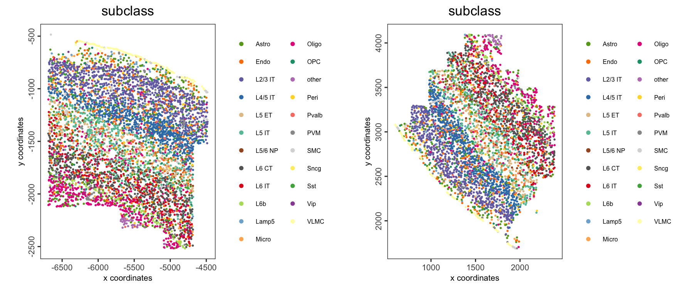
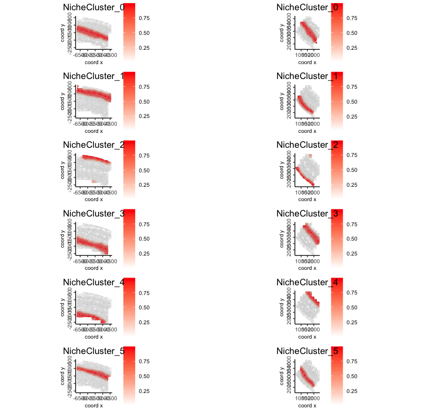
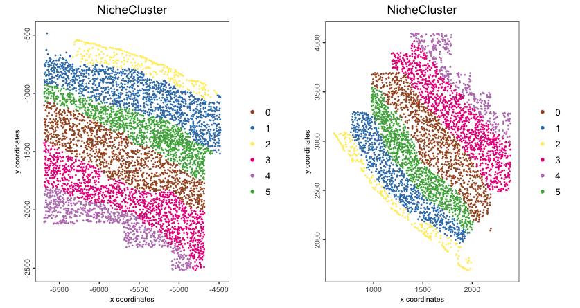
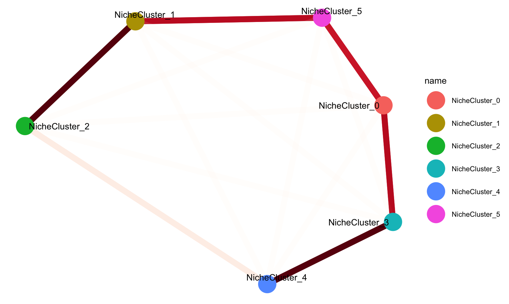
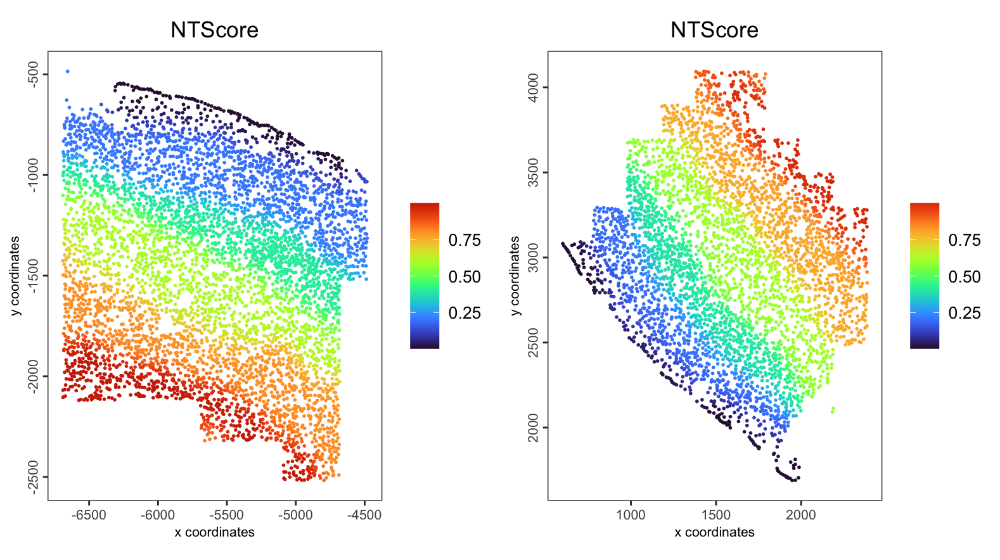
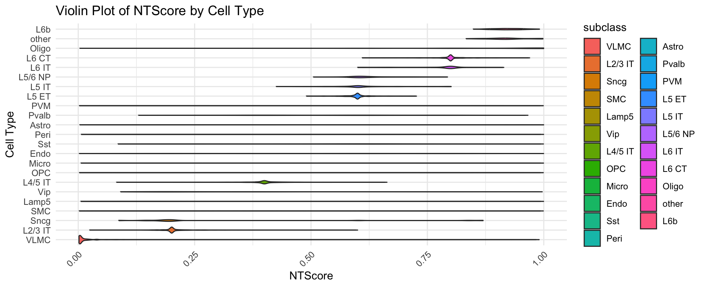
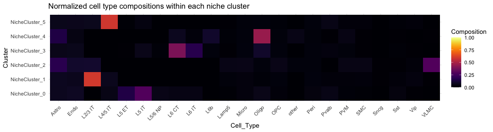

# Interoperability with isolated tools

Wen Wang

August 7th 2024

## Spatial niche trajectory analysis

### Dataset download

The MERFISH mouse motor cortex data to run this tutorial can be found
[here](https://doi.brainimagelibrary.org/doi/10.35077/g.21)

You need to download the processed expression, metadata, and cell segmentation
information by running these commands:

Notes: there are 61 slices here, we run on two of them to save the time.

```{r, eval = FALSE}
data_path <- "data/03_session5"

dir.create(data_path)

options(timeout=10000)

download.file(url = "https://download.brainimagelibrary.org/cf/1c/cf1c1a431ef8d021/processed_data/counts.h5ad",
              destfile = file.path(data_path,"counts.h5ad"))

download.file(url = "https://download.brainimagelibrary.org/cf/1c/cf1c1a431ef8d021/processed_data/cell_labels.csv",
              destfile = file.path(data_path,"cell_labels.csv"))

download.file(url = "https://download.brainimagelibrary.org/cf/1c/cf1c1a431ef8d021/processed_data/segmented_cells_mouse2sample1.csv",
              destfile = file.path(data_path,"segmented_cells_mouse2sample1.csv"))

download.file(url = "https://download.brainimagelibrary.org/cf/1c/cf1c1a431ef8d021/processed_data/segmented_cells_mouse2sample6.csv",
              destfile = file.path(data_path,"segmented_cells_mouse2sample6.csv"))
```

### Create the Giotto object

```{r, eval=FALSE}
library(Giotto)
library(reticulate)

## Set instructions
results_folder <- "results/03_session5"
dir.create(results_folder)
python_path <- NULL

instructions <- createGiottoInstructions(
    save_dir = results_folder,
    save_plot = TRUE,
    show_plot = FALSE,
    return_plot = FALSE,
    python_path = python_path
)


## load data

### meta data
meta_df <- read.csv(file.path(data_path, "cell_labels.csv"), 
                    colClasses = "character") # as the cell IDs are 30 digit numbers, set the type as character to avoid the limitation of R in handling larger integers

colnames(meta_df)[[1]] <- "cell_ID"

slice1_meta_df <- meta_df[meta_df$slice_id == "mouse2_slice229",] # subset selected slice meta info

slice2_meta_df <- meta_df[meta_df$slice_id == "mouse2_slice300",] # subset selected slice meta info

### counts matrix
GiottoClass:::checkPythonPackage("scanpy", 
                                 env_to_use = "giotto_env")

ad2g_path <- system.file("python", "ad2g.py", package = "Giotto")
reticulate::source_python(ad2g_path)

adata <- read_anndata_from_path(file.path(data_path, "counts.h5ad"))

X <- extract_expression(adata)
cID <- extract_cell_IDs(adata)
fID <- extract_feat_IDs(adata)

rownames(X) <- fID
colnames(X) <- cID

slice1_filter <- cID %in% slice1_meta_df$cell_ID
slice2_filter <- cID %in% slice2_meta_df$cell_ID

slice1_exp <- X[,slice1_filter]
slice2_exp <- X[,slice2_filter]

### cell segmentation to cell location
segments_1_df <- read.csv(file.path(data_path, "segmented_cells_mouse2sample1.csv"),
                          row.names=1, colClasses = "character") # as the cell IDs are 30 digit numbers, set the type as character to avoid the limitation of R in handling larger integers

segments_2_df <- read.csv(file.path(data_path, "segmented_cells_mouse2sample6.csv"), 
                          row.names=1, colClasses = "character") # as the cell IDs are 30 digit numbers, set the type as character to avoid the limitation of R in handling larger integers

segments_df <- rbind(segments_1_df, segments_2_df)

loc.use <- segments_df[c(slice1_meta_df$cell_ID, slice2_meta_df$cell_ID),]
loc.x <- grep("boundaryX_",colnames(loc.use), value = TRUE)
loc.y <- grep("boundaryY_",colnames(loc.use), value = TRUE)

centr.x <- apply(loc.use[,loc.x],1,function(x){
  temp <- lapply(x,function(y){
    as.numeric(unlist(strsplit(y,", ")))
  })
  return (median(unname(unlist(temp))))
})

centr.y <- apply(loc.use[,loc.y],1,function(x){
  temp <- lapply(x,function(y){
    as.numeric(unlist(strsplit(y,", ")))
  })
  return (median(unname(unlist(temp))))
})

spatial_locs_df <- data.frame(sdimx = centr.x,sdimy = centr.y)
slice1_spatial_locs_df <- spatial_locs_df[slice1_meta_df$cell_ID,]
slice2_spatial_locs_df <- spatial_locs_df[slice2_meta_df$cell_ID,]

## giotto obj
giotto_obj_1 <- createGiottoObject(expression = slice1_exp,
                                   spatial_locs = slice1_spatial_locs_df,
                                   cell_metadata = slice1_meta_df)

giotto_obj_2 <- createGiottoObject(expression = slice2_exp,
                                   spatial_locs = slice2_spatial_locs_df,
                                   cell_metadata = slice2_meta_df)

giotto_obj <- joinGiottoObjects(gobject_list = list(giotto_obj_1, giotto_obj_2),
                                gobject_names = c("mouse2_slice229",
                                                  "mouse2_slice300"),  # name for each samples
                                join_method = "z_stack")

# We skip the processing process here to save time and use the given cell type
# annotation directly
ONTraC_input <- getONTraCv1Input(gobject = giotto_obj,
                                 cell_type = "subclass",
                                 output_path = data_path,
                                 spat_unit = "cell",
                                 feat_type = "rna",
                                 verbose = TRUE)
```


```{r, eval = FALSE}
head(ONTraC_input)
```

```{r, eval = FALSE}
#                                                 Cell_ID   Sample                  x            y  Cell_Type          
#                                                  <char>   <char>              <dbl>        <dbl>  <char>          
# mouse2_slice229-100101435705986292663283283043431511315   mouse2_slice229	-4828.728	-2203.4502  L6 CT	
# mouse2_slice229-100104370212612969023746137269354247741   mouse2_slice229	-5405.400	 -995.6467  OPC	    
# mouse2_slice229-100128078183217482733448056590230529739   mouse2_slice229	-5731.403	-1071.1735	L2/3 IT	
# mouse2_slice229-100209662400867003194056898065587980841   mouse2_slice229	-5468.113	-1286.2465	Oligo	
# mouse2_slice229-100218038012295593766653119076639444055   mouse2_slice229	-6399.986	 -959.7440	L2/3 IT	
# mouse2_slice229-100252992997994275968450436343196667192   mouse2_slice229	-6637.847	-1659.6237	Astro	

```

Spatial cell type distributions

```{r, eval=FALSE}
spatPlot2D(giotto_obj,
           group_by = "slice_id",
           cell_color = "subclass",
           point_size = 1,
           point_border_stroke = NA,
           legend_text = 6)
```

```{r, echo=FALSE, out.width="100%", fig.align="center"}

```

#### Installation ONTraC

You could run ONTraC on your own laptop or on an HPC with an NVIDIA GPU node.
It will run for less than 10 minutes on this example dataset.
For larger datasets, running on an NVIDIA GPU is recommended, otherwise it will take a long time.

```{bash, eval = FALSE}
source ~/.bash_profile

conda create -y -n ONTraC python=3.11

conda activate ONTraC

pip install git+https://github.com/gyuanlab/ONTraC.git@V2
```

#### Running ONTraC

This step will take several minutes to run.

```{bash, eval = FALSE}
source ~/.bash_profile

conda activate ONTraC

ONTraC --meta-input data/03_session5/ONTraC_dataset_input.csv --preprocessing-dir data/03_session5/preprocessing_dir --GNN-dir data/03_session5/GNN_dir --NTScore-dir data/03_session5/NTScore_dir --device cpu --epochs 1000 -s 42 --patience 100 --min-delta 0.001 --min-epochs 50 --lr 0.03 --hidden-feats 4 -k 6 --modularity-loss-weight 1 --regularization-loss-weight 0.1 --purity-loss-weight 100 --beta 0.3 --equal-space 2>&1 | tee data/03_session5/merfish_subset.log
```

### Visualization

#### Load ONTraC results

```{r, eval = FALSE}
giotto_obj <- loadOntraCResults(gobject = giotto_obj,
                                ontrac_results_dir = data_path)
```

The NTScore and binarized niche cluster info were stored in cell metadata

```{r, eval = FALSE}
head(pDataDT(giotto_obj, spat_unit = "cell", feat_type = "niche cluster"))
```

```{r, eval = FALSE}
#                                                    cell_ID      sample_id        slice_id   class_label subclass    label         list_ID NicheCluster   NTScore
#                                                     <char>         <char>          <char>        <char>   <char>   <char>          <char>        <int>     <num>
# 1: mouse2_slice229-100101435705986292663283283043431511315 mouse2_sample6 mouse2_slice229 Glutamatergic    L6 CT  L6_CT_5 mouse2_slice229            2 0.7998957
# 2: mouse2_slice229-100104370212612969023746137269354247741 mouse2_sample6 mouse2_slice229         Other      OPC      OPC mouse2_slice229            0 0.2003027
# 3: mouse2_slice229-100128078183217482733448056590230529739 mouse2_sample6 mouse2_slice229 Glutamatergic  L2/3 IT L23_IT_4 mouse2_slice229            0 0.2350597
# 4: mouse2_slice229-100209662400867003194056898065587980841 mouse2_sample6 mouse2_slice229         Other    Oligo  Oligo_1 mouse2_slice229            1 0.3990417
# 5: mouse2_slice229-100218038012295593766653119076639444055 mouse2_sample6 mouse2_slice229 Glutamatergic  L2/3 IT L23_IT_4 mouse2_slice229            0 0.2910255
# 6: mouse2_slice229-100252992997994275968450436343196667192 mouse2_sample6 mouse2_slice229         Other    Astro  Astro_2 mouse2_slice229            2 0.8007477
```

The probability matrix of each cell assigned to each niche cluster and
connectivity between niche cluster were stored here.

```{r, eval=FALSE}
GiottoClass::list_expression(giotto_obj)
```

```{r, eval = FALSE}
#        spat_unit     feat_type       name
#           <char>        <char>     <char>
# 1:          cell           rna        raw
# 2:          cell niche cluster       prob
# 3: niche cluster  connectivity normalized
```

#### Niche cluster prob

```{r, eval = FALSE}
spatFeatPlot2D(gobject = giotto_obj, 
           spat_unit = "cell",
           feat_type = "niche cluster",
           expression_values = "prob",
           group_by = "list_ID",
           feats = rownames(giotto_obj@expression$cell$`niche cluster`$prob),
           point_border_col = "gray"
           )
```

```{r, echo=FALSE, out.width="60%", fig.align="center"}

```

#### Binarized niche cluster

```{r, eval = FALSE}
spatPlot2D(giotto_obj,
           spat_unit = "cell",
           group_by = "list_ID",
           cell_color = "NicheCluster",
           color_as_factor = TRUE,
           point_size = 1,
           point_border_stroke = NA,
           title = "Niche cluster")
```

```{r, echo=FALSE, out.width="80%", fig.align="center"}

```

#### Niche cluster spatial connectivity

```{r, eval=FALSE}
set.seed(100)  # fix the node positions

plotNicheClusterConnectivity(gobject = giotto_obj)
```

```{r, echo=FALSE, out.width="60%", fig.align="center"}

```

#### NT score

```{r, eval=FALSE}
spatPlot2D(gobject = giotto_obj, 
           spat_unit = "cell",
           feat_type = "rna",
           group_by = "list_ID",
           cell_color = "NTScore",
           color_as_factor = FALSE,
           cell_color_gradient = "turbo",
           point_size = 1,
           point_border_stroke = NA
           )
```

```{r, echo=FALSE, out.width="80%", fig.align="center"}

```

```{r, eval=FALSE}
plotCellTypeNTScore(gobject = giotto_obj,
                    cell_type = "subclass")
```

```{r, echo=FALSE, out.width="80%", fig.align="center"}

```

#### Cell type composition within niche cluster

```{r, eval=FALSE}
plotCTCompositionInNicheCluster(gobject = giotto_obj,
                                cell_type = "subclass")
```

```{r, echo=FALSE, out.width="80%", fig.align="center"}

```
