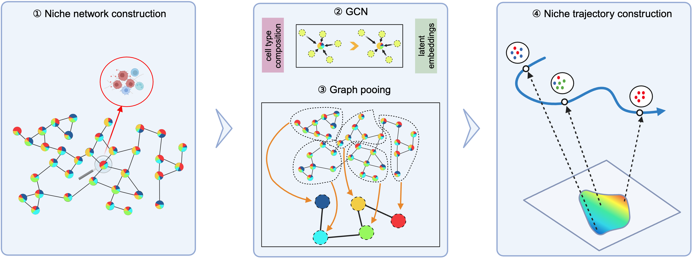
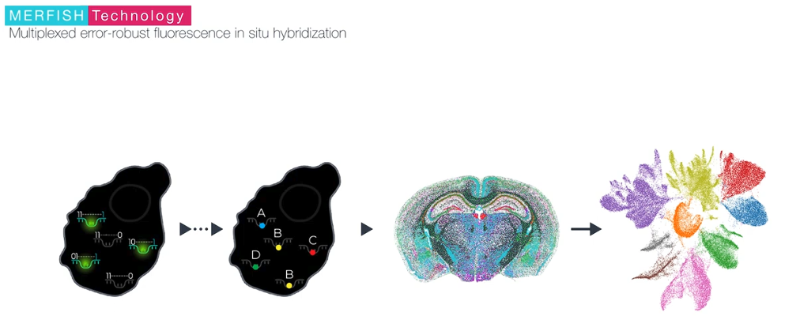
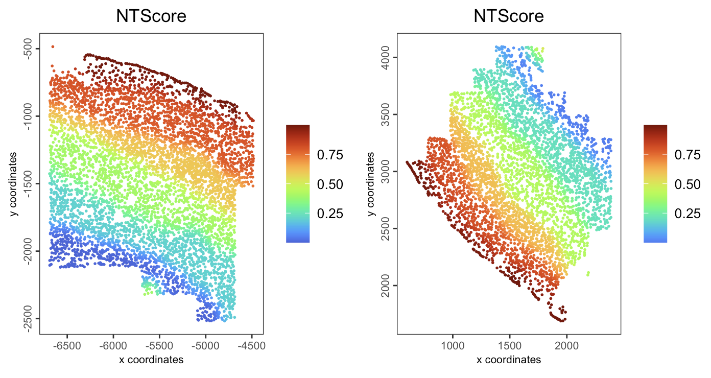
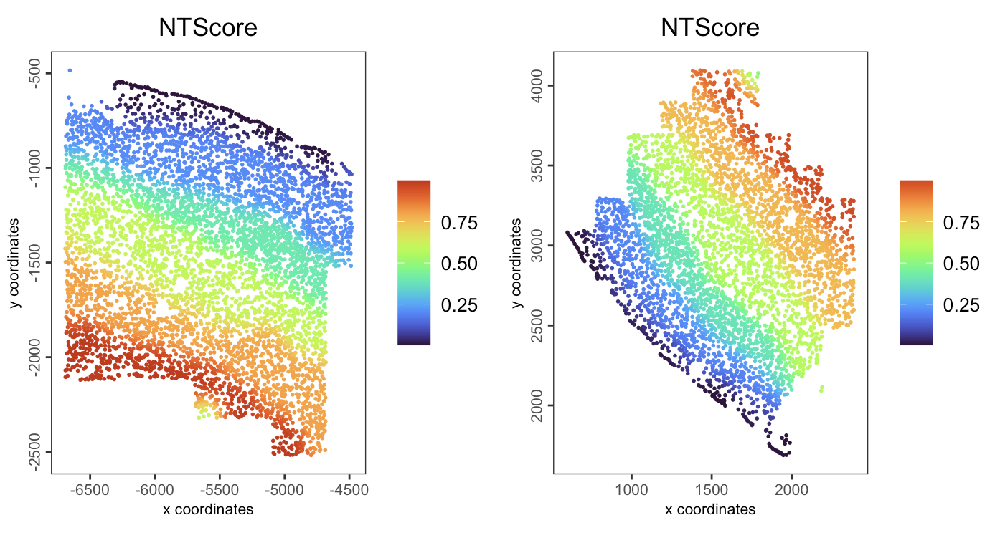

# Interoperability with isolated tools

Wen Wang

August 7th 2024

## Spatial niche trajectory analysis (ONTraC)

### Introduction to ONTraC

ONTraC (Ordered Niche Trajectory Construction) is a niche-centered, machine learning
method for constructing spatially continuous trajectories. ONTraC differs from existing tools in that it treats a niche, rather than an individual cell, as the basic unit for spatial trajectory analysis. In this context, we define niche as a multicellular, spatially localized region where different cell types may coexist and interact with each other.  ONTraC seamlessly integrates cell-type composition and spatial information by using the graph neural network modeling framework. Its output, which is called the niche trajectory, can be viewed as a one dimensional representation of the tissue microenvironment continuum. By disentangling cell-level and niche-level properties, niche trajectory analysis provides a coherent framework to study coordinated responses from all the cells in association with continuous tissue microenvironment variations.

```{r, echo=FALSE, out.width="80%", fig.align="center"}

```

[ONTraC paper](https://www.biorxiv.org/content/10.1101/2024.04.23.590827v1)

[ONTraC GitHub repository](https://github.com/gyuanlab/ONTraC)

[PPT](https://docs.google.com/presentation/d/1XlRIJDLNrSYP4rd5qsF3bvMMlgqN8VUiaZIO8jF0cto/edit?usp=sharing)

### Introduction to MERFISH

MERFISH is a massively multiplexed single-molecule imaging technology for spatially resolved transcriptomics capable of simultaneously measuring the copy number and spatial distribution of hundreds to tens of thousands of RNA species in individual cells. For further information, please visit the official [website](https://vizgen.com/technology/#merfish).

```{r, echo=FALSE, out.width="100%", fig.align="center"}

```

### Settings

```{r, eval=FALSE}
options(timeout=Inf) # In case of network interrupt

data_path <- file.path("data","03_session5")
dir.create(data_path)

results_folder <- file.path("results","03_session5")
dir.create(results_folder)
```

### Dataset

This is a MERFISH mouse motor cortex dataset comprising 61 tissue sections and containing approximately 280,000 cells characterised by a 258-gene panel. The study identified 3 classes of cells, glutamatergic, GABAergic and non-neuronal cell groups, and further clustered into 23 annotated plus 1 other subclass-level cell types.

```{r, echo=FALSE, out.width="100%", fig.align="center"}
knitr::include_graphics("img/03_session5/0-Dataset.png")
```


Pseudotime based methods could generate one dimensional coordinates for specific lineages but lack the ability to generate trajectories for whole samples. By moving our focus from the cell to the niche (local microenvironment), ONTraC could generate niche trajectories for whole samples and map the NT score to each cell.


#### Dataset download

The MERFISH mouse motor cortex data to run this tutorial can be found
[here](https://doi.brainimagelibrary.org/doi/10.35077/g.21)

You need to download the processed expression, metadata, and cell segmentation
information by running these commands:

Note 1: there are 61 slices here, we run on two of them to save the time.
Note 2: due to the instability of network, download processing may be interrupt.

We recommend to download these data in advance or download the processing giotto obj from [Zenodo](https://zenodo.org/communities/gw2024/).

```{r, eval = FALSE}
download.file(url = "https://download.brainimagelibrary.org/cf/1c/cf1c1a431ef8d021/processed_data/counts.h5ad",
              destfile = file.path(data_path,"counts.h5ad"))

download.file(url = "https://download.brainimagelibrary.org/cf/1c/cf1c1a431ef8d021/processed_data/cell_labels.csv",
              destfile = file.path(data_path,"cell_labels.csv"))

download.file(url = "https://download.brainimagelibrary.org/cf/1c/cf1c1a431ef8d021/processed_data/segmented_cells_mouse2sample1.csv",
              destfile = file.path(data_path,"segmented_cells_mouse2sample1.csv"))

download.file(url = "https://download.brainimagelibrary.org/cf/1c/cf1c1a431ef8d021/processed_data/segmented_cells_mouse2sample6.csv",
              destfile = file.path(data_path,"segmented_cells_mouse2sample6.csv"))
```

### Create the Giotto object

```{r, eval=FALSE}
library(Giotto)
library(reticulate)

## Set instructions
python_path <- NULL

instructions <- createGiottoInstructions(
  save_dir = results_folder,
  save_plot = TRUE,
  show_plot = FALSE,
  return_plot = FALSE,
  python_path = python_path
)

## create Giotto object from expression counts. This file contains 61 slices here.
giotto_all_slices_obj <- anndataToGiotto(file.path(data_path, "counts.h5ad"))

## load meta_data
meta_df <- read.csv(file.path(data_path, "cell_labels.csv"),
                    colClasses = "character") # as the cell IDs are 30 digit numbers, set the type as character to avoid the limitation of R in handling larger integers
colnames(meta_df)[[1]] <- "cell_ID"

### we use two slices here to speed up
slice1_cells <- meta_df[meta_df$slice_id == "mouse2_slice229",]$cell_ID
slice2_cells <- meta_df[meta_df$slice_id == "mouse2_slice300",]$cell_ID
selected_cells <- c(slice1_cells, slice2_cells)

## subset giotto obj by cell ID
giotto_slice1_obj <- subsetGiotto(gobject = giotto_all_slices_obj,
                                  cell_ids = slice1_cells)

giotto_slice2_obj <- subsetGiotto(gobject = giotto_all_slices_obj,
                                  cell_ids = slice2_cells)

## add cell metadata
giotto_slice1_obj <- addCellMetadata(gobject = giotto_slice1_obj,
                                     new_metadata = meta_df,
                                     by_column = TRUE)

giotto_slice2_obj <- addCellMetadata(gobject = giotto_slice2_obj,
                                     new_metadata = meta_df,
                                     by_column = TRUE)

## cell segmentation. Calculate center (median of vertices) of each cell.
segments_1_df <- read.csv(file.path(data_path, "segmented_cells_mouse2sample1.csv"), 
                          row.names=1, colClasses = "character") # as the cell IDs are 30 digit numbers, set the type as character to avoid the limitation of R in handling larger integers

segments_2_df <- read.csv(file.path(data_path, "segmented_cells_mouse2sample6.csv"), 
                          row.names=1, colClasses = "character") # as the cell IDs are 30 digit numbers, set the type as character to avoid the limitation of R in handling larger integers

segments_df <- rbind(segments_1_df, segments_2_df)

loc.use <- segments_df[selected_cells,]
loc.x <- grep("boundaryX_",colnames(loc.use),value = T)
loc.y <- grep("boundaryY_",colnames(loc.use),value = T)

centr.x <- apply(loc.use[,loc.x],1,function(x){
  temp <- lapply(x,function(y){
    as.numeric(unlist(strsplit(y,", ")))
  })
  return (median(unname(unlist(temp))))
})

centr.y <- apply(loc.use[,loc.y],1,function(x){
  temp <- lapply(x,function(y){
    as.numeric(unlist(strsplit(y,", ")))
  })
  return (median(unname(unlist(temp))))
})

## create spatial locations object
spatial_locs_df <- data.frame(cell_ID = selected_cells,
                              sdimx = centr.x,
                              sdimy = centr.y)

spatial_locs_slice1_df <- spatial_locs_df[slice1_cells,]
spatial_locs_slice2_df <- spatial_locs_df[slice2_cells,]

spat_locs_slice1_obj <- readSpatLocsData(data_list = spatial_locs_slice1_df)
spat_locs_slice2_obj <- readSpatLocsData(data_list = spatial_locs_slice2_df)

## add spatial location info
giotto_slice1_obj <- setSpatialLocations(gobject = giotto_slice1_obj,
                                         x = spat_locs_slice1_obj)

giotto_slice2_obj <- setSpatialLocations(gobject = giotto_slice2_obj,
                                         x = spat_locs_slice2_obj)

## merge two giotto objects together
giotto_obj <- joinGiottoObjects(gobject_list = list(giotto_slice1_obj,
                                                    giotto_slice2_obj),
                               gobject_names = c("mouse2_slice229",
                                                 "mouse2_slice300"),  # name for each samples
                               join_method = "z_stack")

## save giotto obj
# saveGiotto
saveGiotto(gobject = giotto_obj, foldername = "gobject", dir=results_folder)
```


If you facing network issue when downloading the raw dataset. Please download the processing giotto obj from [Zenodo](https://zenodo.org/communities/gw2024/), unzip and move it to `results` folder

```{r, eval=FALSE}
giotto_obj <- loadGiotto(path_to_folder = file.path(results_folder, "gobject"))
```

#### Spatial distribution of cell type

```{r, eval=FALSE}
spatPlot2D(giotto_obj,
           group_by = "slice_id",
           cell_color = "subclass",
           point_size = 1,
           point_border_stroke = NA,
           legend_text = 6)
```

```{r, echo=FALSE, out.width="100%", fig.align="center"}
knitr::include_graphics("img/03_session5/1-spatialCellTypeDis.png")
```


```{r, eval = FALSE}
# We skip the processing process here to save time and use the given cell type
# annotation directly
ONTraC_input <- getONTraCv1Input(gobject = giotto_obj,
                                 cell_type = "subclass",
                                 output_path = results_folder,
                                 spat_unit = "cell",
                                 feat_type = "rna",
                                 verbose = TRUE)
```


```{r, eval = FALSE}
head(ONTraC_input)
```

```{r, eval = FALSE}
#   Cell_ID                                                     Sample          x           y           Cell_Type          
#   <chr>                                                       <chr>           <dbl>       <dbl>       <chr>
#   mouse2_slice229-100101435705986292663283283043431511315     mouse2_slice229	-4828.728	-2203.4502	L6 CT
#   mouse2_slice229-100104370212612969023746137269354247741     mouse2_slice229	-5405.400	-995.6467	OPC
#   mouse2_slice229-100128078183217482733448056590230529739     mouse2_slice229	-5731.403	-1071.1735	L2/3 IT
#   mouse2_slice229-100209662400867003194056898065587980841     mouse2_slice229	-5468.113	-1286.2465	Oligo
#   mouse2_slice229-100218038012295593766653119076639444055     mouse2_slice229	-6399.986	-959.7440	L2/3 IT
#   mouse2_slice229-100252992997994275968450436343196667192     mouse2_slice229	-6637.847	-1659.6237	Astro

```


### Perform spatial niche trajectory analysis using ONTraC

#### ONTraC Installation

You could run ONTraC on your own laptop or on an HPC with an NVIDIA GPU node.
It will run for less than 10 minutes on this example dataset.
For larger datasets, running on an NVIDIA GPU is recommended, otherwise it will take a long time.

```{bash, eval = FALSE}
source ~/.bash_profile

conda create -y -n ONTraC python=3.11

conda activate ONTraC

pip install ONTraC
```

#### Running ONTraC

This step will take several minutes to run.

```{bash, eval = FALSE}
source ~/.bash_profile

conda activate ONTraC

ONTraC -d results/03_session5/ONTraC_dataset_input.csv --preprocessing-dir results/03_session5/preprocessing_dir --GNN-dir results/03_session5/GNN_dir --NTScore-dir results/03_session5/NTScore_dir --device cuda     --epochs 1000 -s 42 --patience 100 --min-delta 0.001 --min-epochs 50 --lr 0.03     --hidden-feats 4 -k 6 --modularity-loss-weight 0.3 --purity-loss-weight 300 --regularization-loss-weight 0.3 --beta 0.03 2>&1 | tee results/03_session5/merfish_subset.log
```

### Visualization

#### Load ONTraC results

```{r, eval = FALSE}
giotto_obj <- loadOntraCResults(gobject = giotto_obj,
                                ontrac_results_dir = results_folder)
```

The NTScore and binarized niche cluster info were stored in cell metadata

```{r, eval = FALSE}
head(pDataDT(giotto_obj, spat_unit = "cell", feat_type = "rna"))
```

```{r, eval = FALSE}
#                                                       cell_ID      sample_id        slice_id   class_label subclass    label      list_ID         NicheCluster   NTScore
#                                                        <char>         <char>          <char>        <char>   <char>   <char>       <char>                <int>     <num>
#   1:  mouse2_slice229-100101435705986292663283283043431511315	mouse2_sample6	mouse2_slice229	Glutamatergic	L6 CT	L6_CT_5	    mouse2_slice229	          3	0.2002081
#   2:  mouse2_slice229-100104370212612969023746137269354247741	mouse2_sample6	mouse2_slice229	Other	        OPC     OPC	        mouse2_slice229.          1 0.7999791
#   3:  mouse2_slice229-100128078183217482733448056590230529739	mouse2_sample6	mouse2_slice229	Glutamatergic	L2/3 IT	L23_IT_4	mouse2_slice229	          1	0.7662198
#   4:  mouse2_slice229-100209662400867003194056898065587980841	mouse2_sample6	mouse2_slice229	Other	        Oligo	Oligo_1	    mouse2_slice229	          5	0.6010420
#   5:  mouse2_slice229-100218038012295593766653119076639444055	mouse2_sample6	mouse2_slice229	Glutamatergic	L2/3 IT	L23_IT_4	mouse2_slice229	          1	0.7132024
#   6:  mouse2_slice229-100252992997994275968450436343196667192	mouse2_sample6	mouse2_slice229	Other	        Astro	Astro_2	    mouse2_slice229	          3	0.1980136
```

The probability matrix of each cell assigned to each niche cluster and
connectivity between niche cluster were stored here.

```{r, eval=FALSE}
GiottoClass::list_expression(giotto_obj)
```

```{r, eval = FALSE}
#        spat_unit     feat_type       name
#           <char>        <char>     <char>
# 1:          cell           rna        raw
# 2:          cell niche cluster       prob
# 3: niche cluster  connectivity normalized
```

#### Niche cluster probability distribution

```{r, eval = FALSE}
spatFeatPlot2D(gobject = giotto_obj, 
               spat_unit = "cell",
               feat_type = "niche cluster",
               expression_values = "prob",
               group_by = "list_ID",
               feats = rownames(giotto_obj@expression$cell$`niche cluster`$prob),
               point_border_col = "gray"
)
```

```{r, echo=FALSE, out.width="60%", fig.align="center"}
knitr::include_graphics("img/03_session5/2-spatialNicheClusterProb.png")
```

#### Binarized niche cluster for each cell

```{r, eval = FALSE}
spatPlot2D(giotto_obj,
           spat_unit = "cell",
           group_by = "slice_id",
           cell_color = "NicheCluster",
           color_as_factor = TRUE,
           point_size = 1,
           point_border_stroke = NA)
```

```{r, echo=FALSE, out.width="80%", fig.align="center"}

```

#### Niche cluster spatial connectivity

```{r, eval=FALSE}
set.seed(42)  # fix the node positions

plotNicheClusterConnectivity(gobject = giotto_obj)
```

```{r, echo=FALSE, out.width="60%", fig.align="center"}
knitr::include_graphics("img/03_session5/4-nicheClusterConnectivity.png")
```

#### NT (niche trajectory) score

```{r, eval=FALSE}
spatPlot2D(gobject = giotto_obj, 
           spat_unit = "cell",
           feat_type = "rna",
           group_by = "slice_id",
           cell_color = "NTScore",
           color_as_factor = FALSE,
           cell_color_gradient = "turbo",
           point_size = 1,
           point_border_stroke = NA
)
```

```{r, echo=FALSE, out.width="80%", fig.align="center"}

```

We could change the direction of NT scores here.

```{r, eval=FALSE}
giotto_obj@cell_metadata$cell$rna$NTScore <- 1 - giotto_obj@cell_metadata$cell$rna$NTScore
```

```{r, eval=FALSE}
spatPlot2D(gobject = giotto_obj, 
           spat_unit = "cell",
           feat_type = "rna",
           group_by = "slice_id",
           cell_color = "NTScore",
           color_as_factor = FALSE,
           cell_color_gradient = "turbo",
           point_size = 1,
           point_border_stroke = NA
)
```

```{r, echo=FALSE, out.width="80%", fig.align="center"}

```

```{r, eval=FALSE}
plotCellTypeNTScore(gobject = giotto_obj,
                    cell_type = "subclass",
                    values = "NTScore",
                    spat_unit = "cell",
                    feat_type = "rna")
```

```{r, echo=FALSE, out.width="80%", fig.align="center"}

```

#### Cell type composition within niche cluster

```{r, eval=FALSE}
plotCTCompositionInNicheCluster(gobject = giotto_obj,
                                cell_type = "subclass")
```


```{r, echo=FALSE, out.width="80%", fig.align="center"}

```


## Session info

```{r, eval=FALSE}
sessionInfo()
```

```{r, eval=FALSE}
# R version 4.4.0 (2024-04-24)
# Platform: aarch64-apple-darwin20
# Running under: macOS Ventura 13.6.6
# 
# Matrix products: default
# BLAS:   /System/Library/Frameworks/Accelerate.framework/Versions/A/Frameworks/vecLib.framework/Versions/A/libBLAS.dylib 
# LAPACK: /Library/Frameworks/R.framework/Versions/4.4-arm64/Resources/lib/libRlapack.dylib;  LAPACK version 3.12.0
# 
# locale:
# [1] en_US.UTF-8/en_US.UTF-8/en_US.UTF-8/C/en_US.UTF-8/en_US.UTF-8
# 
# time zone: America/New_York
# tzcode source: internal
# 
# attached base packages:
# [1] stats     graphics  grDevices utils     datasets  methods   base     
# 
# other attached packages:
# [1] ggraph_2.2.1      ggplot2_3.5.1     reticulate_1.37.0 Giotto_4.1.0      GiottoClass_0.3.2
# 
# loaded via a namespace (and not attached):
#  [1] tidyselect_1.2.1    viridisLite_0.4.2   dplyr_1.1.4         farver_2.1.2        GiottoVisuals_0.2.4 viridis_0.6.5       fastmap_1.2.0       lazyeval_0.2.2      tweenr_2.0.3        digest_0.6.35       lifecycle_1.0.4    
# [12] terra_1.7-78        magrittr_2.0.3      dbscan_1.1-12       compiler_4.4.0      rlang_1.1.4         tools_4.4.0         igraph_2.0.3        utf8_1.2.4          yaml_2.3.8          data.table_1.15.4   knitr_1.47         
# [23] labeling_0.4.3      graphlayouts_1.1.1  htmlwidgets_1.6.4   sp_2.1-4            plyr_1.8.9          RColorBrewer_1.1-3  withr_3.0.0         purrr_1.0.2         grid_4.4.0          polyclip_1.10-6     fansi_1.0.6        
# [34] colorspace_2.1-0    scales_1.3.0        gtools_3.9.5        MASS_7.3-60.2       cli_3.6.2           rmarkdown_2.27      generics_0.1.3      rstudioapi_0.16.0   httr_1.4.7          reshape2_1.4.4      cachem_1.1.0       
# [45] ggforce_0.4.2       stringr_1.5.1       parallel_4.4.0      matrixStats_1.3.0   vctrs_0.6.5         Matrix_1.7-0        jsonlite_1.8.8      bookdown_0.40       ggrepel_0.9.5       scattermore_1.2     magick_2.8.3       
# [56] GiottoUtils_0.1.10  plotly_4.10.4       tidyr_1.3.1         glue_1.7.0          codetools_0.2-20    cowplot_1.1.3       stringi_1.8.4       gtable_0.3.5        deldir_2.0-4        munsell_0.5.1       tibble_3.2.1       
# [67] pillar_1.9.0        htmltools_0.5.8.1   R6_2.5.1            tidygraph_1.3.1     evaluate_0.24.0     lattice_0.22-6      png_0.1-8           backports_1.5.0     memoise_2.0.1       Rcpp_1.0.12         gridExtra_2.3      
# [78] checkmate_2.3.1     colorRamp2_0.1.0    xfun_0.44           pkgconfig_2.0.3    
```
