# Interactivity with the R/Spatial ecosystem

Jeff Sheridan

August 7th 2024


## Kriging

Low resolution spatial data typically covers multiple cells making it difficult to delineate the cell contribution to gene expression. Using a process called kriging we can interpolate gene expression at the single cell levels from low resolution datasets. Kriging is a spatial interpolation technique that estimates unknown values at specific locations by weighing nearby known values based on distance and spatial trends. It uses a model to account for both the distance between points and the overall pattern in the data to make accurate predictions. By taking discrete measurement spots, such as those used for visium, we can interpolate gene expression to a finer scale using kriging.  

### Visium technology

```{r, echo=FALSE, out.width="80%", fig.align="center", fig.cap="Overview of Visium. Source: 10X Genomics."}
knitr::include_graphics("img/03_session1/visium_overview.png")
```

Visium by 10x Genomics is a spatial gene expression platform that allows for the mapping of gene expression to high-resolution histology through RNA sequencing The process involves placing a tissue section on a specially prepared slide with an array of barcoded spots, which are 55 µm in diameter with a spot to spot distance of 100 µm. Each spot contains unique barcodes that capture the mRNA from the tissue section, preserving the spatial information. After the tissue is imaged and RNA is captured, the mRNA is sequenced, and the data is mapped back to the tissue's spatial coordinates. This technology is particularly useful in understanding complex tissue environments, such as tumors, by providing insights into how gene expression varies across different regions.

### Dataset

For this tutorial we'll be using the mouse brain dataset described in section 6. Visium datasets require a high resolution H&E or IF image to align spots to. Using these images we can identify individual nuclei and cells to be used for kriging. Identifying nuclei is outside the scope of the current tutorial but is required to perform kriging.

### Generating a geojson file of nuclei location

For the following sections we will need to create a geojson that contains polygon information for the nuclei in the sample. We will be providing this in the following [link](https://zenodo.org/records/13144556), however when using for your own datasets this will need to be done outside of Giotto. A tutorial for this using qupath can be found [here](https://qupath.readthedocs.io/en/stable/docs/tutorials/cell_detection.html).

## Downloading the dataset

We first need to import a dataset that we want to perform kriging on.
```{r, eval=FALSE}

data_directory <- "data/03_session6"
dir.create(data_directory)

download.file(url = "https://cf.10xgenomics.com/samples/spatial-exp/1.1.0/V1_Adult_Mouse_Brain/V1_Adult_Mouse_Brain_raw_feature_bc_matrix.tar.gz",
              destfile = file.path(data_directory, "V1_Adult_Mouse_Brain_raw_feature_bc_matrix.tar.gz"))

download.file(url = "https://cf.10xgenomics.com/samples/spatial-exp/1.1.0/V1_Adult_Mouse_Brain/V1_Adult_Mouse_Brain_spatial.tar.gz",
              destfile = file.path(data_directory, "V1_Adult_Mouse_Brain_spatial.tar.gz"))
```

## Extracting the files
```{r, eval=FALSE}

untar(tarfile = file.path(data_directory, "V1_Adult_Mouse_Brain_raw_feature_bc_matrix.tar.gz"), 
      exdir = data_directory)

untar(tarfile = file.path(data_directory, "V1_Adult_Mouse_Brain_spatial.tar.gz"), 
      exdir = data_directory)
```

## Downloading giotto object and nuclei segmentation
We will need nuclue/cell segmentations to perform the kirging. Later in the tutorial we'll also be using a premade giotto object. Download them using the following:

```{r}
destfile = file.path(data_directory, 'subcellular_gobject.zip')

options(timeout = 9999999) # Needed to download large files

download.file('https://zenodo.org/records/13144556/files/Day3_Session6.zip?download=1', destfile = destfile)

unzip(file.path(data_directory, 'subcellular_gobject.zip'), exdir = data_directory)
```


## Importing visium data

We're going to begin by creating a Giotto object for the visium mouse brain dataset. This tutorial won't go into detail about each of these steps as these have been covered for this dataset in section 6. To get the best results when performing gene expression interpolation we need to identify spatially distinct genes. Therefore, we need to perform nearest neighbour to create a spatial network.

If you have a Giotto object from day 1 session 5, feel free to load that in and skip this first step.

```{r, eval=FALSE}
library(Giotto)

save_directory <- 'results/03_session6'
visium_save_directory <- file.path(save_directory, 'visium_mouse_brain')
subcell_save_directory <- file.path(save_directory, 'pseudo_subcellular/')

instrs <- createGiottoInstructions(show_plot = TRUE,
                                  save_plot = TRUE,
                                  save_dir = visium_save_directory)

v_brain <- createGiottoVisiumObject(data_directory, gene_column_index = 2, instructions = instrs)

# Subset to in tissue only
cm = pDataDT(v_brain)
in_tissue_barcodes = cm[in_tissue == 1]$cell_ID
v_brain = subsetGiotto(v_brain, cell_ids = in_tissue_barcodes)

# Filter
v_brain = filterGiotto(gobject = v_brain,
                       expression_threshold = 1,
                       feat_det_in_min_cells = 50,
                       min_det_feats_per_cell = 1000,
                       expression_values = c('raw'))

# Normalize
v_brain = normalizeGiotto(gobject = v_brain,
                          scalefactor = 6000,
                          verbose = TRUE)

# Add stats
v_brain = addStatistics(gobject = v_brain)

# ID HVF
v_brain = calculateHVF(gobject = v_brain, method = "cov_loess")
fm = fDataDT(v_brain)
hv_feats = fm[hvf == 'yes' & perc_cells > 3 & mean_expr_det > 0.4]$feat_ID
length(hv_feats)

# Dimension Reductions
v_brain = runPCA(gobject = v_brain,
                 feats_to_use = hv_feats)

v_brain = runUMAP(v_brain,
                  dimensions_to_use = 1:10,
                  n_neighbors = 15,
                  set_seed = TRUE)

# NN Network
v_brain = createNearestNetwork(gobject = v_brain,
                               dimensions_to_use = 1:10,
                               k = 15)
# Leiden Cluster
v_brain = doLeidenCluster(gobject = v_brain,
                          resolution = 0.4,
                          n_iterations = 1000,
                          set_seed = TRUE)

# Spatial Network (kNN)
v_brain <- createSpatialNetwork(gobject = v_brain,
                                method = 'kNN',
                                k = 5,
                                maximum_distance_knn = 400,
                                name = 'spatial_network')

spatPlot2D(gobject = v_brain,
           spat_unit = 'cell',
           cell_color = 'leiden_clus',
           show_image = T,
           point_size = 1.5,
           point_shape = 'no_border',
           background_color = 'black',
           show_legend = TRUE,
           save_plot = T,
           save_param = list(save_name = '03_ses6_1_vis_spat'))

```

Here we can see the clustering of the regular visium spots is able to identify distinct regions of the mouse brain.
```{r, echo=FALSE, out.width="75%", fig.align="center", fig.cap="Mouse brain spatial plot showing leiden clustering"}
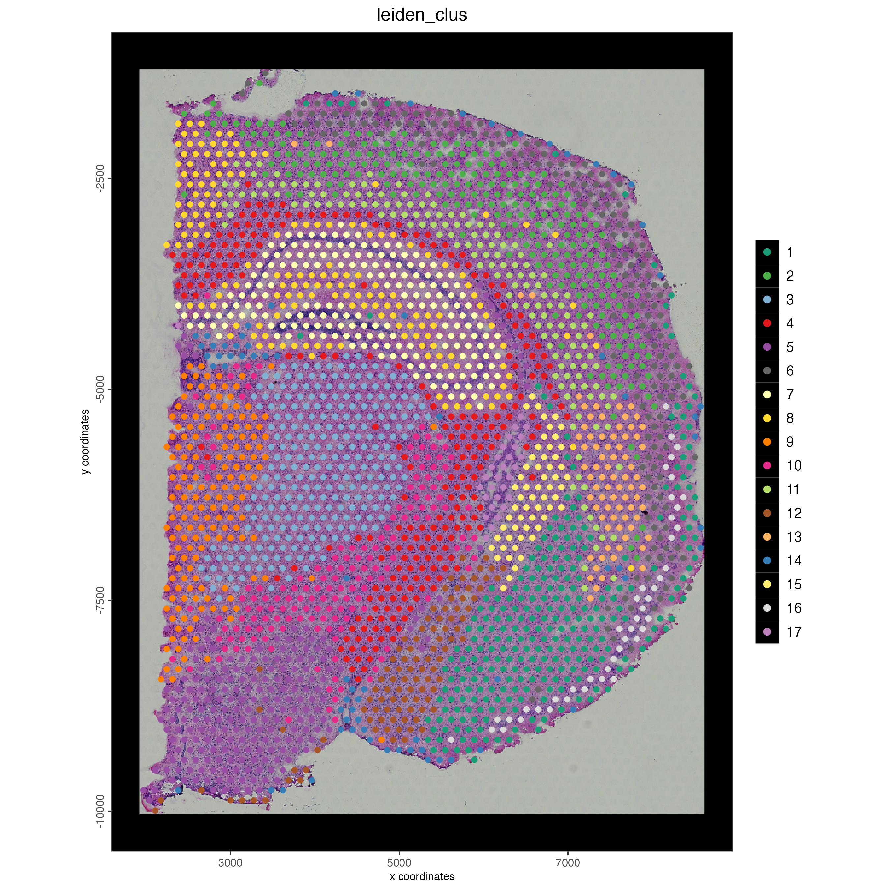
```

### Identifying spatially organized features
We need to identify genes to be used for interpolation. This works best with genes that are spatially distinct. To identify these genes we'll use binSpect(). For this tutorial we'll only use the top 15 spatially distinct genes. The more genes used for interpolation the longer the analysis will take. When running this for your own datasets you should use more genes. We are only using 15 here to minimize analysis time.
```{r, eval=FALSE}
# Spatially Variable Features
ranktest = binSpect(v_brain,
                    bin_method = 'rank',
                    calc_hub = T,
                    hub_min_int = 5,
                    spatial_network_name = 'spatial_network',
                    do_parallel = T,
                    cores = 8) #not able to provide a seed number, so do not set one

# Getting the top 15 spatially organized genes
ext_spatial_features = ranktest[1:15,]$feats
```

## Adding cell polygons to Giotto object

### Read in the poly information

First we need to read in the geojson file that contains the cell polygons that we'll interpolate gene expression onto. These will then be added to the Giotto object as a new polygon object. This won't affect the visium polygons. Both polygons will be stored within the same Giotto object.
```{r, eval=FALSE}
# Read in the data
stardist_cell_poly_path <- file.path(data_directory, "segmentations/stardist_only_cell_bounds.geojson")

stardist_cell_gpoly <- createGiottoPolygonsFromGeoJSON(GeoJSON = stardist_cell_poly_path,
                                                      name = "stardist_cell",
                                                      calc_centroids = TRUE)

stardist_cell_gpoly <- flip(stardist_cell_gpoly)
```

### Vizualizing polygons
Below we can see a vizualization of the polygons for the visium and the nuclei we identified from the H&E image. The visium dataset has 2698 spots compared to teh 36694 nuclei we identified. Just using the visium spots we're therefore losing a lot of the spatial data for individual cells. With the increased number of spots and them directly correlating with the tissue, through the spots alone we are able to better see the actual sturcture of the mouse brain.

```{r, eval=FALSE}
plot(getPolygonInfo(v_brain))
plot(stardist_cell_gpoly, max_poly = 1e6)
```

```{r, echo=FALSE, out.width="100%", fig.align="center", fig.cap="Mouse brain cell polygons from the visium dataset"}
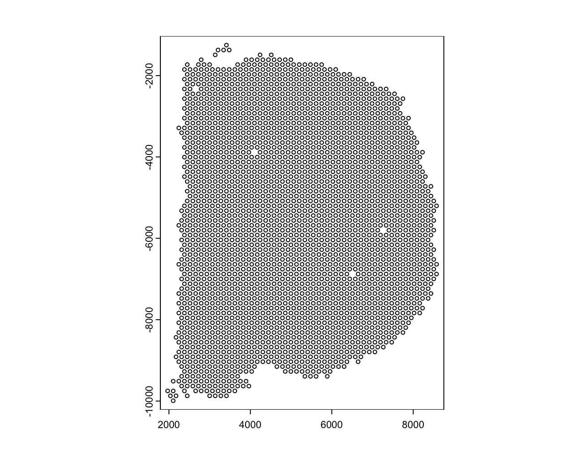
```

```{r, echo=FALSE, out.width="100%", fig.align="center", fig.cap="Mouse brain cell polygons with artifacts removed and flipped"}
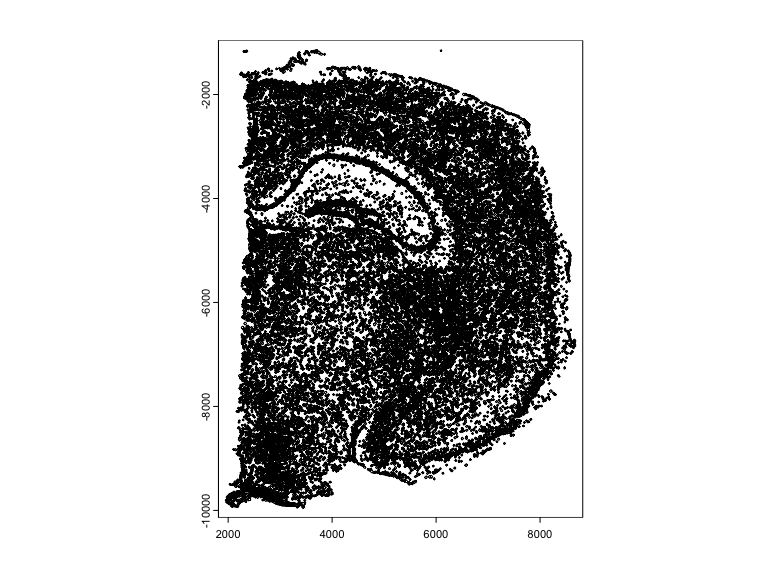
```

### Showing Giotto object prior to polygon addition
Before we add the polygons we're can see the gobject contains 'cell' as a spatial unit and a polygon.
```{r, eval=FALSE}
print(v_brain)
```
```{r, echo=FALSE, out.width="40%", fig.align="center", fig.cap="Giotto object before adding subcellular polygons."}
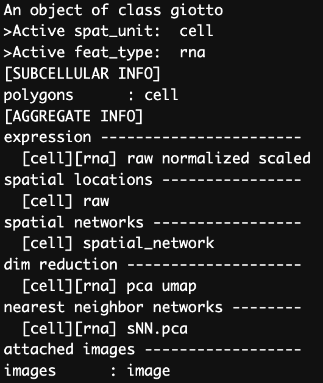
```


### Adding polygons to giotto object
After we add the nuclei polygons we can see that a new polygon name, 'stardist_cell' has been added to the gobject.
```{r, eval=FALSE}
v_brain <- addGiottoPolygons(v_brain, 
                             gpolygons = list('stardist_cell' = stardist_cell_gpoly))

print(v_brain)
```

```{r, echo=FALSE, out.width="40%", fig.align="center", fig.cap="Giotto object after to adding subcellular polygons."}
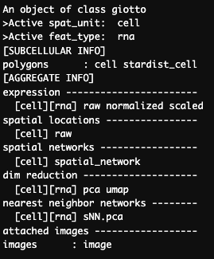
```

### Check polygon information
We can now see the addition of the new polygons under the name 'stardist_cell'. Each of the new polyons is given a unique poly_ID as shown below. Each polygon is also added into same space as the original visium spots, therefore line up with the same image as the visium spots.
```{r, eval=FALSE}
poly_info <- getPolygonInfo(v_brain,polygon_name  = 'stardist_cell')
print(poly_info)
```

```{r, echo=FALSE, out.width="60%", fig.align="center", fig.cap="Polygon information for stardist_cell."}
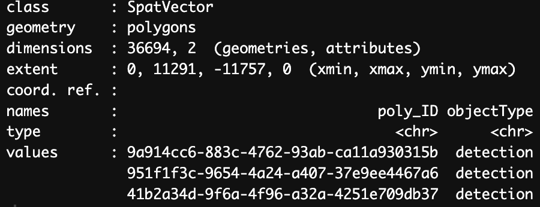
```

## Performing kriging
### Interpolating features
Now we can perform the first step in interpolating expression data onto cell polygons. This involves creating a raster image for the gene expression of each of the selected genes. The steps from here can be time consuming and require large amounts of memory. We will only be 
analyzing 15 genes to show the process of expression interpolation. For clustering and other analyses more genes are required. 

```{r, eval=FALSE}
future::plan(future::multisession()) # comment out for single threading
subcell_v_brain <- interpolateFeature(v_brain,
                                  spat_unit = 'cell',
                                  feat_type = 'rna',
                                  ext = ext(v_brain),
                                  feats = ext_spatial_features,
                                  overwrite = T)

print(subcell_v_brain)
```

```{r, echo=FALSE, out.width="100%", fig.align="center", fig.cap="Giotto object after to interpolating features. Addition of images for each interoplated feature (left) and an example of rasterized gene expression image (right)."}
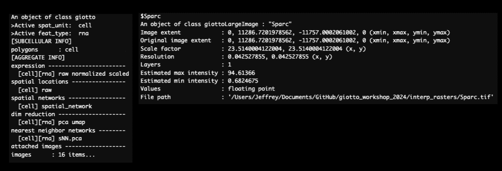
```

For each gene that we interpolate a raster image is exported based on the gene expression. Shown below is an example of an output for the gene Pantr1.

```{r, echo=FALSE, out.width="50%", fig.align="center", fig.cap="Raster of gene expression interpolation for Pantr1"}
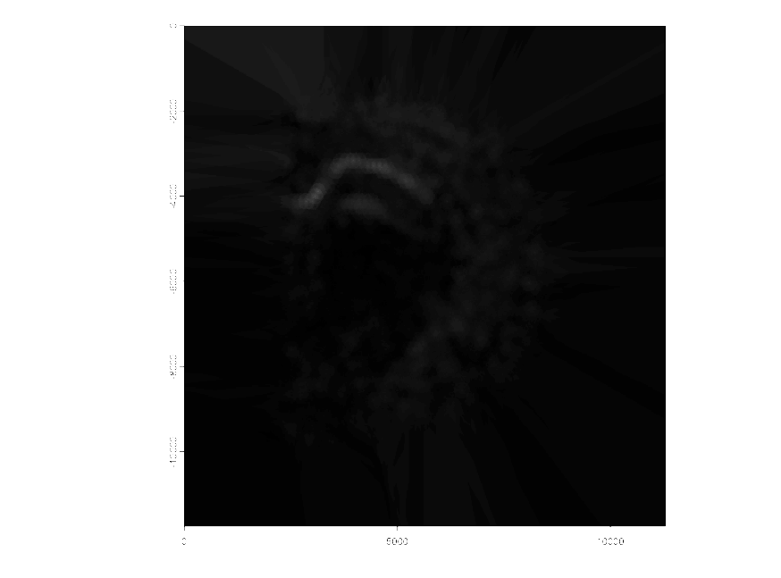
```

### Expression overlap
The raster we created above gives the gene expression in a graphical form. We next need to determine how that relates to the nuclei location. To determine that we will calculate the overlap of the rasterized gene expression image to the polygons supplied earlier. 

This step also takes more time the more genes that are provided. For large datasets please allow up to multiple hours for these steps to run.

```{r, eval=FALSE}
subcell_v_brain <- calculateOverlapPolygonImages(gobject = subcell_v_brain,
                                             name_overlap = "rna",
                                             spatial_info = "stardist_cell",
                                             image_names = ext_spatial_features)

subcell_v_brain <- Giotto::overlapToMatrix(x = subcell_v_brain,
                                     poly_info = "stardist_cell",
                                     feat_info = "rna",
                                     aggr_function = "sum",
                                     type='intensity')
```

After performing the overlap we now have expression data for each gene provided. This can be seen below where we see the interpolated gene expression for genes in each of the nuclei we identified.
```{r, echo=FALSE, out.width="100%", fig.align="center", fig.cap="Gene expression for cells based on interpolation."}
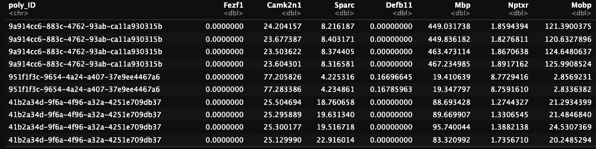
```

## Reading in larger dataset

For better results more genes are required. The above data used only 15 genes. We will now read in a dataset that has 1500 interpolated genes an use this for the remained of the tutorial. If you haven't downloaded this dataset please download it [here](https://zenodo.org/records/13144556).

```{r, eval=FALSE}
subcell_v_brain <- loadGiotto(file.path(data_directory, 'subcellular_gobject'))
```

## Analyzing interpolated features

### Filter and normalization
Now that we have a valid spat unit and gene expression data for each of the provided genes we can now perform the same analyses we used for the regular visium data. Please note that due to the differences in cell number that the valeus used for the current analysis aren't identical to the visium analysis. 

```{r, eval=FALSE}
subcell_v_brain <- filterGiotto(gobject = subcell_v_brain,
                               spat_unit = "stardist_cell",
                               expression_values = "raw",
                               expression_threshold = 1,
                               feat_det_in_min_cells = 0,
                               min_det_feats_per_cell = 1)


subcell_v_brain <- normalizeGiotto(gobject = subcell_v_brain,
                                  spat_unit = "stardist_cell",
                                  scalefactor = 6000,
                                  verbose = T)
```

### Visualizing gene expression from interpolated expression
Since we have the gene expression information for both the visium and the interpolated gene expression we can vizualize gene expression for both from the same Giotto object. We will look at the expression for two genes 'Sparc' and 'Pantr1' for both the visium and interpolated data.
```{r, eval=FALSE}
spatFeatPlot2D(subcell_v_brain,
               spat_unit = 'cell',
               gradient_style = 'sequential',
              cell_color_gradient = 'Geyser',
              feats = 'Sparc',
              point_size = 2,
              save_plot = TRUE,
              show_image = TRUE,
              save_param = list(save_name = '03_ses6_sparc_vis'))

spatFeatPlot2D(subcell_v_brain,
               spat_unit = 'stardist_cell',
               gradient_style = 'sequential',
               cell_color_gradient = 'Geyser',
              feats = 'Sparc',
              point_size = 0.6,
              save_plot = TRUE,
              show_image = TRUE,
              save_param = list(save_name = '03_ses6_sparc'))

spatFeatPlot2D(subcell_v_brain,
               spat_unit = 'cell',
               gradient_style = 'sequential',
              feats = 'Pantr1',
              cell_color_gradient = 'Geyser',
              point_size = 2,
              save_plot = TRUE,
              show_image = TRUE,
              save_param = list(save_name = '03_ses6_pantr1_vis'))
 
spatFeatPlot2D(subcell_v_brain,
               spat_unit = 'stardist_cell',
               gradient_style = 'sequential',
               cell_color_gradient = 'Geyser',
              feats = 'Pantr1',
              point_size = 0.6,
              save_plot = TRUE,
              show_image = TRUE,
              save_param = list(save_name = '03_ses6_pantr1'))
```

Below we can see the gene expression for both datatypes. With the interpolated gene expression we're able to get a better idea as to the cells that are expressing each of the genes. This is especially clear with Pantr1, which clearly localizes to the pyramidal layer.

```{r, echo=FALSE, out.width="100%", fig.align="center", fig.cap="Gene expression for visium (left) and interpolated (right) expression for Sparc (top) and Pantr1 (bottom)."}
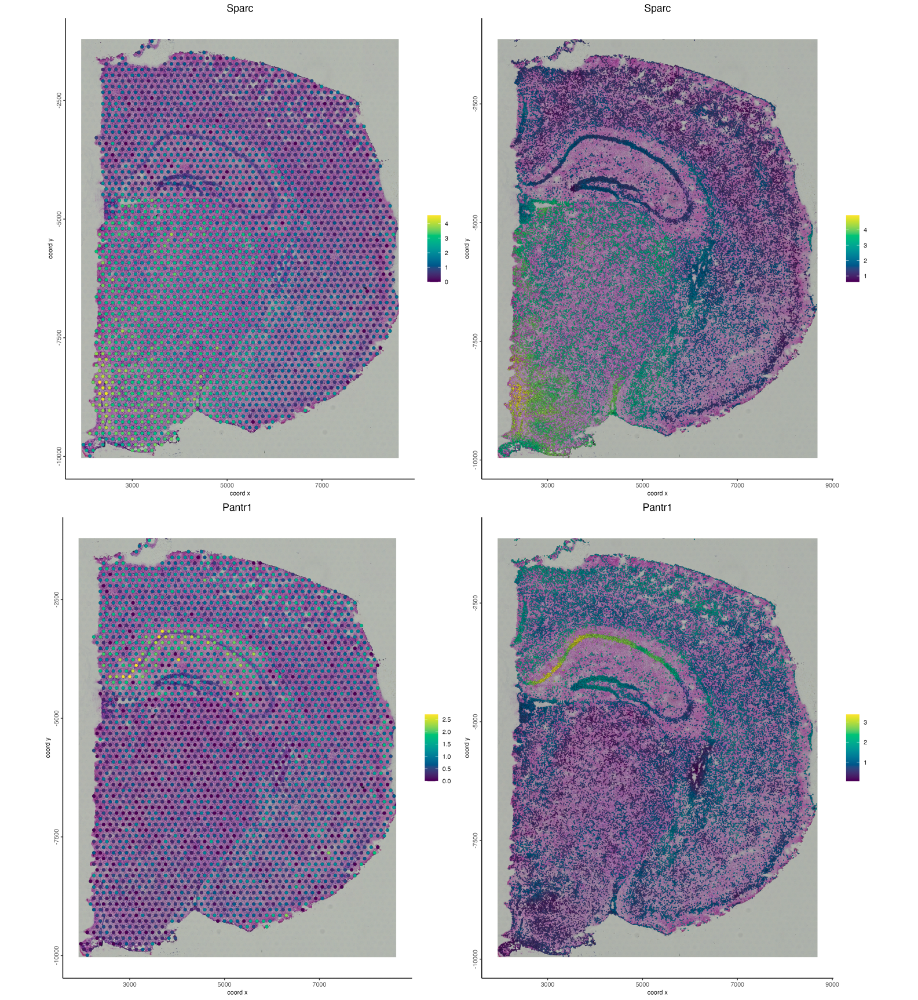
```


### Run PCA
```{r, eval=FALSE}
subcell_v_brain <- runPCA(gobject = subcell_v_brain,
                         spat_unit = "stardist_cell",
                         expression_values = "normalized",
                         feats_to_use = NULL)
```

### Clustering
```{r, eval=FALSE}
# UMAP
subcell_v_brain <- runUMAP(subcell_v_brain,
                          spat_unit = "stardist_cell",
                          dimensions_to_use = 1:15,
                          n_neighbors = 1000,
                          min_dist = 0.001,
                          spread = 1)

# NN Network
subcell_v_brain <- createNearestNetwork(gobject = subcell_v_brain,
                                       spat_unit = "stardist_cell",
                                       dimensions_to_use = 1:10,
                                       feats_to_use = hv_feats,
                                       expression_values = 'normalized',
                                       k = 70)

subcell_v_brain <- doLeidenCluster(gobject = subcell_v_brain,
                                  spat_unit = "stardist_cell",
                                  resolution = 0.15,
                                  n_iterations = 100,
                                  partition_type = 'RBConfigurationVertexPartition')

plotUMAP(subcell_v_brain, spat_unit = 'stardist_cell', cell_color = 'leiden_clus')
```
```{r, echo=FALSE, out.width="100%", fig.align="center", fig.cap="UMAP for stardist_cell based on the 1500 interpolated gene expressions. Colored based on leiden clustering."}
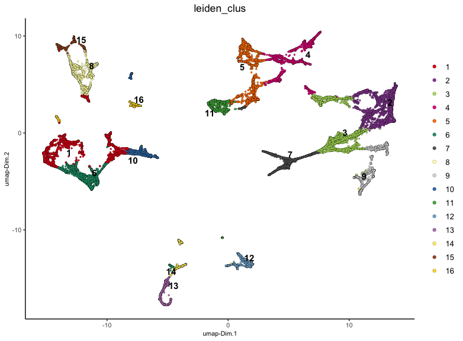
```


### Visualizing clustering
Vizualizing the clustering for both the visium dataset and the interpolated dataset we can similar clusters. However, with the interpolated dataset we are able to see finer detail for each cluster.
```{r, eval=FALSE}
spatPlot2D(gobject = subcell_v_brain,
           spat_unit = 'cell',
           cell_color = 'leiden_clus',
           show_image = T,
           point_size = 0.5,
           point_shape = 'no_border',
           background_color = 'black',
           save_plot = F,
           show_legend = TRUE)

spatPlot2D(gobject = subcell_v_brain,
           spat_unit = 'stardist_cell',
           cell_color = 'leiden_clus',
           show_image = T,
           point_size = 0.1,
           point_shape = 'no_border',
           background_color = 'black',
           show_legend = TRUE,
           save_plot = TRUE,
           save_param = list(save_name = '03_ses6_subcell_spat'))
```

```{r, echo=FALSE, out.width="100%", fig.align="center", fig.cap="Spatial plots showing leiden clustering mapped onto the base visium spots (left) and individual nuceli through interpolation (right)"}
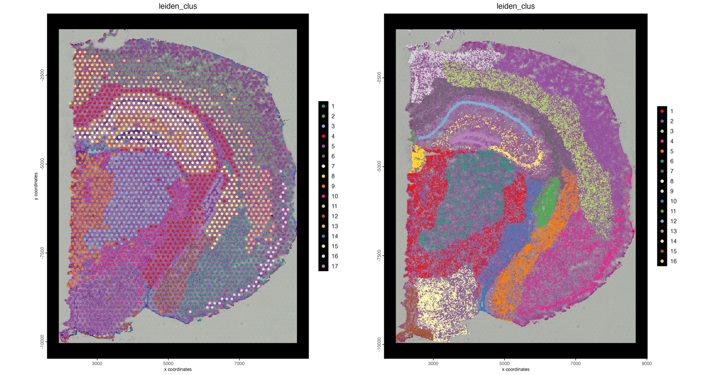
```

### Cropping objects
We are also able to crop both spat units simultaneosly to zoom in on specific regions of the tissue such as seen below.
```{r, eval=FALSE}
subcell_v_brain_crop <- subsetGiottoLocs(gobject = subcell_v_brain,
                           spat_unit = ":all:",
                           x_min = 4000,
                           x_max = 7000,
                           y_min = -6500,
                           y_max = -3500,
                           z_max = NULL,
                           z_min = NULL)

spatPlot2D(gobject = subcell_v_brain_crop,
           spat_unit = 'cell',
           cell_color = 'leiden_clus',
           show_image = T,
           point_size = 2,
           point_shape = 'no_border',
           background_color = 'black',
           show_legend = TRUE,
           save_plot = TRUE,
           save_param = list(save_name = '03_ses6_vis_spat_crop'))

spatPlot2D(gobject = subcell_v_brain_crop,
           spat_unit = 'stardist_cell',
           cell_color = 'leiden_clus',
           show_image = T,
           point_size = 0.1,
           point_shape = 'no_border',
           background_color = 'black',
           show_legend = TRUE,
           save_plot = TRUE,
           save_param = list(save_name = '03_ses6_subcell_spat_crop'))
```
```{r, echo=FALSE, out.width="100%", fig.align="center", fig.cap="Spatial plots showing leiden clustering mapped onto the base visium spots (left) and individual nuceli through interpolation (right)"}
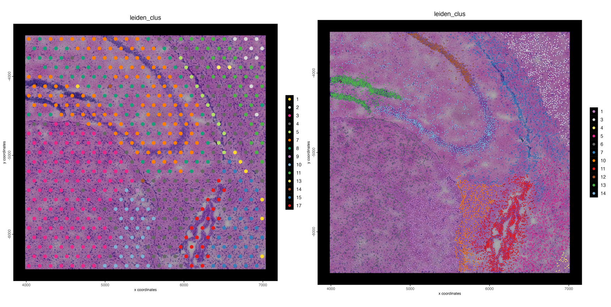
```
