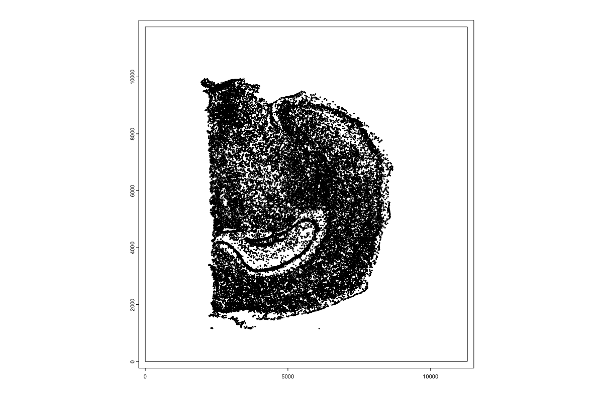

# Interactivity with the R/Spatial ecosystem

Jeff Sheridan

August 7th 2024


## Kriging


Low resolution spatial data typically covers multiple cells making it difficult to 
delineate the cell contribution to gene expression. Using a process called kriging
we can interpolate gene expression at the single cell levels from low resolution 
datasets.

Visium datasets require a high resolution H&E or IF image to align spots to. Using 
these images we can identify individual nuclei and cells to be used for kriging. Identifying
nuclei is outside the scope of the current tutorial but is required to perform kriging.
Tutorials can found here for H&E and IF.

### Dataset

For this tutorial we'll be using the mouse brain dataset described in section 6.

## Importing visium data

We first need to import a dataset that we want to perform kriging on.
```{r}

data_directory <- "data"

download.file(url = "https://cf.10xgenomics.com/samples/spatial-exp/1.1.0/V1_Adult_Mouse_Brain/V1_Adult_Mouse_Brain_raw_feature_bc_matrix.tar.gz",
              destfile = "data/V1_Adult_Mouse_Brain_raw_feature_bc_matrix.tar.gz")

download.file(url = "https://cf.10xgenomics.com/samples/spatial-exp/1.1.0/V1_Adult_Mouse_Brain/V1_Adult_Mouse_Brain_spatial.tar.gz",
              destfile = "data/V1_Adult_Mouse_Brain_spatial.tar.gz")
```

After downloading, unzip the gz files. You should get the “raw_feature_bc_matrix” and “spatial” folders inside “data/”.

```{r eval=FALSE}
library(Giotto)

save_directory <- 'results'
visium_save_directory <- file.path(save_directory, 'visium_mouse_brain')
subcell_save_directory <- file.path(save_directory, 'pseudo_subcellular/')

instrs <- createGiottoInstructions(show_plot = TRUE,
                                  save_plot = TRUE,
                                  save_dir = visium_save_directory)

v_brain <- createGiottoVisiumObject(data_directory, gene_column_index = 2, instructions = instrs)

# Subset to in tissue only
cm = pDataDT(v_brain)
in_tissue_barcodes = cm[in_tissue == 1]$cell_ID
v_brain = subsetGiotto(v_brain, cell_ids = in_tissue_barcodes)

# Filter
v_brain = filterGiotto(gobject = v_brain,
                       expression_threshold = 1,
                       feat_det_in_min_cells = 50,
                       min_det_feats_per_cell = 1000,
                       expression_values = c('raw'))

# Normalize
v_brain = normalizeGiotto(gobject = v_brain,
                          scalefactor = 6000,
                          verbose = TRUE)

# Add stats
v_brain = addStatistics(gobject = v_brain)

# ID HVF
v_brain = calculateHVF(gobject = v_brain, method = "cov_loess")
fm = fDataDT(v_brain)
hv_feats = fm[hvf == 'yes' & perc_cells > 3 & mean_expr_det > 0.4]$feat_ID
length(hv_feats)

# Dimension Reductions
v_brain = runPCA(gobject = v_brain,
                 feats_to_use = hv_feats)

v_brain = runUMAP(v_brain,
                  dimensions_to_use = 1:10,
                  n_neighbors = 15,
                  set_seed = TRUE)

# NN Network
v_brain = createNearestNetwork(gobject = v_brain,
                               dimensions_to_use = 1:10,
                               k = 15)
# Leiden Cluster
v_brain = doLeidenCluster(gobject = v_brain,
                          resolution = 0.4,
                          n_iterations = 1000,
                          set_seed = TRUE)

# Spatial Network (kNN)
v_brain <- createSpatialNetwork(gobject = v_brain,
                                method = 'kNN',
                                k = 5,
                                maximum_distance_knn = 400,
                                name = 'spatial_network')

spatPlot2D(gobject = v_brain,
           spat_unit = 'cell',
           cell_color = 'leiden_clus',
           show_image = T,
           point_size = 1.5,
           point_shape = 'no_border',
           background_color = 'black',
           show_legend = TRUE,
           save_plot = T,
           save_param = list(save_name = '03_ses6_1_vis_spat'))

```
```{r, echo=FALSE, out.width="75%", fig.align="center", fig.cap="Mouse brain spatial plot showing leiden clustering"}
knitr::include_graphics("img/03_session6/03_ses6_1_vis_spat.png")
```

### Identifying spatially organized features
We need to identify genes to be used for interpolation. This works best with genes that are spatially distinct.
```{r eval=FALSE}
# Spatially Variable Features
ranktest = binSpect(v_brain,
                    bin_method = 'rank',
                    calc_hub = T,
                    hub_min_int = 5,
                    spatial_network_name = 'spatial_network',
                    do_parallel = T,
                    cores = 8) #not able to provide a seed number, so do not set one

# Getting the top 15 spatially organized genes
ext_spatial_features = ranktest[1:15,]$feats
```

## Adding cell polygons to Giotto object

First we need to read in the geojson file that contains the cell polygons that 
we'll interpolate gene expression onto. These will then be added to the Giotto object

### Read in the poly information
```{r eval=FALSE}
# Read in the data
stardist_cell_poly_path <- file.path(data_directory, "segmentations/stardist_only_cell_bounds.geojson")

stardist_cell_gpoly <- createGiottoPolygonsFromGeoJSON(GeoJSON = stardist_cell_poly_path,
                                                      name = "stardist_cell",
                                                      calc_centroids = TRUE)

stardist_cell_gpoly <- flip(stardist_cell_gpoly)
plot(stardist_cell_gpoly, max_poly = 1e6)
```

### Vizualizing polygons
```{r eval=FALSE}
# show the data
plot(stardist_cell_gpoly, max_poly = 1e6)
```

```{r, echo=FALSE, out.width="100%", fig.align="center", fig.cap="Mouse brain cell polygons"}

```

```{r, echo=FALSE, out.width="100%", fig.align="center", fig.cap="Mouse brain cell polygons with artifacts removed and flipped"}
knitr::include_graphics("img/03_session6/03_ses6_2_cell_poly_flipped.png")
```

### Showing Giotto object prior to polygon addition
```{r eval=FALSE}
print(v_brain)
```

### Adding polygons to giotto object
```{r eval=FALSE}
v_brain <- addGiottoPolygons(v_brain, 
                             gpolygons = list('stardist_cell' = stardist_cell_gpoly))

print(v_brain)
```

```{r, echo=FALSE, out.width="40%", fig.align="center", fig.cap="Giotto object after to adding subcellular polygons. Addition of new stardist_cell polygon."}
knitr::include_graphics("img/03_session6/03_ses6_gobject_sub.png")
```

### Check polygon information
```{r eval=FALSE}
poly_info <- getPolygonInfo(v_brain,polygon_name  = 'stardist_cell')
```

## Performing kriging
### Interpolating features
Now we can perform the first step in interpolating expression data onto cell polygons.
This involves creating a raster image for the gene expression of each of the selected genes.
The steps from here can be time consuming and require large amounts of memory. We will only be 
analyzing 50 genes to show the process of expression interpolation. 
```{r eval=FALSE}
future::plan(future::multisession()) # comment out for single threading
subcell_v_brain <- interpolateFeature(v_brain,
                                  spat_unit = 'cell',
                                  feat_type = 'rna',
                                  ext = ext(v_brain),
                                  feats = ext_spatial_features,
                                  overwrite = T)

print(subcell_v_brain)
```
```{r, echo=FALSE, out.width="100%", fig.align="center", fig.cap="Giotto object after to interpolating features. Addition of images for each interoplated feature (left) and an example of rasterized gene expression image (right)."}
knitr::include_graphics("img/03_session6/03_ses6_gobject_sub_interpolate.png")
```


### Expression overlap
Next we will calculate the overlap of the rasterized gene expression image to the polygons supplied earlier.
```{r eval=FALSE}
subcell_v_brain <- calculateOverlapPolygonImages(gobject = subcell_v_brain,
                                             name_overlap = "rna",
                                             spatial_info = "stardist_cell",
                                             image_names = ext_spatial_features)

subcell_v_brain <- Giotto::overlapToMatrix(x = subcell_v_brain,
                                     poly_info = "stardist_cell",
                                     feat_info = "rna",
                                     aggr_function = "sum",
                                     type='intensity')
```
```{r, echo=FALSE, out.width="100%", fig.align="center", fig.cap="Gene expression for cells based on interpolation."}
knitr::include_graphics("img/03_session6/03_ses6_interpolate_gene_express.png")
```

## Reading in larger dataset

For better results more genes are required. The above data used only 15 genes. We will now read in a dataset that has 1500 interpolated genes an use this for the remained of the tutorial.

```{r eval=FALSE}
subcell_v_brain <- loadGiotto(file.path(data_directory, 'subcellular_1500_overlap'))
```

## Analyzing interpolated features

### Filter and normalization
```{r eval=FALSE}
subcell_v_brain <- filterGiotto(gobject = subcell_v_brain,
                               spat_unit = "stardist_cell",
                               expression_values = "raw",
                               expression_threshold = 1,
                               feat_det_in_min_cells = 0,
                               min_det_feats_per_cell = 1)


subcell_v_brain <- normalizeGiotto(gobject = subcell_v_brain,
                                  spat_unit = "stardist_cell",
                                  scalefactor = 6000,
                                  verbose = T)
```

### Visualizing gene expression from interpolated expression
```{r eval=FALSE}
spatFeatPlot2D(subcell_v_brain,
               spat_unit = 'cell',
               gradient_style = 'sequential',
              cell_color_gradient = 'Geyser',
              feats = 'Sparc',
              point_size = 2,
              save_plot = TRUE,
              show_image = TRUE,
              save_param = list(save_name = '03_ses6_sparc_vis'))

spatFeatPlot2D(subcell_v_brain,
               spat_unit = 'stardist_cell',
               gradient_style = 'sequential',
               cell_color_gradient = 'Geyser',
              feats = 'Sparc',
              point_size = 0.6,
              save_plot = TRUE,
              show_image = TRUE,
              save_param = list(save_name = '03_ses6_sparc'))

spatFeatPlot2D(subcell_v_brain,
               spat_unit = 'cell',
               gradient_style = 'sequential',
              feats = 'Pantr1',
              cell_color_gradient = 'Geyser',
              point_size = 2,
              save_plot = TRUE,
              show_image = TRUE,
              save_param = list(save_name = '03_ses6_pantr1_vis'))
 
spatFeatPlot2D(subcell_v_brain,
               spat_unit = 'stardist_cell',
               gradient_style = 'sequential',
               cell_color_gradient = 'Geyser',
              feats = 'Pantr1',
              point_size = 0.6,
              save_plot = TRUE,
              show_image = TRUE,
              save_param = list(save_name = '03_ses6_pantr1'))
```
```{r, echo=FALSE, out.width="100%", fig.align="center", fig.cap="Gene expression for visium (left) and interpolated (right) expression for Sparc (top) and Pantr1 (bottom)."}
knitr::include_graphics("img/03_session6/03_ses6_gene_expression.png")
```


### Run PCA
```{r eval=FALSE}
subcell_v_brain <- runPCA(gobject = subcell_v_brain,
                         spat_unit = "stardist_cell",
                         expression_values = "normalized",
                         feats_to_use = NULL)
```

### Clustering

```{r eval=FALSE}
# UMAP
subcell_v_brain <- runUMAP(subcell_v_brain,
                          spat_unit = "stardist_cell",
                          dimensions_to_use = 1:15,
                          n_neighbors = 1000,
                          min_dist = 0.001,
                          spread = 1)

# NN Network
subcell_v_brain <- createNearestNetwork(gobject = subcell_v_brain,
                                       spat_unit = "stardist_cell",
                                       dimensions_to_use = 1:10,
                                       feats_to_use = hv_feats,
                                       expression_values = 'normalized',
                                       k = 70)

subcell_v_brain <- doLeidenCluster(gobject = subcell_v_brain,
                                  spat_unit = "stardist_cell",
                                  resolution = 0.15,
                                  n_iterations = 100,
                                  partition_type = 'RBConfigurationVertexPartition')

plotUMAP(subcell_v_brain, spat_unit = 'stardist_cell', cell_color = 'leiden_clus')
```
```{r, echo=FALSE, out.width="100%", fig.align="center", fig.cap="UMAP for stardist_cell based on the 1500 interpolated gene expressions. Colored based on leiden clustering."}
knitr::include_graphics("img/03_session6/03_ses6_subcell_umap.png")
```


### Visualizing clustering
```{r eval=FALSE}
spatPlot2D(gobject = subcell_v_brain,
           spat_unit = 'cell',
           cell_color = 'leiden_clus',
           show_image = T,
           point_size = 0.5,
           point_shape = 'no_border',
           background_color = 'black',
           save_plot = F,
           show_legend = TRUE)

spatPlot2D(gobject = subcell_v_brain,
           spat_unit = 'stardist_cell',
           cell_color = 'leiden_clus',
           show_image = T,
           point_size = 0.1,
           point_shape = 'no_border',
           background_color = 'black',
           show_legend = TRUE,
           save_plot = TRUE,
           save_param = list(save_name = '03_ses6_subcell_spat'))
```

```{r, echo=FALSE, out.width="100%", fig.align="center", fig.cap="Spatial plots showing leiden clustering mapped onto the base visium spots (left) and individual nuceli through interpolation (right)"}
knitr::include_graphics("img/03_session6/03_ses6_spat_plots.png")
```

### Cropping objects

```{r eval=FALSE}
subcell_v_brain_crop <- subsetGiottoLocs(gobject = subcell_v_brain,
                           spat_unit = ":all:",
                           x_min = 4000,
                           x_max = 7000,
                           y_min = -6500,
                           y_max = -3500,
                           z_max = NULL,
                           z_min = NULL)

spatPlot2D(gobject = subcell_v_brain_crop,
           spat_unit = 'cell',
           cell_color = 'leiden_clus',
           show_image = T,
           point_size = 2,
           point_shape = 'no_border',
           background_color = 'black',
           show_legend = TRUE,
           save_plot = TRUE,
           save_param = list(save_name = '03_ses6_vis_spat_crop'))

spatPlot2D(gobject = subcell_v_brain_crop,
           spat_unit = 'stardist_cell',
           cell_color = 'leiden_clus',
           show_image = T,
           point_size = 0.1,
           point_shape = 'no_border',
           background_color = 'black',
           show_legend = TRUE,
           save_plot = TRUE,
           save_param = list(save_name = '03_ses6_subcell_spat_crop'))
```
```{r, echo=FALSE, out.width="100%", fig.align="center", fig.cap="Spatial plots showing leiden clustering mapped onto the base visium spots (left) and individual nuceli through interpolation (right)"}
knitr::include_graphics("img/03_session6/03_ses_spat_crop.png")
```
