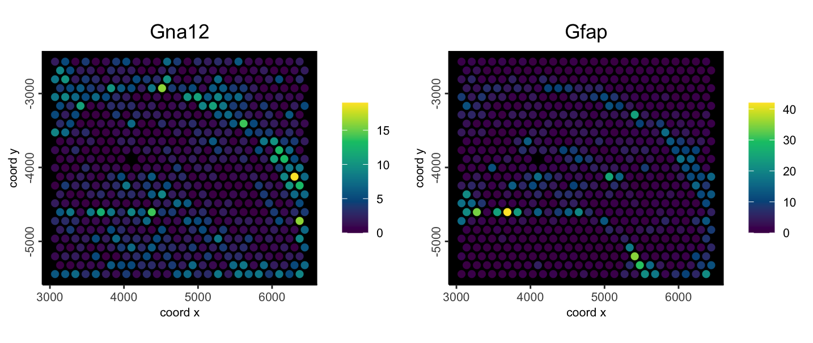

# Giotto Suite Workshop 2024

Placeholder


## Instructors
## Topics and Schedule:
## License

<!--chapter:end:index.Rmd-->


# Datasets & Packages

Placeholder


## Datasets to download
### Zenodo repository
### 10X Genomics Visium Mouse Brain Section (Coronal) dataset
### 10X Genomics Visium HD: FFPE Human Colon Cancer
### 10X Genomics multi-modal dataset
### 10X Genomics multi-omics Visium CytAssist Human Tonsil dataset
### 10X Genomics Human Prostate Cancer Adenocarcinoma with Invasive Carcinoma (FFPE)
### 10X Genomics Normal Human Prostate (FFPE)
### Xenium 
### MERFISH cortex dataset
### Lunaphore IF dataset

<!--chapter:end:00_datasets.Rmd-->


## Needed packages
### CRAN dependencies:
### *terra* installation
### *Matrix* installation
### *Rtools* installation
### *Giotto* installation 
### *irlba* install
### *arrow* install
### Bioconductor dependencies:
### CRAN packages:
### Packages from GitHub
### Python environments

<!--chapter:end:00_needed_packages.Rmd-->


# Spatial omics technologies

Placeholder


## Presentation
## Short summary
### Why do we need spatial omics technologies?
### What is spatial omics?
### What are the main spatial omics technologies?
### Other Spatial omics: ATAC-seq, CUT&Tag, lipidomics, etc
### What are the different types of spatial downstream analyses?

<!--chapter:end:01_session1.Rmd-->


# Introduction to the Giotto package

Placeholder


## Presentation  
## Ecosystem
## Installation + python environment
### Giotto installation
#### System prerequisites
#### Installation of released version
#### Installation of dev branch Giotto packages
#### Common install issues
### Python environment
#### Default installation
#### Custom installs
#### Using a specific environment
## Giotto instructions

<!--chapter:end:01_session2.Rmd-->


# Data formatting and Pre-processing

Placeholder


## Data formats
### General formats
### Matrix formats
### Tabular formats
### Spatial formats
### Mask files
### images
### jsonlike formats
### Hierarchical formats
## Pre-processing
### Expression matrix
### Spatial locations
### giottoPoints
### giottoPolygon
## Subobject utility functions
### IDs
### Bracket subsetting and extraction
### Nesting metadata generics
### Appending to a giotto object

<!--chapter:end:01_session3.Rmd-->

# Creating a Giotto object

Jiaji George Chen

August 5th 2024


## Overview

The minimal amount of raw data needed to put together a fully functional `giotto` object are either of the following:

- spatial coordinates (centroids) and expression matrix information
- spatial feature information (points or image intensity values) and spatial annotations to aggregate that feature information with (polygons/mask).

You can either use the `create*` style functions introduced in the previous session and build up the object piecewise or you can use the `giotto` object constructor functions `createGiottoObject()` and `createGiottoObjectSubcellular()`

## GiottoData modular package

We can showcase the construction of objects by pulling some raw data from the _GiottoData_ package. A dataset was loaded from here earlier in the previous section, but to formally introduce it, this package contains mini datasets and also download links to other publicly available datasets. It helps with prototyping and development and also making reproducible examples. 

The mini examples from popular platform datasets can also help give an understanding of what their data is like and how _Giotto_ represents them.

## From matrix + locations

For this, we will load some visium expression information and spatial locations.

```{r, eval=FALSE}
library(Giotto)

# function to get a filepath from GiottoData
mini_vis_raw <- function(x) {
    system.file(
        package = "GiottoData", 
        file.path("Mini_datasets", "Visium", "Raw", x)
    )
}

mini_vis_expr <- mini_vis_raw("visium_DG_expr.txt.gz") |>
    data.table::fread() |>
    GiottoUtils::dt_to_matrix()
mini_vis_expr[seq(5), seq(5)]
```

```
5 x 5 sparse Matrix of class "dgCMatrix"
       AAAGGGATGTAGCAAG-1 AAATGGCATGTCTTGT-1 AAATGGTCAATGTGCC-1 AAATTAACGGGTAGCT-1 AACAACTGGTAGTTGC-1
Gna12                   1                  2                  1                  1                  9
Ccnd2                   .                  1                  1                  .                  .
Btbd17                  .                  1                  1                  1                  .
Sox9                    .                  .                  .                  .                  .
Sez6                    .                  1                  4                  3                  .
```


```{r, eval=FALSE}
mini_vis_slocs <- mini_vis_raw("visium_DG_locs.txt") |>
    data.table::fread()
head(mini_vis_slocs)
```

```
      V1    V2
   <int> <int>
1:  5477 -4125
2:  5959 -2808
3:  4720 -5202
4:  5202 -5322
5:  4101 -4604
6:  5821 -3047
```

With these two pieces of data, we can make a fully working `giotto` object. The spatial locations are missing cell_ID names, but they will be detected from the expression information.

```{r, eval=FALSE}
mini_vis <- createGiottoObject(
    expression = mini_vis_expr,
    spatial_locs = mini_vis_slocs
)
instructions(mini_vis, "return_plot") <- FALSE
# set return_plot = FALSE otherwise we will get duplicate outputs in code chunks
```


For a simple example plot:

```{r, eval=FALSE}
spatFeatPlot2D(mini_vis,
    feats = c("Gna12", "Gfap"), 
    expression_values = "raw",
    point_size = 2.5,
    gradient_style = "sequential",
    background_color = "black"
)
```

```{r, echo=FALSE, fig.cap="Example spatial feature plot to show functioning object"}

```


## From subcellular raw data (transcripts or images) + polygons

You can also make `giotto` objects starting from raw spatial feature information and annotations that give them spatial context.


```{r, eval=FALSE}
# function to get a filepath from GiottoData
mini_viz_raw <- function(x) {
    system.file(
        package = "GiottoData", 
        file.path("Mini_datasets", "Vizgen", "Raw", x)
    )
}

mini_viz_dt <- mini_viz_raw(file.path("cell_boundaries", "z0_polygons.gz")) |>
    data.table::fread()
mini_viz_poly <- createGiottoPolygon(mini_viz_dt)
force(mini_viz_poly)
```

```
An object of class giottoPolygon
spat_unit : "cell"
Spatial Information:
 class       : SpatVector 
 geometry    : polygons 
 dimensions  : 498, 1  (geometries, attributes)
 extent      : 6399.244, 6903.243, -5152.39, -4694.868  (xmin, xmax, ymin, ymax)
 coord. ref. :  
 names       :                                 poly_ID
 type        :                                   <chr>
 values      :  40951783403982682273285375368232495429
               240649020551054330404932383065726870513
               274176126496863898679934791272921588227
 centroids   : NULL
 overlaps    : NULL
```

```{r, eval=FALSE}
plot(mini_viz_poly)
```

```{r, echo=FALSE, out.width="60%", fig.cap="Example MERSCOPE polygons loaded form vertex info"}
knitr::include_graphics("img/01_session4/viz_gpoly.png")
```


```{r, eval=FALSE}
mini_viz_tx <- mini_viz_raw("vizgen_transcripts.gz") |>
    data.table::fread()
mini_viz_tx[, global_y := -global_y] # flip values to match polys

viz_gpoints <- createGiottoPoints(mini_viz_tx)
force(viz_gpoints)
```

```
An object of class giottoPoints
feat_type : "rna"
Feature Information:
 class       : SpatVector 
 geometry    : points 
 dimensions  : 80343, 3  (geometries, attributes)
 extent      : 6400.037, 6900.032, 4699.979, 5149.983  (xmin, xmax, ymin, ymax)
 coord. ref. :  
 names       : feat_ID global_z feat_ID_uniq
 type        :   <chr>    <int>        <int>
 values      :    Mlc1        0            1
                Gprc5b        0            2
                  Gfap        0            3
```

```{r, eval=FALSE}
plot(viz_gpoints)
```

```{r, echo=FALSE, out.width="60%", fig.cap="Example mini MERSCOPE transcripts data"}
knitr::include_graphics("img/01_session4/viz_gpoints.png")
```

```{r, eval=FALSE}
mini_viz <- createGiottoObjectSubcellular(
    gpolygons = mini_viz_poly,
    gpoints = viz_gpoints
)
instructions(mini_viz, "return_plot") <- FALSE 
force(mini_viz)
```

```
An object of class giotto 
>Active spat_unit:  cell 
>Active feat_type:  rna 
[SUBCELLULAR INFO]
polygons      : cell 
features      : rna 
[AGGREGATE INFO]


Use objHistory() to see steps and params used
```

```{r, eval=FALSE}
# calculate centroids
mini_viz <- addSpatialCentroidLocations(mini_viz)

# create aggregated information
mini_viz <- calculateOverlap(mini_viz)
mini_viz <- overlapToMatrix(mini_viz)

spatFeatPlot2D(
    mini_viz, 
    feats = c("Grm4", "Gfap"),
    expression_values = "raw",
    point_size = 2.5,
    gradient_style = "sequential",
    background_color = "black"
)
```

```{r, echo=FALSE, out.width="60%", fig.cap="Example mini MERSCOPE aggregated feature counts"}
knitr::include_graphics("img/01_session4/example_featplot_sub.png")
```


## From piece-wise

You can also piece-wise assemble an object independently of one of the 2 previously shown convenience functions.

```{r, eval=FALSE}
g <- giotto() # initialize empty gobject
g <- setGiotto(g, mini_viz_poly)
g <- setGiotto(g, viz_gpoints)
force(g)
```

```
An object of class giotto 
>Active spat_unit:  cell 
>Active feat_type:  rna 
[SUBCELLULAR INFO]
polygons      : cell 
features      : rna 
[AGGREGATE INFO]


Use objHistory() to see steps and params used
```

This is essentially the same object as the one created through `createGiottoObjectSubcellular()` earlier.


## Using convenience functions for popular technologies (Vizgen, Xenium, CosMx, …)

There are also several convenience functions we provide for loading in data from popular platforms. These functions take care of reading the expected output folder structures, auto-detecting where needed data items are, formatting items for ingestion, then object creation. Many of these will be touched on later during other sessions.
```
createGiottoVisiumObject()
createGiottoVisiumHDObject()
createGiottoXeniumObject()
createGiottoCosMxObject()
createGiottoMerscopeObject()
```


## Plotting

### Subobject plotting

Giotto has several spatial plotting functions. At the lowest level, you directly call `plot()` on several subobjects in order to see what they look like, particularly the ones containing spatial info. Here we load several mini subobjects which are taken from the vizgen MERSCOPE mini dataset. To see which mini objects are available for independent loading with `GiottoData::loadSubObjectMini()`, you can run `GiottoData::listSubobjectMini()`

```{r, eval=FALSE}
gpoints <- GiottoData::loadSubObjectMini("giottoPoints")
plot(gpoints)
plot(gpoints, dens = TRUE, col = getColors("magma", 255))
plot(gpoints, raster = FALSE)
plot(gpoints, feats = c("Grm4", "Gfap"))
```

```{r, echo=FALSE, fig.cap="giottoPoints plots. Rasterized (top left), Rasterized and colored with 'magma' color scale by density (top right), Non-rasterized (bottom left), Plotting specifically 2 features (bottom right)"}
knitr::include_graphics("img/01_session4/gpoint_plots.png")
```


```{r, eval=FALSE}
gpoly <- GiottoData::loadSubObjectMini("giottoPolygon")
plot(gpoly)
plot(gpoly, type = "centroid")
plot(gpoly, max_poly = 10)
```

```{r, echo=FALSE, fig.cap="giottoPolygon plots. default (left), plotting centroids (middle), auto changing to centroids after there are more polygons to plot than max_poly param (right)"}
knitr::include_graphics("img/01_session4/gpoly_plots.png")
```


```{r, eval=FALSE}
spatlocs <- GiottoData::loadSubObjectMini("spatLocsObj")
plot(spatlocs)
```

```{r, echo=FALSE, out.width="60%", fig.cap="Plot of spatLocsObj"}
knitr::include_graphics("img/01_session4/sl_plot.png")
```


```{r, eval=FALSE}
spatnet <- GiottoData::loadSubObjectMini("spatialNetworkObj")
plot(spatnet)
```

```{r, echo=FALSE, out.width="60%", fig.cap="Plot of spatialNetworkObj"}
knitr::include_graphics("img/01_session4/spatnet_plot.png")
```


```{r, eval=FALSE}
pca <- GiottoData::loadSubObjectMini("dimObj")
plot(pca, dims = c(3,10))
```

```{r, echo=FALSE, out.width="60%", fig.cap="Plot of PCA dimObj showing the 3rd and 10th PCs"}
knitr::include_graphics("img/01_session4/dimobj_plot.png")
```


### Additive subobject plotting

These base plotting functions inherit from `terra::plot()`. They can be used additively with more than one object.

```{r, eval=FALSE}
gimg <- GiottoData::loadSubObjectMini("giottoLargeImage")

plot(gimg, col = getMonochromeColors("#5FAFFF"))
plot(gpoly, border = "maroon", lwd = 0.5, add = TRUE)
```

```{r, echo=FALSE, fig.cap="Plot image with monochrome color scaling with added polygon borders"}
knitr::include_graphics("img/01_session4/additive_baseplot.png")
```

### Giotto object plotting

_Giotto_ also has several _ggplot2_-based plotting functions that work on the whole `giotto` object.
Here we load the vizgen mini dataset from _GiottoData_ which contains a lot of worked out data.


```{r, eval=FALSE}
g <- GiottoData::loadGiottoMini("vizgen")
activeSpatUnit(g) <- "aggregate" # set default spat_unit to the one with lots of results
```


## Subsetting

-   Based on IDs
-   Based on locations
-   Visualizations


## _GiottoData_ Mini objects

Giotto makes available several mini objects to allow devs and users to work
with easily loadable Giotto objects. These are small subsets of a larger
dataset that often contain some worked through analyses and are fully functional.
```{r, eval=FALSE}
pak::pak("drieslab/GiottoData")
```


<!--chapter:end:01_session4.Rmd-->


# Visium Part I

Placeholder


## The Visium technology
## Introduction to the spatial dataset
## Download dataset
## Create the Giotto object
## Subset on spots that were covered by tissue
## Quality control
## Filtering
## Normalization
## Feature selection
### Highly Variable Features:
## Dimension Reduction
### PCA
### UMAP
### t-SNE
## Clustering
### Calculate Leiden clustering
### Calculate Louvain clustering
## Save the object
## Session info

<!--chapter:end:01_session5.Rmd-->


# Visium Part II

Placeholder


## Load the object
## Differential expression
### Gini markers
### Scran markers
## Enrichment & Deconvolution
### PAGE/Rank
### SpatialDWLS
## Spatial expression patterns
### Spatial variable genes
### Spatial co-expression modules
## Spatially informed clusters
## Spatial domains HMRF
## Interactive tools
## Save the object
## Session info

<!--chapter:end:02_session1.Rmd-->


# Visium HD

Placeholder


## Objective {#objective}
## Background
### Visium HD Technology
### Colorectal Cancer Sample
## Data Ingestion
### Visium HD output data format
### Mini Visium HD dataset
### Giotto Visium HD convenience function
### Read in data manually
#### Raw expression data
#### Tissue positions data
#### Merge expression and 2 micron position data
## Giotto object at Hexbin 400
### create giotto points 
### create giotto polygons 
#### Tiling and aggregation
### combine Giotto points and polygons to create Giotto object
### Process Giotto object
#### calculate overlap between points and polygons
#### convert overlap results to a bin-by-gene matrix
#### default processing steps
#### visualize number of features
### Dimension reduction + clustering
#### Highly variable features + PCA
#### UMAP reduction for visualization
#### Create network based on expression similarity + graph partition cluster
## Hexbin 100
### Standard subcellular pipeline
### Spatial expression patterns
#### Identify single genes
#### Spatial co-expression modules
#### Plot spatial gene groups
## Hexbin 25
### Subcellular workflow and projection functions
## Database backend - Work in progress, but coming soon!

<!--chapter:end:02_session2.Rmd-->


# Xenium

Placeholder


## Introduction to spatial dataset
### Output directory structure
### Mini Xenium Dataset
## Data prep
### Image conversion (may change)
## Convenience function
### Specific filepaths
### Quality value
### Transcript type splitting
### Centroids calculation
### Simple visualization
## Piecewise loading
### load giottoPoints transcripts
### (optional) Loading pre-aggregated data
## Xenium Images
### Image metadata
### Image loading
## Spatial aggregation
## Aggregate analyses workflow
### Filtering
### Normalization
### Dimension Reduction
### Clustering
## Niche clustering
### Spatial network
### Niche calculation
### kmeans clustering based on niche signature
## Cell proximity enrichment
## Pseudovisium
### Pseudovisium aggregation and workflow

<!--chapter:end:02_session3.Rmd-->


# Spatial proteomics: Multiplexed Immunofluorescence

Placeholder


## Spatial Proteomics Technologies
## Raw data type coming out of different technologies
### Use ome.tiff as an example output data to begin with
### Use single channel images as an example output data to begin with
## Cell Segmentation file to get single cell level protein expression
### Using segmentation output file from DeepCell(mesmer) as an example. 
### Using Giotto wrapper of Cellpose to perform segmentation
## Create a Giotto Object using list of gitto large images and polygons
### Overlap to matrix
### Manipulate Expression information
### Rescale polygons
### Perform clustering and differential expression
### Give the cluster an annotation based on expression values
### spatial network 
### Cell Neighborhood: Cell-Type/Cell-Type Interactions

<!--chapter:end:02_session4.Rmd-->


# Working with multiple samples

Placeholder


## Objective
## Background
### Dataset
### Visium technology
## Create individual giotto objects
### Download the data
## Extracting the downloaded files
### Create giotto instructions
### Load visium data into Giotto
### Healthy prostate tissue coverage
### Adenocarcinoma prostate tissue coverage
### Showing the data strucutre for the inidividual objects
## Join Giotto Objects
## Visualizing combined datasets
### Vizualizing in the same plot
### Vizualizing on separate plots
## Splitting combined dataset
## Analyzing joined objects
### Normalization and adding statistics
### Clustering the datasets
### Vizualizing spatial location of clusters
### Vizualizing tissue contribution to clusters
## Perform Harmony and default workflows
### Clustering harmonized object
### Vizualizing the tissue contribution

<!--chapter:end:03_session1.Rmd-->


# Spatial multi-modal analysis

Placeholder


## Overview
## Spatial manipulation
### Spatial transforms:
### Spatial utilities:
### Spatial classes:
## Examples of the simple transforms with a giottoPolygon
## Affine transforms
## Image transforms
## The practical usage of multi-modality co-registration
### Example dataset: Xenium Breast Cancer pre-release pack
### Target Coordinate system
### Visium to register
#### Create Pseudo Visium dataset for comparison
### Register post-Xenium H&E and IF image
#### Add registered image information and compare RNA vs protein expression
### Automatic alignment via SIFT feature descriptor matching and affine transformation
### Final Notes

<!--chapter:end:03_session2.Rmd-->


# Multi-omics integration

Placeholder


## The CytAssist technology
## Introduction to the spatial dataset
## Download dataset
## Create the Giotto object
## Subset on spots that were covered by tissue
## RNA processing
## Protein processing
## Multi-omics integration
## Session info

<!--chapter:end:03_session3.Rmd-->


# Interoperability with other frameworks

Placeholder


## Load Giotto object
## Seurat
### Conversion of Giotto Object to Seurat Object
#### Apply SCTransform
#### Dimension Reduction
### Conversion of Seurat object Back to Giotto Object
#### Clustering and Plotting UMAP
#### Spatial CoExpression
## SpatialExperiment
### Convert Giotto Object to SpatialExperiment Object
#### Identify top spatially variable genes with nnSVG
### Conversion of SpatialExperiment object back to Giotto
#### Plotting top genes from nnSVG in Giotto 
## AnnData
### Load Required Libraries
### Specify Path for Results
#### Create Default kNN Network
### Giotto To AnnData
### Convert AnnData to Giotto
#### UMAP Visualization
## Create mini Vizgen object

<!--chapter:end:03_session4.Rmd-->


# Interoperability with isolated tools

Placeholder


## Spatial niche trajectory analysis (ONTraC)
### Introduction to ONTraC
### Introduction to MERFISH
### Settings
### Dataset
#### Dataset download
### Create the Giotto object
#### Spatial distribution of cell type
### Perform spatial niche trajectory analysis using ONTraC
#### ONTraC Installation
#### Running ONTraC
### Visualization
#### Load ONTraC results
#### Niche cluster probability distribution
#### Binarized niche cluster for each cell
#### Niche cluster spatial connectivity
#### NT (niche trajectory) score
#### Cell type composition within niche cluster
## Session info

<!--chapter:end:03_session5.Rmd-->


# Interactivity with the R/Spatial ecosystem

Placeholder


## Kriging
### Visium technology
### Dataset
### Generating a geojson file of nuclei location
## Downloading the dataset
## Extracting the files
## Downloading giotto object and nuclei segmentation
## Importing visium data
### Identifying spatially organized features
## Adding cell polygons to Giotto object
### Read in the poly information
### Vizualizing polygons
### Showing Giotto object prior to polygon addition
### Adding polygons to giotto object
### Check polygon information
## Performing kriging
### Interpolating features
### Expression overlap
## Reading in larger dataset
## Analyzing interpolated features
### Filter and normalization
### Visualizing gene expression from interpolated expression
### Run PCA
### Clustering
### Visualizing clustering
### Cropping objects

<!--chapter:end:03_session6.Rmd-->

# Contributing to Giotto

Jiaji George Chen

August 7th 2024


```{r, eval=FALSE}
save_dir <- "~/Documents/GitHub/giotto_workshop_2024/img/03_session7"
```

## Contribution guideline

https://drieslab.github.io/Giotto_website/CONTRIBUTING.html 


<!--chapter:end:03_session7.Rmd-->

